第二章: 數據繪圖文法
================
2024 三月 04

``` r
#整體設定，含載入套件
source("https://raw.githubusercontent.com/ChungPingCheng/R4BS2/main/R4BS_setup2.R")
```

# 資料與管理

``` r
#讀檔案
dta <- read.csv(file = "../Data/HEXACO_HS.csv", 
                  header = TRUE, stringsAsFactors = TRUE)
```

``` r
#檢視資料結構
#程式報表2.1
str(dta)
```

    'data.frame':   897 obs. of  13 variables:
     $ 性別        : Factor w/ 2 levels "女","男": 2 1 2 2 1 1 2 2 1 1 ...
     $ 父親教育程度: Factor w/ 5 levels "大學或專科","小學或不識字",..: 5 4 5 4 4 4 2 1 3 1 ...
     $ 母親教育程度: Factor w/ 5 levels "大學或專科","小學或不識字",..: 5 5 4 4 4 4 2 4 1 4 ...
     $ 誠實.謙遜   : int  48 60 53 48 53 66 55 58 51 58 ...
     $ 情緒性      : int  54 43 50 52 45 68 52 44 57 62 ...
     $ 外向性      : int  44 39 48 46 51 60 38 55 54 67 ...
     $ 和悅性      : int  50 55 47 50 51 48 55 54 51 61 ...
     $ 嚴謹性      : int  43 59 52 46 48 51 43 43 50 53 ...
     $ 開放性      : int  44 57 44 49 45 51 38 50 50 52 ...
     $ 攻擊行為    : int  13 2 1 12 21 1 4 2 8 4 ...
     $ 焦慮.憂鬱   : int  11 2 0 9 14 6 5 1 6 4 ...
     $ 違反規定    : int  7 1 0 9 12 0 1 3 4 3 ...
     $ 社會退縮    : int  9 4 0 5 12 2 4 2 5 0 ...

``` r
#設定類別變項的順序
dta <- dta |> 
  dplyr::mutate(母親教育程度 = forcats::fct_relevel(母親教育程度, 
                                              c("小學或不識字", 
                                                "國中", 
                                                "高中", 
                                                "大學或專科", 
                                                "研究所以上")),
                父親教育程度 = forcats::fct_relevel(父親教育程度, 
                                              c("小學或不識字", 
                                                "國中", 
                                                "高中", 
                                                "大學或專科", 
                                                "研究所以上")))
```

# 畫圖

``` r
#瞭解 ggplot 啟動後的設定規劃
#程式報表2.2
ggplot() |> attributes()
```

    $names
    [1] "data"        "layers"      "scales"      "mapping"     "theme"      
    [6] "coordinates" "facet"       "plot_env"    "labels"     

    $class
    [1] "gg"     "ggplot"

``` r
#ggplot 是一個一個圖層（layer）疊上去
#底下以散佈圖為例，呈現每一步驟的結果
#第一步驟設定圖的框架，注意圖的X軸與Y軸
#圖2.1
g0 <- ggplot(data = dta, 
             aes(x=社會退縮, y=攻擊行為)) 
g0
```

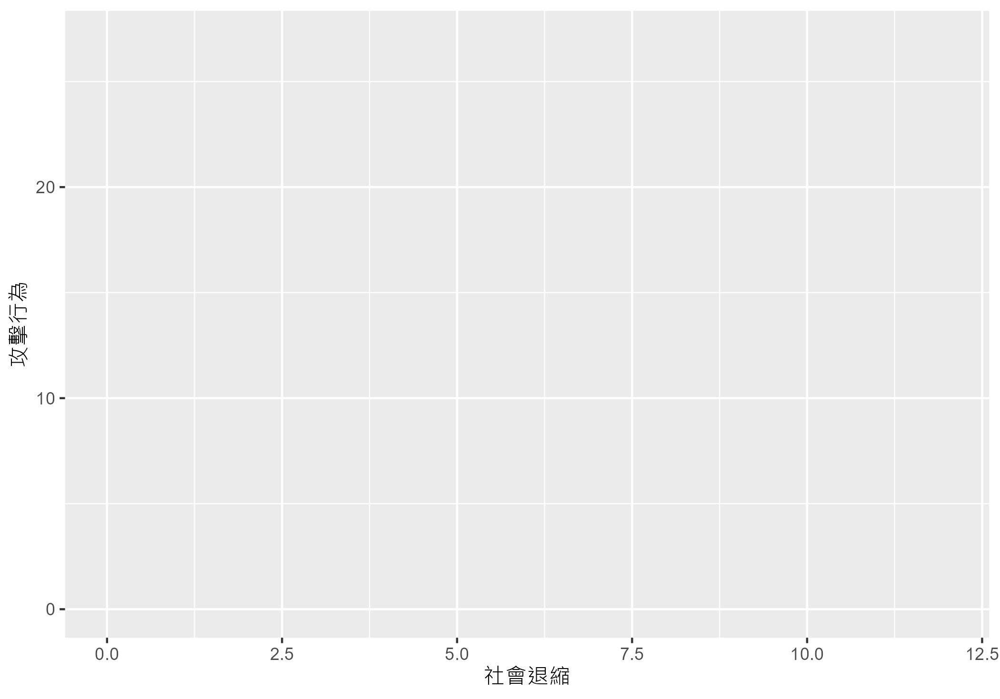

``` r
#在前一步驟結果（圖的框架）上加入點
#圖2.2
g1 <- g0 + geom_point(alpha=.2) 
g1
```

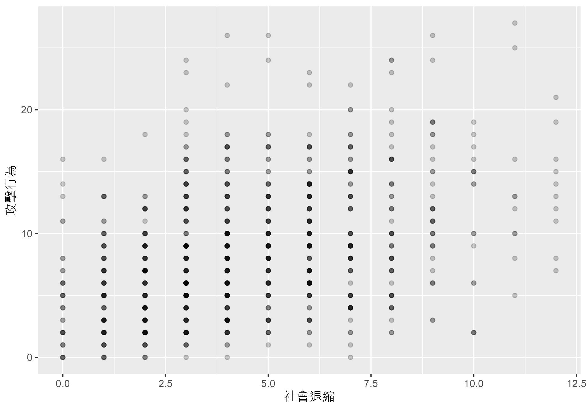

``` r
#在前一步驟結果上加入橢圓（資料的95%區間）與局部迴歸線
#圖2.3
g2 <- g1 + stat_smooth(method='lm', 
                       formula = y ~ x,
                       se=FALSE, 
                       linewidth = 0.5) 
g2
```

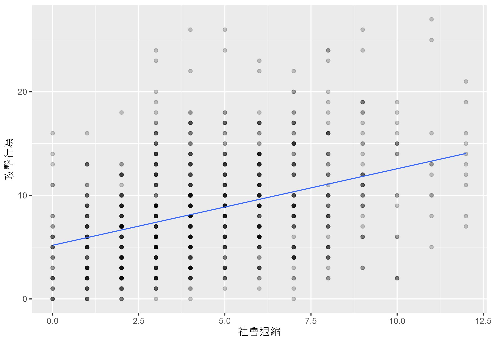

``` r
#在前一步驟結果上要求以變項（性別）區分顏色
#圖2.4
g3 <- g2 + aes(color=性別) 
g3
```

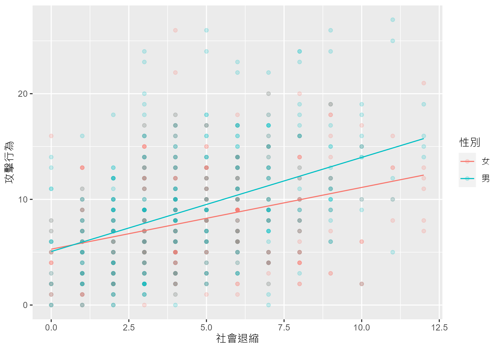

``` r
#在前一步驟結果上設定 x 軸與 y 軸刻度
#圖2.5
g4 <- g3 + 
  scale_y_continuous(breaks=seq(0, 25, by=5)) +
  scale_x_continuous(breaks=seq(0, 12, by=2))
g4
```

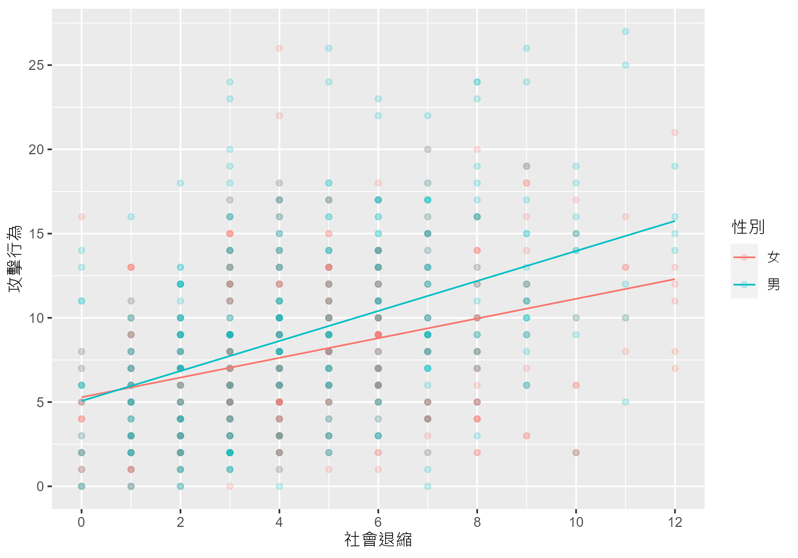

``` r
#在前一步驟結果上要求以變項（父母教育）分面（facet）
#圖2.6
g5 <- g4 + facet_wrap(vars(母親教育程度),nrow=1)
g5
```

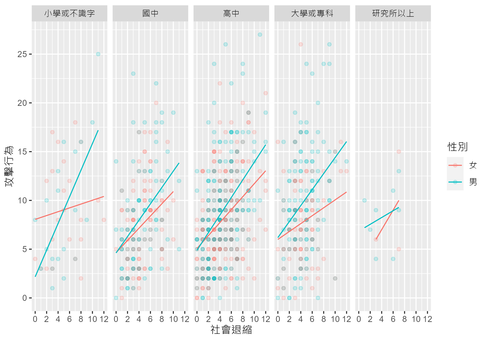

``` r
#在前一步驟結果上加上X軸、Y軸的標示，以及整個圖形的標題
#圖2.7
g6 <- g5 + labs(x='社會退縮分數',
                y='攻擊行為分數',
                title='散布圖：攻擊行為與社會退縮')
g6
```

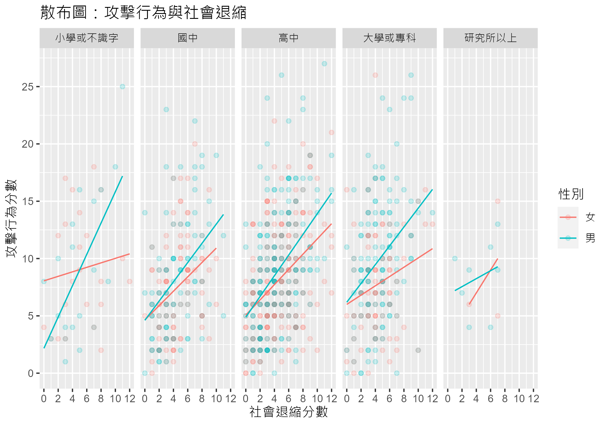

``` r
#在前一步驟結果上改變主題，並要求圖示位置
#圖2.8
g7 <- g6 + theme_minimal() + 
  theme(legend.position='top')
g7
```

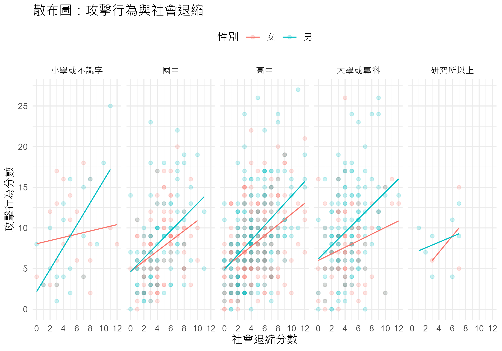

``` r
#前面步驟可以一次執行
ggplot(data = dta, aes(x=社會退縮, y=攻擊行為)) +
   geom_point(alpha=.2) +
 stat_smooth(method='lm', formula = y ~ x,
       se=FALSE, linewidth = 0.5)+
 aes(color=性別) +
 scale_y_continuous(breaks=seq(0, 25, by=5)) +
 scale_x_continuous(breaks=seq(0, 12, by=2)) +
 facet_wrap(vars(母親教育程度),nrow=1)+
 labs(x='社會退縮分數', y='攻擊行為分數',
     title='散布圖：攻擊行為與社會退縮') +
 theme_minimal() + 
 theme(legend.position='top')
```

``` r
#設定後面的 ggplot 繪圖以 theme_minimal 為預設值
ggplot2::theme_set(theme_minimal())
```

# 繪製統計摘要

``` r
#以 ggplot 直接繪製統計摘要結果（連續資料平均數與標準誤） 
#圖2.9
ggplot(data=dta, 
     aes(x=母親教育程度, y=誠實.謙遜, color=性別)) +
  stat_summary(fun.data = "mean_cl_boot", 
               position=position_dodge(.2)) +
  stat_summary(aes(group=性別), fun = mean, 
               geom="line",
               position=position_dodge(.2))+
  scale_color_grey(end=.7)+
  labs(y='誠實.謙遜平均分數',
       x='母親教育程度',
       title='不同性別的誠實.謙遜平均跟母親教育程度的關係',
       caption="來源: 許功餘")+
  theme(legend.position='top')
```

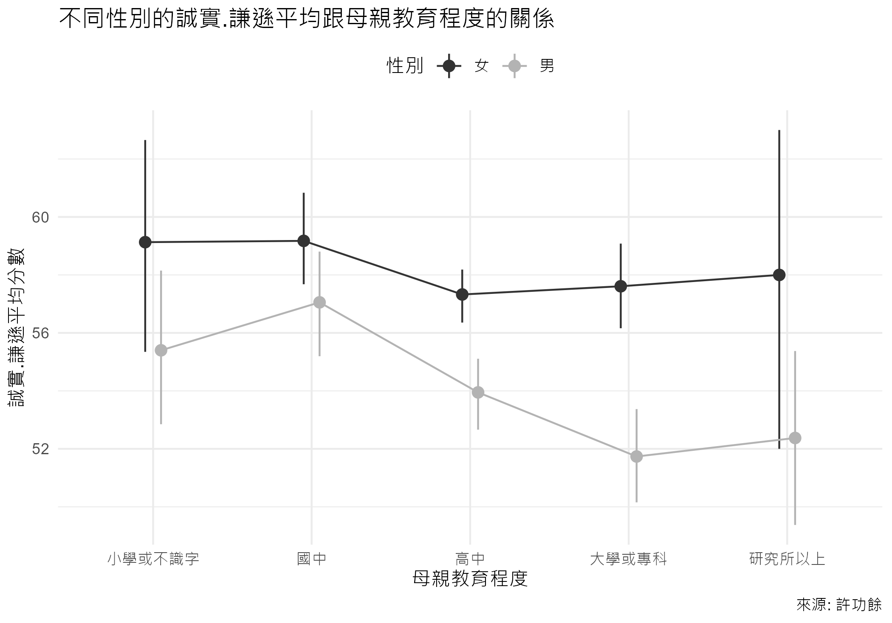

``` r
#程式報表2.3
dta |> 
  dplyr::group_by(性別, 母親教育程度) |>
  dplyr::reframe( 誠謙平均 = mean(誠實.謙遜),
                  誠謙標準誤 = sd(誠實.謙遜)/sqrt(n()),
                  誠謙平均下界 = 誠謙平均 - 1.96*誠謙標準誤,
                  誠謙平均上界 = 誠謙平均 + 1.96*誠謙標準誤)
```

<table>
<thead>
<tr>
<th style="text-align:left;">
性別
</th>
<th style="text-align:left;">
母親教育程度
</th>
<th style="text-align:right;">
誠謙平均
</th>
<th style="text-align:right;">
誠謙標準誤
</th>
<th style="text-align:right;">
誠謙平均下界
</th>
<th style="text-align:right;">
誠謙平均上界
</th>
</tr>
</thead>
<tbody>
<tr>
<td style="text-align:left;">
女
</td>
<td style="text-align:left;">
小學或不識字
</td>
<td style="text-align:right;">
59.13
</td>
<td style="text-align:right;">
1.9299
</td>
<td style="text-align:right;">
55.35
</td>
<td style="text-align:right;">
62.91
</td>
</tr>
<tr>
<td style="text-align:left;">
女
</td>
<td style="text-align:left;">
國中
</td>
<td style="text-align:right;">
59.18
</td>
<td style="text-align:right;">
0.8071
</td>
<td style="text-align:right;">
57.59
</td>
<td style="text-align:right;">
60.76
</td>
</tr>
<tr>
<td style="text-align:left;">
女
</td>
<td style="text-align:left;">
高中
</td>
<td style="text-align:right;">
57.33
</td>
<td style="text-align:right;">
0.4803
</td>
<td style="text-align:right;">
56.38
</td>
<td style="text-align:right;">
58.27
</td>
</tr>
<tr>
<td style="text-align:left;">
女
</td>
<td style="text-align:left;">
大學或專科
</td>
<td style="text-align:right;">
57.61
</td>
<td style="text-align:right;">
0.7780
</td>
<td style="text-align:right;">
56.08
</td>
<td style="text-align:right;">
59.13
</td>
</tr>
<tr>
<td style="text-align:left;">
女
</td>
<td style="text-align:left;">
研究所以上
</td>
<td style="text-align:right;">
58.00
</td>
<td style="text-align:right;">
3.2146
</td>
<td style="text-align:right;">
51.70
</td>
<td style="text-align:right;">
64.30
</td>
</tr>
<tr>
<td style="text-align:left;">
男
</td>
<td style="text-align:left;">
小學或不識字
</td>
<td style="text-align:right;">
55.40
</td>
<td style="text-align:right;">
1.4261
</td>
<td style="text-align:right;">
52.60
</td>
<td style="text-align:right;">
58.20
</td>
</tr>
<tr>
<td style="text-align:left;">
男
</td>
<td style="text-align:left;">
國中
</td>
<td style="text-align:right;">
57.05
</td>
<td style="text-align:right;">
0.9345
</td>
<td style="text-align:right;">
55.22
</td>
<td style="text-align:right;">
58.89
</td>
</tr>
<tr>
<td style="text-align:left;">
男
</td>
<td style="text-align:left;">
高中
</td>
<td style="text-align:right;">
53.95
</td>
<td style="text-align:right;">
0.6108
</td>
<td style="text-align:right;">
52.75
</td>
<td style="text-align:right;">
55.15
</td>
</tr>
<tr>
<td style="text-align:left;">
男
</td>
<td style="text-align:left;">
大學或專科
</td>
<td style="text-align:right;">
51.74
</td>
<td style="text-align:right;">
0.8171
</td>
<td style="text-align:right;">
50.13
</td>
<td style="text-align:right;">
53.34
</td>
</tr>
<tr>
<td style="text-align:left;">
男
</td>
<td style="text-align:left;">
研究所以上
</td>
<td style="text-align:right;">
52.38
</td>
<td style="text-align:right;">
1.7314
</td>
<td style="text-align:right;">
48.98
</td>
<td style="text-align:right;">
55.77
</td>
</tr>
</tbody>
</table>

``` r
#以 ggplot 直接繪製統計摘要結果（類別資料的百分比） 
#圖2.10
ggplot(dta, 
       aes(x=母親教育程度, group=父親教育程度)) + 
  geom_bar(aes(y=after_stat(prop), 
          fill = factor(after_stat(x))),
          width = .2) + 
  scale_y_continuous(labels=scales::percent) +
  scale_fill_grey()+
  coord_flip()+
  labs(y="百分比",
       title="門當戶對:父母親教育程度") +
  facet_wrap(vars(父親教育程度), ncol=1)+
  theme(legend.position="none")
```

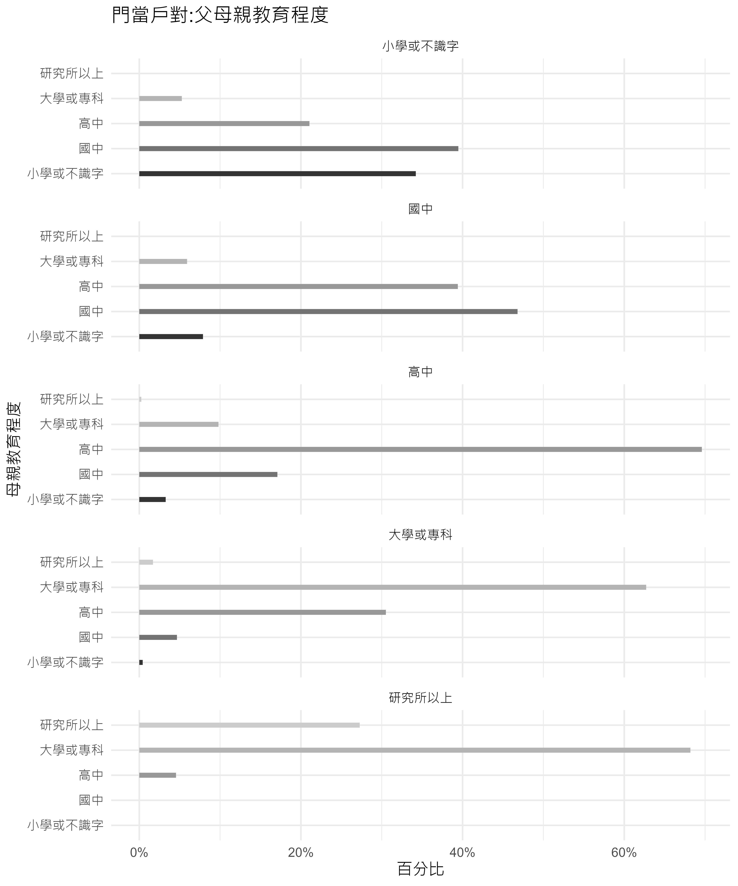

``` r
#程式報表2.4
dta |> 
  dplyr::select(母親教育程度, 父親教育程度) |>
  gtsummary::tbl_cross(percent=c("column"))
```

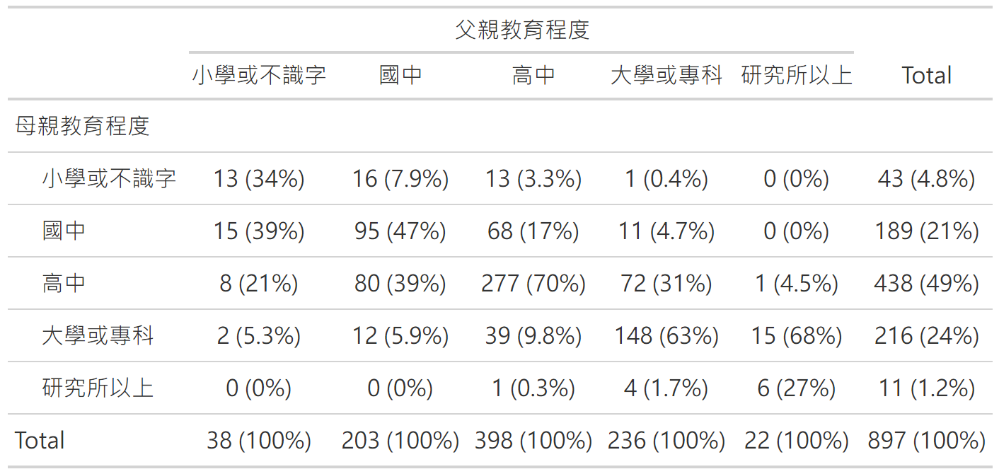

``` r
#以 ggplot 直接繪製統計摘要結果（連續資料平均數與標準誤） 
#圖2.11
ggplot(data=dta, 
     aes(x=母親教育程度, y=誠實.謙遜)) +
  stat_summary(fun.data = "mean_cl_boot") +
  scale_color_grey(end=.7)+
  facet_wrap(vars(父親教育程度), nrow=1)+
  labs(y='誠實.謙遜平均分數',
       x='母親教育程度',
       title='不同父親教育程度的誠實.謙遜平均跟母親教育程度的關係',
       caption="來源: 許功餘")+
  theme(legend.position='top',
        axis.text.x = element_text(angle = 90, vjust = 0.5, hjust=1))
```

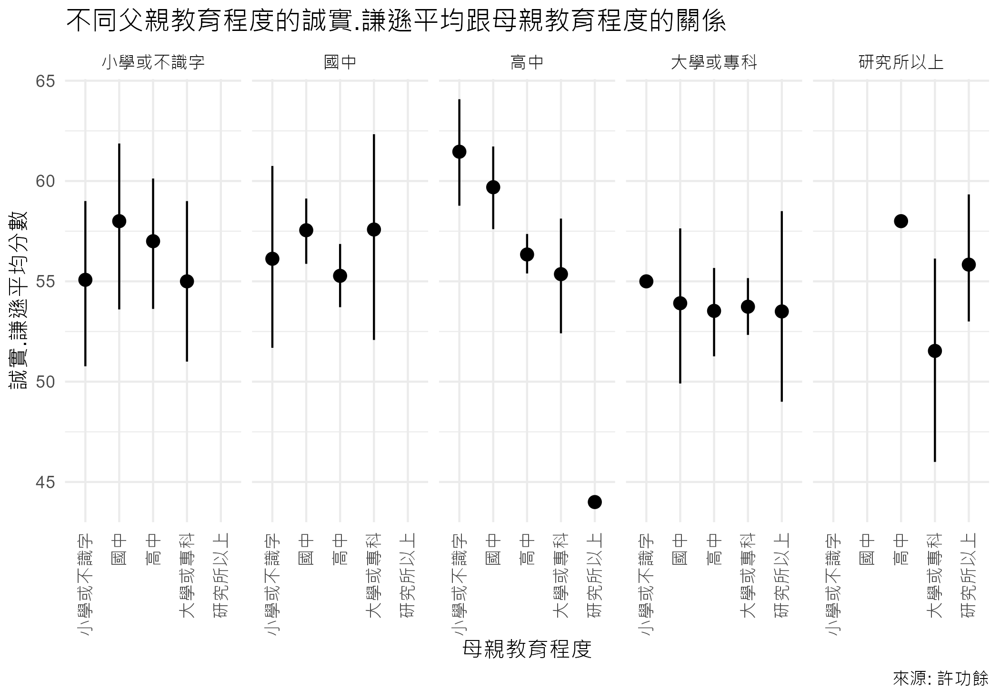

## 多變量圖形

``` r
#多變量圖形 
#圖2.12,dpi=300
dta |> tidyr::pivot_longer(cols=4:9, 
                           names_to = '人格維度',
                           values_to = '分數') |>
  ggplot()+
  aes(x=違反規定, y=分數, color=性別)+
  geom_point(size=rel(.5))+
  stat_smooth(method='lm', 
              formula = y ~ x,
              se=F, linewidth=.5)+
  facet_grid(人格維度 ~ 母親教育程度) +
  scale_color_grey(start=.1, end=.6)+
  labs(x="違反規定分數",
       y="人格維度分數")+
  theme(legend.position='top')
```

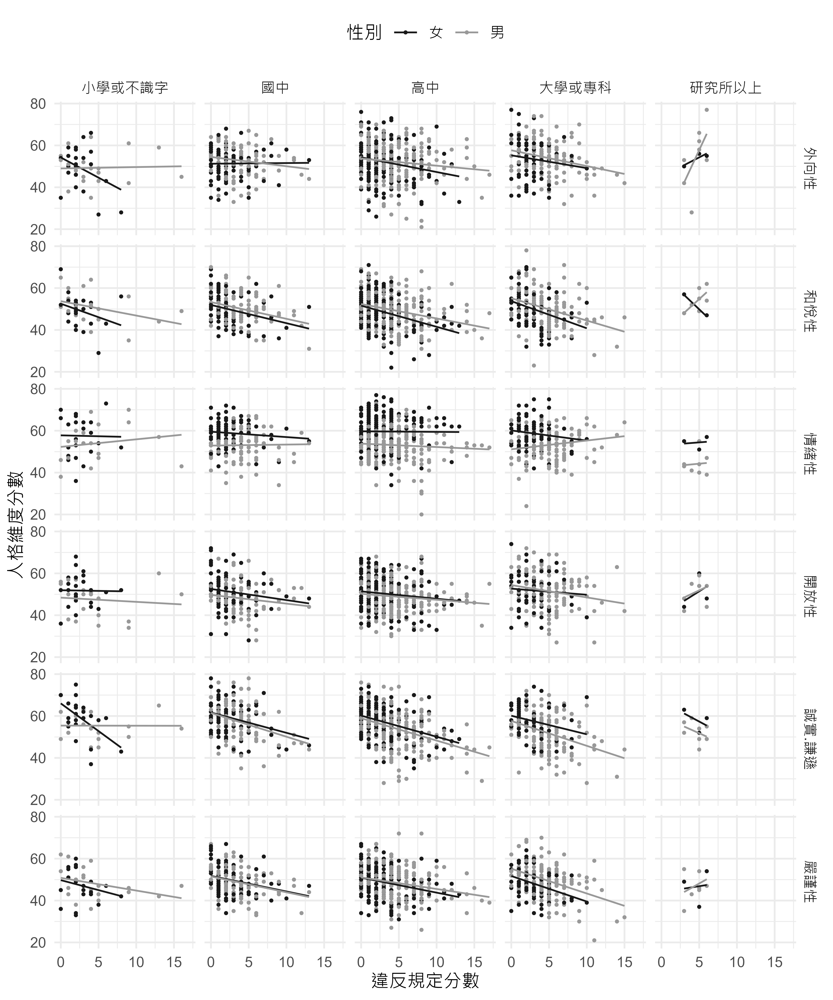

## 延伸

``` r
#同時繪製兩個變項的散布圖，以及各自的邊際分布
#圖2.13
p <- ggplot(dta, 
            aes(x=誠實.謙遜, y=違反規定)) +
  geom_point(shape=21, alpha=.5) +
  stat_ellipse() +
  geom_vline(xintercept=mean(dta$誠實.謙遜), col="gray") +
  geom_hline(yintercept=mean(dta$違反規定), col="gray") +
  stat_smooth(method="lm", 
              formula = y ~ x,
              linewidth=.7,
              linetype="dotted",
              se=FALSE,
              alpha=.5,
              col=1) +
  labs(y="違反規定分數", 
       x="誠實.謙遜分數") 
pacman::p_load(ggExtra, KernSmooth)
ggMarginal(p, 
           type="histogram",
           xparams=list(binwidth=dpih(dta$誠實.謙遜),
                          fill="gray90"),
           yparams=list(binwidth=dpih(dta$違反規定),
                          fill="gray90"))
```

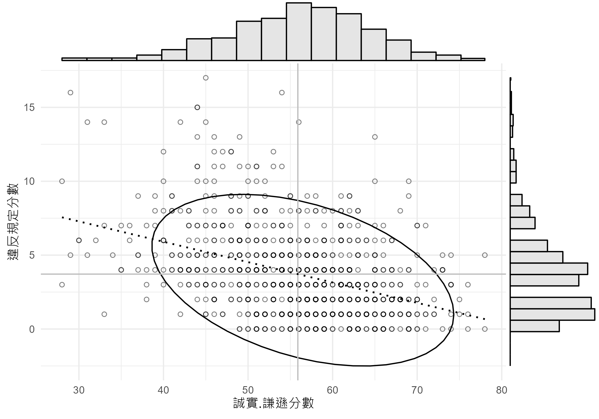

# 繪製模型分析結果

``` r
#以 tidy 方式整理後繪製
#圖2.14
lm(誠實.謙遜 ~ 性別 + 母親教育程度 + 性別:母親教育程度, data=dta) |>
  broom::tidy(conf.int=TRUE) |> 
  dplyr::slice(-1) |>
  ggplot() +
  aes(estimate, term, xmin = conf.low, xmax = conf.high, height = 0) +
  geom_errorbarh()+
  geom_point() +
  geom_vline(xintercept = 0, linetype='dotted', col='gray') 
```

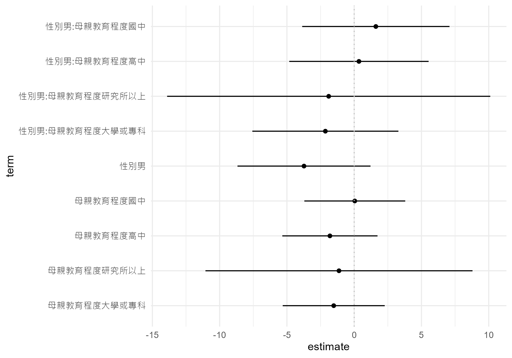

``` r
#繪製模型分析所得參數
#以套件GGally整理後繪製
#圖2.15
lm(誠實.謙遜 ~ 性別 + 母親教育程度 + 性別:母親教育程度, data=dta) %>%
  GGally::ggcoef(.,  exclude_intercept=TRUE,
                 sort=NULL, 
                 na.rm=TRUE) +
  labs(x="估計值",
       y="變項")
```

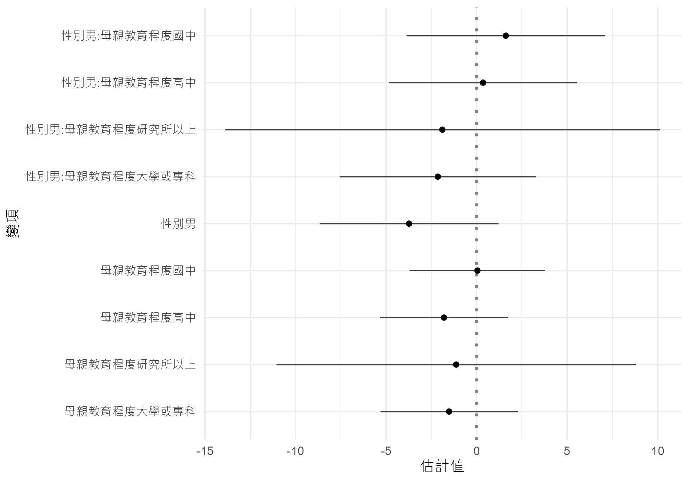

``` r
#繪圖檢視模型與資料的配適性
#這邊先做性別與父母教育對數學成績的二因子 ANOVA
#程式報表2.5
lm(誠實.謙遜 ~ 性別*母親教育程度, data=dta) |> anova()
```

<table>
<thead>
<tr>
<th style="text-align:left;">
</th>
<th style="text-align:right;">
Df
</th>
<th style="text-align:right;">
Sum Sq
</th>
<th style="text-align:right;">
Mean Sq
</th>
<th style="text-align:right;">
F value
</th>
<th style="text-align:right;">
Pr(\>F)
</th>
</tr>
</thead>
<tbody>
<tr>
<td style="text-align:left;">
性別
</td>
<td style="text-align:right;">
1
</td>
<td style="text-align:right;">
3422.0
</td>
<td style="text-align:right;">
3422.01
</td>
<td style="text-align:right;">
50.432
</td>
<td style="text-align:right;">
0.0000
</td>
</tr>
<tr>
<td style="text-align:left;">
母親教育程度
</td>
<td style="text-align:right;">
4
</td>
<td style="text-align:right;">
1472.6
</td>
<td style="text-align:right;">
368.14
</td>
<td style="text-align:right;">
5.426
</td>
<td style="text-align:right;">
0.0003
</td>
</tr>
<tr>
<td style="text-align:left;">
性別:母親教育程度
</td>
<td style="text-align:right;">
4
</td>
<td style="text-align:right;">
382.2
</td>
<td style="text-align:right;">
95.55
</td>
<td style="text-align:right;">
1.408
</td>
<td style="text-align:right;">
0.2293
</td>
</tr>
<tr>
<td style="text-align:left;">
Residuals
</td>
<td style="text-align:right;">
887
</td>
<td style="text-align:right;">
60186.1
</td>
<td style="text-align:right;">
67.85
</td>
<td style="text-align:right;">
NA
</td>
<td style="text-align:right;">
NA
</td>
</tr>
</tbody>
</table>

``` r
#繪製模型分析所得參數，並與實際資料對照
#先彙整資料
#程式報表2.6
ef_m1 <- lm(誠實.謙遜 ~ 性別 + 母親教育程度, data=dta) %>%
  ggeffects::ggpredict(., terms=c("母親教育程度", "性別")) |> 
  as.data.frame()

ef_m1
```

<table>
<thead>
<tr>
<th style="text-align:left;">
x
</th>
<th style="text-align:right;">
predicted
</th>
<th style="text-align:right;">
std.error
</th>
<th style="text-align:right;">
conf.low
</th>
<th style="text-align:right;">
conf.high
</th>
<th style="text-align:left;">
group
</th>
</tr>
</thead>
<tbody>
<tr>
<td style="text-align:left;">
小學或不識字
</td>
<td style="text-align:right;">
59.13
</td>
<td style="text-align:right;">
1.2835
</td>
<td style="text-align:right;">
56.61
</td>
<td style="text-align:right;">
61.65
</td>
<td style="text-align:left;">
女
</td>
</tr>
<tr>
<td style="text-align:left;">
小學或不識字
</td>
<td style="text-align:right;">
55.40
</td>
<td style="text-align:right;">
1.2918
</td>
<td style="text-align:right;">
52.86
</td>
<td style="text-align:right;">
57.93
</td>
<td style="text-align:left;">
男
</td>
</tr>
<tr>
<td style="text-align:left;">
國中
</td>
<td style="text-align:right;">
59.96
</td>
<td style="text-align:right;">
0.6576
</td>
<td style="text-align:right;">
58.67
</td>
<td style="text-align:right;">
61.25
</td>
<td style="text-align:left;">
女
</td>
</tr>
<tr>
<td style="text-align:left;">
國中
</td>
<td style="text-align:right;">
56.23
</td>
<td style="text-align:right;">
0.6637
</td>
<td style="text-align:right;">
54.92
</td>
<td style="text-align:right;">
57.53
</td>
<td style="text-align:left;">
男
</td>
</tr>
<tr>
<td style="text-align:left;">
高中
</td>
<td style="text-align:right;">
57.50
</td>
<td style="text-align:right;">
0.4759
</td>
<td style="text-align:right;">
56.56
</td>
<td style="text-align:right;">
58.43
</td>
<td style="text-align:left;">
女
</td>
</tr>
<tr>
<td style="text-align:left;">
高中
</td>
<td style="text-align:right;">
53.76
</td>
<td style="text-align:right;">
0.4875
</td>
<td style="text-align:right;">
52.81
</td>
<td style="text-align:right;">
54.72
</td>
<td style="text-align:left;">
男
</td>
</tr>
<tr>
<td style="text-align:left;">
大學或專科
</td>
<td style="text-align:right;">
56.33
</td>
<td style="text-align:right;">
0.6513
</td>
<td style="text-align:right;">
55.05
</td>
<td style="text-align:right;">
57.61
</td>
<td style="text-align:left;">
女
</td>
</tr>
<tr>
<td style="text-align:left;">
大學或專科
</td>
<td style="text-align:right;">
52.60
</td>
<td style="text-align:right;">
0.6038
</td>
<td style="text-align:right;">
51.41
</td>
<td style="text-align:right;">
53.78
</td>
<td style="text-align:left;">
男
</td>
</tr>
<tr>
<td style="text-align:left;">
研究所以上
</td>
<td style="text-align:right;">
56.63
</td>
<td style="text-align:right;">
2.5184
</td>
<td style="text-align:right;">
51.68
</td>
<td style="text-align:right;">
61.57
</td>
<td style="text-align:left;">
女
</td>
</tr>
<tr>
<td style="text-align:left;">
研究所以上
</td>
<td style="text-align:right;">
52.89
</td>
<td style="text-align:right;">
2.4905
</td>
<td style="text-align:right;">
48.00
</td>
<td style="text-align:right;">
57.78
</td>
<td style="text-align:left;">
男
</td>
</tr>
</tbody>
</table>

``` r
#繪製模型分析所得參數，並與實際資料對照
#注意 y 被設定四次
#圖2.16
ggplot() +
   stat_summary(data=dta, 
                aes(x=母親教育程度, y=誠實.謙遜, color=性別), 
                fun.data = "mean_cl_boot", 
                size=rel(.3),
                position=position_dodge(.2))+
   geom_line(data=ef_m1, aes(x=x, y=predicted, 
                             group=group, 
                             color=group))+
   geom_line(data=ef_m1, aes(x=x, y=conf.low, 
                             col=group, group=group),
                             linetype='dotted')+
   geom_line(data=ef_m1, aes(x=x, y=conf.high, 
                             col=group, group=group),
                             linetype='dotted') +
   scale_color_grey(end=.6)+
   labs(y='誠實.謙遜平均分數',
        x='母親教育程度',
        title='性別跟母親教育對誠實.謙遜平均的效果')+
   guides(color=guide_legend(title="性別"))+
   theme(legend.position='top')
```

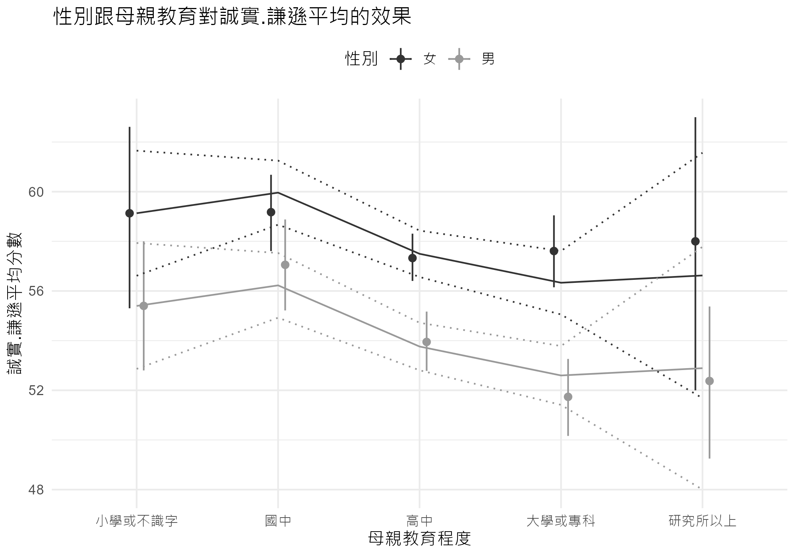

# References

Wickham, H. (2016). ggplot2: Elegant Graphics for Data Analysis. New
York: Springer-Verlag.
