第三章: 變項間關係
================
2024 三月 04

``` r
#整體設定，含載入套件
source("https://raw.githubusercontent.com/ChungPingCheng/R4BS2/main/R4BS_setup.R")
```

# 資料與管理

``` r
#讀檔案，資料來自於 TIMSS 2011 年
dta <- read.csv(file = "../Data/TIMSS3C.csv", 
                  header = TRUE, stringsAsFactors = TRUE)
```

``` r
#檢視資料結構
#程式報表3.1
str(dta)
```

    'data.frame':   12300 obs. of  9 variables:
     $ 國家    : Factor w/ 3 levels "日本","台灣",..: 2 2 2 2 2 2 2 2 2 2 ...
     $ 性別    : Factor w/ 2 levels "女生","男生": 1 1 1 1 1 1 1 1 1 1 ...
     $ 父母教育: Factor w/ 5 levels "大學以上","初中",..: 3 3 4 2 1 5 3 1 2 3 ...
     $ 數學    : num  729 776 718 607 658 ...
     $ 化學    : num  625 662 709 633 618 ...
     $ 地科    : num  608 666 629 620 614 ...
     $ 生物    : num  651 628 617 592 560 ...
     $ 物理    : num  618 617 663 616 591 ...
     $ 電腦    : Factor w/ 2 levels "有","無": 1 1 1 1 1 1 1 1 1 1 ...

``` r
#看看前六筆
#程式報表3.2
head(dta)
```

<table>
<thead>
<tr>
<th style="text-align:left;">
國家
</th>
<th style="text-align:left;">
性別
</th>
<th style="text-align:left;">
父母教育
</th>
<th style="text-align:right;">
數學
</th>
<th style="text-align:right;">
化學
</th>
<th style="text-align:right;">
地科
</th>
<th style="text-align:right;">
生物
</th>
<th style="text-align:right;">
物理
</th>
<th style="text-align:left;">
電腦
</th>
</tr>
</thead>
<tbody>
<tr>
<td style="text-align:left;">
台灣
</td>
<td style="text-align:left;">
女生
</td>
<td style="text-align:left;">
高中
</td>
<td style="text-align:right;">
729.4
</td>
<td style="text-align:right;">
624.8
</td>
<td style="text-align:right;">
607.8
</td>
<td style="text-align:right;">
650.7
</td>
<td style="text-align:right;">
618.3
</td>
<td style="text-align:left;">
有
</td>
</tr>
<tr>
<td style="text-align:left;">
台灣
</td>
<td style="text-align:left;">
女生
</td>
<td style="text-align:left;">
高中
</td>
<td style="text-align:right;">
776.2
</td>
<td style="text-align:right;">
661.8
</td>
<td style="text-align:right;">
665.7
</td>
<td style="text-align:right;">
627.9
</td>
<td style="text-align:right;">
616.7
</td>
<td style="text-align:left;">
有
</td>
</tr>
<tr>
<td style="text-align:left;">
台灣
</td>
<td style="text-align:left;">
女生
</td>
<td style="text-align:left;">
國小以下
</td>
<td style="text-align:right;">
718.2
</td>
<td style="text-align:right;">
708.8
</td>
<td style="text-align:right;">
629.3
</td>
<td style="text-align:right;">
617.5
</td>
<td style="text-align:right;">
663.3
</td>
<td style="text-align:left;">
有
</td>
</tr>
<tr>
<td style="text-align:left;">
台灣
</td>
<td style="text-align:left;">
女生
</td>
<td style="text-align:left;">
初中
</td>
<td style="text-align:right;">
607.2
</td>
<td style="text-align:right;">
633.0
</td>
<td style="text-align:right;">
620.3
</td>
<td style="text-align:right;">
592.1
</td>
<td style="text-align:right;">
616.5
</td>
<td style="text-align:left;">
有
</td>
</tr>
<tr>
<td style="text-align:left;">
台灣
</td>
<td style="text-align:left;">
女生
</td>
<td style="text-align:left;">
大學以上
</td>
<td style="text-align:right;">
658.2
</td>
<td style="text-align:right;">
617.8
</td>
<td style="text-align:right;">
614.1
</td>
<td style="text-align:right;">
560.2
</td>
<td style="text-align:right;">
591.0
</td>
<td style="text-align:left;">
有
</td>
</tr>
<tr>
<td style="text-align:left;">
台灣
</td>
<td style="text-align:left;">
女生
</td>
<td style="text-align:left;">
專科
</td>
<td style="text-align:right;">
478.6
</td>
<td style="text-align:right;">
601.2
</td>
<td style="text-align:right;">
591.0
</td>
<td style="text-align:right;">
598.8
</td>
<td style="text-align:right;">
554.0
</td>
<td style="text-align:left;">
有
</td>
</tr>
</tbody>
</table>

``` r
dta <- dta |> 
  dplyr::mutate(父母教育 = fct_relevel(父母教育, 
      c("國小以下", "初中", "高中", "專科", "大學以上")))
```

# 基本統計

``` r
#看看描述性統計（論文裡面常見的「表一」）
#程式報表3.3
gtsummary::tbl_summary(dta,
            statistic = list(all_continuous() ~ "{mean} ({sd})")) 
```

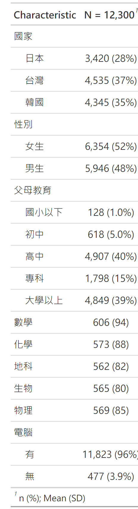

``` r
#區分國家看看連續資料描述性統計
#程式報表3.4
dta |> dplyr::select(where(is.numeric), c('國家', '性別')) %>%
  gtsummary::tbl_summary(., by = 國家, 
    statistic = list(all_continuous() ~ "{mean} ({sd})")) %>% add_p()
```

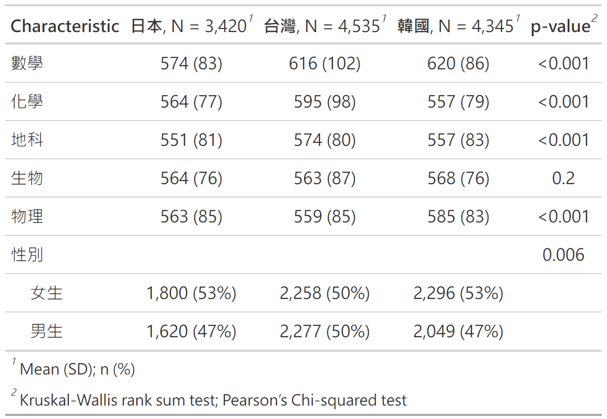

``` r
#區分國家與性別看看連續資料描述性統計
#程式報表3.5
dta |> dplyr::select(where(is.numeric), c('國家', '性別')) %>%
  gtsummary::tbl_strata(strata = 國家, .tbl_fun =~ .x %>%
  tbl_summary(by = 性別,
              statistic = list(all_continuous() ~ "{mean} ({sd})"))) 
```

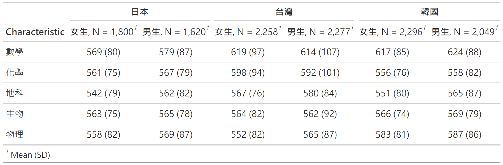

\#連續變項

``` r
#看看連續資料（數學分數）的直方圖
#圖3.1
ggplot(data=dta, 
       aes(x = 數學, after_stat(density))) +
  geom_histogram(binwidth = function(x) 2 * IQR(x) / (length(x)^(1/3)),
                 col='black', fill='gray90')+
  labs(x = '數學分數', 
       y = '機率密度')
```

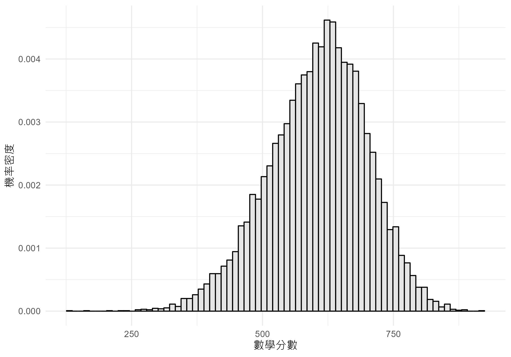

``` r
#看看連續資料（五科分數）的直方圖
#圖3.2
dta |> dplyr::select(where(is.numeric)) |>
  tidyr::pivot_longer(everything()) |>
  dplyr::mutate(name = reorder(name, value, mean)) |>
  ggplot() +
  aes(x = value, after_stat(density)) +
  facet_wrap(~ name, scales = 'free_y', ncol=1) +
  geom_histogram(binwidth = function(x) 2 * IQR(x) / (length(x)^(1/3)),
                 fill='gray90', col='black')+
  labs(x = '分數', 
       y = '機率密度',
       title="五科分數分配圖(不分國家)")
```

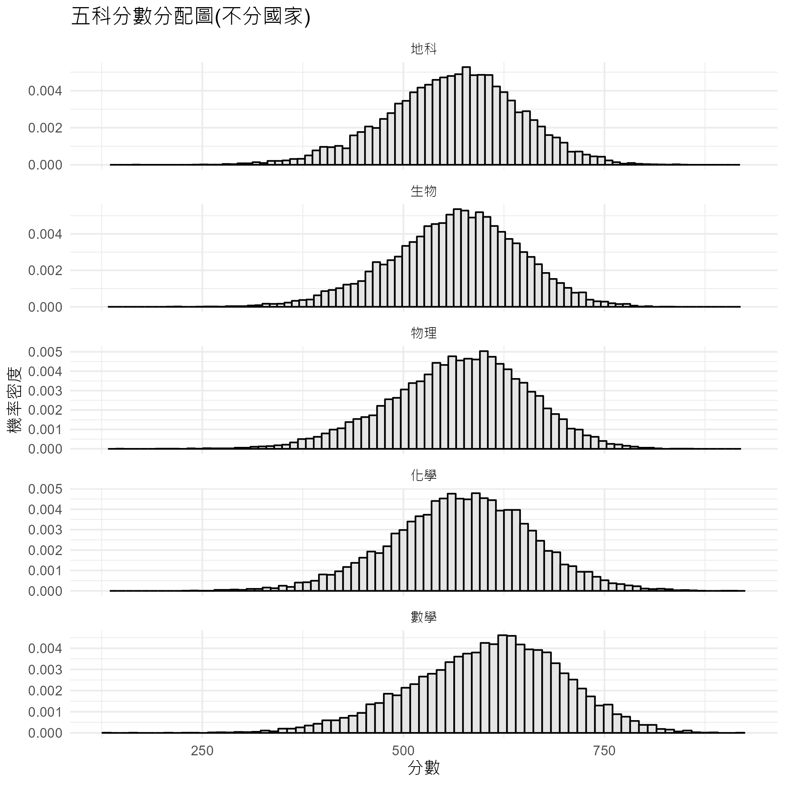

## 連續變項間關係

``` r
#數學與物理分數相關
#程式報表3.6前
with(dta, cor(數學, 物理)) |> round(3)
```

    [1] 0.728

``` r
#所有學科分數相關
#程式報表3.6後
dta |> dplyr::select(where(is.numeric)) |>
  cor() |> round(3)
```

<table>
<thead>
<tr>
<th style="text-align:left;">
</th>
<th style="text-align:right;">
數學
</th>
<th style="text-align:right;">
化學
</th>
<th style="text-align:right;">
地科
</th>
<th style="text-align:right;">
生物
</th>
<th style="text-align:right;">
物理
</th>
</tr>
</thead>
<tbody>
<tr>
<td style="text-align:left;">
數學
</td>
<td style="text-align:right;">
1.000
</td>
<td style="text-align:right;">
0.730
</td>
<td style="text-align:right;">
0.691
</td>
<td style="text-align:right;">
0.709
</td>
<td style="text-align:right;">
0.728
</td>
</tr>
<tr>
<td style="text-align:left;">
化學
</td>
<td style="text-align:right;">
0.730
</td>
<td style="text-align:right;">
1.000
</td>
<td style="text-align:right;">
0.864
</td>
<td style="text-align:right;">
0.871
</td>
<td style="text-align:right;">
0.860
</td>
</tr>
<tr>
<td style="text-align:left;">
地科
</td>
<td style="text-align:right;">
0.691
</td>
<td style="text-align:right;">
0.864
</td>
<td style="text-align:right;">
1.000
</td>
<td style="text-align:right;">
0.877
</td>
<td style="text-align:right;">
0.856
</td>
</tr>
<tr>
<td style="text-align:left;">
生物
</td>
<td style="text-align:right;">
0.709
</td>
<td style="text-align:right;">
0.871
</td>
<td style="text-align:right;">
0.877
</td>
<td style="text-align:right;">
1.000
</td>
<td style="text-align:right;">
0.898
</td>
</tr>
<tr>
<td style="text-align:left;">
物理
</td>
<td style="text-align:right;">
0.728
</td>
<td style="text-align:right;">
0.860
</td>
<td style="text-align:right;">
0.856
</td>
<td style="text-align:right;">
0.898
</td>
<td style="text-align:right;">
1.000
</td>
</tr>
</tbody>
</table>

``` r
#兩兩變項畫散佈圖
#圖3.3
dta |>
  dplyr::select_if(is.numeric) |> 
  as.tibble() |>
  GGally::ggpairs(data = _, axisLabels= 'internal', title= '變項間關聯')
```

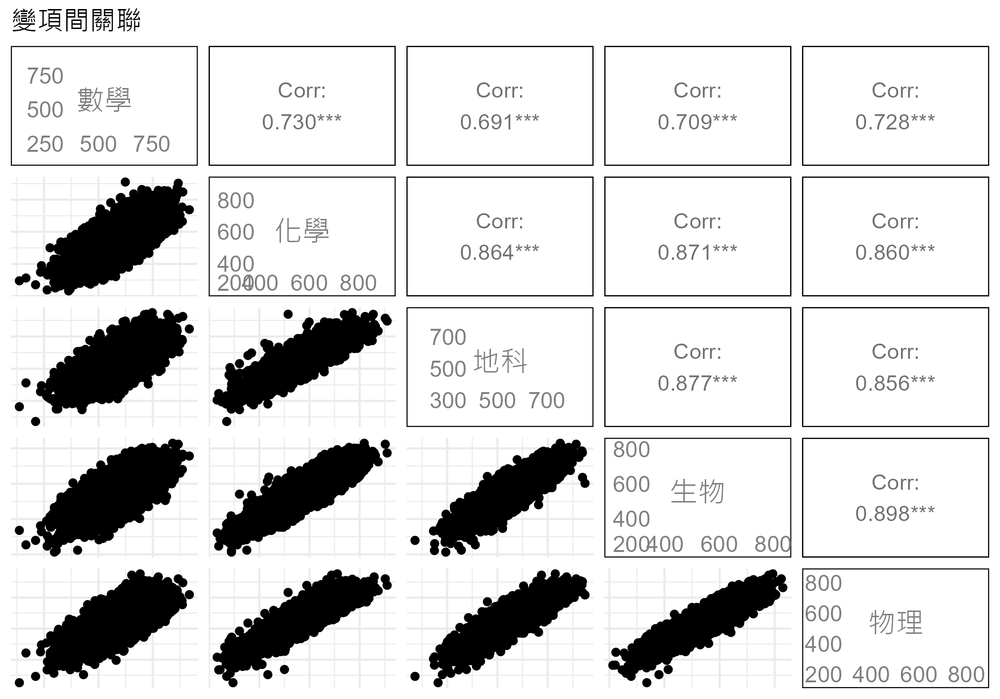

## 檢定相關

``` r
#檢定相關是否顯著，也可以看到信賴區間
#程式報表3.7
dta |> 
  dplyr::select(where(is.numeric)) |>
  cor.test( ~ 數學 + 物理, data = _)
```


        Pearson's product-moment correlation

    data:  數學 and 物理
    t = 118, df = 12298, p-value <2e-16
    alternative hypothesis: true correlation is not equal to 0
    95 percent confidence interval:
     0.7196 0.7362
    sample estimates:
      cor 
    0.728 

``` r
#以 Hmist　一次檢定所有相關
#程式報表3.8
dta4 <- dta |> 
  dplyr::select(where(is.numeric))
Hmisc::rcorr(as.matrix(dta4), type="pearson") 
```

         數學 化學 地科 生物 物理
    數學 1.00 0.73 0.69 0.71 0.73
    化學 0.73 1.00 0.86 0.87 0.86
    地科 0.69 0.86 1.00 0.88 0.86
    生物 0.71 0.87 0.88 1.00 0.90
    物理 0.73 0.86 0.86 0.90 1.00

    n= 12300 


    P
         數學 化學 地科 生物 物理
    數學       0    0    0    0  
    化學  0         0    0    0  
    地科  0    0         0    0  
    生物  0    0    0         0  
    物理  0    0    0    0       

``` r
#檢驗數學與物理、數學與生物何者相關高
#程式報表3.9
cocor::cocor(~ 數學 + 物理 | 數學 + 生物, dta)
```


      Results of a comparison of two overlapping correlations based on dependent groups

    Comparison between r.jk (數學, 物理) = 0.728 and r.jh (數學, 生物) = 0.7092
    Difference: r.jk - r.jh = 0.0189
    Related correlation: r.kh = 0.8975
    Data: dta: j = 數學, k = 物理, h = 生物
    Group size: n = 12300
    Null hypothesis: r.jk is equal to r.jh
    Alternative hypothesis: r.jk is not equal to r.jh (two-sided)
    Alpha: 0.05

    pearson1898: Pearson and Filon's z (1898)
      z = 6.8293, p-value = 0.0000
      Null hypothesis rejected

    hotelling1940: Hotelling's t (1940)
      t = 6.8706, df = 12297, p-value = 0.0000
      Null hypothesis rejected

    williams1959: Williams' t (1959)
      t = 6.8598, df = 12297, p-value = 0.0000
      Null hypothesis rejected

    olkin1967: Olkin's z (1967)
      z = 6.8293, p-value = 0.0000
      Null hypothesis rejected

    dunn1969: Dunn and Clark's z (1969)
      z = 6.8537, p-value = 0.0000
      Null hypothesis rejected

    hendrickson1970: Hendrickson, Stanley, and Hills' (1970) modification of Williams' t (1959)
      t = 6.8706, df = 12297, p-value = 0.0000
      Null hypothesis rejected

    steiger1980: Steiger's (1980) modification of Dunn and Clark's z (1969) using average correlations
      z = 6.8489, p-value = 0.0000
      Null hypothesis rejected

    meng1992: Meng, Rosenthal, and Rubin's z (1992)
      z = 6.8483, p-value = 0.0000
      Null hypothesis rejected
      95% confidence interval for r.jk - r.jh: 0.0279 0.0503
      Null hypothesis rejected (Interval does not include 0)

    hittner2003: Hittner, May, and Silver's (2003) modification of Dunn and Clark's z (1969) using a backtransformed average Fisher's (1921) Z procedure
      z = 6.8477, p-value = 0.0000
      Null hypothesis rejected

    zou2007: Zou's (2007) confidence interval
      95% confidence interval for r.jk - r.jh: 0.0135 0.0243
      Null hypothesis rejected (Interval does not include 0)

``` r
#檢驗數學與物理、地科與生物何者相關高
#程式報表3.10
cocor::cocor(~ 數學 + 物理 | 地科 + 生物, dta)
```


      Results of a comparison of two nonoverlapping correlations based on dependent groups

    Comparison between r.jk (數學, 物理) = 0.728 and r.hm (地科, 生物) = 0.8766
    Difference: r.jk - r.hm = -0.1485
    Related correlations: r.jh = 0.6907, r.jm = 0.7092, r.kh = 0.8556, r.km = 0.8975
    Data: dta: j = 數學, k = 物理, h = 地科, m = 生物
    Group size: n = 12300
    Null hypothesis: r.jk is equal to r.hm
    Alternative hypothesis: r.jk is not equal to r.hm (two-sided)
    Alpha: 0.05

    pearson1898: Pearson and Filon's z (1898)
      z = -37.0484, p-value = 0.0000
      Null hypothesis rejected

    dunn1969: Dunn and Clark's z (1969)
      z = -42.5188, p-value = 0.0000
      Null hypothesis rejected

    steiger1980: Steiger's (1980) modification of Dunn and Clark's z (1969) using average correlations
      z = -42.0886, p-value = 0.0000
      Null hypothesis rejected

    raghunathan1996: Raghunathan, Rosenthal, and Rubin's (1996) modification of Pearson and Filon's z (1898)
      z = -42.5188, p-value = 0.0000
      Null hypothesis rejected

    silver2004: Silver, Hittner, and May's (2004) modification of Dunn and Clark's z (1969) using a backtransformed average Fisher's (1921) Z procedure
      z = -41.8351, p-value = 0.0000
      Null hypothesis rejected

    zou2007: Zou's (2007) confidence interval
      95% confidence interval for r.jk - r.hm: -0.1565 -0.1408
      Null hypothesis rejected (Interval does not include 0)

## 類別變項分配圖

``` r
#單一類別變項分布圖
#圖3.4
with(dta, table(父母教育)) |> 
    prop.table() |>
    as.data.frame() |>
ggplot()+
  aes(y=Freq,x=父母教育) + 
  geom_bar(stat = "identity",width = .1) + 
  scale_y_continuous(labels=scales::percent) +
  scale_fill_grey()+
  coord_flip()+
  labs(y="百分比") +
  theme(legend.position="none")
```

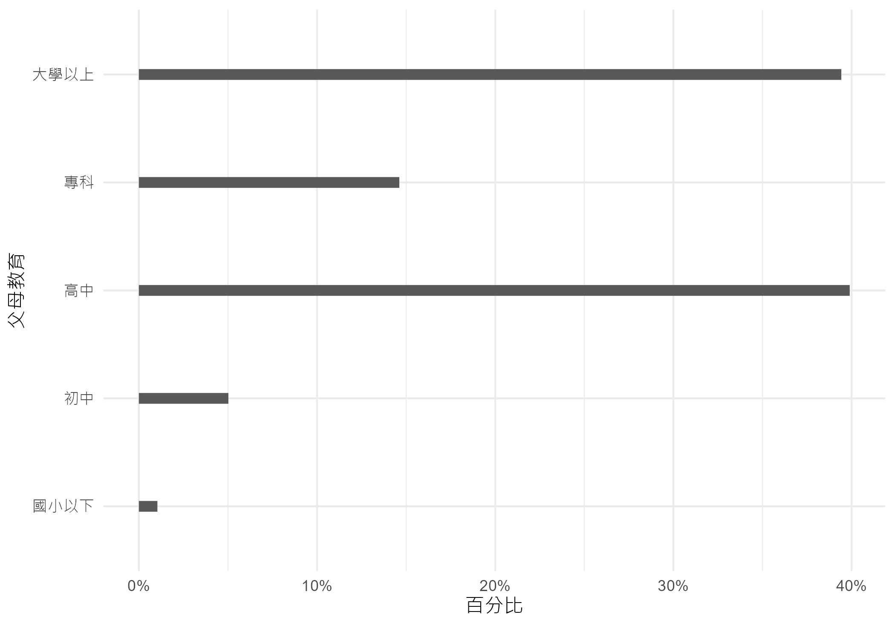

``` r
#看看兩個類別資料間關聯（兩類別變項的列聯表）
#程式報表3.11
dta |> dplyr::select(c('國家', '父母教育')) %>%
  gtsummary::tbl_cross(row=國家, col=父母教育, percent="cell") %>%   
  add_p(source_note = TRUE)
```

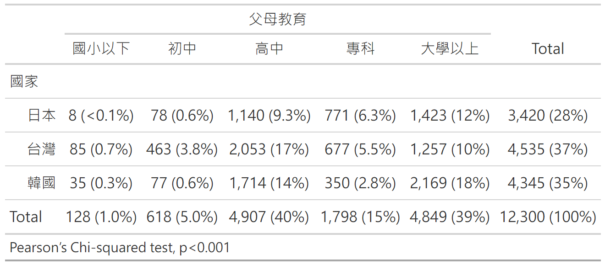

``` r
#兩類別變項卡方檢定
#程式報表3.12前
with(dta, table(國家, 父母教育)) |> 
  chisq.test(simulate.p.value = TRUE)
```


        Pearson's Chi-squared test with simulated p-value (based on 2000
        replicates)

    data:  with(dta, table(國家, 父母教育))
    X-squared = 1068, df = NA, p-value = 5e-04

``` r
#兩類別變項間關聯（Cramer's V）
#程式報表3.12後
with(dta, table(國家, 父母教育)) |> 
  chisq.test(simulate.p.value = TRUE) |> 
  cramersv()
```

    [1] 0.2083

``` r
#看看兩個類別資料的分配圖（欄總和為100%）
#程式報表3.13
with(dta, table(父母教育, 國家)) |> 
  prop.table(2) |> 
  round(3)
```

<table>
<thead>
<tr>
<th style="text-align:left;">
</th>
<th style="text-align:right;">
日本
</th>
<th style="text-align:right;">
台灣
</th>
<th style="text-align:right;">
韓國
</th>
</tr>
</thead>
<tbody>
<tr>
<td style="text-align:left;">
國小以下
</td>
<td style="text-align:right;">
0.002
</td>
<td style="text-align:right;">
0.019
</td>
<td style="text-align:right;">
0.008
</td>
</tr>
<tr>
<td style="text-align:left;">
初中
</td>
<td style="text-align:right;">
0.023
</td>
<td style="text-align:right;">
0.102
</td>
<td style="text-align:right;">
0.018
</td>
</tr>
<tr>
<td style="text-align:left;">
高中
</td>
<td style="text-align:right;">
0.333
</td>
<td style="text-align:right;">
0.453
</td>
<td style="text-align:right;">
0.394
</td>
</tr>
<tr>
<td style="text-align:left;">
專科
</td>
<td style="text-align:right;">
0.225
</td>
<td style="text-align:right;">
0.149
</td>
<td style="text-align:right;">
0.081
</td>
</tr>
<tr>
<td style="text-align:left;">
大學以上
</td>
<td style="text-align:right;">
0.416
</td>
<td style="text-align:right;">
0.277
</td>
<td style="text-align:right;">
0.499
</td>
</tr>
</tbody>
</table>

``` r
#先計算不同國家父母教育百分比，再以ggplot繪圖 
#圖3.5
with(dta, table(父母教育, 國家)) |> 
  prop.table(2) |> 
  as.data.frame() |>
  ggplot()+
  aes(y=Freq, x=父母教育, color=國家, group=國家)+
  geom_point()+
  geom_line()+
  scale_color_grey()+
  labs(y="百分比")+
  theme(legend.position="top")
```

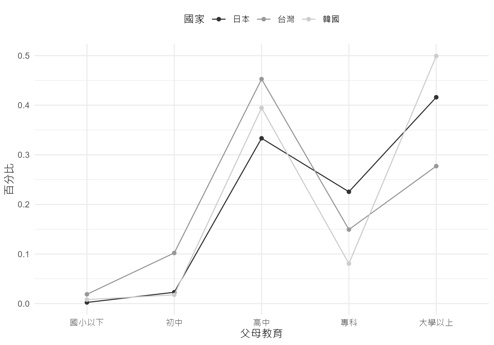

``` r
#也可以不用先算，直接讓 ggplot 算
#圖3.6
ggplot(dta, 
       aes(x=父母教育, group = 國家 )) + 
  geom_bar(aes(y=after_stat(prop), 
               fill = factor(after_stat(x))),
           width = .1) + 
  scale_y_continuous(labels=scales::percent) +
  scale_fill_grey()+
  coord_flip()+
  labs(y="百分比") +
  facet_wrap(vars(國家), ncol=1)+
  theme(legend.position="none")
```

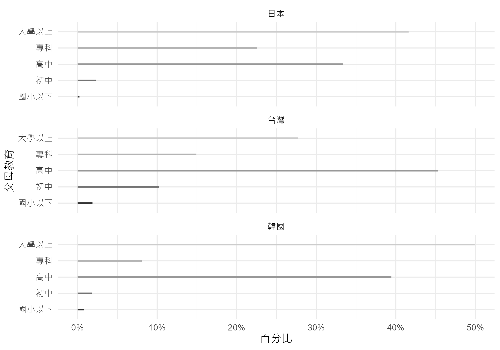

## 連續變項與類別變項間的關係

``` r
##兩個類別變項與一個連續變項
#看看不同國家以及家裡有無電腦下，學生數學分數直方圖
#圖3.7
ggplot(dta, aes(x=數學, color=電腦)) +
  geom_density() +
  scale_color_grey()+
  facet_wrap(vars(國家))+
  labs(x = "數學分數",
       y = "機率密度")+
  theme(legend.position='top')
```

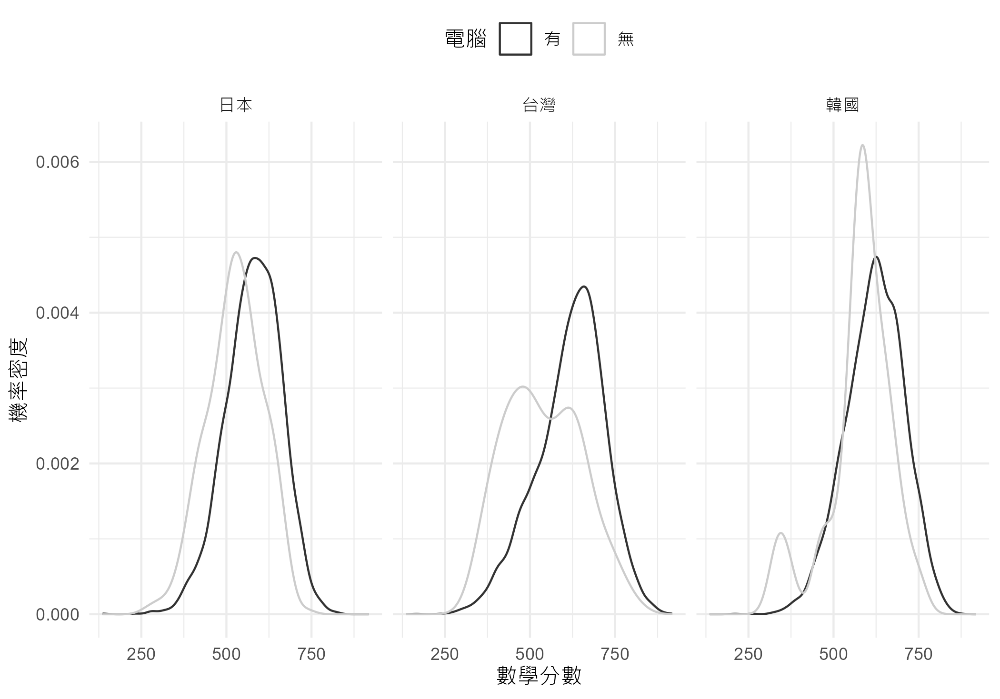

``` r
#也可用實徵累積機率密度函數圖比較
#圖3.8
ggplot(dta, aes(x=數學, color=電腦)) +
  stat_ecdf() +
  scale_color_grey(end=.7)+
  facet_wrap(vars(國家))+
  labs(x = "數學分數",
       y = "累積機率密度")+
  theme(legend.position='top')
```

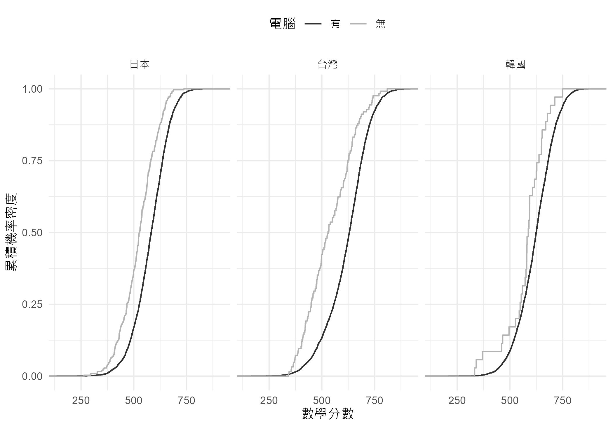

``` r
#看看有無電腦的學生數學平均與數標差
#程式報表3.14
aggregate(數學 ~ 電腦, data = dta, FUN = mean)
```

<table>
<thead>
<tr>
<th style="text-align:left;">
電腦
</th>
<th style="text-align:right;">
數學
</th>
</tr>
</thead>
<tbody>
<tr>
<td style="text-align:left;">
有
</td>
<td style="text-align:right;">
608.9
</td>
</tr>
<tr>
<td style="text-align:left;">
無
</td>
<td style="text-align:right;">
532.3
</td>
</tr>
</tbody>
</table>

``` r
aggregate(數學 ~ 電腦, data = dta, FUN = sd)
```

<table>
<thead>
<tr>
<th style="text-align:left;">
電腦
</th>
<th style="text-align:right;">
數學
</th>
</tr>
</thead>
<tbody>
<tr>
<td style="text-align:left;">
有
</td>
<td style="text-align:right;">
92.66
</td>
</tr>
<tr>
<td style="text-align:left;">
無
</td>
<td style="text-align:right;">
92.78
</td>
</tr>
</tbody>
</table>

``` r
#以盒鬚圖看不同國家學生的差異
#圖3.9
ggplot(dta, aes(y=數學, x=父母教育, col=性別)) +
  geom_boxplot() +
  scale_color_grey()+
  facet_grid(. ~ 國家)+
  labs(x = "數學分數",
       y = "機率密度")+
  theme(legend.position='top')
```

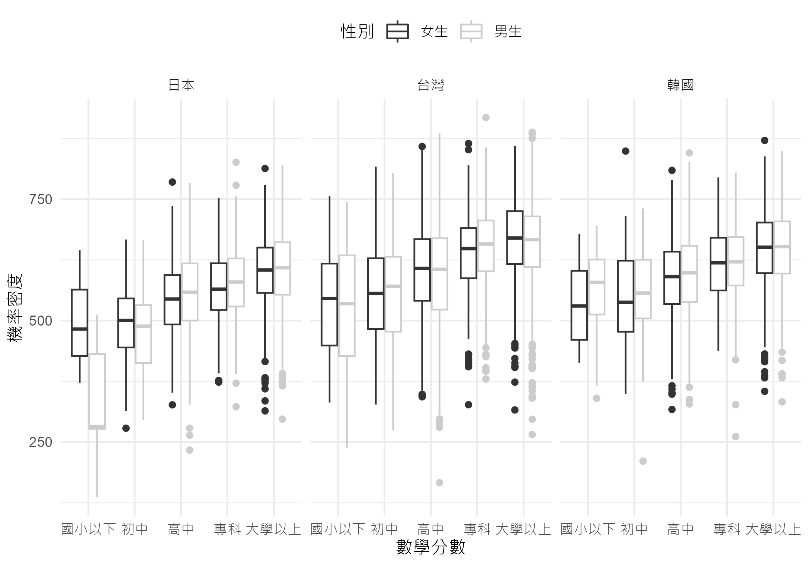

``` r
#看看不同國家間，物理與數學間的關係是否類似
#圖3.10
ggplot(dta, aes(x=數學, y=物理, col=性別)) +
  geom_point(pch = '.', alpha = .8)+
  stat_smooth(method='lm',
              formula = y ~ x,
              se =FALSE,
              linewidth = .5) +
  scale_color_grey()+
  facet_wrap(vars(國家), nrow=1)+
  labs(x = "數學分數",
       y = "物理分數")+
  theme(legend.position='top')
```

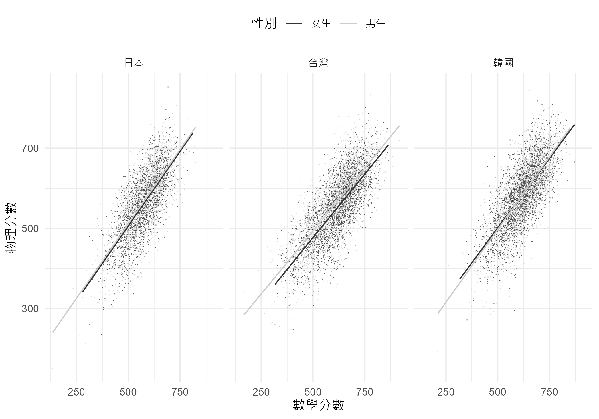

``` r
#在圖中加入了誤差
#圖3.11
ggplot(dta,
       aes(x=父母教育, y = 數學, color=電腦))+
  stat_summary(fun.data = "mean_cl_boot", 
               position=position_dodge(.5))+
  facet_grid(性別 ~ 國家)+
  scale_color_grey(end=.7)+
  theme(legend.position='top')
```

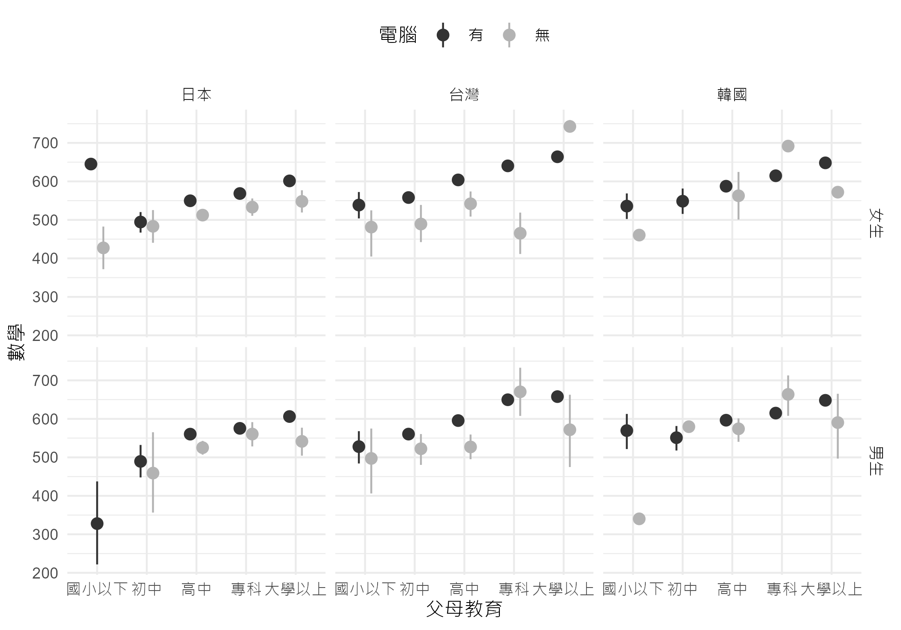

``` r
##連續變項與兩個類別變項間的關係
#看看不同國家、不同性別不同父母教育的學生數學平均與對應的平均數標準誤
#程式報表3.15
dta |> dplyr::group_by(國家, 父母教育, 性別) |>
  dplyr::summarize(數學平均 = mean(數學),
                   數學分數標準誤 = sd(數學)/ sqrt(n())) |>
  dplyr::ungroup() |>
  dplyr::filter(國家 == '台灣')
```

<table>
<thead>
<tr>
<th style="text-align:left;">
國家
</th>
<th style="text-align:left;">
父母教育
</th>
<th style="text-align:left;">
性別
</th>
<th style="text-align:right;">
數學平均
</th>
<th style="text-align:right;">
數學分數標準誤
</th>
</tr>
</thead>
<tbody>
<tr>
<td style="text-align:left;">
台灣
</td>
<td style="text-align:left;">
國小以下
</td>
<td style="text-align:left;">
女生
</td>
<td style="text-align:right;">
534.7
</td>
<td style="text-align:right;">
16.861
</td>
</tr>
<tr>
<td style="text-align:left;">
台灣
</td>
<td style="text-align:left;">
國小以下
</td>
<td style="text-align:left;">
男生
</td>
<td style="text-align:right;">
525.6
</td>
<td style="text-align:right;">
19.402
</td>
</tr>
<tr>
<td style="text-align:left;">
台灣
</td>
<td style="text-align:left;">
初中
</td>
<td style="text-align:left;">
女生
</td>
<td style="text-align:right;">
553.9
</td>
<td style="text-align:right;">
6.827
</td>
</tr>
<tr>
<td style="text-align:left;">
台灣
</td>
<td style="text-align:left;">
初中
</td>
<td style="text-align:left;">
男生
</td>
<td style="text-align:right;">
557.8
</td>
<td style="text-align:right;">
6.382
</td>
</tr>
<tr>
<td style="text-align:left;">
台灣
</td>
<td style="text-align:left;">
高中
</td>
<td style="text-align:left;">
女生
</td>
<td style="text-align:right;">
601.9
</td>
<td style="text-align:right;">
2.818
</td>
</tr>
<tr>
<td style="text-align:left;">
台灣
</td>
<td style="text-align:left;">
高中
</td>
<td style="text-align:left;">
男生
</td>
<td style="text-align:right;">
593.2
</td>
<td style="text-align:right;">
3.269
</td>
</tr>
<tr>
<td style="text-align:left;">
台灣
</td>
<td style="text-align:left;">
專科
</td>
<td style="text-align:left;">
女生
</td>
<td style="text-align:right;">
639.4
</td>
<td style="text-align:right;">
4.489
</td>
</tr>
<tr>
<td style="text-align:left;">
台灣
</td>
<td style="text-align:left;">
專科
</td>
<td style="text-align:left;">
男生
</td>
<td style="text-align:right;">
649.9
</td>
<td style="text-align:right;">
4.835
</td>
</tr>
<tr>
<td style="text-align:left;">
台灣
</td>
<td style="text-align:left;">
大學以上
</td>
<td style="text-align:left;">
女生
</td>
<td style="text-align:right;">
664.5
</td>
<td style="text-align:right;">
3.504
</td>
</tr>
<tr>
<td style="text-align:left;">
台灣
</td>
<td style="text-align:left;">
大學以上
</td>
<td style="text-align:left;">
男生
</td>
<td style="text-align:right;">
656.2
</td>
<td style="text-align:right;">
3.843
</td>
</tr>
</tbody>
</table>
