第四章: 迴歸分析
================
鄭中平, 許清芳
2024 三月 04

``` r
#整體設定，含載入套件
source("https://raw.githubusercontent.com/ChungPingCheng/R4BS2/main/R4BS_setup.R")
```

``` r
#資料來自於 TIMSS 2019 年台灣資料，納入變項無缺漏值者
#讀檔案
dta <- read.table(file="../Data/TIMSS2019TW.txt", 
                  header = TRUE, stringsAsFactors = TRUE)
```

``` r
#看資料結構與前六筆（類別變項與連續變項分開呈現）
#程式報表4.1
str(dta)
```

    'data.frame':   4967 obs. of  11 variables:
     $ 性別    : Factor w/ 2 levels "女","男": 2 2 2 2 2 2 2 2 2 1 ...
     $ 數學    : num  305 498 590 519 506 ...
     $ 數學興趣: num  10.9 7.45 9.68 6.75 9.5 ...
     $ 數學評價: num  13.48 7.3 8.82 7.71 8.58 ...
     $ 數學信心: num  9.23 8.26 10.35 6.5 9.23 ...
     $ 科學    : num  286 496 530 488 513 ...
     $ 科學興趣: num  6.88 5.66 8.9 7.71 6.88 ...
     $ 科學評價: num  12.94 4.28 8.61 7.82 7.62 ...
     $ 科學信心: num  9.12 6.77 8.36 6.77 7.8 ...
     $ 教育資源: num  7.56 8.36 7.56 9.04 8.36 ...
     $ 父母教育: Factor w/ 5 levels "大學以上","初中",..: 2 3 2 3 3 2 2 3 1 1 ...

\#資料管理

``` r
#排除無關變項（有「科學「兩字的）
#把父母教育各個水準順序定下來
dta <- dta |>   
  dplyr::select_at(vars(-contains("科學"))) |>
  dplyr::mutate(父母教育 = factor(父母教育, 
    levels = c('國小以下', '初中', '高中','專科','大學以上')))
```

``` r
#呈現類別變項前六筆
#程式報表4.2前
dta |>  dplyr::select_if(is.factor) |> head()
```

<table>
<thead>
<tr>
<th style="text-align:left;">
性別
</th>
<th style="text-align:left;">
父母教育
</th>
</tr>
</thead>
<tbody>
<tr>
<td style="text-align:left;">
男
</td>
<td style="text-align:left;">
初中
</td>
</tr>
<tr>
<td style="text-align:left;">
男
</td>
<td style="text-align:left;">
高中
</td>
</tr>
<tr>
<td style="text-align:left;">
男
</td>
<td style="text-align:left;">
初中
</td>
</tr>
<tr>
<td style="text-align:left;">
男
</td>
<td style="text-align:left;">
高中
</td>
</tr>
<tr>
<td style="text-align:left;">
男
</td>
<td style="text-align:left;">
高中
</td>
</tr>
<tr>
<td style="text-align:left;">
男
</td>
<td style="text-align:left;">
初中
</td>
</tr>
</tbody>
</table>

``` r
#呈現連續變項前六筆
#程式報表4.2後
dta |>  dplyr::select_if(is.numeric) |> head()
```

<table>
<thead>
<tr>
<th style="text-align:right;">
數學
</th>
<th style="text-align:right;">
數學興趣
</th>
<th style="text-align:right;">
數學評價
</th>
<th style="text-align:right;">
數學信心
</th>
<th style="text-align:right;">
教育資源
</th>
</tr>
</thead>
<tbody>
<tr>
<td style="text-align:right;">
304.8
</td>
<td style="text-align:right;">
10.899
</td>
<td style="text-align:right;">
13.483
</td>
<td style="text-align:right;">
9.226
</td>
<td style="text-align:right;">
7.564
</td>
</tr>
<tr>
<td style="text-align:right;">
498.5
</td>
<td style="text-align:right;">
7.447
</td>
<td style="text-align:right;">
7.305
</td>
<td style="text-align:right;">
8.256
</td>
<td style="text-align:right;">
8.358
</td>
</tr>
<tr>
<td style="text-align:right;">
589.9
</td>
<td style="text-align:right;">
9.680
</td>
<td style="text-align:right;">
8.822
</td>
<td style="text-align:right;">
10.353
</td>
<td style="text-align:right;">
7.564
</td>
</tr>
<tr>
<td style="text-align:right;">
518.6
</td>
<td style="text-align:right;">
6.749
</td>
<td style="text-align:right;">
7.705
</td>
<td style="text-align:right;">
6.496
</td>
<td style="text-align:right;">
9.036
</td>
</tr>
<tr>
<td style="text-align:right;">
505.9
</td>
<td style="text-align:right;">
9.496
</td>
<td style="text-align:right;">
8.578
</td>
<td style="text-align:right;">
9.226
</td>
<td style="text-align:right;">
8.358
</td>
</tr>
<tr>
<td style="text-align:right;">
473.2
</td>
<td style="text-align:right;">
7.950
</td>
<td style="text-align:right;">
6.487
</td>
<td style="text-align:right;">
8.997
</td>
<td style="text-align:right;">
8.358
</td>
</tr>
</tbody>
</table>

# 描述性統計

把需要分析變項呈現為表格,
論文中的表1，這邊分父母教育程度(讀者可以自行練習以男女區分製表）
也可以看到不同教育程度下的數學成績平均

``` r
#看資料基本統計
#程式報表4.3
dta |> 
  gtsummary::tbl_summary(by = '父母教育',
       statistic = list(all_continuous() ~ "{mean} ({sd})")) 
```

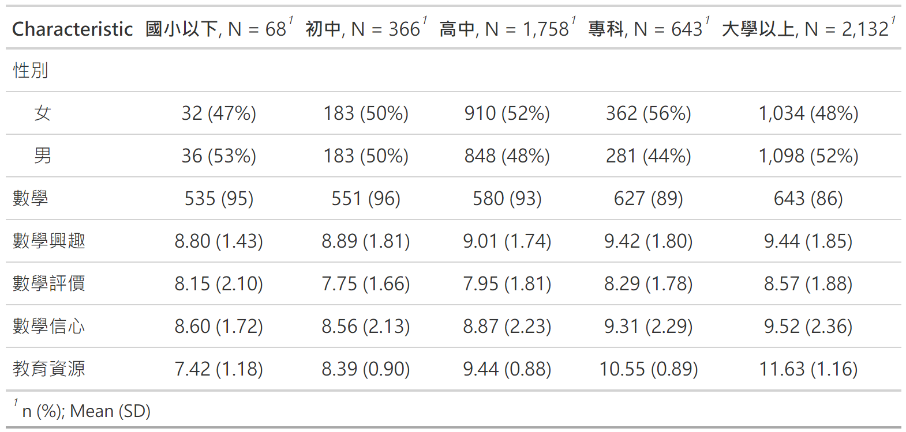

# 繪圖 - 呈現資料

``` r
#圖示不同父母教育程度下的數學分數平均數，加上信賴區間
#圖4.1
ggplot(data = dta, 
       aes(x = 父母教育, 
           y = 數學)) +
  stat_summary(fun.data = 'mean_cl_boot') +
  scale_y_continuous(breaks = seq(500, 660, by = 20)) +
  geom_hline(yintercept = mean(dta$數學) , 
             linetype = 'dotted') +
  coord_flip() +
  labs(x = '父母教育程度', y = '數學平均分數',
       title='數學分數與父母教育程度') 
```

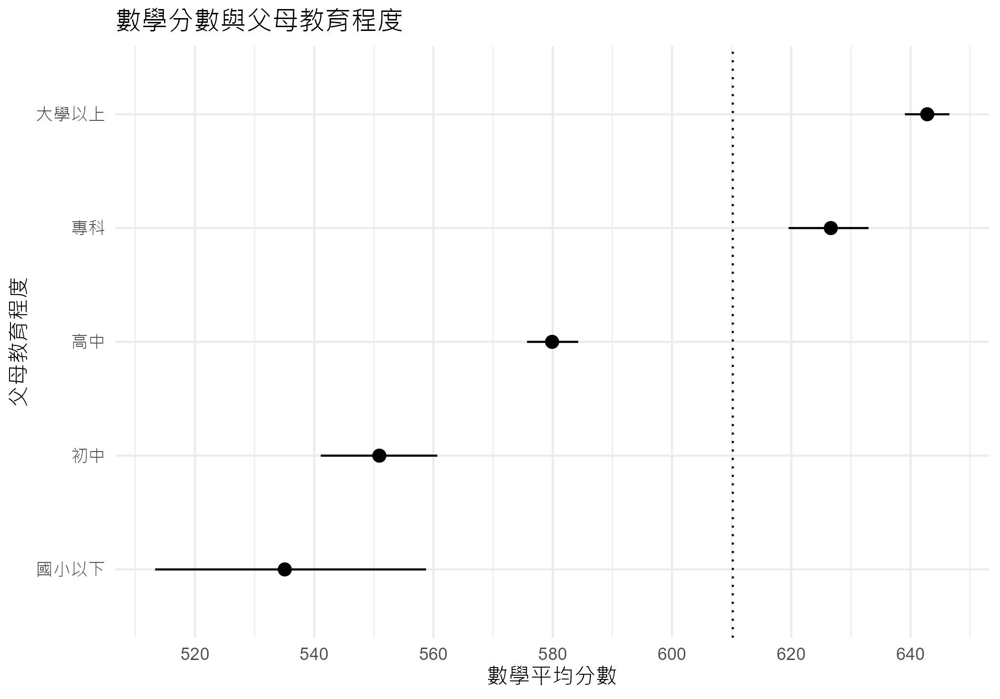

``` r
#父母教育的效果或許會是教育資源造成的，畫圖看看
#圖4.2
ggplot(data = dta, aes(y = 數學, x = 教育資源)) +
  geom_point(pch=1, size=rel(.3), alpha=.3)+
  stat_smooth(method = 'lm', 
              se = F, 
              formula = y ~ x,
              col=1,
              linewidth=.8) +
  facet_wrap(vars(父母教育), nrow=1)+
  labs(x = '教育資源', y = '數學分數')
```

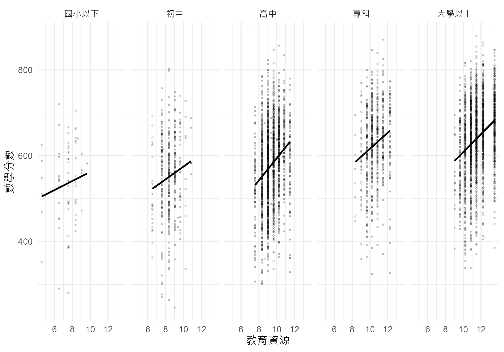

# 迴歸分析

``` r
#以 tidy 方式進行分析並輸出報表
#程式報表4.4
dta |> 
  lm(formula = 數學 ~ 父母教育, data = _) |> 
  broom::tidy(conf.int = TRUE) |>
  insight::format_table(ci_brackets = c("(", ")")) |>
  export_table(format = "markdown", caption = "", align = "lcccrr")
```

| term             | estimate | std.error | statistic | p.value |         conf.int |
|:-----------------|:--------:|:---------:|:---------:|--------:|-----------------:|
| (Intercept)      |  535.07  |   10.91   |   49.05   | \< .001 | (513.68, 556.45) |
| 父母教育初中     |  15.86   |   11.88   |   1.33    |   0.182 |  ( -7.43, 39.15) |
| 父母教育高中     |  44.83   |   11.12   |   4.03    | \< .001 |  ( 23.03, 66.62) |
| 父母教育專科     |  91.57   |   11.47   |   7.98    | \< .001 | ( 69.08, 114.06) |
| 父母教育大學以上 |  107.73  |   11.08   |   9.72    | \< .001 | ( 86.00, 129.46) |

``` r
#這是原始輸出
#程式報表4.5
dta |> 
  lm(formula = 數學 ~ 父母教育, data = _) |> 
  summary()
```


    Call:
    lm(formula = 數學 ~ 父母教育, data = dta)

    Residuals:
        Min      1Q  Median      3Q     Max 
    -304.55  -56.73    7.66   62.91  276.78 

    Coefficients:
                     Estimate Std. Error t value Pr(>|t|)
    (Intercept)         535.1       10.9   49.05  < 2e-16
    父母教育初中         15.9       11.9    1.33     0.18
    父母教育高中         44.8       11.1    4.03  5.6e-05
    父母教育專科         91.6       11.5    7.98  1.8e-15
    父母教育大學以上    107.7       11.1    9.72  < 2e-16

    Residual standard error: 90 on 4962 degrees of freedom
    Multiple R-squared:  0.125, Adjusted R-squared:  0.124 
    F-statistic:  177 on 4 and 4962 DF,  p-value: <2e-16

``` r
#ANOVA 式報表
#程式報表4.6前
anova(m1 <- lm(數學 ~ 父母教育, data = dta))
```

<table>
<thead>
<tr>
<th style="text-align:left;">
</th>
<th style="text-align:right;">
Df
</th>
<th style="text-align:right;">
Sum Sq
</th>
<th style="text-align:right;">
Mean Sq
</th>
<th style="text-align:right;">
F value
</th>
<th style="text-align:right;">
Pr(\>F)
</th>
</tr>
</thead>
<tbody>
<tr>
<td style="text-align:left;">
父母教育
</td>
<td style="text-align:right;">
4
</td>
<td style="text-align:right;">
5723746
</td>
<td style="text-align:right;">
1430936
</td>
<td style="text-align:right;">
176.8
</td>
<td style="text-align:right;">
0
</td>
</tr>
<tr>
<td style="text-align:left;">
Residuals
</td>
<td style="text-align:right;">
4962
</td>
<td style="text-align:right;">
40158168
</td>
<td style="text-align:right;">
8093
</td>
<td style="text-align:right;">
NA
</td>
<td style="text-align:right;">
NA
</td>
</tr>
</tbody>
</table>

``` r
#把教育資源加進模型
#程式報表4.6中
anova(m2 <- update(m1, . ~ . + 教育資源, data = dta))
```

<table>
<thead>
<tr>
<th style="text-align:left;">
</th>
<th style="text-align:right;">
Df
</th>
<th style="text-align:right;">
Sum Sq
</th>
<th style="text-align:right;">
Mean Sq
</th>
<th style="text-align:right;">
F value
</th>
<th style="text-align:right;">
Pr(\>F)
</th>
</tr>
</thead>
<tbody>
<tr>
<td style="text-align:left;">
父母教育
</td>
<td style="text-align:right;">
4
</td>
<td style="text-align:right;">
5723746
</td>
<td style="text-align:right;">
1430936
</td>
<td style="text-align:right;">
187.9
</td>
<td style="text-align:right;">
0
</td>
</tr>
<tr>
<td style="text-align:left;">
教育資源
</td>
<td style="text-align:right;">
1
</td>
<td style="text-align:right;">
2373284
</td>
<td style="text-align:right;">
2373284
</td>
<td style="text-align:right;">
311.6
</td>
<td style="text-align:right;">
0
</td>
</tr>
<tr>
<td style="text-align:left;">
Residuals
</td>
<td style="text-align:right;">
4961
</td>
<td style="text-align:right;">
37784883
</td>
<td style="text-align:right;">
7616
</td>
<td style="text-align:right;">
NA
</td>
<td style="text-align:right;">
NA
</td>
</tr>
</tbody>
</table>

``` r
#或許不是父母教育而是教育資源造成，這邊只考慮教育資源
#程式報表4.6後
anova(m3 <- update(m2, . ~ . - 父母教育,  data = dta))
```

<table>
<thead>
<tr>
<th style="text-align:left;">
</th>
<th style="text-align:right;">
Df
</th>
<th style="text-align:right;">
Sum Sq
</th>
<th style="text-align:right;">
Mean Sq
</th>
<th style="text-align:right;">
F value
</th>
<th style="text-align:right;">
Pr(\>F)
</th>
</tr>
</thead>
<tbody>
<tr>
<td style="text-align:left;">
教育資源
</td>
<td style="text-align:right;">
1
</td>
<td style="text-align:right;">
7825167
</td>
<td style="text-align:right;">
7825167
</td>
<td style="text-align:right;">
1021
</td>
<td style="text-align:right;">
0
</td>
</tr>
<tr>
<td style="text-align:left;">
Residuals
</td>
<td style="text-align:right;">
4965
</td>
<td style="text-align:right;">
38056746
</td>
<td style="text-align:right;">
7665
</td>
<td style="text-align:right;">
NA
</td>
<td style="text-align:right;">
NA
</td>
</tr>
</tbody>
</table>

## 迴歸模型比較

``` r
#比較m3,m2
anova(m3, m2)
```

<table>
<thead>
<tr>
<th style="text-align:right;">
Res.Df
</th>
<th style="text-align:right;">
RSS
</th>
<th style="text-align:right;">
Df
</th>
<th style="text-align:right;">
Sum of Sq
</th>
<th style="text-align:right;">
F
</th>
<th style="text-align:right;">
Pr(\>F)
</th>
</tr>
</thead>
<tbody>
<tr>
<td style="text-align:right;">
4965
</td>
<td style="text-align:right;">
38056746
</td>
<td style="text-align:right;">
NA
</td>
<td style="text-align:right;">
NA
</td>
<td style="text-align:right;">
NA
</td>
<td style="text-align:right;">
NA
</td>
</tr>
<tr>
<td style="text-align:right;">
4961
</td>
<td style="text-align:right;">
37784883
</td>
<td style="text-align:right;">
4
</td>
<td style="text-align:right;">
271863
</td>
<td style="text-align:right;">
8.924
</td>
<td style="text-align:right;">
0
</td>
</tr>
</tbody>
</table>

``` r
#比較m1,m2
anova(m1, m2)
```

<table>
<thead>
<tr>
<th style="text-align:right;">
Res.Df
</th>
<th style="text-align:right;">
RSS
</th>
<th style="text-align:right;">
Df
</th>
<th style="text-align:right;">
Sum of Sq
</th>
<th style="text-align:right;">
F
</th>
<th style="text-align:right;">
Pr(\>F)
</th>
</tr>
</thead>
<tbody>
<tr>
<td style="text-align:right;">
4962
</td>
<td style="text-align:right;">
40158168
</td>
<td style="text-align:right;">
NA
</td>
<td style="text-align:right;">
NA
</td>
<td style="text-align:right;">
NA
</td>
<td style="text-align:right;">
NA
</td>
</tr>
<tr>
<td style="text-align:right;">
4961
</td>
<td style="text-align:right;">
37784883
</td>
<td style="text-align:right;">
1
</td>
<td style="text-align:right;">
2373284
</td>
<td style="text-align:right;">
311.6
</td>
<td style="text-align:right;">
0
</td>
</tr>
</tbody>
</table>

``` r
#將結果放在一個list中，等一下比較方便抓結果
mod_r2 <- sapply(list(m1, m2, m3), broom::glance) |>
  as.data.frame() |>
  dplyr::slice(1) |> 
  t() |> 
  unlist()
mod_r2
```

    [1] 0.1247 0.1765 0.1706

``` r
#比較在控制教育資源下，父母教育的效果
#程式報表4.7 前半
(mod_r2[2] - mod_r2[3])/mod_r2[2]
```

    [1] 0.03358

``` r
#比較在控制父母教育下，教育資源的效果
#程式報表4.7 後半
(mod_r2[2] - mod_r2[1])/mod_r2[2]
```

    [1] 0.2931

``` r
#輸出最終模型結果
#程式報表4.8
dta |> 
  lm(formula = 數學 ~ 父母教育 + 教育資源, data = _) |> 
  jtools::summ(confint = TRUE)
```

<table class="table table-striped table-hover table-condensed table-responsive" style="width: auto !important; margin-left: auto; margin-right: auto;">
<tbody>
<tr>
<td style="text-align:left;font-weight: bold;">
Observations
</td>
<td style="text-align:right;">
4967
</td>
</tr>
<tr>
<td style="text-align:left;font-weight: bold;">
Dependent variable
</td>
<td style="text-align:right;">
數學
</td>
</tr>
<tr>
<td style="text-align:left;font-weight: bold;">
Type
</td>
<td style="text-align:right;">
OLS linear regression
</td>
</tr>
</tbody>
</table>
<table class="table table-striped table-hover table-condensed table-responsive" style="width: auto !important; margin-left: auto; margin-right: auto;">
<tbody>
<tr>
<td style="text-align:left;font-weight: bold;">
F(5,4961)
</td>
<td style="text-align:right;">
212.62
</td>
</tr>
<tr>
<td style="text-align:left;font-weight: bold;">
R²
</td>
<td style="text-align:right;">
0.18
</td>
</tr>
<tr>
<td style="text-align:left;font-weight: bold;">
Adj. R²
</td>
<td style="text-align:right;">
0.18
</td>
</tr>
</tbody>
</table>
<table class="table table-striped table-hover table-condensed table-responsive" style="width: auto !important; margin-left: auto; margin-right: auto;border-bottom: 0;">
<thead>
<tr>
<th style="text-align:left;">
</th>
<th style="text-align:right;">
Est.
</th>
<th style="text-align:right;">
2.5%
</th>
<th style="text-align:right;">
97.5%
</th>
<th style="text-align:right;">
t val.
</th>
<th style="text-align:right;">
p
</th>
</tr>
</thead>
<tbody>
<tr>
<td style="text-align:left;font-weight: bold;">
(Intercept)
</td>
<td style="text-align:right;">
375.71
</td>
<td style="text-align:right;">
348.44
</td>
<td style="text-align:right;">
402.98
</td>
<td style="text-align:right;">
27.01
</td>
<td style="text-align:right;">
0.00
</td>
</tr>
<tr>
<td style="text-align:left;font-weight: bold;">
父母教育初中
</td>
<td style="text-align:right;">
-5.05
</td>
<td style="text-align:right;">
-27.77
</td>
<td style="text-align:right;">
17.66
</td>
<td style="text-align:right;">
-0.44
</td>
<td style="text-align:right;">
0.66
</td>
</tr>
<tr>
<td style="text-align:left;font-weight: bold;">
父母教育高中
</td>
<td style="text-align:right;">
1.22
</td>
<td style="text-align:right;">
-20.48
</td>
<td style="text-align:right;">
22.91
</td>
<td style="text-align:right;">
0.11
</td>
<td style="text-align:right;">
0.91
</td>
</tr>
<tr>
<td style="text-align:left;font-weight: bold;">
父母教育專科
</td>
<td style="text-align:right;">
24.21
</td>
<td style="text-align:right;">
1.14
</td>
<td style="text-align:right;">
47.27
</td>
<td style="text-align:right;">
2.06
</td>
<td style="text-align:right;">
0.04
</td>
</tr>
<tr>
<td style="text-align:left;font-weight: bold;">
父母教育大學以上
</td>
<td style="text-align:right;">
17.10
</td>
<td style="text-align:right;">
-6.25
</td>
<td style="text-align:right;">
40.46
</td>
<td style="text-align:right;">
1.44
</td>
<td style="text-align:right;">
0.15
</td>
</tr>
<tr>
<td style="text-align:left;font-weight: bold;">
教育資源
</td>
<td style="text-align:right;">
21.49
</td>
<td style="text-align:right;">
19.10
</td>
<td style="text-align:right;">
23.88
</td>
<td style="text-align:right;">
17.65
</td>
<td style="text-align:right;">
0.00
</td>
</tr>
</tbody>
<tfoot>
<tr>
<td style="padding: 0; " colspan="100%">
<sup></sup> Standard errors: OLS
</td>
</tr>
</tfoot>
</table>

## 迴歸模型係數

- 底下呈現兩種畫迴歸效果的辦法，第一種是以
  ggplot，第二種引用其他套件，更為簡單

``` r
#以 ggplot 畫效果
#將截距去除，畫更易懂起來
#圖4.3
tidy(m2, conf.int = TRUE) |> 
  dplyr::slice(-1) |>
ggplot() + 
  aes(estimate, term, xmin = conf.low, xmax = conf.high, height = 0) +
  geom_point(size=rel(3)) +
  geom_vline(xintercept = 0, linetype="dashed") +
  geom_errorbarh() +
  labs(x = '估計值和信賴區間', 
       y = '迴歸模型變項(去除截距)', 
       subtitle = '依變項:數學分數')
```

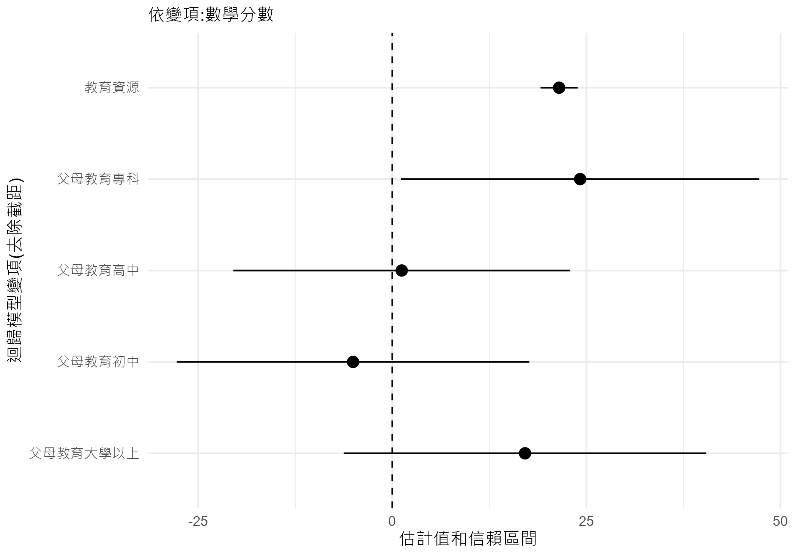

``` r
#以 plot_summs 畫效果
#將截距去除，畫更易懂起來
#圖4.4
jtools::plot_summs(m2) +
  labs(x = '估計值和信賴區間', 
       y = '迴歸模型變項(去除截距)', 
       subtitle = '依變項:數學分數')
```

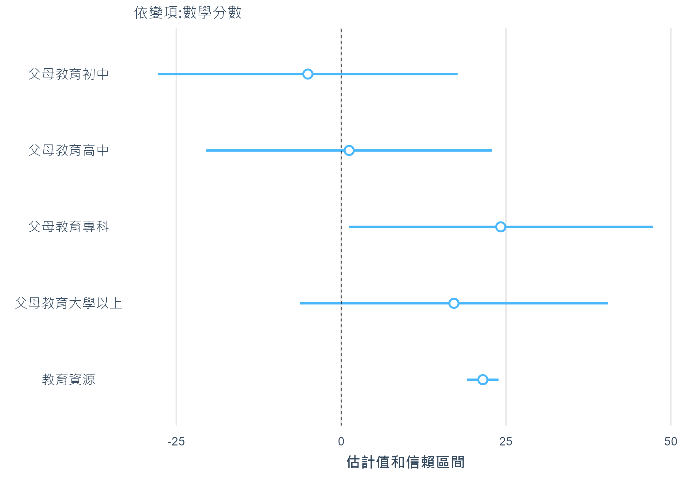

## 迴歸模型效果

``` r
#預備要畫預測時，先看一下教育資源數值差異會到多少
#程式報表4.9
with(dta, 教育資源) |> quantile()
```

        0%    25%    50%    75%   100% 
     4.552  9.036 10.238 11.487 13.515 

``` r
#畫預測值，移除 colors='bw' 可以看到彩色圖
#圖4.5
sjPlot::plot_model(m2, type='pred', colors='bw',
  terms=c("父母教育","教育資源[9.036, 11.487]")) +
  labs(y="數學分數估測值",
       title="數學 ~ 父母教育 + 教育資源")
```

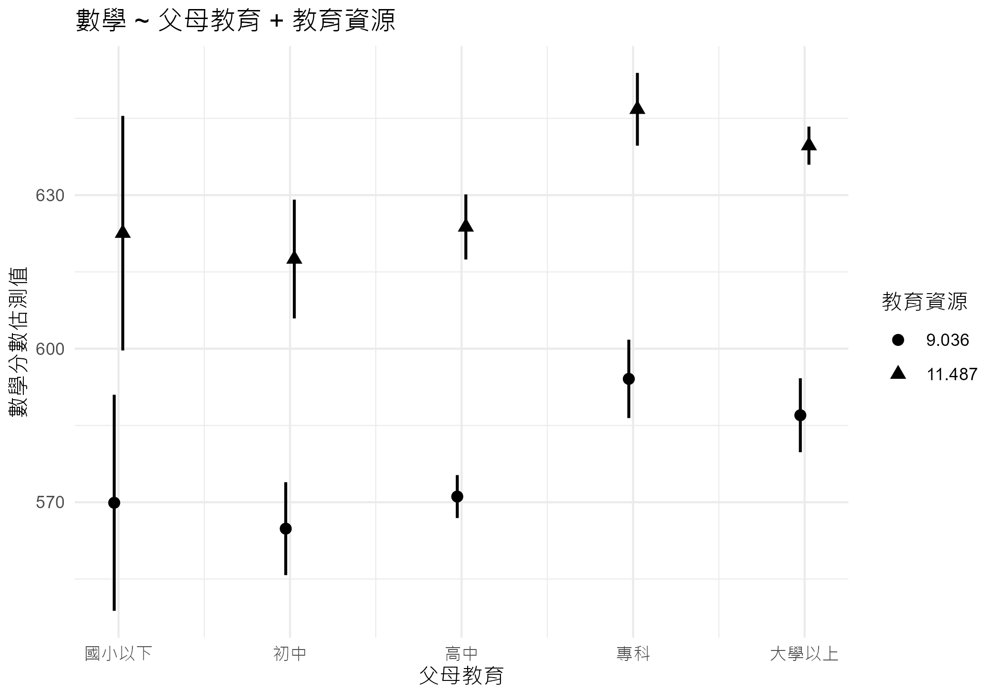

## 模型診斷

``` r
#利用 gglm 套件作模型診斷 
#圖4.6
gglm::gglm(m2, theme = ggplot2::theme_minimal())
```

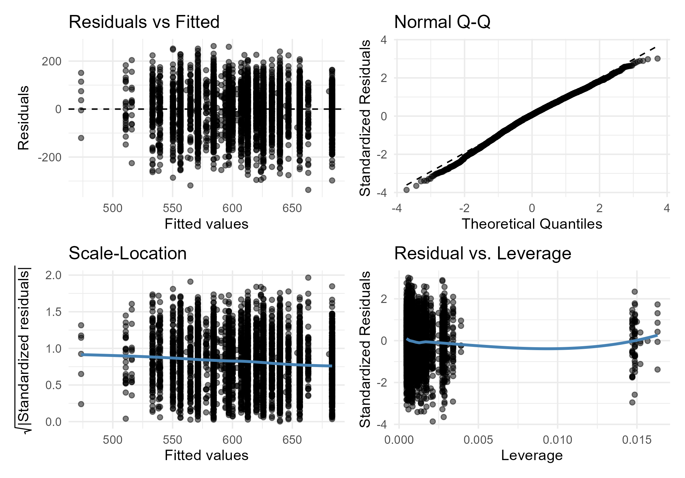

``` r
#利用 performance 套件作模型診斷 
#圖4.7
performance::check_model(m2)
```

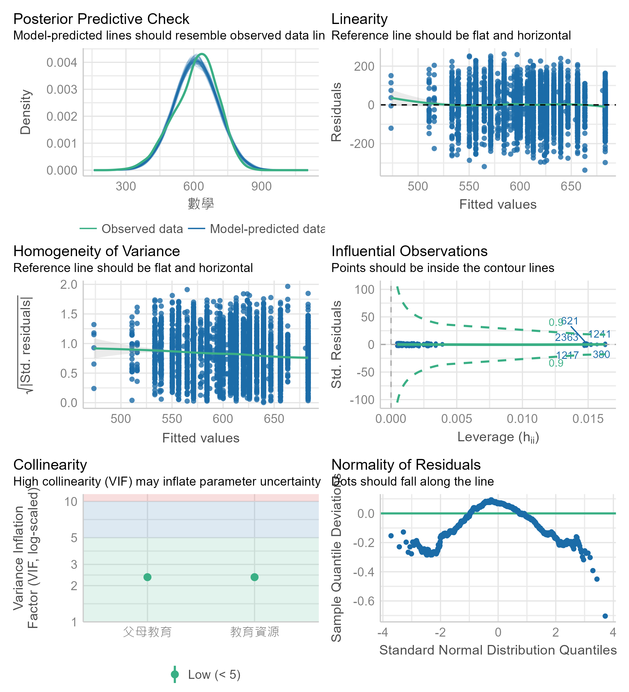

``` r
#殘差圖
#畫圖前用 broom 把迴歸分析的預測值、殘差與槓桿值放進資料
#圖4.8, 上方左圖
p1 <- broom::augment(m2) |>
ggplot() + 
  aes(.fitted, .std.resid) +
  geom_hline(yintercept = 0, col='gray') +
  geom_point(pch = 1, size=rel(.5), alpha=.5) +
  geom_smooth(method='rlm', 
              formula = y ~ x, 
              se = FALSE,
              linewidth=.5, 
              col='black')+
  facet_wrap(vars(父母教育), ncol=1) +
  labs(x="數學分數估測值", 
       y="標準化殘差",
       title = "數學 ~ 父母教育 + 教育資源")
```

``` r
#看看殘差的 Q-Q 圖，依父母教育。檢視常態假設
#圖4.8, 下方
p2 <- broom::augment(m2) |>
ggplot() +
  aes(sample=.std.resid)+
  facet_wrap(vars(父母教育), nrow=1)+
  stat_qq(pch=1, size=rel(.5), alpha=.5)+
  stat_qq_line(linewidth=.5)+
  labs(x = '常態位數', y = '標準化殘差')
```

``` r
#呈現槓桿值與標準化殘差
#區分父母教育
#圖4.8, 上方右圖
p3 <- broom::augment(m2) |>
ggplot() +
 aes(x = .hat, y = .std.resid) +
 geom_point(pch=1, alpha=.5, size=rel(.5))+
 geom_hline(yintercept = 0, linetype = 'dotted') +
 facet_wrap(vars(父母教育), ncol=1) +
 labs(x = '影響值', y = '標準化殘差')

#三張圖併成一張呈現
(p1 + p3) / p2
```

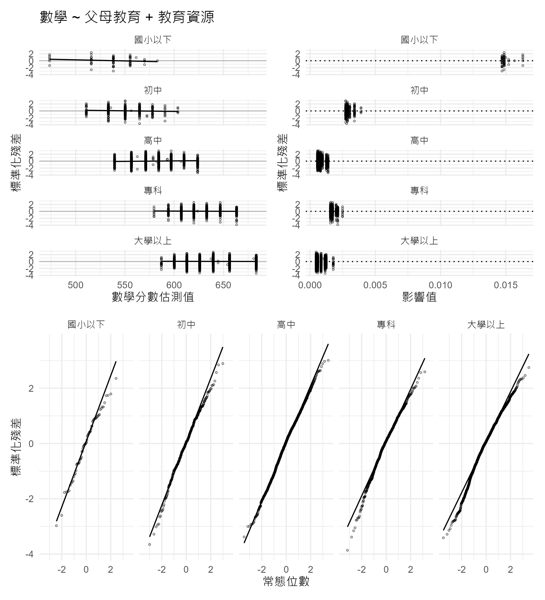

``` r
#看看影響值
#程式報表4.10
broom::augment(m2) |> dplyr::select(".hat") |> summary() 
```

<table>
<thead>
<tr>
<th style="text-align:left;">
</th>
<th style="text-align:left;">
.hat
</th>
</tr>
</thead>
<tbody>
<tr>
<td style="text-align:left;">
</td>
<td style="text-align:left;">
Min. :0.000470
</td>
</tr>
<tr>
<td style="text-align:left;">
</td>
<td style="text-align:left;">
1st Qu.:0.000577
</td>
</tr>
<tr>
<td style="text-align:left;">
</td>
<td style="text-align:left;">
Median :0.000691
</td>
</tr>
<tr>
<td style="text-align:left;">
</td>
<td style="text-align:left;">
Mean :0.001208
</td>
</tr>
<tr>
<td style="text-align:left;">
</td>
<td style="text-align:left;">
3rd Qu.:0.001236
</td>
</tr>
<tr>
<td style="text-align:left;">
</td>
<td style="text-align:left;">
Max. :0.016301
</td>
</tr>
</tbody>
</table>

``` r
#底下要呈現多個連續解釋變項時的情形
#看看個人變項的可能效果，把跟數學有關的部分取出來
#看看基本統計量
dta |> 
 dplyr::select_at(vars(starts_with("數學"))) |>
 dplyr::select_if(is.numeric) |> 
 colMeans()
```

        數學 數學興趣 數學評價 數學信心 
     610.196    9.235    8.250    9.180 

``` r
#呈現兩兩散佈圖
#以corrplot 套件，利用圖形顯示相關大小
#圖4.9
dta |> 
 dplyr::select_at(vars(starts_with("數學"))) |>
 dplyr::select_if(is.numeric) |> cor() %T>%
corrplot(corr = ., method = 'ellipse', order = 'hclust', addrect = 4,
         type = 'upper', tl.pos = 'd') %>%
corrplot(corr = ., add = TRUE, type = 'lower', method = 'number',
         order = 'hclust', col = 'black', 
         diag = FALSE, tl.pos = 'n', cl.pos = 'n')
```

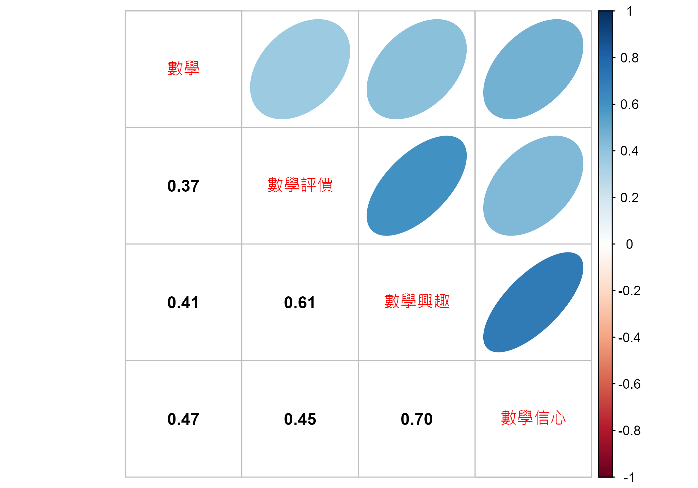

``` r
#放進三個解釋變項
#程式報表4.11前
dta_math <- dta |> 
 dplyr::select_at(vars(starts_with("數學"))) |>
 dplyr::select_if(is.numeric) 
m4 <- lm(數學 ~ 數學興趣 + 數學評價 + 數學信心, data = dta_math)
m4 |> broom::glance() |> dplyr::select(1:6)
```

<table>
<thead>
<tr>
<th style="text-align:right;">
r.squared
</th>
<th style="text-align:right;">
adj.r.squared
</th>
<th style="text-align:right;">
sigma
</th>
<th style="text-align:right;">
statistic
</th>
<th style="text-align:right;">
p.value
</th>
<th style="text-align:right;">
df
</th>
</tr>
</thead>
<tbody>
<tr>
<td style="text-align:right;">
0.2561
</td>
<td style="text-align:right;">
0.2556
</td>
<td style="text-align:right;">
82.93
</td>
<td style="text-align:right;">
569.4
</td>
<td style="text-align:right;">
0
</td>
<td style="text-align:right;">
3
</td>
</tr>
</tbody>
</table>

``` r
#利用 lm.beta套件，計算標準化迴歸係數
#程式報表4.11後
m4 |> lm.beta::lm.beta() |> summary()
```


    Call:
    lm(formula = 數學 ~ 數學興趣 + 數學評價 + 數學信心, 
        data = dta_math)

    Residuals:
       Min     1Q Median     3Q    Max 
    -391.5  -49.4    6.8   56.1  234.4 

    Coefficients:
                Estimate Standardized Std. Error t value Pr(>|t|)
    (Intercept) 371.7862           NA     6.4606   57.55   <2e-16
    數學興趣      3.0116       0.0567     1.0281    2.93   0.0034
    數學評價      8.9673       0.1731     0.7993   11.22   <2e-16
    數學信心     14.8818       0.3567     0.7178   20.73   <2e-16

    Residual standard error: 82.9 on 4963 degrees of freedom
    Multiple R-squared:  0.256, Adjusted R-squared:  0.256 
    F-statistic:  569 on 3 and 4963 DF,  p-value: <2e-16

``` r
#看效果
#圖4.10
jtools::plot_summs(m4) +
  labs(x = '估計值和信賴區間', 
       y = '迴歸模型變項(去除截距)', 
       subtitle = '依變項:數學分數') 
```

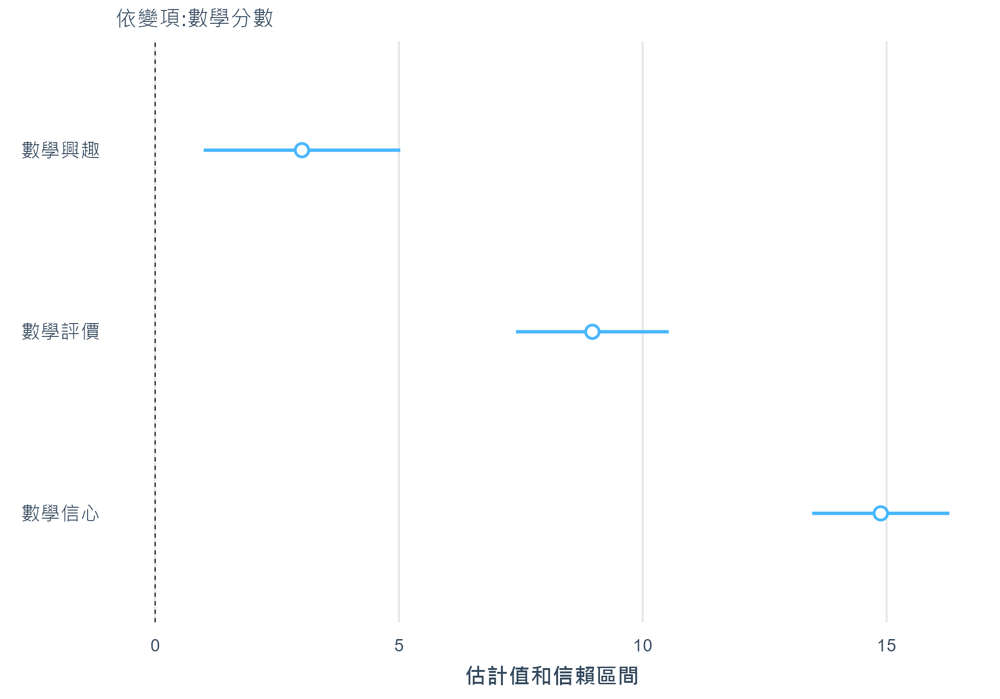

``` r
#看效果
#圖4.11
p1 <- jtools::effect_plot(m4, pred = '數學興趣', 
                    interval = TRUE, 
                    point.size = .1, point.alpha = .3,
                    plot.points = TRUE)
p2 <- jtools::effect_plot(m4, pred = '數學評價', 
                    interval = TRUE,  
                    point.size = .1, point.alpha = .3,
                    plot.points = TRUE)
p3 <- jtools::effect_plot(m4, pred = '數學信心', 
                    interval = TRUE, 
                    point.size = .1, point.alpha = .3,
                    plot.points = TRUE)

p1 + p2 + p3
```

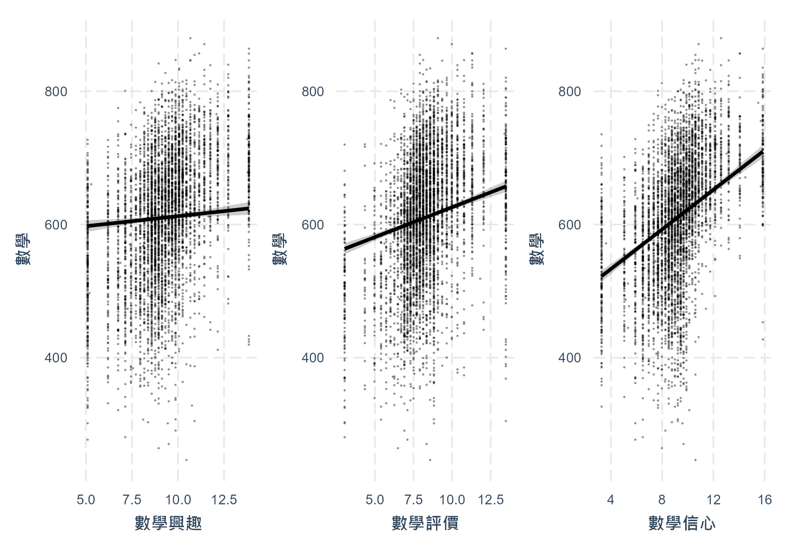

``` r
#看看控制數學信心與數學評價後，數學興趣的效果
#程式報表4.12前
summary(m5 <- update(m4, . ~ . - 數學興趣 , data = dta_math))
```


    Call:
    lm(formula = 數學 ~ 數學評價 + 數學信心, data = dta_math)

    Residuals:
       Min     1Q Median     3Q    Max 
    -390.0  -49.5    6.8   56.1  236.1 

    Coefficients:
                Estimate Std. Error t value Pr(>|t|)
    (Intercept)  379.010      5.976    63.4   <2e-16
    數學評價      10.046      0.710    14.2   <2e-16
    數學信心      16.155      0.572    28.3   <2e-16

    Residual standard error: 83 on 4964 degrees of freedom
    Multiple R-squared:  0.255, Adjusted R-squared:  0.254 
    F-statistic:  849 on 2 and 4964 DF,  p-value: <2e-16

``` r
#程式報表4.12後
anova(m5, m4)
```

<table>
<thead>
<tr>
<th style="text-align:right;">
Res.Df
</th>
<th style="text-align:right;">
RSS
</th>
<th style="text-align:right;">
Df
</th>
<th style="text-align:right;">
Sum of Sq
</th>
<th style="text-align:right;">
F
</th>
<th style="text-align:right;">
Pr(\>F)
</th>
</tr>
</thead>
<tbody>
<tr>
<td style="text-align:right;">
4964
</td>
<td style="text-align:right;">
34192102
</td>
<td style="text-align:right;">
NA
</td>
<td style="text-align:right;">
NA
</td>
<td style="text-align:right;">
NA
</td>
<td style="text-align:right;">
NA
</td>
</tr>
<tr>
<td style="text-align:right;">
4963
</td>
<td style="text-align:right;">
34133085
</td>
<td style="text-align:right;">
1
</td>
<td style="text-align:right;">
59017
</td>
<td style="text-align:right;">
8.581
</td>
<td style="text-align:right;">
0.0034
</td>
</tr>
</tbody>
</table>

``` r
#看看不同模型的預測以及信賴區間
#圖4.12
jtools::plot_summs(m4, m5, model.names = c(formula(m4), formula(m5)))  +
  labs(x = '估計值和信賴區間', 
       y = '迴歸模型變項(去除截距)', 
       subtitle = '依變項:數學分數') +
  theme(legend.position="bottom")
```

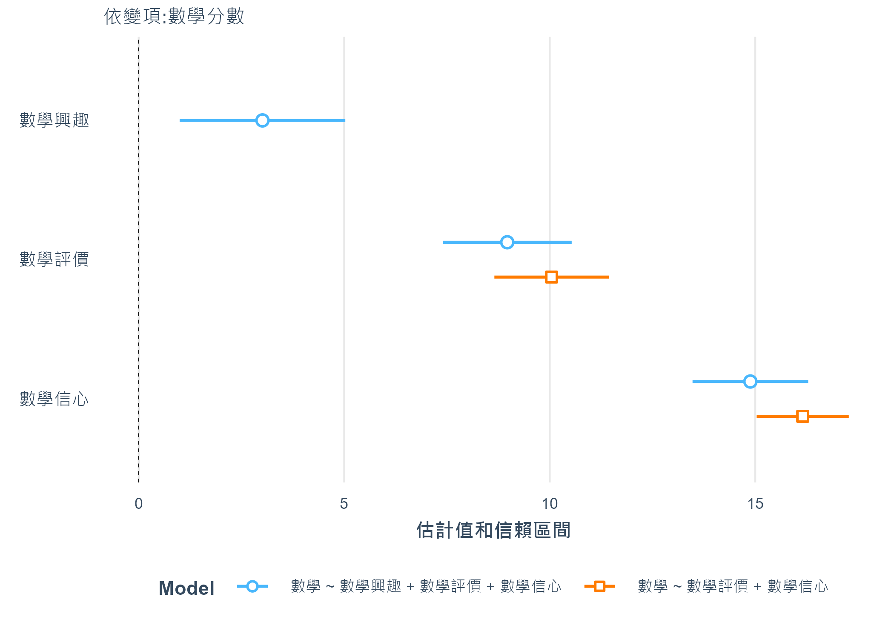
