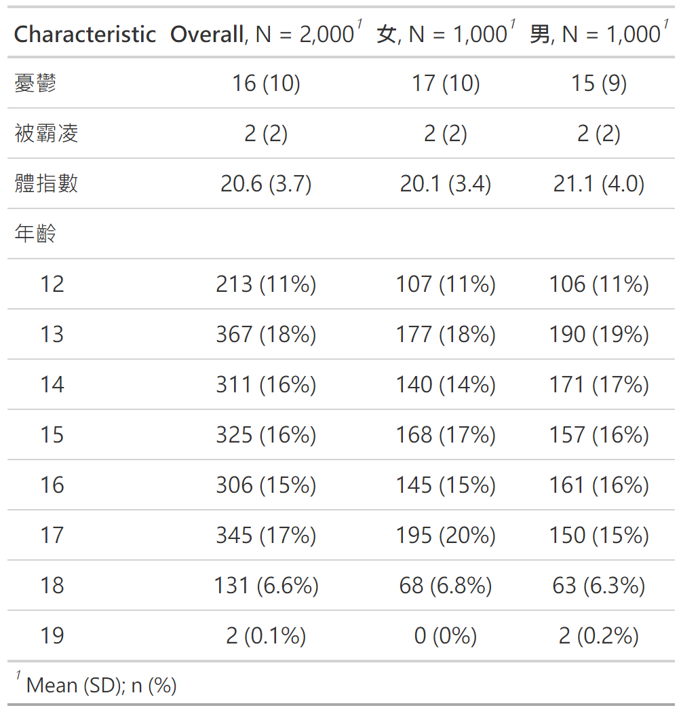
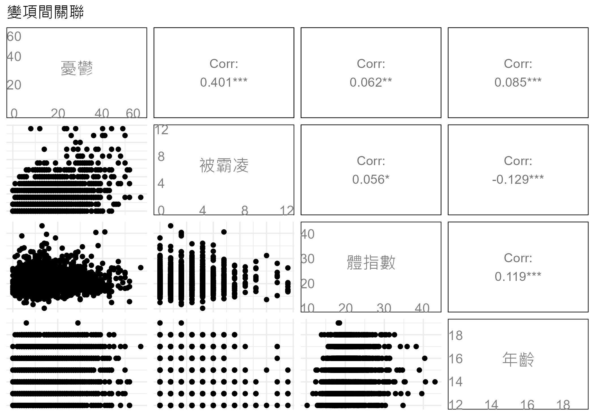
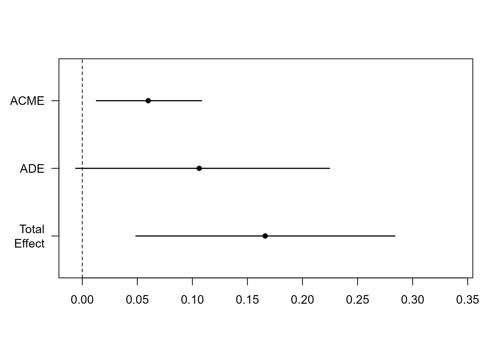
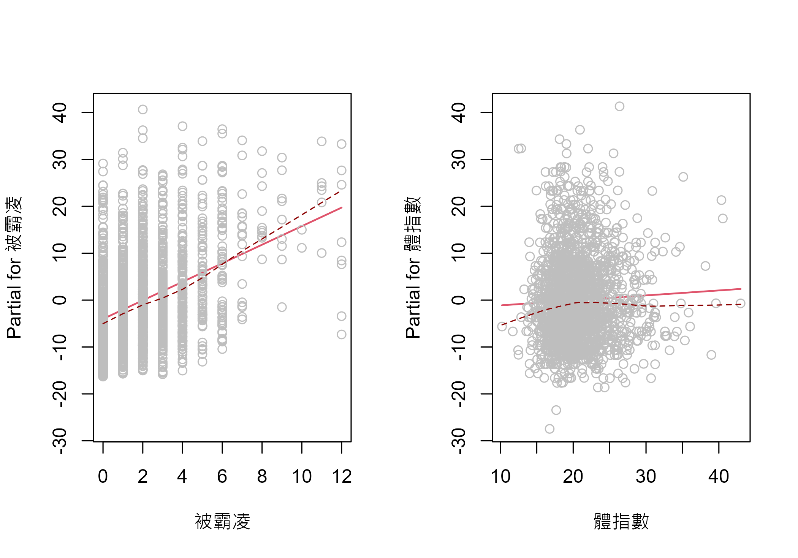
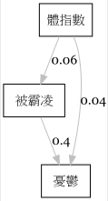
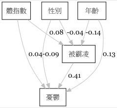

第五章:中介分析
================
2024 三月 04

``` r
#整體設定，含載入套件
source("https://raw.githubusercontent.com/ChungPingCheng/R4BS2/main/R4BS_setup.R")
```

# 資料與管理

``` r
#讀檔案，這是一般的文字檔，可以用 notepad 開啟
dta <- read.table("../Data/bully.txt", header = TRUE)
```

``` r
#看一下前六筆
#程式報表5.1
head(dta)
```

<table>
<thead>
<tr>
<th style="text-align:left;">
性別
</th>
<th style="text-align:right;">
憂鬱
</th>
<th style="text-align:right;">
被霸凌
</th>
<th style="text-align:right;">
體指數
</th>
<th style="text-align:right;">
年齡
</th>
</tr>
</thead>
<tbody>
<tr>
<td style="text-align:left;">
女
</td>
<td style="text-align:right;">
29
</td>
<td style="text-align:right;">
3
</td>
<td style="text-align:right;">
18.49
</td>
<td style="text-align:right;">
17
</td>
</tr>
<tr>
<td style="text-align:left;">
女
</td>
<td style="text-align:right;">
4
</td>
<td style="text-align:right;">
0
</td>
<td style="text-align:right;">
20.17
</td>
<td style="text-align:right;">
15
</td>
</tr>
<tr>
<td style="text-align:left;">
女
</td>
<td style="text-align:right;">
3
</td>
<td style="text-align:right;">
2
</td>
<td style="text-align:right;">
15.63
</td>
<td style="text-align:right;">
16
</td>
</tr>
<tr>
<td style="text-align:left;">
女
</td>
<td style="text-align:right;">
20
</td>
<td style="text-align:right;">
1
</td>
<td style="text-align:right;">
21.48
</td>
<td style="text-align:right;">
18
</td>
</tr>
<tr>
<td style="text-align:left;">
女
</td>
<td style="text-align:right;">
25
</td>
<td style="text-align:right;">
4
</td>
<td style="text-align:right;">
18.43
</td>
<td style="text-align:right;">
15
</td>
</tr>
<tr>
<td style="text-align:left;">
女
</td>
<td style="text-align:right;">
24
</td>
<td style="text-align:right;">
3
</td>
<td style="text-align:right;">
16.29
</td>
<td style="text-align:right;">
13
</td>
</tr>
</tbody>
</table>

``` r
#看一下基本統計
#程式報表5.2
gtsummary::tbl_summary(dta, 
                       by = '性別',
                       statistic = list(all_continuous() ~ "{mean} ({sd})")) |> gtsummary::add_overall()
```



``` r
#看一下變項間關聯
#圖5.2。圖5.1請見書籍內文。
dta |>
  dplyr::select_if(is.numeric) |> 
  as.tibble() |>
  GGally::ggpairs(data = _, axisLabels= 'internal', title= '變項間關聯')
```



# 中介效果

一個獨變項，一個中介變項

``` r
#Baron & Kenny（1986） 的四步驟，檢驗被霸凌是體指數到憂鬱的中介
#程式報表5.3
m1 <- lm(憂鬱 ~ 體指數, data=dta)
m2 <- lm(被霸凌 ~ 體指數, data=dta) 
m3 <- lm(憂鬱 ~ 被霸凌, data=dta)
m4 <- lm(憂鬱 ~ 被霸凌 + 體指數, data=dta) 
```

``` r
options(huxtable.knitr_output_format="md")
jtools::export_summs(m1,m2,m3,m4,
                     model.names = c("憂鬱", "被霸凌","憂鬱","憂鬱"),
                     error_format = "[{conf.low},{conf.high}]")
```

    Warning in to_md.huxtable(structure(list(names = c("", "(Intercept)", "", :
    Markdown cannot handle cells with colspan/rowspan > 1

    Warning in to_md.huxtable(structure(list(names = c("", "(Intercept)", "", :
    Can't vary column alignment in markdown; using first row

|             |      憂鬱      |     被霸凌      |      憂鬱       |           憂鬱 |
|-------------|:--------------:|:---------------:|:---------------:|---------------:|
| (Intercept) |  12.31 \*\*\*  |   1.41 \*\*\*   |  11.70 \*\*\*   |    9.53 \*\*\* |
|             | \[9.85,14.77\] |  \[0.91,1.90\]  | \[11.13,12.26\] | \[7.26,11.81\] |
| 體指數      |   0.17 \*\*    |     0.03 \*     |                 |           0.11 |
|             | \[0.05,0.28\]  |  \[0.01,0.05\]  |                 | \[-0.00,0.21\] |
| 被霸凌      |                |                 |   1.99 \*\*\*   |    1.98 \*\*\* |
|             |                |                 |  \[1.79,2.19\]  |  \[1.78,2.18\] |
| N           |      2000      |      2000       |      2000       |           2000 |
| R2          |      0.00      |      0.00       |      0.16       |           0.16 |
| \*\*        | \* p \< 0.001; | \*\* p \< 0.01; |  \* p \< 0.05.  |                |

``` r
#以拔靴法看中介效果信賴區間
#程式報表5.4
res <- mediation::mediate(model.m=m2,
                              model.y=m4,
                              treat='體指數', 
                              mediator='被霸凌',
                   boot=TRUE)
```

    Running nonparametric bootstrap

``` r
summary(res)
```


    Causal Mediation Analysis 

    Nonparametric Bootstrap Confidence Intervals with the Percentile Method

                   Estimate 95% CI Lower 95% CI Upper p-value
    ACME             0.0599       0.0107         0.11   0.012
    ADE              0.1062      -0.0085         0.21   0.074
    Total Effect     0.1661       0.0442         0.29   0.008
    Prop. Mediated   0.3606       0.0765         1.08   0.020

    Sample Size Used: 2000 


    Simulations: 1000 

``` r
#看效果大小
#圖5.3
plot(res)
```



``` r
#部分殘差圖，先設定一張圖分成兩小圖
#圖5.4
par(mfrow = c(1, 2))
termplot(m4, partial.resid = T, smooth = panel.smooth)
```



``` r
## 以 SEM 中的徑路分析方式，分析中介
model1 <- '
  憂鬱 ~ c*體指數+b*被霸凌
  被霸凌 ~ a*體指數 
  indirect := a*b
  total := c + (a*b)
  proportion := indirect/total
'
```

``` r
#徑路分析報表
#程式報表5.5
fit <- lavaan::sem(model1, data=dta)
summary(fit)
```

    lavaan 0.6.16 ended normally after 1 iteration

      Estimator                                         ML
      Optimization method                           NLMINB
      Number of model parameters                         5

      Number of observations                          2000

    Model Test User Model:
                                                          
      Test statistic                                 0.000
      Degrees of freedom                                 0

    Parameter Estimates:

      Standard errors                             Standard
      Information                                 Expected
      Information saturated (h1) model          Structured

    Regressions:
                    Estimate  Std.Err  z-value  P(>|z|)
      憂鬱 ~                                           
        體指數    c    0.106    0.055    1.928    0.054
        被霸凌    b    1.978    0.102   19.444    0.000
      被霸凌 ~                                         
        體指數    a    0.030    0.012    2.504    0.012

    Variances:
                     Estimate  Std.Err  z-value  P(>|z|)
       .憂鬱           83.081    2.627   31.623    0.000
       .被霸凌          4.013    0.127   31.623    0.000

    Defined Parameters:
                       Estimate  Std.Err  z-value  P(>|z|)
        indirect          0.060    0.024    2.484    0.013
        total             0.166    0.060    2.769    0.006
        proportion        0.361    0.152    2.373    0.018

``` r
#以拔靴法看徑路係數與中介效果信賴區間
#程式報表5.6
set.seed(1234)
fit <- lavaan::sem(model1, data=dta, test="bootstrap", bootstrap=501)
```

    Warning in lav_model_test(lavmodel = lavmodel, lavpartable = lavpartable, :
    lavaan WARNING: 6 bootstrap runs failed or did not converge.

``` r
parameterEstimates(fit,ci=TRUE,boot.ci.type="bca.simple")|>
  filter(op == ":=" | op == "~") |>
  select(label, est, se, pvalue,contains("ci"))
```

           label   est    se pvalue ci.lower ci.upper
    1          c 0.106 0.055  0.054   -0.002    0.214
    2          b 1.978 0.102  0.000    1.779    2.178
    3          a 0.030 0.012  0.012    0.007    0.054
    4   indirect 0.060 0.024  0.013    0.013    0.107
    5      total 0.166 0.060  0.006    0.049    0.284
    6 proportion 0.361 0.152  0.018    0.063    0.658

``` r
#畫圖看模型與估計值
#圖5.5
pl_01 <- lavaanPlot::lavaanPlot(model = fit,
                       edge_options = list(color = "grey"), 
                       coefs = TRUE,
                       stand = TRUE)
#將圖存為 pdf 
#lavaanPlot::embed_plot_pdf(pl_01, "figure/plot_01.pdf")
#將圖存為 .png
lavaanPlot::save_png(pl_01, "figure/plot_01.png")

```


## 兩個獨變項: 一個中介變項，一個控制變項

``` r
model2 <- '
  憂鬱 ~ c1*體指數 + c2*性別+ b*被霸凌+ d2*年齡
  被霸凌 ~ a1*體指數 + a2*性別 + d1*年齡
  indirect_體指數 := a1*b
  total_體指數 := c1 + (a1*b)
  proportion_體指數 := indirect_體指數/total_體指數
  indirect_性別 := a2*b
  total_性別 := c2 + (a2*b)
  proportion_性別 := indirect_性別/total_性別  
'

fit <- lavaan::sem(model2, data=dta)
```

``` r
#程式報表5.7
parameterEstimates(fit) |>
  filter(op == "~") |>
  select(label, est, se, pvalue,contains("ci"))
```

      label    est    se pvalue ci.lower ci.upper
    1    c1  0.095 0.055  0.087   -0.014    0.203
    2    c2 -1.741 0.406  0.000   -2.537   -0.945
    3     b  2.052 0.101  0.000    1.853    2.250
    4    d2  0.719 0.113  0.000    0.497    0.940
    5    a1  0.043 0.012  0.000    0.019    0.066
    6    a2 -0.173 0.090  0.054   -0.348    0.003
    7    d1 -0.155 0.025  0.000   -0.204   -0.107

``` r
#程式報表5.8
parameterEstimates(fit) |>
  filter(op == ":=") |>
  select(label, est, se, pvalue,contains("ci"))
```

                  label    est    se pvalue ci.lower ci.upper
    1   indirect_體指數  0.087 0.025  0.001    0.038    0.137
    2      total_體指數  0.182 0.061  0.003    0.063    0.301
    3 proportion_體指數  0.479 0.164  0.003    0.159    0.800
    4     indirect_性別 -0.354 0.185  0.055   -0.716    0.008
    5        total_性別 -2.095 0.446  0.000   -2.969   -1.222
    6   proportion_性別  0.169 0.080  0.035    0.012    0.327

``` r
#以拔靴法看徑路係數與中介效果信賴區間
set.seed(1234)
fit <- lavaan::sem(model2, data=dta, test="bootstrap", bootstrap=501)

#程式報表5.9
parameterEstimates(fit,ci=TRUE,boot.ci.type="bca.simple")|>
  filter(op == "~") |>
  select(label, est, se, pvalue,contains("ci"))
```

      label    est    se pvalue ci.lower ci.upper
    1    c1  0.095 0.055  0.087   -0.014    0.203
    2    c2 -1.741 0.406  0.000   -2.537   -0.945
    3     b  2.052 0.101  0.000    1.853    2.250
    4    d2  0.719 0.113  0.000    0.497    0.940
    5    a1  0.043 0.012  0.000    0.019    0.066
    6    a2 -0.173 0.090  0.054   -0.348    0.003
    7    d1 -0.155 0.025  0.000   -0.204   -0.107

``` r
#程式報表5.10
parameterEstimates(fit,ci=TRUE,boot.ci.type="bca.simple")|>
  filter(op == ":=") |>
  select(label, est, se, pvalue,contains("ci"))
```

                  label    est    se pvalue ci.lower ci.upper
    1   indirect_體指數  0.087 0.025  0.001    0.038    0.137
    2      total_體指數  0.182 0.061  0.003    0.063    0.301
    3 proportion_體指數  0.479 0.164  0.003    0.159    0.800
    4     indirect_性別 -0.354 0.185  0.055   -0.716    0.008
    5        total_性別 -2.095 0.446  0.000   -2.969   -1.222
    6   proportion_性別  0.169 0.080  0.035    0.012    0.327

``` r
#畫圖看模型與估計值
#圖5.6
pl_02 <- lavaanPlot::lavaanPlot(model = fit,
                       edge_options = list(color = "grey"), 
                       coefs = TRUE,
                       stand = TRUE)
lavaanPlot::save_png(pl_02, "figure/plot_02.png")

```


# References

Lishinski A (2022). lavaanPlot: Path Diagrams for ‘Lavaan’ Models via
‘DiagrammeR’. <https://github.com/alishinski/lavaanPlot>,
<https://lavaanplot.alexlishinski.com/>.
