第六章:多層次分析
================
鄭中平、許清芳
2023 十二月 16

# 資料

``` r
dta <- read.csv("../Data/PIRLS2016TW.csv", stringsAsFactors = TRUE)
```

``` r
#程式報表6.1前
dim(dta)
```

    [1] 4112    8

``` r
#程式報表6.1後
head(dta)
```

<table>
<thead>
<tr>
<th style="text-align:right;">
學生
</th>
<th style="text-align:right;">
老師
</th>
<th style="text-align:right;">
學校
</th>
<th style="text-align:left;">
性別
</th>
<th style="text-align:right;">
書本數
</th>
<th style="text-align:right;">
女性比率
</th>
<th style="text-align:left;">
社經地位
</th>
<th style="text-align:right;">
閱讀成績
</th>
</tr>
</thead>
<tbody>
<tr>
<td style="text-align:right;">
1
</td>
<td style="text-align:right;">
101
</td>
<td style="text-align:right;">
1
</td>
<td style="text-align:left;">
男
</td>
<td style="text-align:right;">
18
</td>
<td style="text-align:right;">
0.5
</td>
<td style="text-align:left;">
差不多
</td>
<td style="text-align:right;">
613.1
</td>
</tr>
<tr>
<td style="text-align:right;">
2
</td>
<td style="text-align:right;">
101
</td>
<td style="text-align:right;">
1
</td>
<td style="text-align:left;">
男
</td>
<td style="text-align:right;">
5
</td>
<td style="text-align:right;">
0.5
</td>
<td style="text-align:left;">
差不多
</td>
<td style="text-align:right;">
610.7
</td>
</tr>
<tr>
<td style="text-align:right;">
3
</td>
<td style="text-align:right;">
101
</td>
<td style="text-align:right;">
1
</td>
<td style="text-align:left;">
男
</td>
<td style="text-align:right;">
63
</td>
<td style="text-align:right;">
0.5
</td>
<td style="text-align:left;">
差不多
</td>
<td style="text-align:right;">
534.7
</td>
</tr>
<tr>
<td style="text-align:right;">
4
</td>
<td style="text-align:right;">
101
</td>
<td style="text-align:right;">
1
</td>
<td style="text-align:left;">
男
</td>
<td style="text-align:right;">
251
</td>
<td style="text-align:right;">
0.5
</td>
<td style="text-align:left;">
差不多
</td>
<td style="text-align:right;">
613.6
</td>
</tr>
<tr>
<td style="text-align:right;">
5
</td>
<td style="text-align:right;">
101
</td>
<td style="text-align:right;">
1
</td>
<td style="text-align:left;">
男
</td>
<td style="text-align:right;">
5
</td>
<td style="text-align:right;">
0.5
</td>
<td style="text-align:left;">
差不多
</td>
<td style="text-align:right;">
654.3
</td>
</tr>
<tr>
<td style="text-align:right;">
6
</td>
<td style="text-align:right;">
101
</td>
<td style="text-align:right;">
1
</td>
<td style="text-align:left;">
男
</td>
<td style="text-align:right;">
18
</td>
<td style="text-align:right;">
0.5
</td>
<td style="text-align:left;">
差不多
</td>
<td style="text-align:right;">
680.9
</td>
</tr>
</tbody>
</table>

# 描述統計

``` r
#重新分派「社經地位」的水準順序
dta <- dta |> 
  dplyr::mutate(社經地位 = fct_relevel(社經地位, 
         c("弱勢多", "差不多", "富有多")))

#程式報表6.2
dta[,-c(1:3)] |> 
  gtsummary::tbl_summary(by = '社經地位',
    statistic = list(all_continuous() ~ "{mean} ({sd})")) |> 
    gtsummary::add_overall()
```

<div id="lglumtpmuq" style="padding-left:0px;padding-right:0px;padding-top:10px;padding-bottom:10px;overflow-x:auto;overflow-y:auto;width:auto;height:auto;">
<style>#lglumtpmuq table {
  font-family: system-ui, 'Segoe UI', Roboto, Helvetica, Arial, sans-serif, 'Apple Color Emoji', 'Segoe UI Emoji', 'Segoe UI Symbol', 'Noto Color Emoji';
  -webkit-font-smoothing: antialiased;
  -moz-osx-font-smoothing: grayscale;
}
&#10;#lglumtpmuq thead, #lglumtpmuq tbody, #lglumtpmuq tfoot, #lglumtpmuq tr, #lglumtpmuq td, #lglumtpmuq th {
  border-style: none;
}
&#10;#lglumtpmuq p {
  margin: 0;
  padding: 0;
}
&#10;#lglumtpmuq .gt_table {
  display: table;
  border-collapse: collapse;
  line-height: normal;
  margin-left: auto;
  margin-right: auto;
  color: #333333;
  font-size: 16px;
  font-weight: normal;
  font-style: normal;
  background-color: #FFFFFF;
  width: auto;
  border-top-style: solid;
  border-top-width: 2px;
  border-top-color: #A8A8A8;
  border-right-style: none;
  border-right-width: 2px;
  border-right-color: #D3D3D3;
  border-bottom-style: solid;
  border-bottom-width: 2px;
  border-bottom-color: #A8A8A8;
  border-left-style: none;
  border-left-width: 2px;
  border-left-color: #D3D3D3;
}
&#10;#lglumtpmuq .gt_caption {
  padding-top: 4px;
  padding-bottom: 4px;
}
&#10;#lglumtpmuq .gt_title {
  color: #333333;
  font-size: 125%;
  font-weight: initial;
  padding-top: 4px;
  padding-bottom: 4px;
  padding-left: 5px;
  padding-right: 5px;
  border-bottom-color: #FFFFFF;
  border-bottom-width: 0;
}
&#10;#lglumtpmuq .gt_subtitle {
  color: #333333;
  font-size: 85%;
  font-weight: initial;
  padding-top: 3px;
  padding-bottom: 5px;
  padding-left: 5px;
  padding-right: 5px;
  border-top-color: #FFFFFF;
  border-top-width: 0;
}
&#10;#lglumtpmuq .gt_heading {
  background-color: #FFFFFF;
  text-align: center;
  border-bottom-color: #FFFFFF;
  border-left-style: none;
  border-left-width: 1px;
  border-left-color: #D3D3D3;
  border-right-style: none;
  border-right-width: 1px;
  border-right-color: #D3D3D3;
}
&#10;#lglumtpmuq .gt_bottom_border {
  border-bottom-style: solid;
  border-bottom-width: 2px;
  border-bottom-color: #D3D3D3;
}
&#10;#lglumtpmuq .gt_col_headings {
  border-top-style: solid;
  border-top-width: 2px;
  border-top-color: #D3D3D3;
  border-bottom-style: solid;
  border-bottom-width: 2px;
  border-bottom-color: #D3D3D3;
  border-left-style: none;
  border-left-width: 1px;
  border-left-color: #D3D3D3;
  border-right-style: none;
  border-right-width: 1px;
  border-right-color: #D3D3D3;
}
&#10;#lglumtpmuq .gt_col_heading {
  color: #333333;
  background-color: #FFFFFF;
  font-size: 100%;
  font-weight: normal;
  text-transform: inherit;
  border-left-style: none;
  border-left-width: 1px;
  border-left-color: #D3D3D3;
  border-right-style: none;
  border-right-width: 1px;
  border-right-color: #D3D3D3;
  vertical-align: bottom;
  padding-top: 5px;
  padding-bottom: 6px;
  padding-left: 5px;
  padding-right: 5px;
  overflow-x: hidden;
}
&#10;#lglumtpmuq .gt_column_spanner_outer {
  color: #333333;
  background-color: #FFFFFF;
  font-size: 100%;
  font-weight: normal;
  text-transform: inherit;
  padding-top: 0;
  padding-bottom: 0;
  padding-left: 4px;
  padding-right: 4px;
}
&#10;#lglumtpmuq .gt_column_spanner_outer:first-child {
  padding-left: 0;
}
&#10;#lglumtpmuq .gt_column_spanner_outer:last-child {
  padding-right: 0;
}
&#10;#lglumtpmuq .gt_column_spanner {
  border-bottom-style: solid;
  border-bottom-width: 2px;
  border-bottom-color: #D3D3D3;
  vertical-align: bottom;
  padding-top: 5px;
  padding-bottom: 5px;
  overflow-x: hidden;
  display: inline-block;
  width: 100%;
}
&#10;#lglumtpmuq .gt_spanner_row {
  border-bottom-style: hidden;
}
&#10;#lglumtpmuq .gt_group_heading {
  padding-top: 8px;
  padding-bottom: 8px;
  padding-left: 5px;
  padding-right: 5px;
  color: #333333;
  background-color: #FFFFFF;
  font-size: 100%;
  font-weight: initial;
  text-transform: inherit;
  border-top-style: solid;
  border-top-width: 2px;
  border-top-color: #D3D3D3;
  border-bottom-style: solid;
  border-bottom-width: 2px;
  border-bottom-color: #D3D3D3;
  border-left-style: none;
  border-left-width: 1px;
  border-left-color: #D3D3D3;
  border-right-style: none;
  border-right-width: 1px;
  border-right-color: #D3D3D3;
  vertical-align: middle;
  text-align: left;
}
&#10;#lglumtpmuq .gt_empty_group_heading {
  padding: 0.5px;
  color: #333333;
  background-color: #FFFFFF;
  font-size: 100%;
  font-weight: initial;
  border-top-style: solid;
  border-top-width: 2px;
  border-top-color: #D3D3D3;
  border-bottom-style: solid;
  border-bottom-width: 2px;
  border-bottom-color: #D3D3D3;
  vertical-align: middle;
}
&#10;#lglumtpmuq .gt_from_md > :first-child {
  margin-top: 0;
}
&#10;#lglumtpmuq .gt_from_md > :last-child {
  margin-bottom: 0;
}
&#10;#lglumtpmuq .gt_row {
  padding-top: 8px;
  padding-bottom: 8px;
  padding-left: 5px;
  padding-right: 5px;
  margin: 10px;
  border-top-style: solid;
  border-top-width: 1px;
  border-top-color: #D3D3D3;
  border-left-style: none;
  border-left-width: 1px;
  border-left-color: #D3D3D3;
  border-right-style: none;
  border-right-width: 1px;
  border-right-color: #D3D3D3;
  vertical-align: middle;
  overflow-x: hidden;
}
&#10;#lglumtpmuq .gt_stub {
  color: #333333;
  background-color: #FFFFFF;
  font-size: 100%;
  font-weight: initial;
  text-transform: inherit;
  border-right-style: solid;
  border-right-width: 2px;
  border-right-color: #D3D3D3;
  padding-left: 5px;
  padding-right: 5px;
}
&#10;#lglumtpmuq .gt_stub_row_group {
  color: #333333;
  background-color: #FFFFFF;
  font-size: 100%;
  font-weight: initial;
  text-transform: inherit;
  border-right-style: solid;
  border-right-width: 2px;
  border-right-color: #D3D3D3;
  padding-left: 5px;
  padding-right: 5px;
  vertical-align: top;
}
&#10;#lglumtpmuq .gt_row_group_first td {
  border-top-width: 2px;
}
&#10;#lglumtpmuq .gt_row_group_first th {
  border-top-width: 2px;
}
&#10;#lglumtpmuq .gt_summary_row {
  color: #333333;
  background-color: #FFFFFF;
  text-transform: inherit;
  padding-top: 8px;
  padding-bottom: 8px;
  padding-left: 5px;
  padding-right: 5px;
}
&#10;#lglumtpmuq .gt_first_summary_row {
  border-top-style: solid;
  border-top-color: #D3D3D3;
}
&#10;#lglumtpmuq .gt_first_summary_row.thick {
  border-top-width: 2px;
}
&#10;#lglumtpmuq .gt_last_summary_row {
  padding-top: 8px;
  padding-bottom: 8px;
  padding-left: 5px;
  padding-right: 5px;
  border-bottom-style: solid;
  border-bottom-width: 2px;
  border-bottom-color: #D3D3D3;
}
&#10;#lglumtpmuq .gt_grand_summary_row {
  color: #333333;
  background-color: #FFFFFF;
  text-transform: inherit;
  padding-top: 8px;
  padding-bottom: 8px;
  padding-left: 5px;
  padding-right: 5px;
}
&#10;#lglumtpmuq .gt_first_grand_summary_row {
  padding-top: 8px;
  padding-bottom: 8px;
  padding-left: 5px;
  padding-right: 5px;
  border-top-style: double;
  border-top-width: 6px;
  border-top-color: #D3D3D3;
}
&#10;#lglumtpmuq .gt_last_grand_summary_row_top {
  padding-top: 8px;
  padding-bottom: 8px;
  padding-left: 5px;
  padding-right: 5px;
  border-bottom-style: double;
  border-bottom-width: 6px;
  border-bottom-color: #D3D3D3;
}
&#10;#lglumtpmuq .gt_striped {
  background-color: rgba(128, 128, 128, 0.05);
}
&#10;#lglumtpmuq .gt_table_body {
  border-top-style: solid;
  border-top-width: 2px;
  border-top-color: #D3D3D3;
  border-bottom-style: solid;
  border-bottom-width: 2px;
  border-bottom-color: #D3D3D3;
}
&#10;#lglumtpmuq .gt_footnotes {
  color: #333333;
  background-color: #FFFFFF;
  border-bottom-style: none;
  border-bottom-width: 2px;
  border-bottom-color: #D3D3D3;
  border-left-style: none;
  border-left-width: 2px;
  border-left-color: #D3D3D3;
  border-right-style: none;
  border-right-width: 2px;
  border-right-color: #D3D3D3;
}
&#10;#lglumtpmuq .gt_footnote {
  margin: 0px;
  font-size: 90%;
  padding-top: 4px;
  padding-bottom: 4px;
  padding-left: 5px;
  padding-right: 5px;
}
&#10;#lglumtpmuq .gt_sourcenotes {
  color: #333333;
  background-color: #FFFFFF;
  border-bottom-style: none;
  border-bottom-width: 2px;
  border-bottom-color: #D3D3D3;
  border-left-style: none;
  border-left-width: 2px;
  border-left-color: #D3D3D3;
  border-right-style: none;
  border-right-width: 2px;
  border-right-color: #D3D3D3;
}
&#10;#lglumtpmuq .gt_sourcenote {
  font-size: 90%;
  padding-top: 4px;
  padding-bottom: 4px;
  padding-left: 5px;
  padding-right: 5px;
}
&#10;#lglumtpmuq .gt_left {
  text-align: left;
}
&#10;#lglumtpmuq .gt_center {
  text-align: center;
}
&#10;#lglumtpmuq .gt_right {
  text-align: right;
  font-variant-numeric: tabular-nums;
}
&#10;#lglumtpmuq .gt_font_normal {
  font-weight: normal;
}
&#10;#lglumtpmuq .gt_font_bold {
  font-weight: bold;
}
&#10;#lglumtpmuq .gt_font_italic {
  font-style: italic;
}
&#10;#lglumtpmuq .gt_super {
  font-size: 65%;
}
&#10;#lglumtpmuq .gt_footnote_marks {
  font-size: 75%;
  vertical-align: 0.4em;
  position: initial;
}
&#10;#lglumtpmuq .gt_asterisk {
  font-size: 100%;
  vertical-align: 0;
}
&#10;#lglumtpmuq .gt_indent_1 {
  text-indent: 5px;
}
&#10;#lglumtpmuq .gt_indent_2 {
  text-indent: 10px;
}
&#10;#lglumtpmuq .gt_indent_3 {
  text-indent: 15px;
}
&#10;#lglumtpmuq .gt_indent_4 {
  text-indent: 20px;
}
&#10;#lglumtpmuq .gt_indent_5 {
  text-indent: 25px;
}
</style>
<table class="gt_table" data-quarto-disable-processing="false" data-quarto-bootstrap="false">
  <thead>
    &#10;    <tr class="gt_col_headings">
      <th class="gt_col_heading gt_columns_bottom_border gt_left" rowspan="1" colspan="1" scope="col" id="&lt;strong&gt;Characteristic&lt;/strong&gt;"><strong>Characteristic</strong></th>
      <th class="gt_col_heading gt_columns_bottom_border gt_center" rowspan="1" colspan="1" scope="col" id="&lt;strong&gt;Overall&lt;/strong&gt;, N = 4,112&lt;span class=&quot;gt_footnote_marks&quot; style=&quot;white-space:nowrap;font-style:italic;font-weight:normal;&quot;&gt;&lt;sup&gt;1&lt;/sup&gt;&lt;/span&gt;"><strong>Overall</strong>, N = 4,112<span class="gt_footnote_marks" style="white-space:nowrap;font-style:italic;font-weight:normal;"><sup>1</sup></span></th>
      <th class="gt_col_heading gt_columns_bottom_border gt_center" rowspan="1" colspan="1" scope="col" id="&lt;strong&gt;弱勢多&lt;/strong&gt;, N = 466&lt;span class=&quot;gt_footnote_marks&quot; style=&quot;white-space:nowrap;font-style:italic;font-weight:normal;&quot;&gt;&lt;sup&gt;1&lt;/sup&gt;&lt;/span&gt;"><strong>弱勢多</strong>, N = 466<span class="gt_footnote_marks" style="white-space:nowrap;font-style:italic;font-weight:normal;"><sup>1</sup></span></th>
      <th class="gt_col_heading gt_columns_bottom_border gt_center" rowspan="1" colspan="1" scope="col" id="&lt;strong&gt;差不多&lt;/strong&gt;, N = 2,498&lt;span class=&quot;gt_footnote_marks&quot; style=&quot;white-space:nowrap;font-style:italic;font-weight:normal;&quot;&gt;&lt;sup&gt;1&lt;/sup&gt;&lt;/span&gt;"><strong>差不多</strong>, N = 2,498<span class="gt_footnote_marks" style="white-space:nowrap;font-style:italic;font-weight:normal;"><sup>1</sup></span></th>
      <th class="gt_col_heading gt_columns_bottom_border gt_center" rowspan="1" colspan="1" scope="col" id="&lt;strong&gt;富有多&lt;/strong&gt;, N = 1,148&lt;span class=&quot;gt_footnote_marks&quot; style=&quot;white-space:nowrap;font-style:italic;font-weight:normal;&quot;&gt;&lt;sup&gt;1&lt;/sup&gt;&lt;/span&gt;"><strong>富有多</strong>, N = 1,148<span class="gt_footnote_marks" style="white-space:nowrap;font-style:italic;font-weight:normal;"><sup>1</sup></span></th>
    </tr>
  </thead>
  <tbody class="gt_table_body">
    <tr><td headers="label" class="gt_row gt_left">性別</td>
<td headers="stat_0" class="gt_row gt_center"><br /></td>
<td headers="stat_1" class="gt_row gt_center"><br /></td>
<td headers="stat_2" class="gt_row gt_center"><br /></td>
<td headers="stat_3" class="gt_row gt_center"><br /></td></tr>
    <tr><td headers="label" class="gt_row gt_left">    女</td>
<td headers="stat_0" class="gt_row gt_center">1,972 (48%)</td>
<td headers="stat_1" class="gt_row gt_center">233 (50%)</td>
<td headers="stat_2" class="gt_row gt_center">1,208 (48%)</td>
<td headers="stat_3" class="gt_row gt_center">531 (46%)</td></tr>
    <tr><td headers="label" class="gt_row gt_left">    男</td>
<td headers="stat_0" class="gt_row gt_center">2,140 (52%)</td>
<td headers="stat_1" class="gt_row gt_center">233 (50%)</td>
<td headers="stat_2" class="gt_row gt_center">1,290 (52%)</td>
<td headers="stat_3" class="gt_row gt_center">617 (54%)</td></tr>
    <tr><td headers="label" class="gt_row gt_left">書本數</td>
<td headers="stat_0" class="gt_row gt_center"><br /></td>
<td headers="stat_1" class="gt_row gt_center"><br /></td>
<td headers="stat_2" class="gt_row gt_center"><br /></td>
<td headers="stat_3" class="gt_row gt_center"><br /></td></tr>
    <tr><td headers="label" class="gt_row gt_left">    5</td>
<td headers="stat_0" class="gt_row gt_center">624 (15%)</td>
<td headers="stat_1" class="gt_row gt_center">133 (29%)</td>
<td headers="stat_2" class="gt_row gt_center">382 (15%)</td>
<td headers="stat_3" class="gt_row gt_center">109 (9.5%)</td></tr>
    <tr><td headers="label" class="gt_row gt_left">    18</td>
<td headers="stat_0" class="gt_row gt_center">871 (21%)</td>
<td headers="stat_1" class="gt_row gt_center">124 (27%)</td>
<td headers="stat_2" class="gt_row gt_center">556 (22%)</td>
<td headers="stat_3" class="gt_row gt_center">191 (17%)</td></tr>
    <tr><td headers="label" class="gt_row gt_left">    63</td>
<td headers="stat_0" class="gt_row gt_center">1,278 (31%)</td>
<td headers="stat_1" class="gt_row gt_center">127 (27%)</td>
<td headers="stat_2" class="gt_row gt_center">801 (32%)</td>
<td headers="stat_3" class="gt_row gt_center">350 (30%)</td></tr>
    <tr><td headers="label" class="gt_row gt_left">    151</td>
<td headers="stat_0" class="gt_row gt_center">692 (17%)</td>
<td headers="stat_1" class="gt_row gt_center">47 (10%)</td>
<td headers="stat_2" class="gt_row gt_center">405 (16%)</td>
<td headers="stat_3" class="gt_row gt_center">240 (21%)</td></tr>
    <tr><td headers="label" class="gt_row gt_left">    251</td>
<td headers="stat_0" class="gt_row gt_center">647 (16%)</td>
<td headers="stat_1" class="gt_row gt_center">35 (7.5%)</td>
<td headers="stat_2" class="gt_row gt_center">354 (14%)</td>
<td headers="stat_3" class="gt_row gt_center">258 (22%)</td></tr>
    <tr><td headers="label" class="gt_row gt_left">女性比率</td>
<td headers="stat_0" class="gt_row gt_center">0.48 (0.07)</td>
<td headers="stat_1" class="gt_row gt_center">0.50 (0.08)</td>
<td headers="stat_2" class="gt_row gt_center">0.48 (0.06)</td>
<td headers="stat_3" class="gt_row gt_center">0.46 (0.07)</td></tr>
    <tr><td headers="label" class="gt_row gt_left">閱讀成績</td>
<td headers="stat_0" class="gt_row gt_center">564 (62)</td>
<td headers="stat_1" class="gt_row gt_center">542 (62)</td>
<td headers="stat_2" class="gt_row gt_center">561 (62)</td>
<td headers="stat_3" class="gt_row gt_center">579 (59)</td></tr>
  </tbody>
  &#10;  <tfoot class="gt_footnotes">
    <tr>
      <td class="gt_footnote" colspan="5"><span class="gt_footnote_marks" style="white-space:nowrap;font-style:italic;font-weight:normal;"><sup>1</sup></span> n (%); Mean (SD)</td>
    </tr>
  </tfoot>
</table>
</div>

## 生態相關（Ecological correlation）

``` r
#看看書本數, 閱讀成績相關，以學生層次分數計算
dta |> dplyr::select(書本數, 閱讀成績) |> cor()
```

<table>
<thead>
<tr>
<th style="text-align:left;">
</th>
<th style="text-align:right;">
書本數
</th>
<th style="text-align:right;">
閱讀成績
</th>
</tr>
</thead>
<tbody>
<tr>
<td style="text-align:left;">
書本數
</td>
<td style="text-align:right;">
1.0000
</td>
<td style="text-align:right;">
0.2731
</td>
</tr>
<tr>
<td style="text-align:left;">
閱讀成績
</td>
<td style="text-align:right;">
0.2731
</td>
<td style="text-align:right;">
1.0000
</td>
</tr>
</tbody>
</table>

``` r
#計算各校書本數與閱讀成績平均分數
dta_m <- dta |> 
  dplyr::group_by(學校) |>
  dplyr::summarize(書本數平均 = mean(書本數), 
                   閱讀成績平均 = mean(閱讀成績))
```

``` r
#以學校層次分數計算生態相關（ecological correlation)
dta_m |> dplyr::select(書本數平均, 閱讀成績平均) |> cor()
```

<table>
<thead>
<tr>
<th style="text-align:left;">
</th>
<th style="text-align:right;">
書本數平均
</th>
<th style="text-align:right;">
閱讀成績平均
</th>
</tr>
</thead>
<tbody>
<tr>
<td style="text-align:left;">
書本數平均
</td>
<td style="text-align:right;">
1.0000
</td>
<td style="text-align:right;">
0.6444
</td>
</tr>
<tr>
<td style="text-align:left;">
閱讀成績平均
</td>
<td style="text-align:right;">
0.6444
</td>
<td style="text-align:right;">
1.0000
</td>
</tr>
</tbody>
</table>

# 繪圖

``` r
#直方圖可以瞭解分數的變異
#這邊以學生成績畫直方圖，看到學生間的變異
#再以學生平均（各校）畫直方圖，看到校間變異
#圖6.1
ggplot() +
  stat_bin(data=dta, 
           aes(閱讀成績, after_stat(density)),
           alpha=.2,
           color='white',
           binwidth = function(x) 2 * IQR(x) / (length(x)^(1/3)))+
  stat_bin(data=dta_m, 
           aes(閱讀成績平均, after_stat(density)), 
           alpha=.2,
           color='black',
           binwidth = function(x) 2 * IQR(x) / (length(x)^(1/3)))+
  labs(x = '閱讀成績',
       y = '密度',
       title = '學生閱讀成績, 各校閱讀成績平均分數')
```

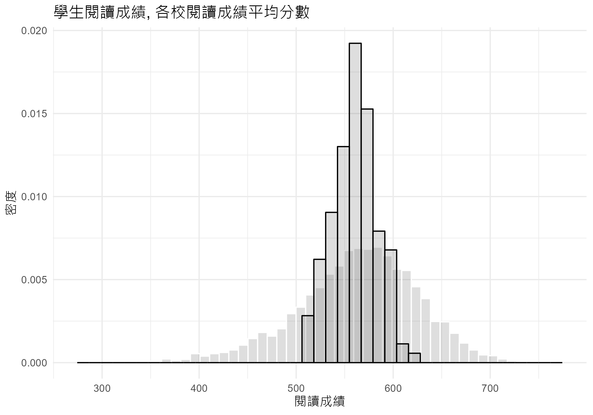

``` r
#繪製學校內學生分數標準差的直方圖，可以知道不同校內變異大小的學校各佔多少
#圖6.2
dta |> dplyr::group_by(學校) |>
  dplyr::summarize(閱讀成績標準差 = sd(閱讀成績)) |>
  ggplot()+
  stat_bin(aes(閱讀成績標準差, after_stat(density)), 
           color='black',
           fill='gray',
           binwidth = function(x) 2 * IQR(x) / (length(x)^(1/3)))+
  labs(x = '學校閱讀成績標準差',
       y = '密度')
```

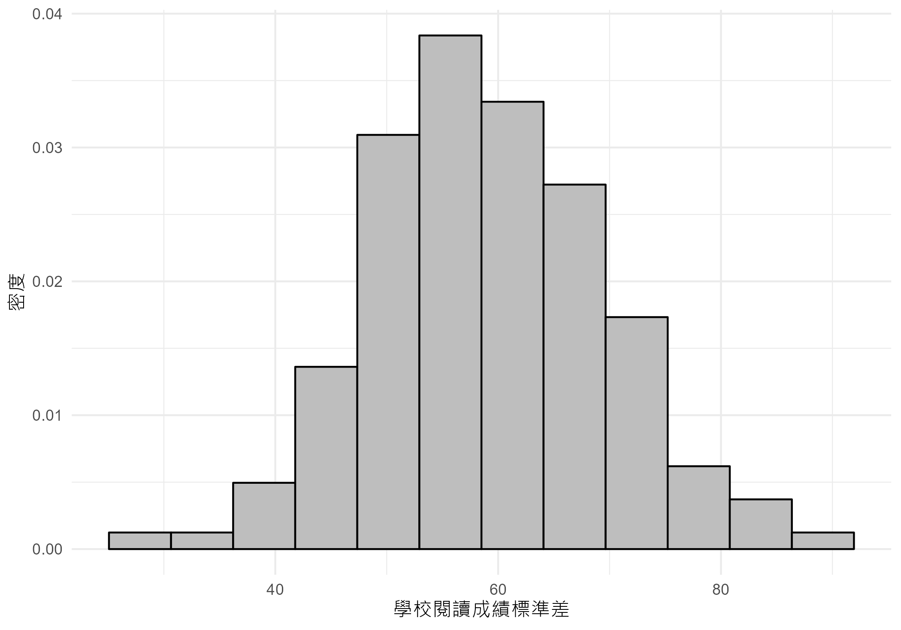

``` r
#此圖縱軸是學校，橫軸是學校成績的平均與標準誤，並且依平均由大到小排列學校
#圖6.3
dta |>
  ggplot()+
  aes(y = 閱讀成績, x = reorder(學校, 閱讀成績, mean)) +
  stat_summary(fun.data = "mean_se", size=rel(.1), alpha=.2) +
  geom_hline(yintercept=mean(dta$閱讀成績), 
             linetype='dotted', 
             col=8)+
  coord_flip() +
  labs(y = '閱讀成績平均分數',
       x = '學校')+
  theme(axis.text.y=element_blank())
```

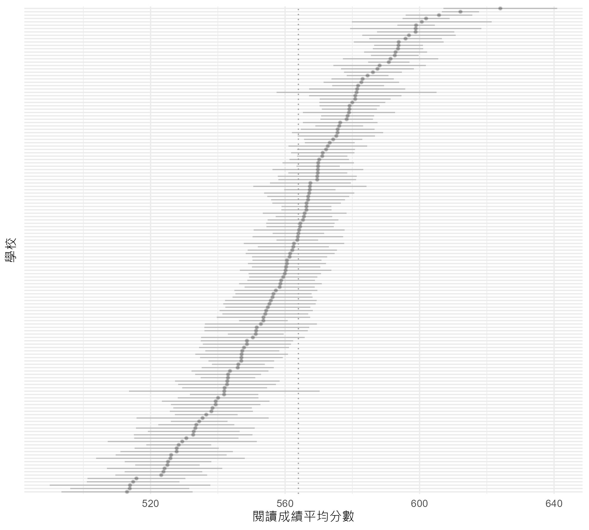

``` r
#預計要先看學校社經地位對閱讀成績的影響
#但學校社經地位為「富有多」時，女性比率較低，因此先畫圖呈現此一現象
#圖6.4
ggplot(dta, 
       aes(x=女性比率, after_stat(density), color=社經地位)) +
  geom_density()+
  scale_color_grey()+
  scale_x_continuous(breaks=seq(.2,.8,by=.1))+
  labs(x="教師班女性比率",
       y="密度")+
  theme(legend.position='top')
```

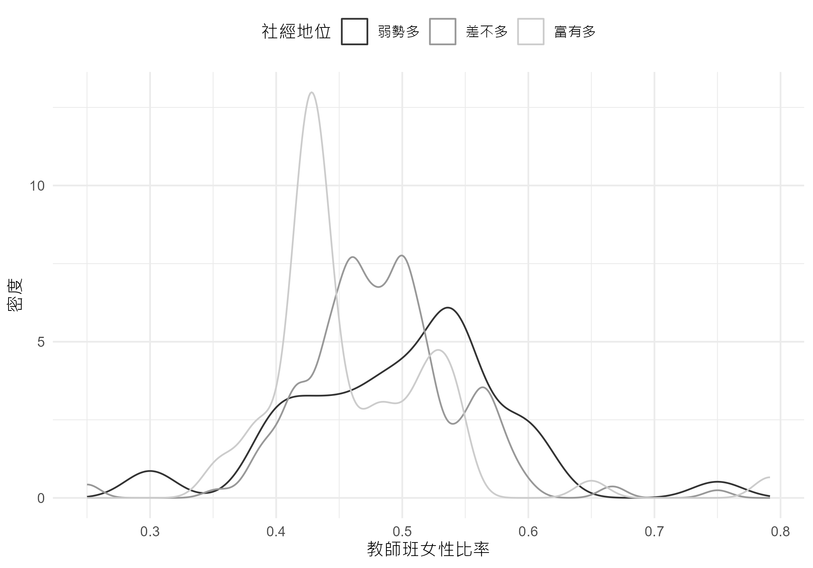

``` r
#依社經地位，各教師班女性比率與閱讀成績的散佈圖，並加上迴歸線
#圖6.5
ggplot(dta, 
       aes(女性比率, 閱讀成績)) +
  geom_point(size=rel(.5), alpha=.5)+
  stat_smooth(method='lm', 
              formula = y ~ x,
              se =FALSE,
              linewidth=.5,
              col=8)+
  scale_color_grey()+
  facet_wrap(vars(社經地位))+
  labs(x="教師班女性比率",
       y="閱讀成績")
```

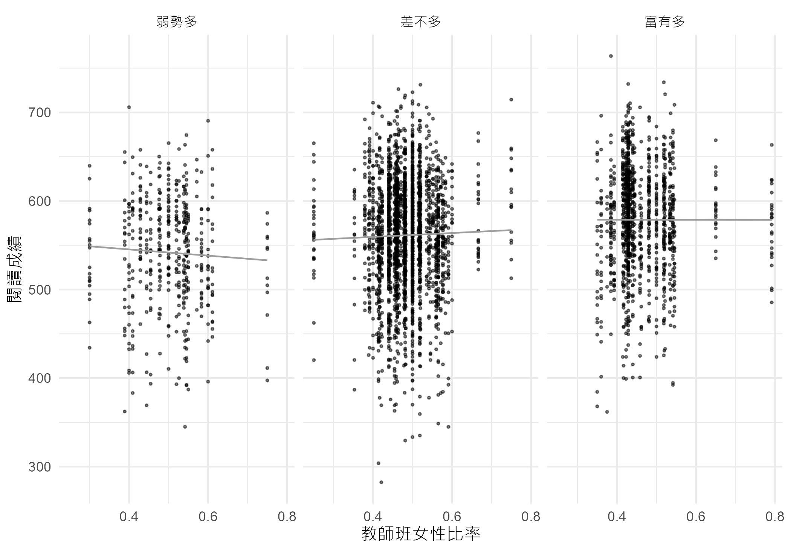

``` r
#書本數與閱讀成績的散佈圖，加上以校為單位的迴歸線
#圖6.6
ggplot(dta, 
       aes(書本數, 閱讀成績, group=學校)) +
  geom_point(size=rel(.2), alpha=.2)+
  stat_smooth(method='lm', 
              formula = y ~ x,
              se =FALSE,
              linewidth=.2,
              col=8,
              alpha=.1)+
  scale_x_continuous(trans='log2')+
  labs(x="書籍數目",
        y="閱讀成績")
```

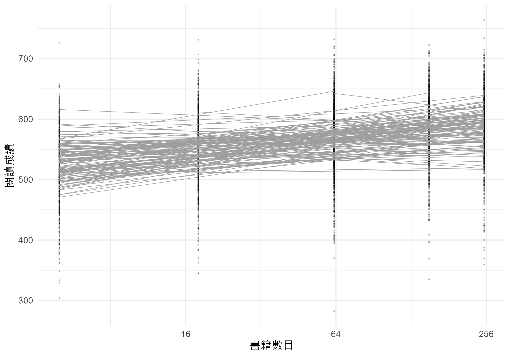

``` r
#看一下各班性別比率的統計
with(dta, 女性比率) |> summary()
```

<table>
<thead>
<tr>
<th style="text-align:right;">
Min.
</th>
<th style="text-align:right;">
1st Qu.
</th>
<th style="text-align:right;">
Median
</th>
<th style="text-align:right;">
Mean
</th>
<th style="text-align:right;">
3rd Qu.
</th>
<th style="text-align:right;">
Max.
</th>
</tr>
</thead>
<tbody>
<tr>
<td style="text-align:right;">
0.25
</td>
<td style="text-align:right;">
0.4286
</td>
<td style="text-align:right;">
0.4783
</td>
<td style="text-align:right;">
0.4796
</td>
<td style="text-align:right;">
0.5185
</td>
<td style="text-align:right;">
0.7917
</td>
</tr>
</tbody>
</table>

``` r
#各校以書本數預測閱讀成績數時的截距與斜率，分各校畫圖
#女性比率可能是兩者關係混淆變項，此處選擇女性比率在中位數附近者
#圖6.7
dta |> dplyr::filter(女性比率 > .455, 女性比率 < .48) |>
 ggplot() + 
   aes(x = 書本數, y = 閱讀成績) +
   geom_point(size = rel(.6)) +
   stat_smooth(method = 'lm', formula = y ~ x, se = F,
               linewidth=.5, col=1) +
   facet_wrap(vars(學校))+
   scale_x_continuous(trans = 'log2')+
   labs(x="書籍數目",
        y="閱讀成績",
        subtitle='學校')+
   theme(legend.position='top')
```

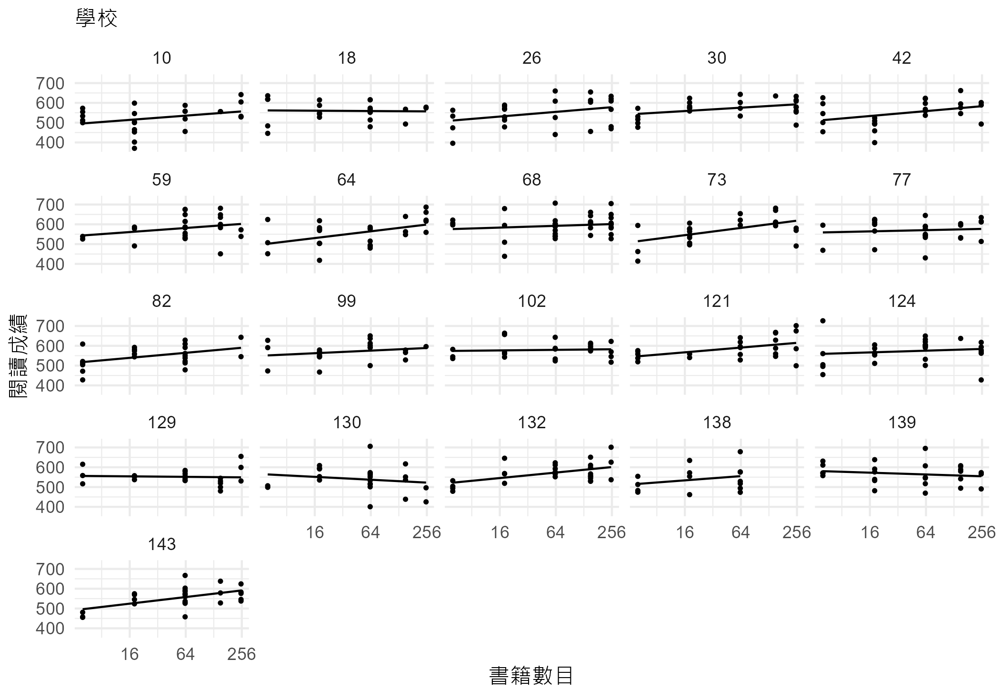

``` r
#區分社經地位與性別，以蜂群圖（beeswarm）繪製閱讀成績
#圖6.8
ggplot(data=dta,
       aes(x=性別, y=閱讀成績))+
   geom_boxplot()+
  ggbeeswarm::geom_beeswarm(size=rel(.2)) +
  facet_wrap(vars(社經地位))
```

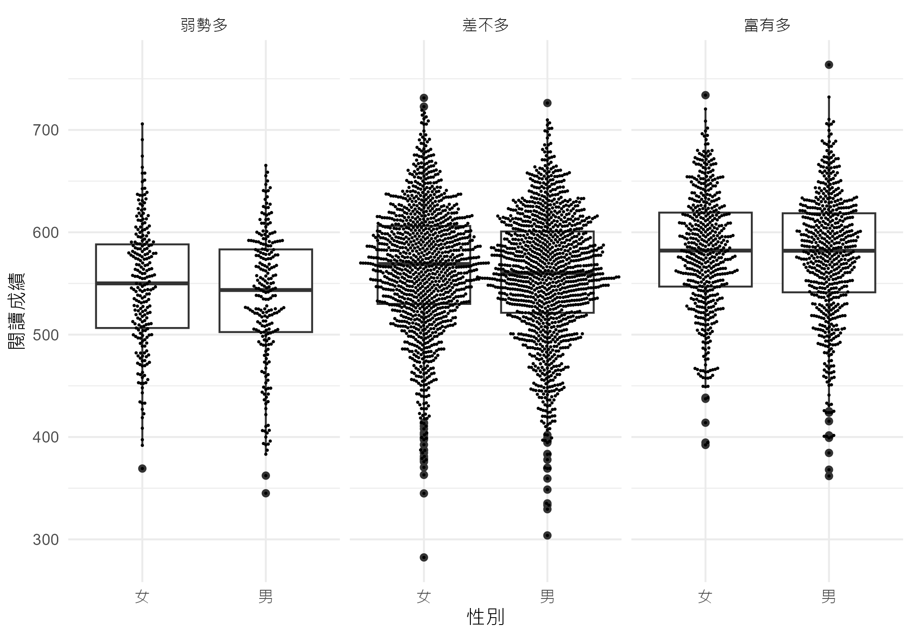

``` r
#區分社經地位與性別，繪製書本數與閱讀成績關係
#圖6.9
ggplot(data=dta,
       aes(x=書本數, y=閱讀成績))+
  stat_smooth(method='lm',
               formula = y ~ x,
              col='black')+
  stat_summary(fun.data="mean_se", size=rel(.5))+
  facet_grid(性別 ~ 社經地位)+
  scale_x_continuous(trans='log2')
```

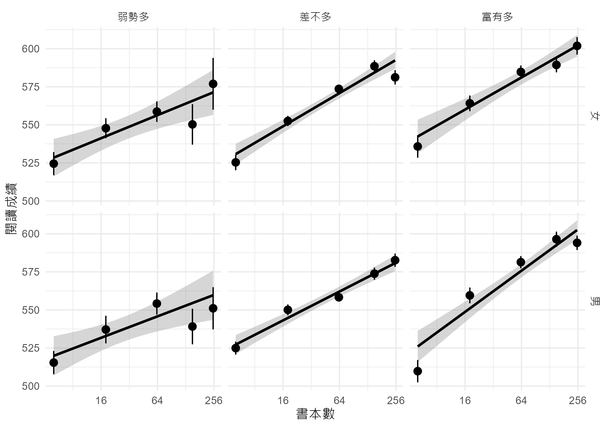

# 多層次分析

``` r
#分析時請確認，教師與學校編號，都已經被視為 factor
#在此將書本數置中
dta <- dta |>
  dplyr::mutate(老師 = as.factor(老師),
                學校 = as.factor(學校),
                書本數置中 = log2(書本數) |> scale(scale=FALSE) |>   
                as.vector())
```

``` r
#只包含隨機截距的模型
#程式報表6.3
m0 <- lme4::lmer(閱讀成績 ~ 1 + ( 1 | 學校/老師 ), 
                 data = dta, 
                 na.action=na.omit)
summary(m0, corr=FALSE)
```

    Linear mixed model fit by REML ['lmerMod']
    Formula: 閱讀成績 ~ 1 + (1 | 學校/老師)
       Data: dta

    REML criterion at convergence: 45398

    Scaled residuals: 
       Min     1Q Median     3Q    Max 
     -4.19  -0.59   0.08   0.66   3.10 

    Random effects:
     Groups    Name        Variance Std.Dev.
     老師:學校 (Intercept)   97      9.85   
     學校      (Intercept)  259     16.10   
     Residual              3479     58.98   
    Number of obs: 4112, groups:  老師:學校, 171; 學校, 145

    Fixed effects:
                Estimate Std. Error t value
    (Intercept)   561.63       1.83     308

``` r
#同一個模型的另一種寫法
#雖未直接設定老師與學校的巢套關係，但資料中仍可以看出
#建議使用這種寫法
m0 <- lme4::lmer(閱讀成績 ~ 1 + ( 1 | 老師 ) + ( 1 | 學校 ), 
                 data = dta, 
                 na.action=na.omit)
summary(m0)
```

``` r
#參數估計
#程式報表6.4
m0 |> broom::tidy()
```

<table>
<thead>
<tr>
<th style="text-align:left;">
effect
</th>
<th style="text-align:left;">
group
</th>
<th style="text-align:left;">
term
</th>
<th style="text-align:right;">
estimate
</th>
<th style="text-align:right;">
std.error
</th>
<th style="text-align:right;">
statistic
</th>
</tr>
</thead>
<tbody>
<tr>
<td style="text-align:left;">
fixed
</td>
<td style="text-align:left;">
NA
</td>
<td style="text-align:left;">
(Intercept)
</td>
<td style="text-align:right;">
561.626
</td>
<td style="text-align:right;">
1.826
</td>
<td style="text-align:right;">
307.5
</td>
</tr>
<tr>
<td style="text-align:left;">
ran_pars
</td>
<td style="text-align:left;">
老師:學校
</td>
<td style="text-align:left;">
sd\_\_(Intercept)
</td>
<td style="text-align:right;">
9.847
</td>
<td style="text-align:right;">
NA
</td>
<td style="text-align:right;">
NA
</td>
</tr>
<tr>
<td style="text-align:left;">
ran_pars
</td>
<td style="text-align:left;">
學校
</td>
<td style="text-align:left;">
sd\_\_(Intercept)
</td>
<td style="text-align:right;">
16.099
</td>
<td style="text-align:right;">
NA
</td>
<td style="text-align:right;">
NA
</td>
</tr>
<tr>
<td style="text-align:left;">
ran_pars
</td>
<td style="text-align:left;">
Residual
</td>
<td style="text-align:left;">
sd\_\_Observation
</td>
<td style="text-align:right;">
58.981
</td>
<td style="text-align:right;">
NA
</td>
<td style="text-align:right;">
NA
</td>
</tr>
</tbody>
</table>

## 加入學校層級解釋變項

``` r
#加入社經地位（學校層級獨變項）
#程式報表6.5
broom::tidy(m1 <- update(m0, . ~ . + 社經地位))
```

<table>
<thead>
<tr>
<th style="text-align:left;">
effect
</th>
<th style="text-align:left;">
group
</th>
<th style="text-align:left;">
term
</th>
<th style="text-align:right;">
estimate
</th>
<th style="text-align:right;">
std.error
</th>
<th style="text-align:right;">
statistic
</th>
</tr>
</thead>
<tbody>
<tr>
<td style="text-align:left;">
fixed
</td>
<td style="text-align:left;">
NA
</td>
<td style="text-align:left;">
(Intercept)
</td>
<td style="text-align:right;">
539.994
</td>
<td style="text-align:right;">
4.276
</td>
<td style="text-align:right;">
126.297
</td>
</tr>
<tr>
<td style="text-align:left;">
fixed
</td>
<td style="text-align:left;">
NA
</td>
<td style="text-align:left;">
社經地位差不多
</td>
<td style="text-align:right;">
20.650
</td>
<td style="text-align:right;">
4.729
</td>
<td style="text-align:right;">
4.366
</td>
</tr>
<tr>
<td style="text-align:left;">
fixed
</td>
<td style="text-align:left;">
NA
</td>
<td style="text-align:left;">
社經地位富有多
</td>
<td style="text-align:right;">
37.082
</td>
<td style="text-align:right;">
5.304
</td>
<td style="text-align:right;">
6.992
</td>
</tr>
<tr>
<td style="text-align:left;">
ran_pars
</td>
<td style="text-align:left;">
老師:學校
</td>
<td style="text-align:left;">
sd\_\_(Intercept)
</td>
<td style="text-align:right;">
9.588
</td>
<td style="text-align:right;">
NA
</td>
<td style="text-align:right;">
NA
</td>
</tr>
<tr>
<td style="text-align:left;">
ran_pars
</td>
<td style="text-align:left;">
學校
</td>
<td style="text-align:left;">
sd\_\_(Intercept)
</td>
<td style="text-align:right;">
12.072
</td>
<td style="text-align:right;">
NA
</td>
<td style="text-align:right;">
NA
</td>
</tr>
<tr>
<td style="text-align:left;">
ran_pars
</td>
<td style="text-align:left;">
Residual
</td>
<td style="text-align:left;">
sd\_\_Observation
</td>
<td style="text-align:right;">
58.976
</td>
<td style="text-align:right;">
NA
</td>
<td style="text-align:right;">
NA
</td>
</tr>
</tbody>
</table>

## 加入教師班層級解釋變項

``` r
##加入女性比率（教師班層級）及其與社經地位交互作用（跨層次交互作用）
#程式報表6.6
broom::tidy(m2 <- update(m1, . ~ . + 女性比率 + 女性比率:社經地位))
```

<table>
<thead>
<tr>
<th style="text-align:left;">
effect
</th>
<th style="text-align:left;">
group
</th>
<th style="text-align:left;">
term
</th>
<th style="text-align:right;">
estimate
</th>
<th style="text-align:right;">
std.error
</th>
<th style="text-align:right;">
statistic
</th>
</tr>
</thead>
<tbody>
<tr>
<td style="text-align:left;">
fixed
</td>
<td style="text-align:left;">
NA
</td>
<td style="text-align:left;">
(Intercept)
</td>
<td style="text-align:right;">
556.981
</td>
<td style="text-align:right;">
24.82
</td>
<td style="text-align:right;">
22.4407
</td>
</tr>
<tr>
<td style="text-align:left;">
fixed
</td>
<td style="text-align:left;">
NA
</td>
<td style="text-align:left;">
社經地位差不多
</td>
<td style="text-align:right;">
-11.780
</td>
<td style="text-align:right;">
28.70
</td>
<td style="text-align:right;">
-0.4104
</td>
</tr>
<tr>
<td style="text-align:left;">
fixed
</td>
<td style="text-align:left;">
NA
</td>
<td style="text-align:left;">
社經地位富有多
</td>
<td style="text-align:right;">
12.676
</td>
<td style="text-align:right;">
30.93
</td>
<td style="text-align:right;">
0.4098
</td>
</tr>
<tr>
<td style="text-align:left;">
fixed
</td>
<td style="text-align:left;">
NA
</td>
<td style="text-align:left;">
女性比率
</td>
<td style="text-align:right;">
-33.638
</td>
<td style="text-align:right;">
48.32
</td>
<td style="text-align:right;">
-0.6961
</td>
</tr>
<tr>
<td style="text-align:left;">
fixed
</td>
<td style="text-align:left;">
NA
</td>
<td style="text-align:left;">
社經地位差不多:女性比率
</td>
<td style="text-align:right;">
65.472
</td>
<td style="text-align:right;">
56.59
</td>
<td style="text-align:right;">
1.1569
</td>
</tr>
<tr>
<td style="text-align:left;">
fixed
</td>
<td style="text-align:left;">
NA
</td>
<td style="text-align:left;">
社經地位富有多:女性比率
</td>
<td style="text-align:right;">
49.472
</td>
<td style="text-align:right;">
62.06
</td>
<td style="text-align:right;">
0.7971
</td>
</tr>
<tr>
<td style="text-align:left;">
ran_pars
</td>
<td style="text-align:left;">
老師:學校
</td>
<td style="text-align:left;">
sd\_\_(Intercept)
</td>
<td style="text-align:right;">
9.496
</td>
<td style="text-align:right;">
NA
</td>
<td style="text-align:right;">
NA
</td>
</tr>
<tr>
<td style="text-align:left;">
ran_pars
</td>
<td style="text-align:left;">
學校
</td>
<td style="text-align:left;">
sd\_\_(Intercept)
</td>
<td style="text-align:right;">
12.378
</td>
<td style="text-align:right;">
NA
</td>
<td style="text-align:right;">
NA
</td>
</tr>
<tr>
<td style="text-align:left;">
ran_pars
</td>
<td style="text-align:left;">
Residual
</td>
<td style="text-align:left;">
sd\_\_Observation
</td>
<td style="text-align:right;">
58.969
</td>
<td style="text-align:right;">
NA
</td>
<td style="text-align:right;">
NA
</td>
</tr>
</tbody>
</table>

## 加入學生層級解釋變項

``` r
##加入書本數變項（學生層級、置中）、性別（學生層級）及其與社經地位交互作用（跨層次交互作用）
#程式報表6.7
broom::tidy(m3 <- update(m2, . ~ . + 性別 + 書本數置中 + 性別:社經地位))
```

<table>
<thead>
<tr>
<th style="text-align:left;">
effect
</th>
<th style="text-align:left;">
group
</th>
<th style="text-align:left;">
term
</th>
<th style="text-align:right;">
estimate
</th>
<th style="text-align:right;">
std.error
</th>
<th style="text-align:right;">
statistic
</th>
</tr>
</thead>
<tbody>
<tr>
<td style="text-align:left;">
fixed
</td>
<td style="text-align:left;">
NA
</td>
<td style="text-align:left;">
(Intercept)
</td>
<td style="text-align:right;">
575.054
</td>
<td style="text-align:right;">
22.1454
</td>
<td style="text-align:right;">
25.9672
</td>
</tr>
<tr>
<td style="text-align:left;">
fixed
</td>
<td style="text-align:left;">
NA
</td>
<td style="text-align:left;">
社經地位差不多
</td>
<td style="text-align:right;">
-22.801
</td>
<td style="text-align:right;">
25.5041
</td>
<td style="text-align:right;">
-0.8940
</td>
</tr>
<tr>
<td style="text-align:left;">
fixed
</td>
<td style="text-align:left;">
NA
</td>
<td style="text-align:left;">
社經地位富有多
</td>
<td style="text-align:right;">
-4.054
</td>
<td style="text-align:right;">
27.3719
</td>
<td style="text-align:right;">
-0.1481
</td>
</tr>
<tr>
<td style="text-align:left;">
fixed
</td>
<td style="text-align:left;">
NA
</td>
<td style="text-align:left;">
女性比率
</td>
<td style="text-align:right;">
-41.719
</td>
<td style="text-align:right;">
42.2983
</td>
<td style="text-align:right;">
-0.9863
</td>
</tr>
<tr>
<td style="text-align:left;">
fixed
</td>
<td style="text-align:left;">
NA
</td>
<td style="text-align:left;">
性別男
</td>
<td style="text-align:right;">
-10.791
</td>
<td style="text-align:right;">
5.3239
</td>
<td style="text-align:right;">
-2.0270
</td>
</tr>
<tr>
<td style="text-align:left;">
fixed
</td>
<td style="text-align:left;">
NA
</td>
<td style="text-align:left;">
書本數置中
</td>
<td style="text-align:right;">
9.679
</td>
<td style="text-align:right;">
0.5006
</td>
<td style="text-align:right;">
19.3337
</td>
</tr>
<tr>
<td style="text-align:left;">
fixed
</td>
<td style="text-align:left;">
NA
</td>
<td style="text-align:left;">
社經地位差不多:女性比率
</td>
<td style="text-align:right;">
69.482
</td>
<td style="text-align:right;">
49.4078
</td>
<td style="text-align:right;">
1.4063
</td>
</tr>
<tr>
<td style="text-align:left;">
fixed
</td>
<td style="text-align:left;">
NA
</td>
<td style="text-align:left;">
社經地位富有多:女性比率
</td>
<td style="text-align:right;">
51.996
</td>
<td style="text-align:right;">
53.8922
</td>
<td style="text-align:right;">
0.9648
</td>
</tr>
<tr>
<td style="text-align:left;">
fixed
</td>
<td style="text-align:left;">
NA
</td>
<td style="text-align:left;">
社經地位差不多:性別男
</td>
<td style="text-align:right;">
3.079
</td>
<td style="text-align:right;">
5.7938
</td>
<td style="text-align:right;">
0.5315
</td>
</tr>
<tr>
<td style="text-align:left;">
fixed
</td>
<td style="text-align:left;">
NA
</td>
<td style="text-align:left;">
社經地位富有多:性別男
</td>
<td style="text-align:right;">
5.802
</td>
<td style="text-align:right;">
6.3121
</td>
<td style="text-align:right;">
0.9192
</td>
</tr>
<tr>
<td style="text-align:left;">
ran_pars
</td>
<td style="text-align:left;">
老師:學校
</td>
<td style="text-align:left;">
sd\_\_(Intercept)
</td>
<td style="text-align:right;">
7.786
</td>
<td style="text-align:right;">
NA
</td>
<td style="text-align:right;">
NA
</td>
</tr>
<tr>
<td style="text-align:left;">
ran_pars
</td>
<td style="text-align:left;">
學校
</td>
<td style="text-align:left;">
sd\_\_(Intercept)
</td>
<td style="text-align:right;">
9.326
</td>
<td style="text-align:right;">
NA
</td>
<td style="text-align:right;">
NA
</td>
</tr>
<tr>
<td style="text-align:left;">
ran_pars
</td>
<td style="text-align:left;">
Residual
</td>
<td style="text-align:left;">
sd\_\_Observation
</td>
<td style="text-align:right;">
56.649
</td>
<td style="text-align:right;">
NA
</td>
<td style="text-align:right;">
NA
</td>
</tr>
</tbody>
</table>

## 模型比較

``` r
#比較四個模型
#程式報表6.8
anova(m0, m1, m2, m3)
```

    refitting model(s) with ML (instead of REML)

<table>
<thead>
<tr>
<th style="text-align:left;">
</th>
<th style="text-align:right;">
npar
</th>
<th style="text-align:right;">
AIC
</th>
<th style="text-align:right;">
BIC
</th>
<th style="text-align:right;">
logLik
</th>
<th style="text-align:right;">
deviance
</th>
<th style="text-align:right;">
Chisq
</th>
<th style="text-align:right;">
Df
</th>
<th style="text-align:right;">
Pr(\>Chisq)
</th>
</tr>
</thead>
<tbody>
<tr>
<td style="text-align:left;">
m0
</td>
<td style="text-align:right;">
4
</td>
<td style="text-align:right;">
45409
</td>
<td style="text-align:right;">
45434
</td>
<td style="text-align:right;">
-22700
</td>
<td style="text-align:right;">
45401
</td>
<td style="text-align:right;">
NA
</td>
<td style="text-align:right;">
NA
</td>
<td style="text-align:right;">
NA
</td>
</tr>
<tr>
<td style="text-align:left;">
m1
</td>
<td style="text-align:right;">
6
</td>
<td style="text-align:right;">
45369
</td>
<td style="text-align:right;">
45407
</td>
<td style="text-align:right;">
-22678
</td>
<td style="text-align:right;">
45357
</td>
<td style="text-align:right;">
43.948
</td>
<td style="text-align:right;">
2
</td>
<td style="text-align:right;">
0.0000
</td>
</tr>
<tr>
<td style="text-align:left;">
m2
</td>
<td style="text-align:right;">
9
</td>
<td style="text-align:right;">
45373
</td>
<td style="text-align:right;">
45430
</td>
<td style="text-align:right;">
-22677
</td>
<td style="text-align:right;">
45355
</td>
<td style="text-align:right;">
1.823
</td>
<td style="text-align:right;">
3
</td>
<td style="text-align:right;">
0.6099
</td>
</tr>
<tr>
<td style="text-align:left;">
m3
</td>
<td style="text-align:right;">
13
</td>
<td style="text-align:right;">
45008
</td>
<td style="text-align:right;">
45090
</td>
<td style="text-align:right;">
-22491
</td>
<td style="text-align:right;">
44982
</td>
<td style="text-align:right;">
373.097
</td>
<td style="text-align:right;">
4
</td>
<td style="text-align:right;">
0.0000
</td>
</tr>
</tbody>
</table>

``` r
#看一下m3模型表現（AIC, BIC, conditional R2, marginal R2）
#程式報表6.9前
performance::performance(m3) |> dplyr::select(-c(2,6:8))
```

<table>
<thead>
<tr>
<th style="text-align:right;">
AIC
</th>
<th style="text-align:right;">
BIC
</th>
<th style="text-align:right;">
R2_conditional
</th>
<th style="text-align:right;">
R2_marginal
</th>
</tr>
</thead>
<tbody>
<tr>
<td style="text-align:right;">
44957
</td>
<td style="text-align:right;">
45039
</td>
<td style="text-align:right;">
0.156
</td>
<td style="text-align:right;">
0.1172
</td>
</tr>
</tbody>
</table>

## 組內相關（Intraclass correlations）

``` r
#比較m0與m3的ICC，看看學生間的相似性有多少被解釋變項解釋掉了
#程式報表6.9後
performance::icc(m0)
```

<table>
<thead>
<tr>
<th style="text-align:right;">
ICC_adjusted
</th>
<th style="text-align:right;">
ICC_unadjusted
</th>
<th style="text-align:left;">
optional
</th>
</tr>
</thead>
<tbody>
<tr>
<td style="text-align:right;">
0.0929
</td>
<td style="text-align:right;">
0.0929
</td>
<td style="text-align:left;">
FALSE
</td>
</tr>
</tbody>
</table>

``` r
performance::icc(m3)
```

<table>
<thead>
<tr>
<th style="text-align:right;">
ICC_adjusted
</th>
<th style="text-align:right;">
ICC_unadjusted
</th>
<th style="text-align:left;">
optional
</th>
</tr>
</thead>
<tbody>
<tr>
<td style="text-align:right;">
0.044
</td>
<td style="text-align:right;">
0.0388
</td>
<td style="text-align:left;">
FALSE
</td>
</tr>
</tbody>
</table>

``` r
#抽取變異成分，計算教師與學校可以解釋部分（ICCs）
print(vc <- lme4::VarCorr(m3) |> as.data.frame(), comp = 'Variance')
```

            grp        var1 var2    vcov  sdcor
    1 老師:學校 (Intercept) <NA>   60.63  7.786
    2      學校 (Intercept) <NA>   86.97  9.326
    3  Residual        <NA> <NA> 3209.09 56.649

``` r
#換成百分比
vc["vcov"]/sum(vc["vcov"])
```

<table>
<thead>
<tr>
<th style="text-align:right;">
vcov
</th>
</tr>
</thead>
<tbody>
<tr>
<td style="text-align:right;">
0.0181
</td>
</tr>
<tr>
<td style="text-align:right;">
0.0259
</td>
</tr>
<tr>
<td style="text-align:right;">
0.9560
</td>
</tr>
</tbody>
</table>

## 以圖形顯示模型效果

``` r
#圖示固定效果 
#將截距去除，圖較更易懂
#圖6.10左
p1 <- 
broom::tidy(m3, conf.int = TRUE) |> 
 dplyr::filter(effect=='fixed') |>
 dplyr::slice(-1) |>
ggplot() + 
  aes(x=estimate, y=term, xmin = conf.low, xmax = conf.high, height = 0) +
  geom_point(size=rel(3)) +
  geom_vline(xintercept = 0, linetype="dashed") +
  geom_errorbarh() +
  labs(x = '估計值和信賴區間', 
       y = '模型固定效果變項(去除截距)', 
       subtitle = '依變項:閱讀成績')

#也可以用以下程式碼得出類似圖形
#sjPlot::plot_model(m3) 
```

``` r
#圖示隨機效果（估計值與信賴區間）
#圖6.10右
p2<- 
 lme4::ranef(m3) |> as.data.frame() |>
 ggplot() +  
  aes(y=grp, x=condval, color=grpvar) +
  geom_point(size=rel(.8)) + 
  facet_wrap(vars(term), scale='free') +
  geom_errorbarh(aes(xmin=condval-2*condsd,
                     xmax=condval+2*condsd), 
                     linewidth=rel(.4), alpha=.2)+
  scale_color_grey()+
  labs(x="隨機效果的條件平均數",
       y="")+
  guides(color=guide_legend(title="單位"))+
  theme(axis.text.y=element_blank(),
        legend.position="top")
p1+p2
```

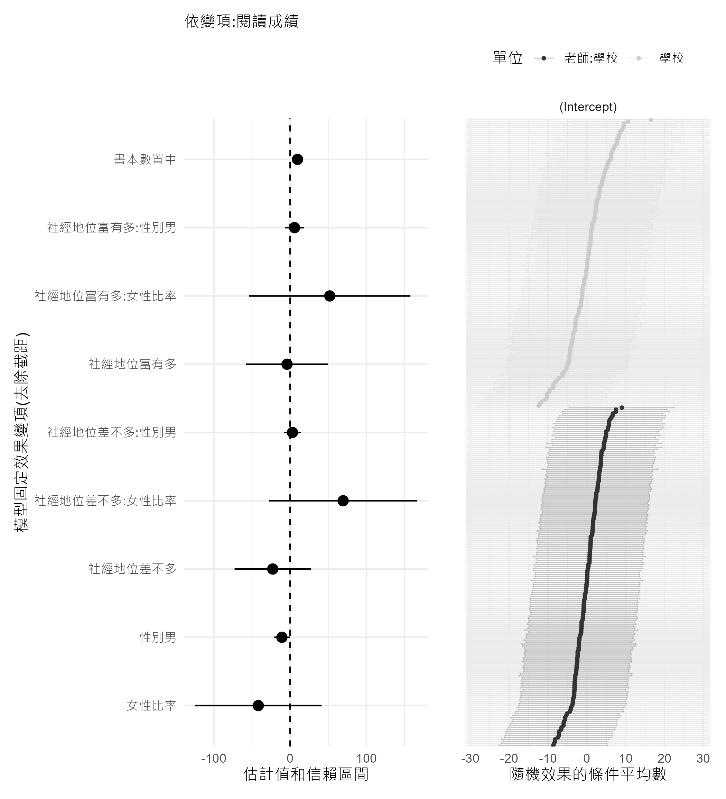

# 模型診斷（檢驗假設）

## 殘差

``` r
#圖6.11
gglm::gglm(m3, theme = ggplot2::theme_minimal())
```

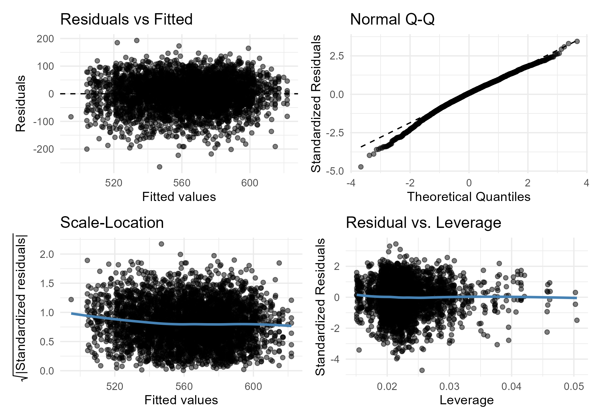

## 隨機效果QQ圖

``` r
#圖6.12
lme4::ranef(m3) |> as.data.frame() |>
  ggplot() +
  aes(sample=condval)+
  stat_qq(size=rel(.5)) + 
  stat_qq_line() +
  facet_wrap(vars(grpvar)) +
  labs(x="常態分位數",
       y="隨機效果的條件平均數")
```

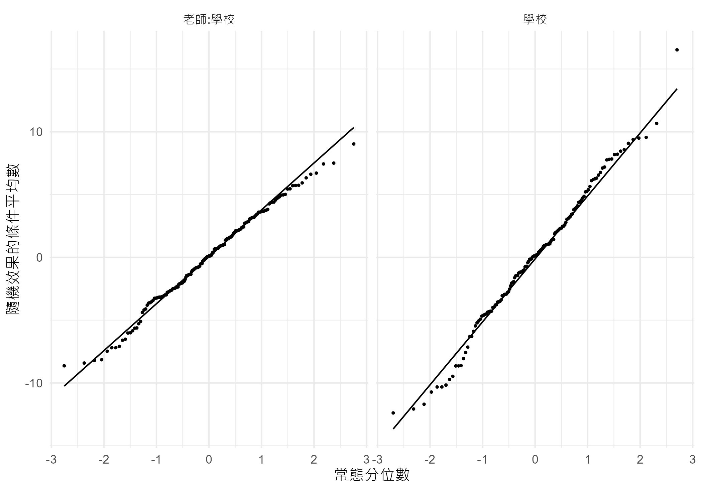

## 模型配適

``` r
#比對社經地位與女性比率與閱讀成績關係的實際資料與預測值
#圖6.13
ef_x <- effects::effect(term=c("女性比率", "社經地位"), mod=m3) |> 
 as.data.frame() 

ggplot() +
  geom_point(data=dta, aes(女性比率, 閱讀成績), alpha=.2, pch=1) + 
  geom_point(data=ef_x, aes(x=女性比率, y=fit)) +
  geom_ribbon(data=ef_x, aes(x=女性比率, 
                              ymin=lower, 
                              ymax=upper), fill=8) +
  geom_line(data=ef_x, aes(x=女性比率, y=fit)) +
  facet_wrap(vars(社經地位)) +
  labs(x="女性比率", 
       y="閱讀成績")
```

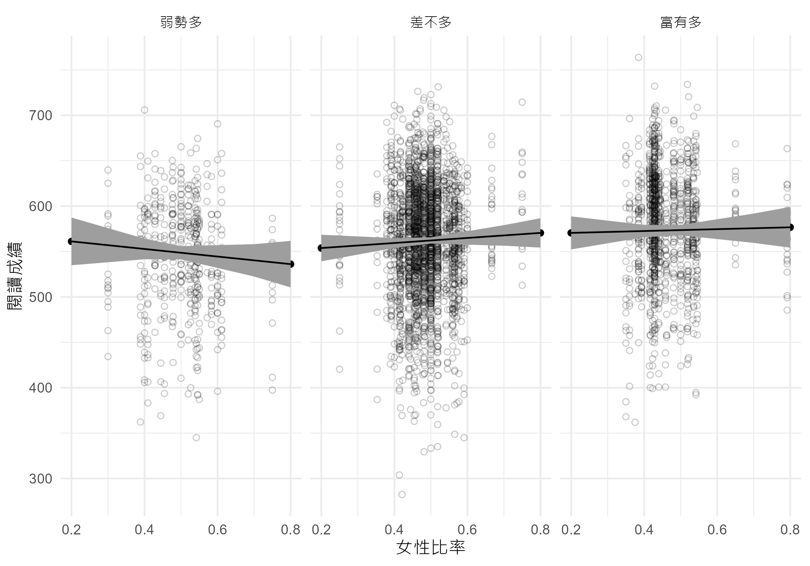

``` r
#比對書本數與女性比率與閱讀成績關係的實際資料與預測值
#圖6.14
broom::augment(m3, dta) |> 
 dplyr::filter(女性比率 > .455, 女性比率 < .48) |>
 ggplot() + 
   aes(x = 書本數, y = 閱讀成績) +
   geom_point(size = rel(.5)) +
   stat_smooth(method = 'lm', 
               formula = y ~ x, 
               se = F, col=1,
               linewidth=.3) +
   stat_smooth(aes(y=.fitted),
               method = 'lm', 
               formula = y ~ x, 
               se = F, col=2,
               linewidth=.3) +
   facet_wrap(vars(學校)) +
   scale_x_continuous(trans='log2') +
   labs(x="書本數",
        y="閱讀成績",
        subtitle='學校')+
   theme(legend.position='top')
```

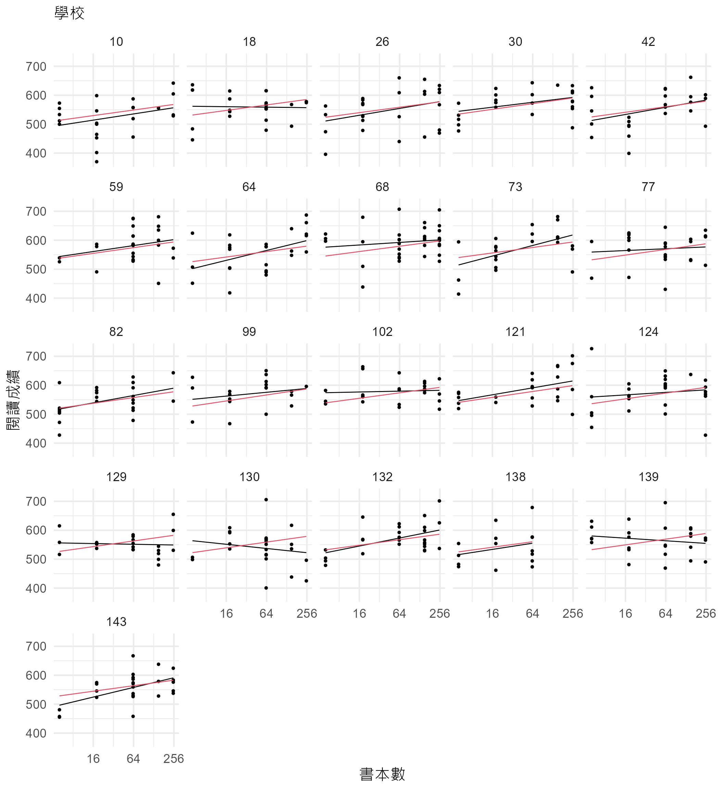

# 複雜的多層次模型

``` r
#隨機斜率模型，不考慮截距與斜率相關
#程式報表6.10
broom::tidy(m4 <- update(m3, . ~ . + (書本數置中 - 1 | 學校)))
```

<table>
<thead>
<tr>
<th style="text-align:left;">
effect
</th>
<th style="text-align:left;">
group
</th>
<th style="text-align:left;">
term
</th>
<th style="text-align:right;">
estimate
</th>
<th style="text-align:right;">
std.error
</th>
<th style="text-align:right;">
statistic
</th>
</tr>
</thead>
<tbody>
<tr>
<td style="text-align:left;">
fixed
</td>
<td style="text-align:left;">
NA
</td>
<td style="text-align:left;">
(Intercept)
</td>
<td style="text-align:right;">
575.117
</td>
<td style="text-align:right;">
22.1793
</td>
<td style="text-align:right;">
25.9304
</td>
</tr>
<tr>
<td style="text-align:left;">
fixed
</td>
<td style="text-align:left;">
NA
</td>
<td style="text-align:left;">
社經地位差不多
</td>
<td style="text-align:right;">
-22.175
</td>
<td style="text-align:right;">
25.5396
</td>
<td style="text-align:right;">
-0.8683
</td>
</tr>
<tr>
<td style="text-align:left;">
fixed
</td>
<td style="text-align:left;">
NA
</td>
<td style="text-align:left;">
社經地位富有多
</td>
<td style="text-align:right;">
-4.495
</td>
<td style="text-align:right;">
27.3870
</td>
<td style="text-align:right;">
-0.1641
</td>
</tr>
<tr>
<td style="text-align:left;">
fixed
</td>
<td style="text-align:left;">
NA
</td>
<td style="text-align:left;">
女性比率
</td>
<td style="text-align:right;">
-42.124
</td>
<td style="text-align:right;">
42.3770
</td>
<td style="text-align:right;">
-0.9940
</td>
</tr>
<tr>
<td style="text-align:left;">
fixed
</td>
<td style="text-align:left;">
NA
</td>
<td style="text-align:left;">
性別男
</td>
<td style="text-align:right;">
-10.873
</td>
<td style="text-align:right;">
5.3168
</td>
<td style="text-align:right;">
-2.0451
</td>
</tr>
<tr>
<td style="text-align:left;">
fixed
</td>
<td style="text-align:left;">
NA
</td>
<td style="text-align:left;">
書本數置中
</td>
<td style="text-align:right;">
9.764
</td>
<td style="text-align:right;">
0.5606
</td>
<td style="text-align:right;">
17.4177
</td>
</tr>
<tr>
<td style="text-align:left;">
fixed
</td>
<td style="text-align:left;">
NA
</td>
<td style="text-align:left;">
社經地位差不多:女性比率
</td>
<td style="text-align:right;">
68.427
</td>
<td style="text-align:right;">
49.4958
</td>
<td style="text-align:right;">
1.3825
</td>
</tr>
<tr>
<td style="text-align:left;">
fixed
</td>
<td style="text-align:left;">
NA
</td>
<td style="text-align:left;">
社經地位富有多:女性比率
</td>
<td style="text-align:right;">
53.151
</td>
<td style="text-align:right;">
53.9190
</td>
<td style="text-align:right;">
0.9858
</td>
</tr>
<tr>
<td style="text-align:left;">
fixed
</td>
<td style="text-align:left;">
NA
</td>
<td style="text-align:left;">
社經地位差不多:性別男
</td>
<td style="text-align:right;">
3.285
</td>
<td style="text-align:right;">
5.7864
</td>
<td style="text-align:right;">
0.5678
</td>
</tr>
<tr>
<td style="text-align:left;">
fixed
</td>
<td style="text-align:left;">
NA
</td>
<td style="text-align:left;">
社經地位富有多:性別男
</td>
<td style="text-align:right;">
5.930
</td>
<td style="text-align:right;">
6.3023
</td>
<td style="text-align:right;">
0.9410
</td>
</tr>
<tr>
<td style="text-align:left;">
ran_pars
</td>
<td style="text-align:left;">
老師.學校
</td>
<td style="text-align:left;">
sd\_\_(Intercept)
</td>
<td style="text-align:right;">
7.836
</td>
<td style="text-align:right;">
NA
</td>
<td style="text-align:right;">
NA
</td>
</tr>
<tr>
<td style="text-align:left;">
ran_pars
</td>
<td style="text-align:left;">
學校
</td>
<td style="text-align:left;">
sd\_\_(Intercept)
</td>
<td style="text-align:right;">
9.133
</td>
<td style="text-align:right;">
NA
</td>
<td style="text-align:right;">
NA
</td>
</tr>
<tr>
<td style="text-align:left;">
ran_pars
</td>
<td style="text-align:left;">
學校.1
</td>
<td style="text-align:left;">
sd\_\_書本數置中
</td>
<td style="text-align:right;">
2.886
</td>
<td style="text-align:right;">
NA
</td>
<td style="text-align:right;">
NA
</td>
</tr>
<tr>
<td style="text-align:left;">
ran_pars
</td>
<td style="text-align:left;">
Residual
</td>
<td style="text-align:left;">
sd\_\_Observation
</td>
<td style="text-align:right;">
56.422
</td>
<td style="text-align:right;">
NA
</td>
<td style="text-align:right;">
NA
</td>
</tr>
</tbody>
</table>

``` r
#原始報表
summary(m4, corr=FALSE)
```

    Linear mixed model fit by REML ['lmerMod']
    Formula: 閱讀成績 ~ (1 | 學校/老師) + 社經地位 + 女性比率 +  
        性別 + 書本數置中 + (書本數置中 - 1 | 學校) +  
        社經地位:女性比率 + 社經地位:性別
       Data: dta

    REML criterion at convergence: 44927

    Scaled residuals: 
       Min     1Q Median     3Q    Max 
    -4.682 -0.595  0.067  0.668  3.351 

    Random effects:
     Groups    Name        Variance Std.Dev.
     老師.學校 (Intercept)   61.41   7.84   
     學校      (Intercept)   83.41   9.13   
     學校.1    書本數置中     8.33   2.89   
     Residual              3183.43  56.42   
    Number of obs: 4112, groups:  老師:學校, 171; 學校, 145

    Fixed effects:
                            Estimate Std. Error t value
    (Intercept)              575.117     22.179   25.93
    社經地位差不多           -22.175     25.540   -0.87
    社經地位富有多            -4.495     27.387   -0.16
    女性比率                 -42.124     42.377   -0.99
    性別男                   -10.873      5.317   -2.05
    書本數置中                 9.764      0.561   17.42
    社經地位差不多:女性比率   68.427     49.496    1.38
    社經地位富有多:女性比率   53.151     53.919    0.99
    社經地位差不多:性別男      3.285      5.786    0.57
    社經地位富有多:性別男      5.930      6.302    0.94

``` r
#隨機斜率模型，考慮截距與斜率相關
#程式報表6.11
broom::tidy(m5 <- lme4::lmer(閱讀成績 ~ 書本數置中 + 
                             (1 | 老師) +
                             (1 + 書本數置中 | 學校),
                             data = dta,
                             na.action = na.omit))
```

<table>
<thead>
<tr>
<th style="text-align:left;">
effect
</th>
<th style="text-align:left;">
group
</th>
<th style="text-align:left;">
term
</th>
<th style="text-align:right;">
estimate
</th>
<th style="text-align:right;">
std.error
</th>
<th style="text-align:right;">
statistic
</th>
</tr>
</thead>
<tbody>
<tr>
<td style="text-align:left;">
fixed
</td>
<td style="text-align:left;">
NA
</td>
<td style="text-align:left;">
(Intercept)
</td>
<td style="text-align:right;">
562.7550
</td>
<td style="text-align:right;">
1.4559
</td>
<td style="text-align:right;">
386.54
</td>
</tr>
<tr>
<td style="text-align:left;">
fixed
</td>
<td style="text-align:left;">
NA
</td>
<td style="text-align:left;">
書本數置中
</td>
<td style="text-align:right;">
10.0581
</td>
<td style="text-align:right;">
0.5605
</td>
<td style="text-align:right;">
17.94
</td>
</tr>
<tr>
<td style="text-align:left;">
ran_pars
</td>
<td style="text-align:left;">
老師
</td>
<td style="text-align:left;">
sd\_\_(Intercept)
</td>
<td style="text-align:right;">
7.8414
</td>
<td style="text-align:right;">
NA
</td>
<td style="text-align:right;">
NA
</td>
</tr>
<tr>
<td style="text-align:left;">
ran_pars
</td>
<td style="text-align:left;">
學校
</td>
<td style="text-align:left;">
sd\_\_(Intercept)
</td>
<td style="text-align:right;">
11.1882
</td>
<td style="text-align:right;">
NA
</td>
<td style="text-align:right;">
NA
</td>
</tr>
<tr>
<td style="text-align:left;">
ran_pars
</td>
<td style="text-align:left;">
學校
</td>
<td style="text-align:left;">
cor\_\_(Intercept).書本數置中
</td>
<td style="text-align:right;">
0.1232
</td>
<td style="text-align:right;">
NA
</td>
<td style="text-align:right;">
NA
</td>
</tr>
<tr>
<td style="text-align:left;">
ran_pars
</td>
<td style="text-align:left;">
學校
</td>
<td style="text-align:left;">
sd\_\_書本數置中
</td>
<td style="text-align:right;">
2.9294
</td>
<td style="text-align:right;">
NA
</td>
<td style="text-align:right;">
NA
</td>
</tr>
<tr>
<td style="text-align:left;">
ran_pars
</td>
<td style="text-align:left;">
Residual
</td>
<td style="text-align:left;">
sd\_\_Observation
</td>
<td style="text-align:right;">
56.5503
</td>
<td style="text-align:right;">
NA
</td>
<td style="text-align:right;">
NA
</td>
</tr>
</tbody>
</table>

``` r
#呈現此時的 ICC
performance::icc(m5)
```

<table>
<thead>
<tr>
<th style="text-align:right;">
ICC_adjusted
</th>
<th style="text-align:right;">
ICC_unadjusted
</th>
<th style="text-align:left;">
optional
</th>
</tr>
</thead>
<tbody>
<tr>
<td style="text-align:right;">
0.0633
</td>
<td style="text-align:right;">
0.0575
</td>
<td style="text-align:left;">
FALSE
</td>
</tr>
</tbody>
</table>

## 縮減（Shrinkage）

``` r
#比較資料、迴歸、多層次迴歸間截距與斜率的關係
#收集資料準備繪圖
betas <- lme4::lmList(閱讀成績 ~ 書本數置中 | 學校, data=dta) |> 
  coef() |>
  as_tibble( rownames = "rowname")

bs <- m5 |> coef() |> 
  purrr::pluck("學校") |> 
  as_tibble( rownames = "rowname")

b_df <- dplyr::inner_join(betas, bs, by='rowname')
names(b_df) <- c("id", "beta0", "beta1", "b0", "b1")
```

``` r
#圖6.15
ggplot(data=b_df, 
       aes(beta0, beta1)) +
  geom_point(aes(x=lme4::fixef(m5)[1], 
                 y=lme4::fixef(m5)[2]), 
             col=1, size=rel(2))+
  geom_point(size=rel(1.5), shape=21, col=8) +
  geom_point(aes(b0, b1), 
             size=rel(1), shape=16, col=1) +
  geom_segment(aes(x=beta0, y=beta1, 
                   xend=b0, yend=b1), 
               alpha=.2, size=rel(.5),
               arrow=arrow(angle=15,
                           length=unit(.2, "cm")))+
  stat_ellipse(col=8, linetype=3)+
  stat_ellipse(aes(b0, b1), col=1, linetype=1)+
  labs(x="Intercept estimats", 
       y="Slope estimates")
```

    Warning: Using `size` aesthetic for lines was deprecated in ggplot2 3.4.0.
    ℹ Please use `linewidth` instead.
    This warning is displayed once every 8 hours.
    Call `lifecycle::last_lifecycle_warnings()` to see where this warning was
    generated.

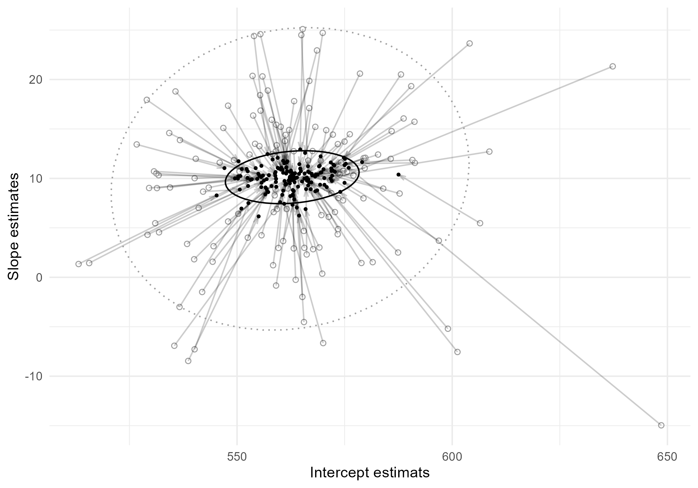

\##附錄：多層次分析與隨機效果ANOVA 間的關聯

``` r
#程式報表6.12
aov(閱讀成績 ~ Error(老師), data=dta) |> summary()
```


    Error: 老師
               Df  Sum Sq Mean Sq F value Pr(>F)
    Residuals 170 2063990   12141               

    Error: Within
                Df   Sum Sq Mean Sq F value Pr(>F)
    Residuals 3941 13700482    3476               

``` r
aggregate(學生 ~ 老師, data=dta, FUN=length) |> pluck('學生') |> mean()
```

    [1] 24.05

``` r
(12141-3476)/24.05
```

    [1] 360.3

# References

紀馥安， 許清芳(2012).運用開放軟體 R
處理大型教育資料庫.當代教育研究季刊, 23(4), 121-153.

# 結束

顯示演練單元信息

``` r
sessionInfo()
```

    R version 4.3.2 (2023-10-31 ucrt)
    Platform: x86_64-w64-mingw32/x64 (64-bit)
    Running under: Windows 11 x64 (build 22621)

    Matrix products: default


    locale:
    [1] LC_COLLATE=Chinese (Traditional)_Taiwan.utf8 
    [2] LC_CTYPE=Chinese (Traditional)_Taiwan.utf8   
    [3] LC_MONETARY=Chinese (Traditional)_Taiwan.utf8
    [4] LC_NUMERIC=C                                 
    [5] LC_TIME=Chinese (Traditional)_Taiwan.utf8    

    time zone: Asia/Taipei
    tzcode source: internal

    attached base packages:
    [1] stats     graphics  grDevices utils     datasets  methods   base     

    other attached packages:
     [1] brolgar_1.0.0.9000  ggmirt_0.1.0        mlogit_1.1-1       
     [4] dfidx_0.0-5         dispmod_1.2         metaviz_0.3.1      
     [7] metafor_4.4-0       numDeriv_2016.8-1.1 metadat_1.2-0      
    [10] ngramr_1.9.3        rentrez_1.2.3       psych_2.3.9        
    [13] psychometric_2.4    multilevel_2.7      nlme_3.1-163       
    [16] cowplot_1.1.1       eRm_1.0-4           qgraph_1.9.8       
    [19] semTools_0.5-6      CTT_2.3.3           tidySEM_0.2.6      
    [22] OpenMx_2.21.11      semPlot_1.1.6       lavaanPlot_0.6.2   
    [25] lavaan_0.6-16       effects_4.2-2       carData_3.0-5      
    [28] lme4_1.1-35.1       broom.mixed_0.2.9.4 plyr_1.8.9         
    [31] mediation_4.5.0     sandwich_3.1-0      mvtnorm_1.2-4      
    [34] Matrix_1.6-4        MBESS_4.9.3         vctrs_0.6.2        
    [37] rsvg_2.6.0          DiagrammeRsvg_0.1   DiagrammeR_1.0.10  
    [40] bda_17.1.2          boot_1.3-28.1       insight_0.19.7     
    [43] lm.beta_1.7-2       see_0.8.1           performance_0.10.8 
    [46] ggokabeito_0.1.0    ggrepel_0.9.4       gglm_1.0.2         
    [49] ggpubr_0.6.0        gghighlight_0.4.0   ggridges_0.5.4     
    [52] ggbeeswarm_0.7.2    KernSmooth_2.23-22  ggExtra_0.10.1     
    [55] ggeffects_1.3.2     webshot2_0.1.1      patchwork_1.1.3    
    [58] ragg_1.2.7          GGally_2.2.0        moments_0.14.1     
    [61] corrplot_0.92       cocor_1.1-4         parameters_0.21.3  
    [64] Hmisc_5.1-1         confintr_1.0.2      kableExtra_1.3.4   
    [67] MASS_7.3-60         statmod_1.5.0       flextable_0.9.4    
    [70] printr_0.3          here_1.0.1          sjPlot_2.8.15      
    [73] broom_1.0.5         gtsummary_1.7.2     jtools_2.2.2       
    [76] lubridate_1.9.3     forcats_1.0.0       stringr_1.5.1      
    [79] dplyr_1.1.2         purrr_1.0.1         readr_2.1.4        
    [82] tidyr_1.3.0         tibble_3.2.1        ggplot2_3.4.4      
    [85] tidyverse_2.0.0     remotes_2.4.2.1     devtools_2.4.5     
    [88] usethis_2.2.2       pacman_0.5.1       

    loaded via a namespace (and not attached):
      [1] sjmisc_2.8.9            urlchecker_1.0.1        kutils_1.73            
      [4] nnet_7.3-19             rstan_2.32.3            bain_0.2.10            
      [7] digest_0.6.31           png_0.1-8               corpcor_1.6.10         
     [10] bayestestR_0.13.1       httpcode_0.3.0          parallelly_1.36.0      
     [13] permute_0.9-7           fontLiberation_0.1.0    reshape2_1.4.4         
     [16] httpuv_1.6.13           withr_2.5.2             xfun_0.39              
     [19] ellipsis_0.3.2          survival_3.5-7          commonmark_1.9.0       
     [22] memoise_2.0.1           crul_1.4.0              emmeans_1.8.9          
     [25] profvis_0.3.8           systemfonts_1.0.5       zoo_1.8-12             
     [28] MplusAutomation_1.1.0   gtools_3.9.5            V8_4.4.1               
     [31] pbapply_1.7-2           Formula_1.2-5           datawizard_0.9.0       
     [34] promises_1.2.1          httr_1.4.7              rstatix_0.7.2          
     [37] rockchalk_1.8.157       globals_0.16.2          ps_1.7.5               
     [40] rstudioapi_0.15.0       miniUI_0.1.1.1          generics_0.1.3         
     [43] base64enc_0.1-3         processx_3.8.3          curl_5.2.0             
     [46] mitools_2.4             quadprog_1.5-8          xtable_1.8-4           
     [49] evaluate_0.23           hms_1.1.3               colorspace_2.1-0       
     [52] visNetwork_2.1.2        lmtest_0.9-40           magrittr_2.0.3         
     [55] later_1.3.2             lattice_0.21-9          tsibble_1.1.3          
     [58] future.apply_1.11.0     matrixStats_1.2.0       XML_3.99-0.16          
     [61] survey_4.2-1            texreg_1.39.3           pillar_1.9.0           
     [64] StanHeaders_2.26.28     compiler_4.3.2          stringi_1.7.12         
     [67] minqa_1.2.6             crayon_1.5.2            abind_1.4-5            
     [70] mathjaxr_1.6-0          modelr_0.1.11           chromote_0.1.2         
     [73] codetools_0.2-19        textshaping_0.3.7       nonnest2_0.5-6         
     [76] openssl_2.1.1           QuickJSR_1.0.8          mime_0.12              
     [79] anytime_0.3.9           splines_4.3.2           markdown_1.12          
     [82] Rcpp_1.0.11             fastDummies_1.7.3       knitr_1.45             
     [85] utf8_1.2.3              pbivnorm_0.6.0          fs_1.6.3               
     [88] listenv_0.9.0           checkmate_2.2.0         Rdpack_2.6             
     [91] pkgbuild_1.4.3          openxlsx_4.2.5.2        ggsignif_0.6.4         
     [94] estimability_1.4.1      tzdb_0.4.0              lpSolve_5.6.20         
     [97] svglite_2.1.3           bayesplot_1.10.0        pkgconfig_2.0.3        
    [100] tools_4.3.2             cachem_1.0.8            rbibutils_2.2.16       
    [103] viridisLite_0.4.2       blavaan_0.5-2           rvest_1.0.3            
    [106] DBI_1.1.3               fastmap_1.1.1           rmarkdown_2.25         
    [109] scales_1.3.0            grid_4.3.2              gt_0.10.0              
    [112] sass_0.4.8              officer_0.6.3           coda_0.19-4            
    [115] ggstats_0.5.1           tmvnsim_1.0-2           RANN_2.6.1             
    [118] rpart_4.1.21            farver_2.1.1            mgcv_1.9-0             
    [121] gsubfn_0.7              yaml_2.3.7              foreign_0.8-85         
    [124] sjstats_0.18.2          cli_3.6.1               stats4_4.3.2           
    [127] webshot_0.5.5           dbscan_1.1-12           lifecycle_1.0.4        
    [130] fabletools_0.3.4        askpass_1.2.0           sessioninfo_1.2.2      
    [133] backports_1.4.1         timechange_0.2.0        gtable_0.3.4           
    [136] progressr_0.14.0        parallel_4.3.2          jsonlite_1.8.8         
    [139] vegan_2.6-4             glasso_1.11             proto_1.0.0            
    [142] zip_2.3.0               RcppParallel_5.1.7      GPArotation_2023.11-1  
    [145] highr_0.10              sem_3.1-15              loo_2.6.0              
    [148] distributional_0.3.2    dcurver_0.9.2           pander_0.6.5           
    [151] shiny_1.8.0             lisrelToR_0.1.5         htmltools_0.5.7        
    [154] sjlabelled_1.2.0        glue_1.6.2              gfonts_0.2.0           
    [157] broom.helpers_1.14.0    gdtools_0.3.5           rprojroot_2.0.4        
    [160] mirt_1.41               mnormt_2.1.1            jpeg_0.1-10            
    [163] gridExtra_2.3           igraph_1.6.0            R6_2.5.1               
    [166] arm_1.13-1              fdrtool_1.2.17          labeling_0.4.3         
    [169] Deriv_4.1.3             CompQuadForm_1.4.3      cluster_2.1.4          
    [172] pkgload_1.3.3           nloptr_2.0.3            rstantools_2.3.1.1     
    [175] tidyselect_1.2.0        vipor_0.4.5             htmlTable_2.4.2        
    [178] xml2_1.3.4              inline_0.3.19           fontBitstreamVera_0.1.1
    [181] car_3.1-2               future_1.33.0           munsell_0.5.0          
    [184] mi_1.1                  furrr_0.3.1             fontquiver_0.2.1       
    [187] data.table_1.14.8       websocket_1.4.1         htmlwidgets_1.6.4      
    [190] RColorBrewer_1.1-3      rlang_1.1.1             uuid_1.1-1             
    [193] fansi_1.0.4             beeswarm_0.4.0         
