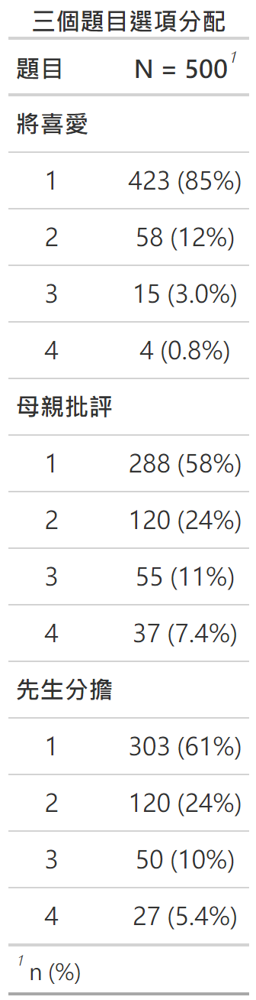

第七章: 量表分析
================
2024 三月 04

``` r
#整體設定，含載入套件
source("https://raw.githubusercontent.com/ChungPingCheng/R4BS2/main/R4BS_setup.R")
```

# 資料與管理

``` r
#讀資料
dta <- read.table(file = "../Data/prenatal1.txt", 
                  header = TRUE, stringsAsFactors = TRUE)
```

``` r
#程式報表7.1前、後
dim(dta)
```

    [1] 500  35

``` r
head(dta)
```

<table>
<thead>
<tr>
<th style="text-align:right;">
相處
</th>
<th style="text-align:right;">
值得
</th>
<th style="text-align:right;">
期待
</th>
<th style="text-align:right;">
不確定
</th>
<th style="text-align:right;">
喜歡
</th>
<th style="text-align:right;">
平衡
</th>
<th style="text-align:right;">
照顧
</th>
<th style="text-align:right;">
關注
</th>
<th style="text-align:right;">
負擔
</th>
<th style="text-align:right;">
思考
</th>
<th style="text-align:right;">
時間
</th>
<th style="text-align:right;">
不喜歡
</th>
<th style="text-align:right;">
喜愛
</th>
<th style="text-align:right;">
好母親
</th>
<th style="text-align:right;">
將喜愛
</th>
<th style="text-align:right;">
母親興趣
</th>
<th style="text-align:right;">
母親高興
</th>
<th style="text-align:right;">
母親建議
</th>
<th style="text-align:right;">
母親談論
</th>
<th style="text-align:right;">
母親期待
</th>
<th style="text-align:right;">
母親相處
</th>
<th style="text-align:right;">
母親爭論
</th>
<th style="text-align:right;">
母親信心
</th>
<th style="text-align:right;">
母親鼓勵
</th>
<th style="text-align:right;">
母親批評
</th>
<th style="text-align:right;">
先生談論
</th>
<th style="text-align:right;">
先生批評
</th>
<th style="text-align:right;">
先生體諒
</th>
<th style="text-align:right;">
先生討論
</th>
<th style="text-align:right;">
先生幫忙
</th>
<th style="text-align:right;">
性慾變化
</th>
<th style="text-align:right;">
先生支援
</th>
<th style="text-align:right;">
先生負擔
</th>
<th style="text-align:right;">
性調適
</th>
<th style="text-align:right;">
先生分擔
</th>
</tr>
</thead>
<tbody>
<tr>
<td style="text-align:right;">
2
</td>
<td style="text-align:right;">
1
</td>
<td style="text-align:right;">
1
</td>
<td style="text-align:right;">
1
</td>
<td style="text-align:right;">
1
</td>
<td style="text-align:right;">
3
</td>
<td style="text-align:right;">
1
</td>
<td style="text-align:right;">
2
</td>
<td style="text-align:right;">
1
</td>
<td style="text-align:right;">
1
</td>
<td style="text-align:right;">
2
</td>
<td style="text-align:right;">
1
</td>
<td style="text-align:right;">
1
</td>
<td style="text-align:right;">
1
</td>
<td style="text-align:right;">
1
</td>
<td style="text-align:right;">
1
</td>
<td style="text-align:right;">
1
</td>
<td style="text-align:right;">
1
</td>
<td style="text-align:right;">
1
</td>
<td style="text-align:right;">
1
</td>
<td style="text-align:right;">
1
</td>
<td style="text-align:right;">
1
</td>
<td style="text-align:right;">
1
</td>
<td style="text-align:right;">
1
</td>
<td style="text-align:right;">
1
</td>
<td style="text-align:right;">
1
</td>
<td style="text-align:right;">
1
</td>
<td style="text-align:right;">
1
</td>
<td style="text-align:right;">
1
</td>
<td style="text-align:right;">
1
</td>
<td style="text-align:right;">
1
</td>
<td style="text-align:right;">
1
</td>
<td style="text-align:right;">
1
</td>
<td style="text-align:right;">
1
</td>
<td style="text-align:right;">
1
</td>
</tr>
<tr>
<td style="text-align:right;">
1
</td>
<td style="text-align:right;">
1
</td>
<td style="text-align:right;">
1
</td>
<td style="text-align:right;">
2
</td>
<td style="text-align:right;">
1
</td>
<td style="text-align:right;">
2
</td>
<td style="text-align:right;">
1
</td>
<td style="text-align:right;">
1
</td>
<td style="text-align:right;">
1
</td>
<td style="text-align:right;">
3
</td>
<td style="text-align:right;">
2
</td>
<td style="text-align:right;">
1
</td>
<td style="text-align:right;">
1
</td>
<td style="text-align:right;">
1
</td>
<td style="text-align:right;">
1
</td>
<td style="text-align:right;">
1
</td>
<td style="text-align:right;">
1
</td>
<td style="text-align:right;">
2
</td>
<td style="text-align:right;">
1
</td>
<td style="text-align:right;">
1
</td>
<td style="text-align:right;">
1
</td>
<td style="text-align:right;">
1
</td>
<td style="text-align:right;">
1
</td>
<td style="text-align:right;">
1
</td>
<td style="text-align:right;">
1
</td>
<td style="text-align:right;">
1
</td>
<td style="text-align:right;">
1
</td>
<td style="text-align:right;">
1
</td>
<td style="text-align:right;">
2
</td>
<td style="text-align:right;">
1
</td>
<td style="text-align:right;">
2
</td>
<td style="text-align:right;">
1
</td>
<td style="text-align:right;">
1
</td>
<td style="text-align:right;">
2
</td>
<td style="text-align:right;">
2
</td>
</tr>
<tr>
<td style="text-align:right;">
1
</td>
<td style="text-align:right;">
1
</td>
<td style="text-align:right;">
1
</td>
<td style="text-align:right;">
1
</td>
<td style="text-align:right;">
2
</td>
<td style="text-align:right;">
3
</td>
<td style="text-align:right;">
1
</td>
<td style="text-align:right;">
1
</td>
<td style="text-align:right;">
1
</td>
<td style="text-align:right;">
2
</td>
<td style="text-align:right;">
1
</td>
<td style="text-align:right;">
1
</td>
<td style="text-align:right;">
2
</td>
<td style="text-align:right;">
2
</td>
<td style="text-align:right;">
2
</td>
<td style="text-align:right;">
1
</td>
<td style="text-align:right;">
2
</td>
<td style="text-align:right;">
2
</td>
<td style="text-align:right;">
3
</td>
<td style="text-align:right;">
2
</td>
<td style="text-align:right;">
2
</td>
<td style="text-align:right;">
1
</td>
<td style="text-align:right;">
3
</td>
<td style="text-align:right;">
3
</td>
<td style="text-align:right;">
1
</td>
<td style="text-align:right;">
1
</td>
<td style="text-align:right;">
1
</td>
<td style="text-align:right;">
2
</td>
<td style="text-align:right;">
2
</td>
<td style="text-align:right;">
2
</td>
<td style="text-align:right;">
1
</td>
<td style="text-align:right;">
2
</td>
<td style="text-align:right;">
1
</td>
<td style="text-align:right;">
2
</td>
<td style="text-align:right;">
2
</td>
</tr>
<tr>
<td style="text-align:right;">
1
</td>
<td style="text-align:right;">
1
</td>
<td style="text-align:right;">
1
</td>
<td style="text-align:right;">
3
</td>
<td style="text-align:right;">
1
</td>
<td style="text-align:right;">
4
</td>
<td style="text-align:right;">
2
</td>
<td style="text-align:right;">
1
</td>
<td style="text-align:right;">
1
</td>
<td style="text-align:right;">
1
</td>
<td style="text-align:right;">
4
</td>
<td style="text-align:right;">
2
</td>
<td style="text-align:right;">
1
</td>
<td style="text-align:right;">
1
</td>
<td style="text-align:right;">
1
</td>
<td style="text-align:right;">
1
</td>
<td style="text-align:right;">
1
</td>
<td style="text-align:right;">
1
</td>
<td style="text-align:right;">
1
</td>
<td style="text-align:right;">
1
</td>
<td style="text-align:right;">
1
</td>
<td style="text-align:right;">
4
</td>
<td style="text-align:right;">
1
</td>
<td style="text-align:right;">
1
</td>
<td style="text-align:right;">
4
</td>
<td style="text-align:right;">
1
</td>
<td style="text-align:right;">
4
</td>
<td style="text-align:right;">
3
</td>
<td style="text-align:right;">
2
</td>
<td style="text-align:right;">
2
</td>
<td style="text-align:right;">
3
</td>
<td style="text-align:right;">
2
</td>
<td style="text-align:right;">
4
</td>
<td style="text-align:right;">
1
</td>
<td style="text-align:right;">
1
</td>
</tr>
<tr>
<td style="text-align:right;">
1
</td>
<td style="text-align:right;">
1
</td>
<td style="text-align:right;">
1
</td>
<td style="text-align:right;">
2
</td>
<td style="text-align:right;">
1
</td>
<td style="text-align:right;">
4
</td>
<td style="text-align:right;">
1
</td>
<td style="text-align:right;">
1
</td>
<td style="text-align:right;">
3
</td>
<td style="text-align:right;">
1
</td>
<td style="text-align:right;">
2
</td>
<td style="text-align:right;">
1
</td>
<td style="text-align:right;">
1
</td>
<td style="text-align:right;">
1
</td>
<td style="text-align:right;">
1
</td>
<td style="text-align:right;">
1
</td>
<td style="text-align:right;">
1
</td>
<td style="text-align:right;">
1
</td>
<td style="text-align:right;">
1
</td>
<td style="text-align:right;">
1
</td>
<td style="text-align:right;">
1
</td>
<td style="text-align:right;">
1
</td>
<td style="text-align:right;">
1
</td>
<td style="text-align:right;">
1
</td>
<td style="text-align:right;">
2
</td>
<td style="text-align:right;">
3
</td>
<td style="text-align:right;">
1
</td>
<td style="text-align:right;">
2
</td>
<td style="text-align:right;">
1
</td>
<td style="text-align:right;">
2
</td>
<td style="text-align:right;">
2
</td>
<td style="text-align:right;">
1
</td>
<td style="text-align:right;">
2
</td>
<td style="text-align:right;">
2
</td>
<td style="text-align:right;">
2
</td>
</tr>
<tr>
<td style="text-align:right;">
1
</td>
<td style="text-align:right;">
2
</td>
<td style="text-align:right;">
2
</td>
<td style="text-align:right;">
1
</td>
<td style="text-align:right;">
2
</td>
<td style="text-align:right;">
3
</td>
<td style="text-align:right;">
2
</td>
<td style="text-align:right;">
2
</td>
<td style="text-align:right;">
1
</td>
<td style="text-align:right;">
2
</td>
<td style="text-align:right;">
1
</td>
<td style="text-align:right;">
1
</td>
<td style="text-align:right;">
2
</td>
<td style="text-align:right;">
2
</td>
<td style="text-align:right;">
2
</td>
<td style="text-align:right;">
2
</td>
<td style="text-align:right;">
2
</td>
<td style="text-align:right;">
3
</td>
<td style="text-align:right;">
3
</td>
<td style="text-align:right;">
2
</td>
<td style="text-align:right;">
2
</td>
<td style="text-align:right;">
2
</td>
<td style="text-align:right;">
2
</td>
<td style="text-align:right;">
3
</td>
<td style="text-align:right;">
2
</td>
<td style="text-align:right;">
1
</td>
<td style="text-align:right;">
1
</td>
<td style="text-align:right;">
2
</td>
<td style="text-align:right;">
1
</td>
<td style="text-align:right;">
1
</td>
<td style="text-align:right;">
2
</td>
<td style="text-align:right;">
1
</td>
<td style="text-align:right;">
1
</td>
<td style="text-align:right;">
2
</td>
<td style="text-align:right;">
1
</td>
</tr>
</tbody>
</table>

``` r
#同一個量表的35個題目
#此處我們選擇仔細看三個分量表的一個變項，而不只是印出前六筆
#希望可以看到分量表的差異，對資料有更深的理解
#程式報表7.2
dta |> dplyr::select(c(15, 25, 35)) |> 
  gtsummary::tbl_summary() |>
  modify_header(label ~ "**題目**") |>
  modify_caption("**三個題目選項分配**") |>
  bold_labels()
```



``` r
#通常要檢查一下是否有遺漏，不過本筆資料沒有遺漏，結果比較單調
#程式報表7.3
dta |> apply(2, is.na) |> apply(2, sum)
```

        相處     值得     期待   不確定     喜歡     平衡     照顧     關注 
           0        0        0        0        0        0        0        0 
        負擔     思考     時間   不喜歡     喜愛   好母親   將喜愛 母親興趣 
           0        0        0        0        0        0        0        0 
    母親高興 母親建議 母親談論 母親期待 母親相處 母親爭論 母親信心 母親鼓勵 
           0        0        0        0        0        0        0        0 
    母親批評 先生談論 先生批評 先生體諒 先生討論 先生幫忙 性慾變化 先生支援 
           0        0        0        0        0        0        0        0 
    先生負擔   性調適 先生分擔 
           0        0        0 

``` r
#將表格資料由寬形換成長形
#命名長形資料變項名
#製造題目編號
#選項顯示
dta_tbl <- dta |> 
  apply(2, table) |> 
  prop.table(2) |>
  as.data.frame() |>
  dplyr::mutate(選項 = ordered(c("一點也不","稍微如此","有些如此","的確如此"),
                             levels=c("一點也不","稍微如此","有些如此","的確如此"))) |>
  tidyr::pivot_longer(!選項,
                      names_to = '題目',
                      values_to = '比率') |>
  dplyr::mutate(題號 = rep(1:35, 4),
                分量表 = rep(rep(c("職", "母", "夫"), c(15, 10, 10)), 4)) |>
  arrange(題目, 分量表) 
```

``` r
#整理好預計畫圖用的資料，這邊只印六筆作確認
#程式報表7.4
head(dta_tbl)
```

<table>
<thead>
<tr>
<th style="text-align:left;">
選項
</th>
<th style="text-align:left;">
題目
</th>
<th style="text-align:right;">
比率
</th>
<th style="text-align:right;">
題號
</th>
<th style="text-align:left;">
分量表
</th>
</tr>
</thead>
<tbody>
<tr>
<td style="text-align:left;">
一點也不
</td>
<td style="text-align:left;">
不喜歡
</td>
<td style="text-align:right;">
0.712
</td>
<td style="text-align:right;">
12
</td>
<td style="text-align:left;">
職
</td>
</tr>
<tr>
<td style="text-align:left;">
稍微如此
</td>
<td style="text-align:left;">
不喜歡
</td>
<td style="text-align:right;">
0.168
</td>
<td style="text-align:right;">
12
</td>
<td style="text-align:left;">
職
</td>
</tr>
<tr>
<td style="text-align:left;">
有些如此
</td>
<td style="text-align:left;">
不喜歡
</td>
<td style="text-align:right;">
0.076
</td>
<td style="text-align:right;">
12
</td>
<td style="text-align:left;">
職
</td>
</tr>
<tr>
<td style="text-align:left;">
的確如此
</td>
<td style="text-align:left;">
不喜歡
</td>
<td style="text-align:right;">
0.044
</td>
<td style="text-align:right;">
12
</td>
<td style="text-align:left;">
職
</td>
</tr>
<tr>
<td style="text-align:left;">
一點也不
</td>
<td style="text-align:left;">
不確定
</td>
<td style="text-align:right;">
0.392
</td>
<td style="text-align:right;">
4
</td>
<td style="text-align:left;">
職
</td>
</tr>
<tr>
<td style="text-align:left;">
稍微如此
</td>
<td style="text-align:left;">
不確定
</td>
<td style="text-align:right;">
0.234
</td>
<td style="text-align:right;">
4
</td>
<td style="text-align:left;">
職
</td>
</tr>
</tbody>
</table>

# 繪圖 - 呈現資料

``` r
#量表各題各選項比率
#圖7.1
ggplot(data = dta_tbl, 
       aes(x = reorder(題目, 題號, min),
       y = 比率, 
       ymin = 0.25, ymax = 比率, group = 題目, color = 分量表)) +
 geom_pointrange(size=rel(.5)) +
 geom_hline(yintercept = 0.25, linetype = "dotted") +
 facet_wrap(vars(選項), nrow=1) +
 coord_flip() +
 scale_color_grey(start=.8, end=.1)+
 labs(x = "題目", 
      y = "選項比率", 
      title = "產前自我評估量表")+
 theme(legend.position='top')
```


``` r
#算所有題目前四級動差（平均數、標準差、偏態與峰度）
#程式報表7.5
dta_dsc <- 
  tidySEM::descriptives(dta) |> 
  dplyr::select(c("name", "mean", "sd", "skew", "kurt")) |>
  dplyr::rename(c("題目"=name, "平均"=mean, "標準差"=sd, "偏態"=skew, "峰度"=kurt))
dta_dsc
```

<table>
<thead>
<tr>
<th style="text-align:left;">
題目
</th>
<th style="text-align:right;">
平均
</th>
<th style="text-align:right;">
標準差
</th>
<th style="text-align:right;">
偏態
</th>
<th style="text-align:right;">
峰度
</th>
</tr>
</thead>
<tbody>
<tr>
<td style="text-align:left;">
相處
</td>
<td style="text-align:right;">
1.284
</td>
<td style="text-align:right;">
0.5899
</td>
<td style="text-align:right;">
2.1746
</td>
<td style="text-align:right;">
7.457
</td>
</tr>
<tr>
<td style="text-align:left;">
值得
</td>
<td style="text-align:right;">
1.394
</td>
<td style="text-align:right;">
0.6631
</td>
<td style="text-align:right;">
1.6317
</td>
<td style="text-align:right;">
5.059
</td>
</tr>
<tr>
<td style="text-align:left;">
期待
</td>
<td style="text-align:right;">
1.354
</td>
<td style="text-align:right;">
0.6336
</td>
<td style="text-align:right;">
1.7668
</td>
<td style="text-align:right;">
5.572
</td>
</tr>
<tr>
<td style="text-align:left;">
不確定
</td>
<td style="text-align:right;">
2.066
</td>
<td style="text-align:right;">
1.0078
</td>
<td style="text-align:right;">
0.3616
</td>
<td style="text-align:right;">
1.851
</td>
</tr>
<tr>
<td style="text-align:left;">
喜歡
</td>
<td style="text-align:right;">
1.330
</td>
<td style="text-align:right;">
0.6434
</td>
<td style="text-align:right;">
2.0530
</td>
<td style="text-align:right;">
6.895
</td>
</tr>
<tr>
<td style="text-align:left;">
平衡
</td>
<td style="text-align:right;">
2.494
</td>
<td style="text-align:right;">
1.0257
</td>
<td style="text-align:right;">
-0.0954
</td>
<td style="text-align:right;">
1.868
</td>
</tr>
<tr>
<td style="text-align:left;">
照顧
</td>
<td style="text-align:right;">
1.908
</td>
<td style="text-align:right;">
1.0107
</td>
<td style="text-align:right;">
0.7209
</td>
<td style="text-align:right;">
2.264
</td>
</tr>
<tr>
<td style="text-align:left;">
關注
</td>
<td style="text-align:right;">
1.466
</td>
<td style="text-align:right;">
0.7707
</td>
<td style="text-align:right;">
1.5861
</td>
<td style="text-align:right;">
4.669
</td>
</tr>
<tr>
<td style="text-align:left;">
負擔
</td>
<td style="text-align:right;">
1.504
</td>
<td style="text-align:right;">
0.8193
</td>
<td style="text-align:right;">
1.6174
</td>
<td style="text-align:right;">
4.799
</td>
</tr>
<tr>
<td style="text-align:left;">
思考
</td>
<td style="text-align:right;">
1.616
</td>
<td style="text-align:right;">
0.7885
</td>
<td style="text-align:right;">
1.1364
</td>
<td style="text-align:right;">
3.600
</td>
</tr>
<tr>
<td style="text-align:left;">
時間
</td>
<td style="text-align:right;">
2.396
</td>
<td style="text-align:right;">
1.0552
</td>
<td style="text-align:right;">
0.1108
</td>
<td style="text-align:right;">
1.801
</td>
</tr>
<tr>
<td style="text-align:left;">
不喜歡
</td>
<td style="text-align:right;">
1.452
</td>
<td style="text-align:right;">
0.8155
</td>
<td style="text-align:right;">
1.7971
</td>
<td style="text-align:right;">
5.303
</td>
</tr>
<tr>
<td style="text-align:left;">
喜愛
</td>
<td style="text-align:right;">
1.324
</td>
<td style="text-align:right;">
0.6480
</td>
<td style="text-align:right;">
2.0893
</td>
<td style="text-align:right;">
6.941
</td>
</tr>
<tr>
<td style="text-align:left;">
好母親
</td>
<td style="text-align:right;">
1.522
</td>
<td style="text-align:right;">
0.7229
</td>
<td style="text-align:right;">
1.1658
</td>
<td style="text-align:right;">
3.465
</td>
</tr>
<tr>
<td style="text-align:left;">
將喜愛
</td>
<td style="text-align:right;">
1.200
</td>
<td style="text-align:right;">
0.5182
</td>
<td style="text-align:right;">
2.9062
</td>
<td style="text-align:right;">
11.911
</td>
</tr>
<tr>
<td style="text-align:left;">
母親興趣
</td>
<td style="text-align:right;">
1.444
</td>
<td style="text-align:right;">
0.7293
</td>
<td style="text-align:right;">
1.6065
</td>
<td style="text-align:right;">
4.903
</td>
</tr>
<tr>
<td style="text-align:left;">
母親高興
</td>
<td style="text-align:right;">
1.382
</td>
<td style="text-align:right;">
0.7163
</td>
<td style="text-align:right;">
1.9414
</td>
<td style="text-align:right;">
6.183
</td>
</tr>
<tr>
<td style="text-align:left;">
母親建議
</td>
<td style="text-align:right;">
1.566
</td>
<td style="text-align:right;">
0.8018
</td>
<td style="text-align:right;">
1.2436
</td>
<td style="text-align:right;">
3.621
</td>
</tr>
<tr>
<td style="text-align:left;">
母親談論
</td>
<td style="text-align:right;">
1.528
</td>
<td style="text-align:right;">
0.8115
</td>
<td style="text-align:right;">
1.4410
</td>
<td style="text-align:right;">
4.189
</td>
</tr>
<tr>
<td style="text-align:left;">
母親期待
</td>
<td style="text-align:right;">
1.384
</td>
<td style="text-align:right;">
0.7025
</td>
<td style="text-align:right;">
1.8051
</td>
<td style="text-align:right;">
5.507
</td>
</tr>
<tr>
<td style="text-align:left;">
母親相處
</td>
<td style="text-align:right;">
1.374
</td>
<td style="text-align:right;">
0.6626
</td>
<td style="text-align:right;">
1.8142
</td>
<td style="text-align:right;">
5.896
</td>
</tr>
<tr>
<td style="text-align:left;">
母親爭論
</td>
<td style="text-align:right;">
1.770
</td>
<td style="text-align:right;">
0.9332
</td>
<td style="text-align:right;">
1.0045
</td>
<td style="text-align:right;">
2.987
</td>
</tr>
<tr>
<td style="text-align:left;">
母親信心
</td>
<td style="text-align:right;">
1.730
</td>
<td style="text-align:right;">
0.8937
</td>
<td style="text-align:right;">
0.9602
</td>
<td style="text-align:right;">
2.880
</td>
</tr>
<tr>
<td style="text-align:left;">
母親鼓勵
</td>
<td style="text-align:right;">
1.748
</td>
<td style="text-align:right;">
0.9329
</td>
<td style="text-align:right;">
0.9199
</td>
<td style="text-align:right;">
2.646
</td>
</tr>
<tr>
<td style="text-align:left;">
母親批評
</td>
<td style="text-align:right;">
1.682
</td>
<td style="text-align:right;">
0.9395
</td>
<td style="text-align:right;">
1.2078
</td>
<td style="text-align:right;">
3.345
</td>
</tr>
<tr>
<td style="text-align:left;">
先生談論
</td>
<td style="text-align:right;">
1.374
</td>
<td style="text-align:right;">
0.7478
</td>
<td style="text-align:right;">
2.0613
</td>
<td style="text-align:right;">
6.486
</td>
</tr>
<tr>
<td style="text-align:left;">
先生批評
</td>
<td style="text-align:right;">
1.280
</td>
<td style="text-align:right;">
0.6652
</td>
<td style="text-align:right;">
2.6004
</td>
<td style="text-align:right;">
9.371
</td>
</tr>
<tr>
<td style="text-align:left;">
先生體諒
</td>
<td style="text-align:right;">
1.534
</td>
<td style="text-align:right;">
0.8260
</td>
<td style="text-align:right;">
1.5362
</td>
<td style="text-align:right;">
4.583
</td>
</tr>
<tr>
<td style="text-align:left;">
先生討論
</td>
<td style="text-align:right;">
1.692
</td>
<td style="text-align:right;">
0.8664
</td>
<td style="text-align:right;">
1.0448
</td>
<td style="text-align:right;">
3.156
</td>
</tr>
<tr>
<td style="text-align:left;">
先生幫忙
</td>
<td style="text-align:right;">
1.670
</td>
<td style="text-align:right;">
0.8824
</td>
<td style="text-align:right;">
1.1667
</td>
<td style="text-align:right;">
3.427
</td>
</tr>
<tr>
<td style="text-align:left;">
性慾變化
</td>
<td style="text-align:right;">
1.702
</td>
<td style="text-align:right;">
0.9181
</td>
<td style="text-align:right;">
1.0738
</td>
<td style="text-align:right;">
3.049
</td>
</tr>
<tr>
<td style="text-align:left;">
先生支援
</td>
<td style="text-align:right;">
1.374
</td>
<td style="text-align:right;">
0.7261
</td>
<td style="text-align:right;">
2.0632
</td>
<td style="text-align:right;">
6.716
</td>
</tr>
<tr>
<td style="text-align:left;">
先生負擔
</td>
<td style="text-align:right;">
1.596
</td>
<td style="text-align:right;">
0.8777
</td>
<td style="text-align:right;">
1.3792
</td>
<td style="text-align:right;">
3.937
</td>
</tr>
<tr>
<td style="text-align:left;">
性調適
</td>
<td style="text-align:right;">
1.986
</td>
<td style="text-align:right;">
0.9939
</td>
<td style="text-align:right;">
0.6042
</td>
<td style="text-align:right;">
2.208
</td>
</tr>
<tr>
<td style="text-align:left;">
先生分擔
</td>
<td style="text-align:right;">
1.602
</td>
<td style="text-align:right;">
0.8747
</td>
<td style="text-align:right;">
1.3500
</td>
<td style="text-align:right;">
3.864
</td>
</tr>
</tbody>
</table>

``` r
#改成長形資料供後續繪圖，列印前六筆確認
#程式報表7.6
dta_dscl <-
dta_dsc |>
   tidyr::pivot_longer(!題目,
                      names_to = "動差",
                      values_to = '估計值')
dta_dscl |> head()
```

<table>
<thead>
<tr>
<th style="text-align:left;">
題目
</th>
<th style="text-align:left;">
動差
</th>
<th style="text-align:right;">
估計值
</th>
</tr>
</thead>
<tbody>
<tr>
<td style="text-align:left;">
相處
</td>
<td style="text-align:left;">
平均
</td>
<td style="text-align:right;">
1.2840
</td>
</tr>
<tr>
<td style="text-align:left;">
相處
</td>
<td style="text-align:left;">
標準差
</td>
<td style="text-align:right;">
0.5899
</td>
</tr>
<tr>
<td style="text-align:left;">
相處
</td>
<td style="text-align:left;">
偏態
</td>
<td style="text-align:right;">
2.1746
</td>
</tr>
<tr>
<td style="text-align:left;">
相處
</td>
<td style="text-align:left;">
峰度
</td>
<td style="text-align:right;">
7.4573
</td>
</tr>
<tr>
<td style="text-align:left;">
值得
</td>
<td style="text-align:left;">
平均
</td>
<td style="text-align:right;">
1.3940
</td>
</tr>
<tr>
<td style="text-align:left;">
值得
</td>
<td style="text-align:left;">
標準差
</td>
<td style="text-align:right;">
0.6631
</td>
</tr>
</tbody>
</table>

``` r
#繪製所有題目平均數與標準差，依平均數排序
#圖7.2
ggplot(data = subset(dta_dscl, 動差 %in% c("平均", "標準差")), 
       aes(x = reorder(題目, 估計值, max), 
           y = 估計值)) +
 geom_point(size = 1)+
 coord_flip() +
 facet_wrap(vars(動差), ncol=1, scales='free')+
 labs(x = "題目", 
      y = "估計值")
```


``` r
#繪製所有題目偏態與峰度，依偏態排序
#圖7.3
ggplot(data = subset(dta_dscl, !(動差 %in%  c("平均", "標準差"))),
                     #c("偏態",  "峰度")), 
   aes(x = reorder(題目, 估計值, max), 
           y = 估計值)) +
 geom_point(size = 1)+
 coord_flip() +
 facet_wrap(vars(動差), ncol=1, scales='free')+
 labs(x = "題目", 
      y = "估計值")
```


## 區辨度

``` r
#計算區辨度。以總分為準，選取低分組與高分組，比較各題在兩組上的差異。
dta_2g <- dta %>% 
  dplyr::mutate( tot = rowSums(.),
                 grp = case_when(
                   rank(tot) > 500*.73 ~ "H",
                   rank(tot) < 500*.27 ~ "L",
  .default = "M")) |>
  dplyr::filter(grp != 'M')
```

``` r
#t檢定, 算高低分組平均數
#將計算結果存於新資料框架中
item_t <- sapply(dta_2g[,1:35], 
                 function(x) tidy(t.test(x ~ dta_2g$grp)))[1:4,] |> 
  t() |> 
  as.data.frame() |>
  dplyr::mutate(across(1:4, as.numeric)) |>
  dplyr::rename(c("組平均差" = "estimate", 
                  "低分組平均"="estimate2", 
                  "高分組平均"="estimate1", 
                  "t檢定值"="statistic")) 
```

``` r
#四捨五入取至小數點後第2位
#程式報表7.7
item_t |> round(2) |> head()
```

<table>
<thead>
<tr>
<th style="text-align:left;">
</th>
<th style="text-align:right;">
組平均差
</th>
<th style="text-align:right;">
高分組平均
</th>
<th style="text-align:right;">
低分組平均
</th>
<th style="text-align:right;">
t檢定值
</th>
</tr>
</thead>
<tbody>
<tr>
<td style="text-align:left;">
相處
</td>
<td style="text-align:right;">
0.59
</td>
<td style="text-align:right;">
1.66
</td>
<td style="text-align:right;">
1.07
</td>
<td style="text-align:right;">
8.37
</td>
</tr>
<tr>
<td style="text-align:left;">
值得
</td>
<td style="text-align:right;">
0.66
</td>
<td style="text-align:right;">
1.78
</td>
<td style="text-align:right;">
1.12
</td>
<td style="text-align:right;">
8.23
</td>
</tr>
<tr>
<td style="text-align:left;">
期待
</td>
<td style="text-align:right;">
0.82
</td>
<td style="text-align:right;">
1.83
</td>
<td style="text-align:right;">
1.02
</td>
<td style="text-align:right;">
11.18
</td>
</tr>
<tr>
<td style="text-align:left;">
不確定
</td>
<td style="text-align:right;">
1.34
</td>
<td style="text-align:right;">
2.69
</td>
<td style="text-align:right;">
1.35
</td>
<td style="text-align:right;">
13.44
</td>
</tr>
<tr>
<td style="text-align:left;">
喜歡
</td>
<td style="text-align:right;">
0.84
</td>
<td style="text-align:right;">
1.84
</td>
<td style="text-align:right;">
1.00
</td>
<td style="text-align:right;">
11.18
</td>
</tr>
<tr>
<td style="text-align:left;">
平衡
</td>
<td style="text-align:right;">
0.90
</td>
<td style="text-align:right;">
2.79
</td>
<td style="text-align:right;">
1.89
</td>
<td style="text-align:right;">
7.51
</td>
</tr>
</tbody>
</table>

``` r
#畫出t檢定結果，圖中的點線是t = 2，在樣本較大時 t 的顯著標準
#圖7.4
ggplot(data = item_t, 
       aes(x=reorder(rownames(item_t), t檢定值, max),
           y=t檢定值)) +
 geom_point() +
 geom_hline(yintercept = 2, linetype="dashed") +
 coord_flip() +
 labs(x = "題目", 
      y = "t-檢定值",
      title = '檢定高低分組平均')
```


## 題目與總分相關

``` r
#做總量表的題目分析
res_t <- dta |> CTT::itemAnalysis() |> purrr::pluck("itemReport")
```

``` r
#做分量表的題目分析
#先定義分量表包括哪些題目
dta_lst <- list(s1=dta |> select(相處:將喜愛),
                s2=dta |> select(starts_with("母親")),
                s3=dta |> select(starts_with(c("先生", "性"))))

res_s <- lapply(dta_lst, CTT::itemAnalysis) %>% 
  purrr::map(., purrr::pluck("itemReport")) |>
  bind_rows()
```

``` r
#把分析結果集中
res <- res_t |> 
  full_join(res_s, by="itemName") |> 
  dplyr::select(-"itemMean.y") 
```

``` r
#變項更名為中文
names(res) <- c('題目','平均','量表點二序列相關','量表二序列相關','量表信度_刪題','分量表點二序列相關','分量表二序列相關','分量表信度_刪題')
```

``` r
#程式報表7.8
res |> dplyr::select(c(1:2, contains(c("相關")))) 
```

<table>
<thead>
<tr>
<th style="text-align:left;">
題目
</th>
<th style="text-align:right;">
平均
</th>
<th style="text-align:right;">
量表點二序列相關
</th>
<th style="text-align:right;">
量表二序列相關
</th>
<th style="text-align:right;">
分量表點二序列相關
</th>
<th style="text-align:right;">
分量表二序列相關
</th>
</tr>
</thead>
<tbody>
<tr>
<td style="text-align:left;">
相處
</td>
<td style="text-align:right;">
1.284
</td>
<td style="text-align:right;">
0.4430
</td>
<td style="text-align:right;">
0.6060
</td>
<td style="text-align:right;">
0.4313
</td>
<td style="text-align:right;">
0.5900
</td>
</tr>
<tr>
<td style="text-align:left;">
值得
</td>
<td style="text-align:right;">
1.394
</td>
<td style="text-align:right;">
0.4194
</td>
<td style="text-align:right;">
0.5290
</td>
<td style="text-align:right;">
0.4283
</td>
<td style="text-align:right;">
0.5403
</td>
</tr>
<tr>
<td style="text-align:left;">
期待
</td>
<td style="text-align:right;">
1.354
</td>
<td style="text-align:right;">
0.5005
</td>
<td style="text-align:right;">
0.6459
</td>
<td style="text-align:right;">
0.4911
</td>
<td style="text-align:right;">
0.6339
</td>
</tr>
<tr>
<td style="text-align:left;">
不確定
</td>
<td style="text-align:right;">
2.066
</td>
<td style="text-align:right;">
0.4203
</td>
<td style="text-align:right;">
0.4612
</td>
<td style="text-align:right;">
0.4548
</td>
<td style="text-align:right;">
0.4992
</td>
</tr>
<tr>
<td style="text-align:left;">
喜歡
</td>
<td style="text-align:right;">
1.330
</td>
<td style="text-align:right;">
0.5627
</td>
<td style="text-align:right;">
0.7482
</td>
<td style="text-align:right;">
0.5580
</td>
<td style="text-align:right;">
0.7419
</td>
</tr>
<tr>
<td style="text-align:left;">
平衡
</td>
<td style="text-align:right;">
2.494
</td>
<td style="text-align:right;">
0.2697
</td>
<td style="text-align:right;">
0.2890
</td>
<td style="text-align:right;">
0.3080
</td>
<td style="text-align:right;">
0.3302
</td>
</tr>
<tr>
<td style="text-align:left;">
照顧
</td>
<td style="text-align:right;">
1.908
</td>
<td style="text-align:right;">
0.4847
</td>
<td style="text-align:right;">
0.5428
</td>
<td style="text-align:right;">
0.5519
</td>
<td style="text-align:right;">
0.6181
</td>
</tr>
<tr>
<td style="text-align:left;">
關注
</td>
<td style="text-align:right;">
1.466
</td>
<td style="text-align:right;">
0.4256
</td>
<td style="text-align:right;">
0.5302
</td>
<td style="text-align:right;">
0.4697
</td>
<td style="text-align:right;">
0.5852
</td>
</tr>
<tr>
<td style="text-align:left;">
負擔
</td>
<td style="text-align:right;">
1.504
</td>
<td style="text-align:right;">
0.4528
</td>
<td style="text-align:right;">
0.5607
</td>
<td style="text-align:right;">
0.4647
</td>
<td style="text-align:right;">
0.5754
</td>
</tr>
<tr>
<td style="text-align:left;">
思考
</td>
<td style="text-align:right;">
1.616
</td>
<td style="text-align:right;">
0.4400
</td>
<td style="text-align:right;">
0.5108
</td>
<td style="text-align:right;">
0.4266
</td>
<td style="text-align:right;">
0.4953
</td>
</tr>
<tr>
<td style="text-align:left;">
時間
</td>
<td style="text-align:right;">
2.396
</td>
<td style="text-align:right;">
0.3241
</td>
<td style="text-align:right;">
0.3478
</td>
<td style="text-align:right;">
0.3583
</td>
<td style="text-align:right;">
0.3845
</td>
</tr>
<tr>
<td style="text-align:left;">
不喜歡
</td>
<td style="text-align:right;">
1.452
</td>
<td style="text-align:right;">
0.2965
</td>
<td style="text-align:right;">
0.3808
</td>
<td style="text-align:right;">
0.3288
</td>
<td style="text-align:right;">
0.4223
</td>
</tr>
<tr>
<td style="text-align:left;">
喜愛
</td>
<td style="text-align:right;">
1.324
</td>
<td style="text-align:right;">
0.5168
</td>
<td style="text-align:right;">
0.6935
</td>
<td style="text-align:right;">
0.5405
</td>
<td style="text-align:right;">
0.7253
</td>
</tr>
<tr>
<td style="text-align:left;">
好母親
</td>
<td style="text-align:right;">
1.522
</td>
<td style="text-align:right;">
0.5697
</td>
<td style="text-align:right;">
0.6775
</td>
<td style="text-align:right;">
0.5757
</td>
<td style="text-align:right;">
0.6847
</td>
</tr>
<tr>
<td style="text-align:left;">
將喜愛
</td>
<td style="text-align:right;">
1.200
</td>
<td style="text-align:right;">
0.4233
</td>
<td style="text-align:right;">
0.6410
</td>
<td style="text-align:right;">
0.4185
</td>
<td style="text-align:right;">
0.6339
</td>
</tr>
<tr>
<td style="text-align:left;">
母親興趣
</td>
<td style="text-align:right;">
1.444
</td>
<td style="text-align:right;">
0.4955
</td>
<td style="text-align:right;">
0.6171
</td>
<td style="text-align:right;">
0.6029
</td>
<td style="text-align:right;">
0.7509
</td>
</tr>
<tr>
<td style="text-align:left;">
母親高興
</td>
<td style="text-align:right;">
1.382
</td>
<td style="text-align:right;">
0.5523
</td>
<td style="text-align:right;">
0.7209
</td>
<td style="text-align:right;">
0.6654
</td>
<td style="text-align:right;">
0.8685
</td>
</tr>
<tr>
<td style="text-align:left;">
母親建議
</td>
<td style="text-align:right;">
1.566
</td>
<td style="text-align:right;">
0.5437
</td>
<td style="text-align:right;">
0.6460
</td>
<td style="text-align:right;">
0.6501
</td>
<td style="text-align:right;">
0.7724
</td>
</tr>
<tr>
<td style="text-align:left;">
母親談論
</td>
<td style="text-align:right;">
1.528
</td>
<td style="text-align:right;">
0.5288
</td>
<td style="text-align:right;">
0.6426
</td>
<td style="text-align:right;">
0.6413
</td>
<td style="text-align:right;">
0.7793
</td>
</tr>
<tr>
<td style="text-align:left;">
母親期待
</td>
<td style="text-align:right;">
1.384
</td>
<td style="text-align:right;">
0.5733
</td>
<td style="text-align:right;">
0.7420
</td>
<td style="text-align:right;">
0.6624
</td>
<td style="text-align:right;">
0.8574
</td>
</tr>
<tr>
<td style="text-align:left;">
母親相處
</td>
<td style="text-align:right;">
1.374
</td>
<td style="text-align:right;">
0.5217
</td>
<td style="text-align:right;">
0.6693
</td>
<td style="text-align:right;">
0.6495
</td>
<td style="text-align:right;">
0.8334
</td>
</tr>
<tr>
<td style="text-align:left;">
母親爭論
</td>
<td style="text-align:right;">
1.770
</td>
<td style="text-align:right;">
0.3825
</td>
<td style="text-align:right;">
0.4361
</td>
<td style="text-align:right;">
0.3060
</td>
<td style="text-align:right;">
0.3489
</td>
</tr>
<tr>
<td style="text-align:left;">
母親信心
</td>
<td style="text-align:right;">
1.730
</td>
<td style="text-align:right;">
0.5765
</td>
<td style="text-align:right;">
0.6587
</td>
<td style="text-align:right;">
0.7015
</td>
<td style="text-align:right;">
0.8014
</td>
</tr>
<tr>
<td style="text-align:left;">
母親鼓勵
</td>
<td style="text-align:right;">
1.748
</td>
<td style="text-align:right;">
0.5100
</td>
<td style="text-align:right;">
0.5854
</td>
<td style="text-align:right;">
0.6246
</td>
<td style="text-align:right;">
0.7169
</td>
</tr>
<tr>
<td style="text-align:left;">
母親批評
</td>
<td style="text-align:right;">
1.682
</td>
<td style="text-align:right;">
0.3030
</td>
<td style="text-align:right;">
0.3564
</td>
<td style="text-align:right;">
0.2764
</td>
<td style="text-align:right;">
0.3251
</td>
</tr>
<tr>
<td style="text-align:left;">
先生談論
</td>
<td style="text-align:right;">
1.374
</td>
<td style="text-align:right;">
0.5172
</td>
<td style="text-align:right;">
0.6920
</td>
<td style="text-align:right;">
0.5689
</td>
<td style="text-align:right;">
0.7611
</td>
</tr>
<tr>
<td style="text-align:left;">
先生批評
</td>
<td style="text-align:right;">
1.280
</td>
<td style="text-align:right;">
0.2496
</td>
<td style="text-align:right;">
0.3610
</td>
<td style="text-align:right;">
0.2669
</td>
<td style="text-align:right;">
0.3859
</td>
</tr>
<tr>
<td style="text-align:left;">
先生體諒
</td>
<td style="text-align:right;">
1.534
</td>
<td style="text-align:right;">
0.4956
</td>
<td style="text-align:right;">
0.6043
</td>
<td style="text-align:right;">
0.6262
</td>
<td style="text-align:right;">
0.7635
</td>
</tr>
<tr>
<td style="text-align:left;">
先生討論
</td>
<td style="text-align:right;">
1.692
</td>
<td style="text-align:right;">
0.6137
</td>
<td style="text-align:right;">
0.7053
</td>
<td style="text-align:right;">
0.6684
</td>
<td style="text-align:right;">
0.7682
</td>
</tr>
<tr>
<td style="text-align:left;">
先生幫忙
</td>
<td style="text-align:right;">
1.670
</td>
<td style="text-align:right;">
0.5020
</td>
<td style="text-align:right;">
0.5839
</td>
<td style="text-align:right;">
0.5920
</td>
<td style="text-align:right;">
0.6885
</td>
</tr>
<tr>
<td style="text-align:left;">
性慾變化
</td>
<td style="text-align:right;">
1.702
</td>
<td style="text-align:right;">
0.3644
</td>
<td style="text-align:right;">
0.4225
</td>
<td style="text-align:right;">
0.3522
</td>
<td style="text-align:right;">
0.4084
</td>
</tr>
<tr>
<td style="text-align:left;">
先生支援
</td>
<td style="text-align:right;">
1.374
</td>
<td style="text-align:right;">
0.5237
</td>
<td style="text-align:right;">
0.6930
</td>
<td style="text-align:right;">
0.6046
</td>
<td style="text-align:right;">
0.8002
</td>
</tr>
<tr>
<td style="text-align:left;">
先生負擔
</td>
<td style="text-align:right;">
1.596
</td>
<td style="text-align:right;">
0.5027
</td>
<td style="text-align:right;">
0.6028
</td>
<td style="text-align:right;">
0.4903
</td>
<td style="text-align:right;">
0.5880
</td>
</tr>
<tr>
<td style="text-align:left;">
性調適
</td>
<td style="text-align:right;">
1.986
</td>
<td style="text-align:right;">
0.4972
</td>
<td style="text-align:right;">
0.5472
</td>
<td style="text-align:right;">
0.4821
</td>
<td style="text-align:right;">
0.5306
</td>
</tr>
<tr>
<td style="text-align:left;">
先生分擔
</td>
<td style="text-align:right;">
1.602
</td>
<td style="text-align:right;">
0.5311
</td>
<td style="text-align:right;">
0.6343
</td>
<td style="text-align:right;">
0.6245
</td>
<td style="text-align:right;">
0.7458
</td>
</tr>
</tbody>
</table>

``` r
#程式報表7.9前，計算分量表信度
lapply(dta_lst, CTT::itemAnalysis) %>% 
  purrr::map(., purrr::pluck("alpha")) |>
  bind_cols()
```

<table>
<thead>
<tr>
<th style="text-align:right;">
s1
</th>
<th style="text-align:right;">
s2
</th>
<th style="text-align:right;">
s3
</th>
</tr>
</thead>
<tbody>
<tr>
<td style="text-align:right;">
0.8216
</td>
<td style="text-align:right;">
0.8558
</td>
<td style="text-align:right;">
0.8341
</td>
</tr>
</tbody>
</table>

``` r
#程式報表7.9後，刪除題目後信度
res |> dplyr::select(c(1:2, contains(c("信度")))) 
```

<table>
<thead>
<tr>
<th style="text-align:left;">
題目
</th>
<th style="text-align:right;">
平均
</th>
<th style="text-align:right;">
量表信度_刪題
</th>
<th style="text-align:right;">
分量表信度_刪題
</th>
</tr>
</thead>
<tbody>
<tr>
<td style="text-align:left;">
相處
</td>
<td style="text-align:right;">
1.284
</td>
<td style="text-align:right;">
0.9100
</td>
<td style="text-align:right;">
0.8126
</td>
</tr>
<tr>
<td style="text-align:left;">
值得
</td>
<td style="text-align:right;">
1.394
</td>
<td style="text-align:right;">
0.9102
</td>
<td style="text-align:right;">
0.8122
</td>
</tr>
<tr>
<td style="text-align:left;">
期待
</td>
<td style="text-align:right;">
1.354
</td>
<td style="text-align:right;">
0.9093
</td>
<td style="text-align:right;">
0.8091
</td>
</tr>
<tr>
<td style="text-align:left;">
不確定
</td>
<td style="text-align:right;">
2.066
</td>
<td style="text-align:right;">
0.9104
</td>
<td style="text-align:right;">
0.8109
</td>
</tr>
<tr>
<td style="text-align:left;">
喜歡
</td>
<td style="text-align:right;">
1.330
</td>
<td style="text-align:right;">
0.9086
</td>
<td style="text-align:right;">
0.8053
</td>
</tr>
<tr>
<td style="text-align:left;">
平衡
</td>
<td style="text-align:right;">
2.494
</td>
<td style="text-align:right;">
0.9131
</td>
<td style="text-align:right;">
0.8235
</td>
</tr>
<tr>
<td style="text-align:left;">
照顧
</td>
<td style="text-align:right;">
1.908
</td>
<td style="text-align:right;">
0.9094
</td>
<td style="text-align:right;">
0.8026
</td>
</tr>
<tr>
<td style="text-align:left;">
關注
</td>
<td style="text-align:right;">
1.466
</td>
<td style="text-align:right;">
0.9101
</td>
<td style="text-align:right;">
0.8092
</td>
</tr>
<tr>
<td style="text-align:left;">
負擔
</td>
<td style="text-align:right;">
1.504
</td>
<td style="text-align:right;">
0.9097
</td>
<td style="text-align:right;">
0.8094
</td>
</tr>
<tr>
<td style="text-align:left;">
思考
</td>
<td style="text-align:right;">
1.616
</td>
<td style="text-align:right;">
0.9099
</td>
<td style="text-align:right;">
0.8119
</td>
</tr>
<tr>
<td style="text-align:left;">
時間
</td>
<td style="text-align:right;">
2.396
</td>
<td style="text-align:right;">
0.9123
</td>
<td style="text-align:right;">
0.8199
</td>
</tr>
<tr>
<td style="text-align:left;">
不喜歡
</td>
<td style="text-align:right;">
1.452
</td>
<td style="text-align:right;">
0.9118
</td>
<td style="text-align:right;">
0.8185
</td>
</tr>
<tr>
<td style="text-align:left;">
喜愛
</td>
<td style="text-align:right;">
1.324
</td>
<td style="text-align:right;">
0.9091
</td>
<td style="text-align:right;">
0.8062
</td>
</tr>
<tr>
<td style="text-align:left;">
好母親
</td>
<td style="text-align:right;">
1.522
</td>
<td style="text-align:right;">
0.9083
</td>
<td style="text-align:right;">
0.8029
</td>
</tr>
<tr>
<td style="text-align:left;">
將喜愛
</td>
<td style="text-align:right;">
1.200
</td>
<td style="text-align:right;">
0.9104
</td>
<td style="text-align:right;">
0.8140
</td>
</tr>
<tr>
<td style="text-align:left;">
母親興趣
</td>
<td style="text-align:right;">
1.444
</td>
<td style="text-align:right;">
0.9092
</td>
<td style="text-align:right;">
0.8393
</td>
</tr>
<tr>
<td style="text-align:left;">
母親高興
</td>
<td style="text-align:right;">
1.382
</td>
<td style="text-align:right;">
0.9085
</td>
<td style="text-align:right;">
0.8347
</td>
</tr>
<tr>
<td style="text-align:left;">
母親建議
</td>
<td style="text-align:right;">
1.566
</td>
<td style="text-align:right;">
0.9085
</td>
<td style="text-align:right;">
0.8346
</td>
</tr>
<tr>
<td style="text-align:left;">
母親談論
</td>
<td style="text-align:right;">
1.528
</td>
<td style="text-align:right;">
0.9087
</td>
<td style="text-align:right;">
0.8353
</td>
</tr>
<tr>
<td style="text-align:left;">
母親期待
</td>
<td style="text-align:right;">
1.384
</td>
<td style="text-align:right;">
0.9083
</td>
<td style="text-align:right;">
0.8352
</td>
</tr>
<tr>
<td style="text-align:left;">
母親相處
</td>
<td style="text-align:right;">
1.374
</td>
<td style="text-align:right;">
0.9090
</td>
<td style="text-align:right;">
0.8371
</td>
</tr>
<tr>
<td style="text-align:left;">
母親爭論
</td>
<td style="text-align:right;">
1.770
</td>
<td style="text-align:right;">
0.9109
</td>
<td style="text-align:right;">
0.8669
</td>
</tr>
<tr>
<td style="text-align:left;">
母親信心
</td>
<td style="text-align:right;">
1.730
</td>
<td style="text-align:right;">
0.9079
</td>
<td style="text-align:right;">
0.8289
</td>
</tr>
<tr>
<td style="text-align:left;">
母親鼓勵
</td>
<td style="text-align:right;">
1.748
</td>
<td style="text-align:right;">
0.9089
</td>
<td style="text-align:right;">
0.8365
</td>
</tr>
<tr>
<td style="text-align:left;">
母親批評
</td>
<td style="text-align:right;">
1.682
</td>
<td style="text-align:right;">
0.9121
</td>
<td style="text-align:right;">
0.8698
</td>
</tr>
<tr>
<td style="text-align:left;">
先生談論
</td>
<td style="text-align:right;">
1.374
</td>
<td style="text-align:right;">
0.9089
</td>
<td style="text-align:right;">
0.8154
</td>
</tr>
<tr>
<td style="text-align:left;">
先生批評
</td>
<td style="text-align:right;">
1.280
</td>
<td style="text-align:right;">
0.9121
</td>
<td style="text-align:right;">
0.8393
</td>
</tr>
<tr>
<td style="text-align:left;">
先生體諒
</td>
<td style="text-align:right;">
1.534
</td>
<td style="text-align:right;">
0.9091
</td>
<td style="text-align:right;">
0.8090
</td>
</tr>
<tr>
<td style="text-align:left;">
先生討論
</td>
<td style="text-align:right;">
1.692
</td>
<td style="text-align:right;">
0.9073
</td>
<td style="text-align:right;">
0.8041
</td>
</tr>
<tr>
<td style="text-align:left;">
先生幫忙
</td>
<td style="text-align:right;">
1.670
</td>
<td style="text-align:right;">
0.9090
</td>
<td style="text-align:right;">
0.8120
</td>
</tr>
<tr>
<td style="text-align:left;">
性慾變化
</td>
<td style="text-align:right;">
1.702
</td>
<td style="text-align:right;">
0.9111
</td>
<td style="text-align:right;">
0.8369
</td>
</tr>
<tr>
<td style="text-align:left;">
先生支援
</td>
<td style="text-align:right;">
1.374
</td>
<td style="text-align:right;">
0.9089
</td>
<td style="text-align:right;">
0.8127
</td>
</tr>
<tr>
<td style="text-align:left;">
先生負擔
</td>
<td style="text-align:right;">
1.596
</td>
<td style="text-align:right;">
0.9090
</td>
<td style="text-align:right;">
0.8224
</td>
</tr>
<tr>
<td style="text-align:left;">
性調適
</td>
<td style="text-align:right;">
1.986
</td>
<td style="text-align:right;">
0.9091
</td>
<td style="text-align:right;">
0.8248
</td>
</tr>
<tr>
<td style="text-align:left;">
先生分擔
</td>
<td style="text-align:right;">
1.602
</td>
<td style="text-align:right;">
0.9086
</td>
<td style="text-align:right;">
0.8086
</td>
</tr>
</tbody>
</table>

# 因素分析

``` r
#圖7.5
corrplot(cor(dta[,-c(1:15)]), 
         method = 'ellipse',  
         order="original",
         col=gray.colors(n=200, start=1, end=0.4),
         type = 'lower', diag=FALSE,
         tl.pos = 'l', tl.cex=.7, tl.col='black',
         addCoef.col = 'black', number.cex = .7)
```


``` r
#根據量表設計理念，因素數為 3
#程式報表7.10
dta |>
 lavaan::efa(data=_,nfactors = 3) 
```


                 f1      f2      f3 
    相處          .*      .       .*
    值得          .*              .*
    期待      0.476*      .*        
    不確定                    0.435*
    喜歡      0.417*      .*      . 
    平衡                  .   0.448*
    照顧          .           0.443*
    關注                  .   0.508*
    負擔          .           0.407*
    思考      0.412*      .         
    時間                      0.374*
    不喜歡                    0.357*
    喜愛      0.873*                
    好母親    0.624*              . 
    將喜愛    0.695*                
    母親興趣          0.667*        
    母親高興          0.756*        
    母親建議          0.704*        
    母親談論          0.736*        
    母親期待          0.729*        
    母親相處          0.726*        
    母親爭論      .           0.449*
    母親信心          0.736*        
    母親鼓勵          0.689*        
    母親批評      .           0.341*
    先生談論      .       .   0.419*
    先生批評      .           0.384*
    先生體諒              .   0.586*
    先生討論              .*  0.487*
    先生幫忙                  0.486*
    性慾變化                  0.475*
    先生支援              .*  0.497*
    先生負擔      .           0.694*
    性調適                .   0.422*
    先生分擔      .           0.523*

## 探索因素數

``` r
#平行分析探索因素數
#圖7.6
dta |>
 EFA.dimensions::RAWPAR() |> 
 purrr::pluck("eigenvalues") |> 
 as_tibble() |>  
 tidyr::pivot_longer(cols=c(2,4), 
                      names_to = "Type", 
                      values_to = "Eigen") |>
 ggplot2::ggplot() +
  aes(x=Root, y=Eigen, color=Type) +
  geom_line()+
  geom_point(size=rel(2))+
  scale_color_grey(start=.6, end=.1)+
  scale_y_continuous(name='特徵值')+
  scale_x_continuous(name='因素個數', breaks=seq(0,35,5))+
  theme(legend.position='top')
```


    PARALLEL ANALYSIS


    Randomization method: generated data


    Type of correlations specified for the real data eigenvalues: Pearson


    Type of correlations specified for the random data eigenvalues: pearson


    Extraction Method: Principal Components


    Variables = 35


    Cases = 500


    Ndatasets = 100


    Percentile = 95


    Compare the Real Data eigenvalues below to the corresponding

    random data Mean and Percentile eigenvalues

       Root   Real Data    Mean   Percentile
          1       9.551   1.535        1.600
          2       2.758   1.473        1.517
          3       2.018   1.419        1.459
          4       1.880   1.375        1.403
          5       1.331   1.338        1.378
          6       1.152   1.302        1.336
          7       1.124   1.266        1.296
          8       1.031   1.236        1.260
          9       0.968   1.208        1.231
         10       0.873   1.180        1.204
         11       0.853   1.151        1.178
         12       0.803   1.123        1.142
         13       0.761   1.098        1.118
         14       0.745   1.073        1.092
         15       0.695   1.050        1.071
         16       0.625   1.026        1.047
         17       0.612   1.003        1.024
         18       0.597   0.978        0.997
         19       0.553   0.955        0.976
         20       0.522   0.933        0.952
         21       0.491   0.910        0.932
         22       0.475   0.889        0.909
         23       0.450   0.868        0.888
         24       0.442   0.845        0.866
         25       0.430   0.821        0.842
         26       0.412   0.800        0.818
         27       0.404   0.778        0.794
         28       0.386   0.756        0.778
         29       0.373   0.733        0.752
         30       0.329   0.711        0.733
         31       0.316   0.688        0.717
         32       0.304   0.661        0.684
         33       0.269   0.637        0.662
         34       0.255   0.610        0.640
         35       0.211   0.570        0.602


    The number of factors according to the parallel analysis = 4


``` r
#設定因素數為 4
#程式報表7.11
fit <- 
  dta |> lavaan::efa(data=_,nfactors = 4) 
fit
```


                 f1      f2      f3      f4 
    相處              0.319*      .         
    值得          .   0.314*                
    期待              0.514*      .*        
    不確定    0.482*      .*                
    喜歡              0.488*      .*        
    平衡      0.512*                        
    照顧      0.406*  0.305*                
    關注      0.497*      .*                
    負擔      0.319*      .*                
    思考              0.470*      .*        
    時間      0.340*      .*                
    不喜歡    0.388*      .                 
    喜愛          .*  0.906*                
    好母親            0.692*                
    將喜愛        .*  0.712*                
    母親興趣                  0.623*        
    母親高興                  0.683*      .*
    母親建議                  0.669*        
    母親談論                  0.712*        
    母親期待                  0.651*      .*
    母親相處                  0.711*        
    母親爭論  0.495*              .         
    母親信心                  0.726*        
    母親鼓勵      .*          0.690*        
    母親批評  0.433*              .         
    先生談論              .           0.566*
    先生批評      .*      .               .*
    先生體諒                          0.708*
    先生討論                      .   0.680*
    先生幫忙                          0.671*
    性慾變化  0.344*                      .*
    先生支援                          0.629*
    先生負擔  0.433*                  0.366*
    性調適        .*      .           0.337*
    先生分擔              .           0.624*

``` r
#圖示因素負載
#圖7.7
fit$loadings |> as.data.frame() |> 
  dplyr::mutate(題號 = 1:35,
                題目= fit$loadings |> row.names(),
                分量表 = rep(c("職", "母", "夫"), c(15, 10, 10))) |> 
  tidyr::pivot_longer(1:4,
                      names_to = 'Factor',
                      values_to = 'Loading') |>
 ggplot() + 
 aes(x = reorder(題目, 題號, min),
     y = Loading, 
     ymin = 0.0, ymax = Loading, group = 題目, color = 分量表) +
 geom_pointrange(size=rel(.5)) +
 geom_hline(yintercept = 0.0, linetype = "dotted") +
 facet_wrap(vars(Factor), nrow=1) +
 coord_flip() +
 annotate("rect", ymin=-.3, ymax=.3, xmin=0 , xmax=35, 
          alpha=0.5, fill="gray") +
 scale_color_grey(start=.8, end=.1)+
 labs(x = "題目", 
      y = "選項比率", 
      title = "母職認同分量表")+
 theme(legend.position='top')
```


## 樣本驗證

``` r
#選題後，以另一個樣本驗證
dta2 <- read.table("../Data/prenatal2.txt", 
                   stringsAsFactors = TRUE, header = TRUE)
```

``` r
#平行分析看看因素數
#圖7.8
dta2 |>
 EFA.dimensions::RAWPAR() |> 
 purrr::pluck("eigenvalues") |> 
 as_tibble() |>  
 tidyr::pivot_longer(cols=c(2,4), 
                      names_to = "Type", 
                      values_to = "Eigen") |>
 ggplot2::ggplot() +
  aes(x=Root, y=Eigen, color=Type) +
  geom_line()+
  geom_point(size=rel(2))+
    scale_color_grey(start=.6, end=.1)+
  scale_y_continuous(name='特徵值')+
  scale_x_continuous(name='因素個數', breaks=seq(0,16,2))
```

       Root   Real Data    Mean   Percentile
          1       6.359   1.507        1.593
          2       2.346   1.397        1.475
          3       1.446   1.316        1.373
          4       0.958   1.242        1.295
          5       0.742   1.184        1.244
          6       0.585   1.121        1.176
          7       0.544   1.062        1.107
          8       0.533   1.007        1.038
          9       0.423   0.954        0.995
         10       0.406   0.903        0.936
         11       0.370   0.849        0.890
         12       0.357   0.801        0.843
         13       0.279   0.748        0.796
         14       0.250   0.701        0.757
         15       0.214   0.640        0.689
         16       0.188   0.569        0.626


``` r
#設定因素數是3、因素分析結果
#程式報表7.12
fit <- 
  dta2 |> lavaan::efa(data=_,nfactors = 3) 
fit 
```


                 f1      f2      f3 
    喜愛      0.867*                
    好母親    0.646*                
    將喜愛    0.868*              . 
    母親興趣      .*  0.657*        
    母親高興      .*  0.680*        
    母親建議          0.674*        
    母親談論          0.765*        
    母親期待      .*  0.762*        
    母親相處          0.819*        
    母親信心          0.535*        
    母親鼓勵          0.636*        
    先生體諒                  0.758*
    先生討論              .   0.487*
    先生幫忙                  0.682*
    先生支援      .           0.698*
    先生分擔      .           0.658*

``` r
#三因素模型與資料的配適程度
#程式報表7.13
lavaan::fitMeasures(fit, fit.measures = c("rmsea", "srmr", "cfi", "tli"))
```

<table>
<thead>
<tr>
<th style="text-align:left;">
</th>
<th style="text-align:right;">
nfactors = 3
</th>
</tr>
</thead>
<tbody>
<tr>
<td style="text-align:left;">
rmsea
</td>
<td style="text-align:right;">
0.0895
</td>
</tr>
<tr>
<td style="text-align:left;">
srmr
</td>
<td style="text-align:right;">
0.0404
</td>
</tr>
<tr>
<td style="text-align:left;">
cfi
</td>
<td style="text-align:right;">
0.9259
</td>
</tr>
<tr>
<td style="text-align:left;">
tli
</td>
<td style="text-align:right;">
0.8815
</td>
</tr>
</tbody>
</table>

``` r
#三因素模型因素間相關
#程式報表7.14
fit |> 
  purrr::pluck(1,'Model','GLIST', 'psi')
```

<table>
<tbody>
<tr>
<td style="text-align:right;">
1.0000
</td>
<td style="text-align:right;">
0.3314
</td>
<td style="text-align:right;">
0.5117
</td>
</tr>
<tr>
<td style="text-align:right;">
0.3314
</td>
<td style="text-align:right;">
1.0000
</td>
<td style="text-align:right;">
0.2962
</td>
</tr>
<tr>
<td style="text-align:right;">
0.5117
</td>
<td style="text-align:right;">
0.2962
</td>
<td style="text-align:right;">
1.0000
</td>
</tr>
</tbody>
</table>

``` r
#定義分量表，計算分量表信度
#程式報表7.15
lapply(list(item01_03 = dta2[, 1:3], 
            item04_11 = dta2[, 4:11], 
            item12_16 = dta2[, 12:16]), CTT::itemAnalysis) %>% 
  purrr::map(., purrr::pluck("alpha")) |>
  bind_cols()
```

<table>
<thead>
<tr>
<th style="text-align:right;">
item01_03
</th>
<th style="text-align:right;">
item04_11
</th>
<th style="text-align:right;">
item12_16
</th>
</tr>
</thead>
<tbody>
<tr>
<td style="text-align:right;">
0.8138
</td>
<td style="text-align:right;">
0.9017
</td>
<td style="text-align:right;">
0.8065
</td>
</tr>
</tbody>
</table>

``` r
#總量表信度
#程式報表7.16
psych::omega(dta2, nfactor = 3)
```


    Omega 
    Call: omegah(m = m, nfactors = nfactors, fm = fm, key = key, flip = flip, 
        digits = digits, title = title, sl = sl, labels = labels, 
        plot = plot, n.obs = n.obs, rotate = rotate, Phi = Phi, option = option, 
        covar = covar)
    Alpha:                 0.9 
    G.6:                   0.93 
    Omega Hierarchical:    0.57 
    Omega H asymptotic:    0.61 
    Omega Total            0.93 

    Schmid Leiman Factor loadings greater than  0.2 
                g   F1*   F2*   F3*   h2   u2   p2
    喜愛     0.65              0.57 0.76 0.24 0.56
    好母親   0.52              0.43 0.47 0.53 0.58
    將喜愛   0.55              0.60 0.67 0.33 0.45
    母親興趣 0.52  0.55             0.58 0.42 0.46
    母親高興 0.54  0.57             0.64 0.36 0.46
    母親建議 0.38  0.59             0.50 0.50 0.29
    母親談論 0.43  0.67             0.64 0.36 0.29
    母親期待 0.51  0.64             0.67 0.33 0.39
    母親相處 0.40  0.73             0.69 0.31 0.23
    母親信心 0.31  0.48             0.33 0.67 0.29
    母親鼓勵 0.40  0.56             0.47 0.53 0.34
    先生體諒 0.51        0.58       0.60 0.40 0.43
    先生討論 0.39        0.37       0.31 0.69 0.48
    先生幫忙 0.40        0.54       0.45 0.55 0.36
    先生支援 0.54        0.54       0.59 0.41 0.50
    先生分擔 0.47        0.52       0.50 0.50 0.44

    With Sums of squares  of:
       g  F1*  F2*  F3* 
    3.65 2.94 1.36 0.94 

    general/max  1.24   max/min =   3.11
    mean percent general =  0.41    with sd =  0.1 and cv of  0.25 
    Explained Common Variance of the general factor =  0.41 

    The degrees of freedom are 75  and the fit is  0.99 
    The number of observations was  200  with Chi Square =  188.3  with prob <  1e-11
    The root mean square of the residuals is  0.04 
    The df corrected root mean square of the residuals is  0.05
    RMSEA index =  0.087  and the 10 % confidence intervals are  0.072 0.103
    BIC =  -209.1

    Compare this with the adequacy of just a general factor and no group factors
    The degrees of freedom for just the general factor are 104  and the fit is  4.4 
    The number of observations was  200  with Chi Square =  844.8  with prob <  2.2e-116
    The root mean square of the residuals is  0.2 
    The df corrected root mean square of the residuals is  0.22 

    RMSEA index =  0.189  and the 10 % confidence intervals are  0.177 0.201
    BIC =  293.8 

    Measures of factor score adequacy             
                                                     g  F1*  F2*  F3*
    Correlation of scores with factors            0.80 0.86 0.76 0.73
    Multiple R square of scores with factors      0.63 0.75 0.58 0.54
    Minimum correlation of factor score estimates 0.26 0.49 0.17 0.08

     Total, General and Subset omega for each subset
                                                     g  F1*  F2*  F3*
    Omega total for total scores and subscales    0.93 0.91 0.82 0.82
    Omega general for total scores and subscales  0.57 0.32 0.37 0.44
    Omega group for total scores and subscales    0.32 0.59 0.45 0.38

# References
