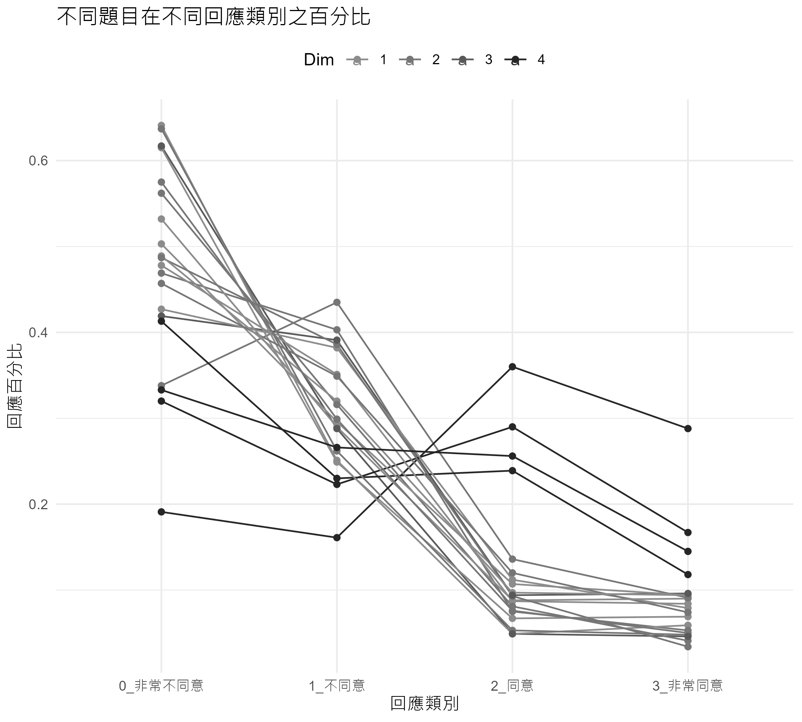
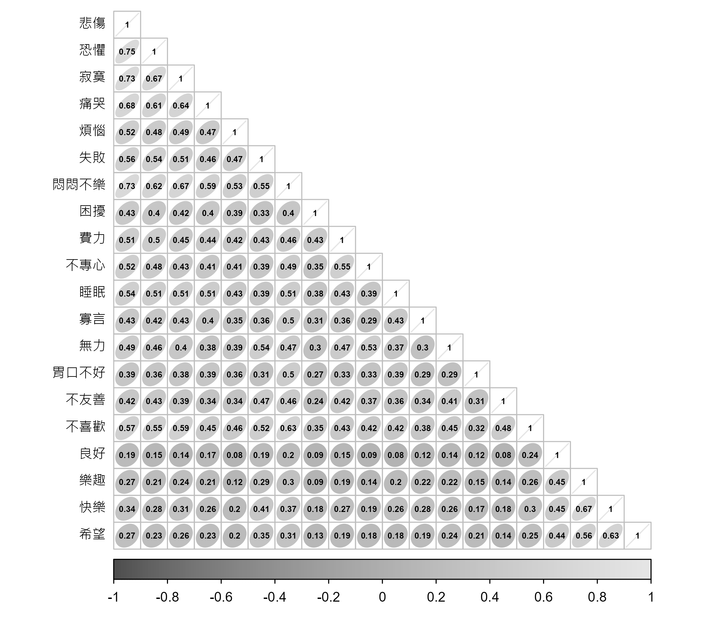
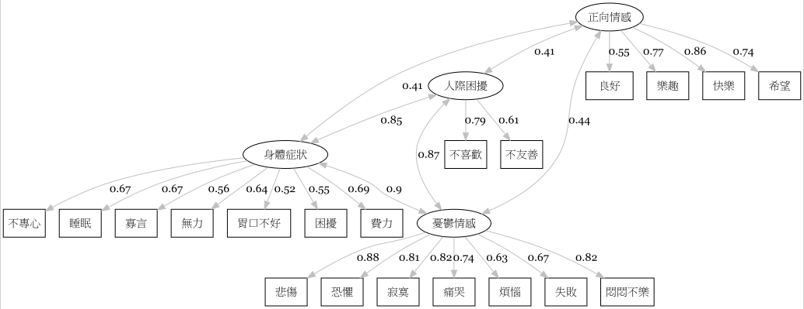
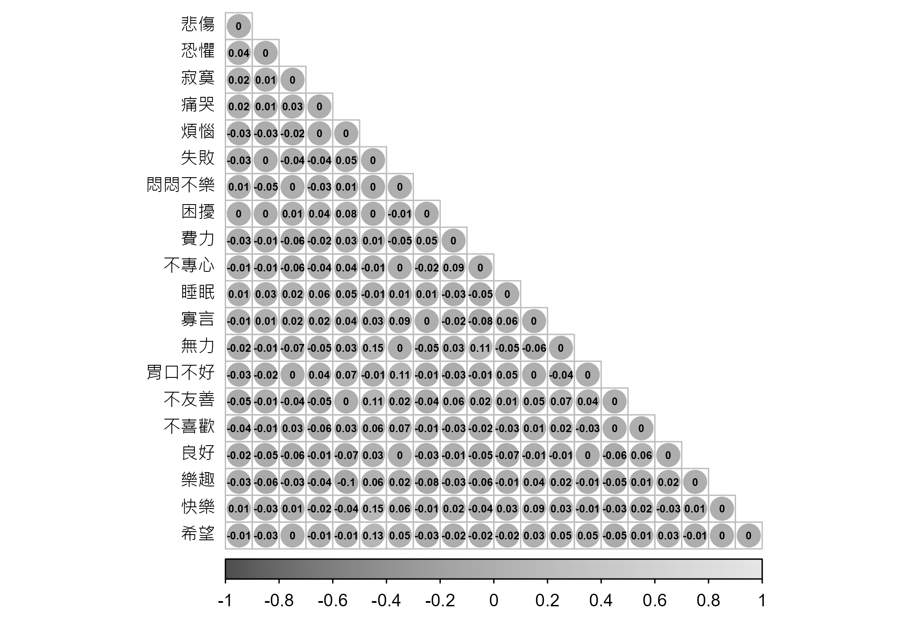

第八章: 驗證性因素分析
================
2024 二月 23

``` r
#整體設定，含載入套件
source("https://raw.githubusercontent.com/ChungPingCheng/R4BS2/main/R4BS_setup.R")
```

# 資料

``` r
#讀檔案
dta <- read.table('../Data/cesd.txt', header = TRUE, stringsAsFactors = TRUE)
```

``` r
#檢視資料
#程式報表8.1
dim(dta)
```

    [1] 1000   20

``` r
head(dta)
```

<table>
<thead>
<tr>
<th style="text-align:right;">
悲傷
</th>
<th style="text-align:right;">
恐懼
</th>
<th style="text-align:right;">
寂寞
</th>
<th style="text-align:right;">
痛哭
</th>
<th style="text-align:right;">
煩惱
</th>
<th style="text-align:right;">
失敗
</th>
<th style="text-align:right;">
悶悶不樂
</th>
<th style="text-align:right;">
困擾
</th>
<th style="text-align:right;">
費力
</th>
<th style="text-align:right;">
不專心
</th>
<th style="text-align:right;">
睡眠
</th>
<th style="text-align:right;">
寡言
</th>
<th style="text-align:right;">
無力
</th>
<th style="text-align:right;">
胃口不好
</th>
<th style="text-align:right;">
不友善
</th>
<th style="text-align:right;">
不喜歡
</th>
<th style="text-align:right;">
良好
</th>
<th style="text-align:right;">
樂趣
</th>
<th style="text-align:right;">
快樂
</th>
<th style="text-align:right;">
希望
</th>
</tr>
</thead>
<tbody>
<tr>
<td style="text-align:right;">
1
</td>
<td style="text-align:right;">
0
</td>
<td style="text-align:right;">
2
</td>
<td style="text-align:right;">
1
</td>
<td style="text-align:right;">
2
</td>
<td style="text-align:right;">
1
</td>
<td style="text-align:right;">
1
</td>
<td style="text-align:right;">
0
</td>
<td style="text-align:right;">
1
</td>
<td style="text-align:right;">
0
</td>
<td style="text-align:right;">
1
</td>
<td style="text-align:right;">
0
</td>
<td style="text-align:right;">
1
</td>
<td style="text-align:right;">
0
</td>
<td style="text-align:right;">
1
</td>
<td style="text-align:right;">
1
</td>
<td style="text-align:right;">
3
</td>
<td style="text-align:right;">
3
</td>
<td style="text-align:right;">
2
</td>
<td style="text-align:right;">
2
</td>
</tr>
<tr>
<td style="text-align:right;">
0
</td>
<td style="text-align:right;">
0
</td>
<td style="text-align:right;">
0
</td>
<td style="text-align:right;">
1
</td>
<td style="text-align:right;">
0
</td>
<td style="text-align:right;">
0
</td>
<td style="text-align:right;">
0
</td>
<td style="text-align:right;">
1
</td>
<td style="text-align:right;">
1
</td>
<td style="text-align:right;">
1
</td>
<td style="text-align:right;">
1
</td>
<td style="text-align:right;">
1
</td>
<td style="text-align:right;">
1
</td>
<td style="text-align:right;">
1
</td>
<td style="text-align:right;">
1
</td>
<td style="text-align:right;">
0
</td>
<td style="text-align:right;">
2
</td>
<td style="text-align:right;">
2
</td>
<td style="text-align:right;">
1
</td>
<td style="text-align:right;">
1
</td>
</tr>
<tr>
<td style="text-align:right;">
1
</td>
<td style="text-align:right;">
1
</td>
<td style="text-align:right;">
1
</td>
<td style="text-align:right;">
1
</td>
<td style="text-align:right;">
2
</td>
<td style="text-align:right;">
1
</td>
<td style="text-align:right;">
2
</td>
<td style="text-align:right;">
1
</td>
<td style="text-align:right;">
2
</td>
<td style="text-align:right;">
1
</td>
<td style="text-align:right;">
0
</td>
<td style="text-align:right;">
0
</td>
<td style="text-align:right;">
2
</td>
<td style="text-align:right;">
0
</td>
<td style="text-align:right;">
0
</td>
<td style="text-align:right;">
2
</td>
<td style="text-align:right;">
3
</td>
<td style="text-align:right;">
2
</td>
<td style="text-align:right;">
2
</td>
<td style="text-align:right;">
2
</td>
</tr>
<tr>
<td style="text-align:right;">
0
</td>
<td style="text-align:right;">
0
</td>
<td style="text-align:right;">
0
</td>
<td style="text-align:right;">
0
</td>
<td style="text-align:right;">
0
</td>
<td style="text-align:right;">
0
</td>
<td style="text-align:right;">
0
</td>
<td style="text-align:right;">
0
</td>
<td style="text-align:right;">
1
</td>
<td style="text-align:right;">
1
</td>
<td style="text-align:right;">
0
</td>
<td style="text-align:right;">
0
</td>
<td style="text-align:right;">
2
</td>
<td style="text-align:right;">
2
</td>
<td style="text-align:right;">
1
</td>
<td style="text-align:right;">
0
</td>
<td style="text-align:right;">
3
</td>
<td style="text-align:right;">
2
</td>
<td style="text-align:right;">
1
</td>
<td style="text-align:right;">
2
</td>
</tr>
<tr>
<td style="text-align:right;">
0
</td>
<td style="text-align:right;">
0
</td>
<td style="text-align:right;">
0
</td>
<td style="text-align:right;">
1
</td>
<td style="text-align:right;">
1
</td>
<td style="text-align:right;">
1
</td>
<td style="text-align:right;">
0
</td>
<td style="text-align:right;">
0
</td>
<td style="text-align:right;">
0
</td>
<td style="text-align:right;">
1
</td>
<td style="text-align:right;">
0
</td>
<td style="text-align:right;">
0
</td>
<td style="text-align:right;">
1
</td>
<td style="text-align:right;">
1
</td>
<td style="text-align:right;">
0
</td>
<td style="text-align:right;">
0
</td>
<td style="text-align:right;">
3
</td>
<td style="text-align:right;">
1
</td>
<td style="text-align:right;">
2
</td>
<td style="text-align:right;">
3
</td>
</tr>
<tr>
<td style="text-align:right;">
0
</td>
<td style="text-align:right;">
0
</td>
<td style="text-align:right;">
0
</td>
<td style="text-align:right;">
0
</td>
<td style="text-align:right;">
0
</td>
<td style="text-align:right;">
0
</td>
<td style="text-align:right;">
0
</td>
<td style="text-align:right;">
0
</td>
<td style="text-align:right;">
1
</td>
<td style="text-align:right;">
1
</td>
<td style="text-align:right;">
1
</td>
<td style="text-align:right;">
0
</td>
<td style="text-align:right;">
1
</td>
<td style="text-align:right;">
1
</td>
<td style="text-align:right;">
0
</td>
<td style="text-align:right;">
0
</td>
<td style="text-align:right;">
3
</td>
<td style="text-align:right;">
2
</td>
<td style="text-align:right;">
2
</td>
<td style="text-align:right;">
3
</td>
</tr>
</tbody>
</table>

# 描述統計

``` r
#資料初步看起來很多0，這邊直接看看每一題有幾個人選 0
#程式報表8.2
apply(dta, 2, function(x) sum(ifelse(x==0,1,0))) |> sort() 
```

        良好     希望     樂趣   不專心     快樂   不喜歡 悶悶不樂     無力 
         191      320      333      338      413      419      427      457 
        困擾     悲傷     費力     煩惱     寂寞     痛哭 胃口不好     寡言 
         469      478      487      489      503      532      562      575 
        失敗   不友善     睡眠     恐懼 
         615      617      637      641 

``` r
# 比較仔細地看某些題目，這邊選前兩題與倒數兩題展示
#程式報表8.3
dta |> 
  dplyr::select(c('良好', '希望', '睡眠', '恐懼')) |>
  gtsummary::tbl_summary()
```

<div id="syckuddiga" style="padding-left:0px;padding-right:0px;padding-top:10px;padding-bottom:10px;overflow-x:auto;overflow-y:auto;width:auto;height:auto;">
<style>#syckuddiga table {
  font-family: system-ui, 'Segoe UI', Roboto, Helvetica, Arial, sans-serif, 'Apple Color Emoji', 'Segoe UI Emoji', 'Segoe UI Symbol', 'Noto Color Emoji';
  -webkit-font-smoothing: antialiased;
  -moz-osx-font-smoothing: grayscale;
}
&#10;#syckuddiga thead, #syckuddiga tbody, #syckuddiga tfoot, #syckuddiga tr, #syckuddiga td, #syckuddiga th {
  border-style: none;
}
&#10;#syckuddiga p {
  margin: 0;
  padding: 0;
}
&#10;#syckuddiga .gt_table {
  display: table;
  border-collapse: collapse;
  line-height: normal;
  margin-left: auto;
  margin-right: auto;
  color: #333333;
  font-size: 16px;
  font-weight: normal;
  font-style: normal;
  background-color: #FFFFFF;
  width: auto;
  border-top-style: solid;
  border-top-width: 2px;
  border-top-color: #A8A8A8;
  border-right-style: none;
  border-right-width: 2px;
  border-right-color: #D3D3D3;
  border-bottom-style: solid;
  border-bottom-width: 2px;
  border-bottom-color: #A8A8A8;
  border-left-style: none;
  border-left-width: 2px;
  border-left-color: #D3D3D3;
}
&#10;#syckuddiga .gt_caption {
  padding-top: 4px;
  padding-bottom: 4px;
}
&#10;#syckuddiga .gt_title {
  color: #333333;
  font-size: 125%;
  font-weight: initial;
  padding-top: 4px;
  padding-bottom: 4px;
  padding-left: 5px;
  padding-right: 5px;
  border-bottom-color: #FFFFFF;
  border-bottom-width: 0;
}
&#10;#syckuddiga .gt_subtitle {
  color: #333333;
  font-size: 85%;
  font-weight: initial;
  padding-top: 3px;
  padding-bottom: 5px;
  padding-left: 5px;
  padding-right: 5px;
  border-top-color: #FFFFFF;
  border-top-width: 0;
}
&#10;#syckuddiga .gt_heading {
  background-color: #FFFFFF;
  text-align: center;
  border-bottom-color: #FFFFFF;
  border-left-style: none;
  border-left-width: 1px;
  border-left-color: #D3D3D3;
  border-right-style: none;
  border-right-width: 1px;
  border-right-color: #D3D3D3;
}
&#10;#syckuddiga .gt_bottom_border {
  border-bottom-style: solid;
  border-bottom-width: 2px;
  border-bottom-color: #D3D3D3;
}
&#10;#syckuddiga .gt_col_headings {
  border-top-style: solid;
  border-top-width: 2px;
  border-top-color: #D3D3D3;
  border-bottom-style: solid;
  border-bottom-width: 2px;
  border-bottom-color: #D3D3D3;
  border-left-style: none;
  border-left-width: 1px;
  border-left-color: #D3D3D3;
  border-right-style: none;
  border-right-width: 1px;
  border-right-color: #D3D3D3;
}
&#10;#syckuddiga .gt_col_heading {
  color: #333333;
  background-color: #FFFFFF;
  font-size: 100%;
  font-weight: normal;
  text-transform: inherit;
  border-left-style: none;
  border-left-width: 1px;
  border-left-color: #D3D3D3;
  border-right-style: none;
  border-right-width: 1px;
  border-right-color: #D3D3D3;
  vertical-align: bottom;
  padding-top: 5px;
  padding-bottom: 6px;
  padding-left: 5px;
  padding-right: 5px;
  overflow-x: hidden;
}
&#10;#syckuddiga .gt_column_spanner_outer {
  color: #333333;
  background-color: #FFFFFF;
  font-size: 100%;
  font-weight: normal;
  text-transform: inherit;
  padding-top: 0;
  padding-bottom: 0;
  padding-left: 4px;
  padding-right: 4px;
}
&#10;#syckuddiga .gt_column_spanner_outer:first-child {
  padding-left: 0;
}
&#10;#syckuddiga .gt_column_spanner_outer:last-child {
  padding-right: 0;
}
&#10;#syckuddiga .gt_column_spanner {
  border-bottom-style: solid;
  border-bottom-width: 2px;
  border-bottom-color: #D3D3D3;
  vertical-align: bottom;
  padding-top: 5px;
  padding-bottom: 5px;
  overflow-x: hidden;
  display: inline-block;
  width: 100%;
}
&#10;#syckuddiga .gt_spanner_row {
  border-bottom-style: hidden;
}
&#10;#syckuddiga .gt_group_heading {
  padding-top: 8px;
  padding-bottom: 8px;
  padding-left: 5px;
  padding-right: 5px;
  color: #333333;
  background-color: #FFFFFF;
  font-size: 100%;
  font-weight: initial;
  text-transform: inherit;
  border-top-style: solid;
  border-top-width: 2px;
  border-top-color: #D3D3D3;
  border-bottom-style: solid;
  border-bottom-width: 2px;
  border-bottom-color: #D3D3D3;
  border-left-style: none;
  border-left-width: 1px;
  border-left-color: #D3D3D3;
  border-right-style: none;
  border-right-width: 1px;
  border-right-color: #D3D3D3;
  vertical-align: middle;
  text-align: left;
}
&#10;#syckuddiga .gt_empty_group_heading {
  padding: 0.5px;
  color: #333333;
  background-color: #FFFFFF;
  font-size: 100%;
  font-weight: initial;
  border-top-style: solid;
  border-top-width: 2px;
  border-top-color: #D3D3D3;
  border-bottom-style: solid;
  border-bottom-width: 2px;
  border-bottom-color: #D3D3D3;
  vertical-align: middle;
}
&#10;#syckuddiga .gt_from_md > :first-child {
  margin-top: 0;
}
&#10;#syckuddiga .gt_from_md > :last-child {
  margin-bottom: 0;
}
&#10;#syckuddiga .gt_row {
  padding-top: 8px;
  padding-bottom: 8px;
  padding-left: 5px;
  padding-right: 5px;
  margin: 10px;
  border-top-style: solid;
  border-top-width: 1px;
  border-top-color: #D3D3D3;
  border-left-style: none;
  border-left-width: 1px;
  border-left-color: #D3D3D3;
  border-right-style: none;
  border-right-width: 1px;
  border-right-color: #D3D3D3;
  vertical-align: middle;
  overflow-x: hidden;
}
&#10;#syckuddiga .gt_stub {
  color: #333333;
  background-color: #FFFFFF;
  font-size: 100%;
  font-weight: initial;
  text-transform: inherit;
  border-right-style: solid;
  border-right-width: 2px;
  border-right-color: #D3D3D3;
  padding-left: 5px;
  padding-right: 5px;
}
&#10;#syckuddiga .gt_stub_row_group {
  color: #333333;
  background-color: #FFFFFF;
  font-size: 100%;
  font-weight: initial;
  text-transform: inherit;
  border-right-style: solid;
  border-right-width: 2px;
  border-right-color: #D3D3D3;
  padding-left: 5px;
  padding-right: 5px;
  vertical-align: top;
}
&#10;#syckuddiga .gt_row_group_first td {
  border-top-width: 2px;
}
&#10;#syckuddiga .gt_row_group_first th {
  border-top-width: 2px;
}
&#10;#syckuddiga .gt_summary_row {
  color: #333333;
  background-color: #FFFFFF;
  text-transform: inherit;
  padding-top: 8px;
  padding-bottom: 8px;
  padding-left: 5px;
  padding-right: 5px;
}
&#10;#syckuddiga .gt_first_summary_row {
  border-top-style: solid;
  border-top-color: #D3D3D3;
}
&#10;#syckuddiga .gt_first_summary_row.thick {
  border-top-width: 2px;
}
&#10;#syckuddiga .gt_last_summary_row {
  padding-top: 8px;
  padding-bottom: 8px;
  padding-left: 5px;
  padding-right: 5px;
  border-bottom-style: solid;
  border-bottom-width: 2px;
  border-bottom-color: #D3D3D3;
}
&#10;#syckuddiga .gt_grand_summary_row {
  color: #333333;
  background-color: #FFFFFF;
  text-transform: inherit;
  padding-top: 8px;
  padding-bottom: 8px;
  padding-left: 5px;
  padding-right: 5px;
}
&#10;#syckuddiga .gt_first_grand_summary_row {
  padding-top: 8px;
  padding-bottom: 8px;
  padding-left: 5px;
  padding-right: 5px;
  border-top-style: double;
  border-top-width: 6px;
  border-top-color: #D3D3D3;
}
&#10;#syckuddiga .gt_last_grand_summary_row_top {
  padding-top: 8px;
  padding-bottom: 8px;
  padding-left: 5px;
  padding-right: 5px;
  border-bottom-style: double;
  border-bottom-width: 6px;
  border-bottom-color: #D3D3D3;
}
&#10;#syckuddiga .gt_striped {
  background-color: rgba(128, 128, 128, 0.05);
}
&#10;#syckuddiga .gt_table_body {
  border-top-style: solid;
  border-top-width: 2px;
  border-top-color: #D3D3D3;
  border-bottom-style: solid;
  border-bottom-width: 2px;
  border-bottom-color: #D3D3D3;
}
&#10;#syckuddiga .gt_footnotes {
  color: #333333;
  background-color: #FFFFFF;
  border-bottom-style: none;
  border-bottom-width: 2px;
  border-bottom-color: #D3D3D3;
  border-left-style: none;
  border-left-width: 2px;
  border-left-color: #D3D3D3;
  border-right-style: none;
  border-right-width: 2px;
  border-right-color: #D3D3D3;
}
&#10;#syckuddiga .gt_footnote {
  margin: 0px;
  font-size: 90%;
  padding-top: 4px;
  padding-bottom: 4px;
  padding-left: 5px;
  padding-right: 5px;
}
&#10;#syckuddiga .gt_sourcenotes {
  color: #333333;
  background-color: #FFFFFF;
  border-bottom-style: none;
  border-bottom-width: 2px;
  border-bottom-color: #D3D3D3;
  border-left-style: none;
  border-left-width: 2px;
  border-left-color: #D3D3D3;
  border-right-style: none;
  border-right-width: 2px;
  border-right-color: #D3D3D3;
}
&#10;#syckuddiga .gt_sourcenote {
  font-size: 90%;
  padding-top: 4px;
  padding-bottom: 4px;
  padding-left: 5px;
  padding-right: 5px;
}
&#10;#syckuddiga .gt_left {
  text-align: left;
}
&#10;#syckuddiga .gt_center {
  text-align: center;
}
&#10;#syckuddiga .gt_right {
  text-align: right;
  font-variant-numeric: tabular-nums;
}
&#10;#syckuddiga .gt_font_normal {
  font-weight: normal;
}
&#10;#syckuddiga .gt_font_bold {
  font-weight: bold;
}
&#10;#syckuddiga .gt_font_italic {
  font-style: italic;
}
&#10;#syckuddiga .gt_super {
  font-size: 65%;
}
&#10;#syckuddiga .gt_footnote_marks {
  font-size: 75%;
  vertical-align: 0.4em;
  position: initial;
}
&#10;#syckuddiga .gt_asterisk {
  font-size: 100%;
  vertical-align: 0;
}
&#10;#syckuddiga .gt_indent_1 {
  text-indent: 5px;
}
&#10;#syckuddiga .gt_indent_2 {
  text-indent: 10px;
}
&#10;#syckuddiga .gt_indent_3 {
  text-indent: 15px;
}
&#10;#syckuddiga .gt_indent_4 {
  text-indent: 20px;
}
&#10;#syckuddiga .gt_indent_5 {
  text-indent: 25px;
}
</style>
<table class="gt_table" data-quarto-disable-processing="false" data-quarto-bootstrap="false">
  <thead>
    &#10;    <tr class="gt_col_headings">
      <th class="gt_col_heading gt_columns_bottom_border gt_left" rowspan="1" colspan="1" scope="col" id="&lt;strong&gt;Characteristic&lt;/strong&gt;"><strong>Characteristic</strong></th>
      <th class="gt_col_heading gt_columns_bottom_border gt_center" rowspan="1" colspan="1" scope="col" id="&lt;strong&gt;N = 1,000&lt;/strong&gt;&lt;span class=&quot;gt_footnote_marks&quot; style=&quot;white-space:nowrap;font-style:italic;font-weight:normal;&quot;&gt;&lt;sup&gt;1&lt;/sup&gt;&lt;/span&gt;"><strong>N = 1,000</strong><span class="gt_footnote_marks" style="white-space:nowrap;font-style:italic;font-weight:normal;"><sup>1</sup></span></th>
    </tr>
  </thead>
  <tbody class="gt_table_body">
    <tr><td headers="label" class="gt_row gt_left">良好</td>
<td headers="stat_0" class="gt_row gt_center"><br /></td></tr>
    <tr><td headers="label" class="gt_row gt_left">    0</td>
<td headers="stat_0" class="gt_row gt_center">191 (19%)</td></tr>
    <tr><td headers="label" class="gt_row gt_left">    1</td>
<td headers="stat_0" class="gt_row gt_center">161 (16%)</td></tr>
    <tr><td headers="label" class="gt_row gt_left">    2</td>
<td headers="stat_0" class="gt_row gt_center">360 (36%)</td></tr>
    <tr><td headers="label" class="gt_row gt_left">    3</td>
<td headers="stat_0" class="gt_row gt_center">288 (29%)</td></tr>
    <tr><td headers="label" class="gt_row gt_left">希望</td>
<td headers="stat_0" class="gt_row gt_center"><br /></td></tr>
    <tr><td headers="label" class="gt_row gt_left">    0</td>
<td headers="stat_0" class="gt_row gt_center">320 (32%)</td></tr>
    <tr><td headers="label" class="gt_row gt_left">    1</td>
<td headers="stat_0" class="gt_row gt_center">223 (22%)</td></tr>
    <tr><td headers="label" class="gt_row gt_left">    2</td>
<td headers="stat_0" class="gt_row gt_center">290 (29%)</td></tr>
    <tr><td headers="label" class="gt_row gt_left">    3</td>
<td headers="stat_0" class="gt_row gt_center">167 (17%)</td></tr>
    <tr><td headers="label" class="gt_row gt_left">睡眠</td>
<td headers="stat_0" class="gt_row gt_center"><br /></td></tr>
    <tr><td headers="label" class="gt_row gt_left">    0</td>
<td headers="stat_0" class="gt_row gt_center">637 (64%)</td></tr>
    <tr><td headers="label" class="gt_row gt_left">    1</td>
<td headers="stat_0" class="gt_row gt_center">262 (26%)</td></tr>
    <tr><td headers="label" class="gt_row gt_left">    2</td>
<td headers="stat_0" class="gt_row gt_center">53 (5.3%)</td></tr>
    <tr><td headers="label" class="gt_row gt_left">    3</td>
<td headers="stat_0" class="gt_row gt_center">48 (4.8%)</td></tr>
    <tr><td headers="label" class="gt_row gt_left">恐懼</td>
<td headers="stat_0" class="gt_row gt_center"><br /></td></tr>
    <tr><td headers="label" class="gt_row gt_left">    0</td>
<td headers="stat_0" class="gt_row gt_center">641 (64%)</td></tr>
    <tr><td headers="label" class="gt_row gt_left">    1</td>
<td headers="stat_0" class="gt_row gt_center">251 (25%)</td></tr>
    <tr><td headers="label" class="gt_row gt_left">    2</td>
<td headers="stat_0" class="gt_row gt_center">49 (4.9%)</td></tr>
    <tr><td headers="label" class="gt_row gt_left">    3</td>
<td headers="stat_0" class="gt_row gt_center">59 (5.9%)</td></tr>
  </tbody>
  &#10;  <tfoot class="gt_footnotes">
    <tr>
      <td class="gt_footnote" colspan="2"><span class="gt_footnote_marks" style="white-space:nowrap;font-style:italic;font-weight:normal;"><sup>1</sup></span> n (%)</td>
    </tr>
  </tfoot>
</table>
</div>

\##資料整理

``` r
#為更清楚地瞭解各題目在四個選項上的分布，底下進行一系列的資料整理
#目的在繪出訊息量高的圖形

#先記錄下變項名稱
#將變項名稱前面加上分量表編號與題號
#程式報表 8.4 前半
item_names <- names(dta)
names(dta) <- c(paste(101:107, item_names[1:7], sep="_"),
  paste(208:214, item_names[8:14], sep="_"),
  paste(315:316, item_names[15:16], sep="_"),
  paste(417:420, item_names[17:20], sep="_"))
head(dta)
```

<table>
<thead>
<tr>
<th style="text-align:right;">
101_悲傷
</th>
<th style="text-align:right;">
102_恐懼
</th>
<th style="text-align:right;">
103_寂寞
</th>
<th style="text-align:right;">
104_痛哭
</th>
<th style="text-align:right;">
105_煩惱
</th>
<th style="text-align:right;">
106_失敗
</th>
<th style="text-align:right;">
107_悶悶不樂
</th>
<th style="text-align:right;">
208_困擾
</th>
<th style="text-align:right;">
209_費力
</th>
<th style="text-align:right;">
210_不專心
</th>
<th style="text-align:right;">
211_睡眠
</th>
<th style="text-align:right;">
212_寡言
</th>
<th style="text-align:right;">
213_無力
</th>
<th style="text-align:right;">
214_胃口不好
</th>
<th style="text-align:right;">
315_不友善
</th>
<th style="text-align:right;">
316_不喜歡
</th>
<th style="text-align:right;">
417_良好
</th>
<th style="text-align:right;">
418_樂趣
</th>
<th style="text-align:right;">
419_快樂
</th>
<th style="text-align:right;">
420_希望
</th>
</tr>
</thead>
<tbody>
<tr>
<td style="text-align:right;">
1
</td>
<td style="text-align:right;">
0
</td>
<td style="text-align:right;">
2
</td>
<td style="text-align:right;">
1
</td>
<td style="text-align:right;">
2
</td>
<td style="text-align:right;">
1
</td>
<td style="text-align:right;">
1
</td>
<td style="text-align:right;">
0
</td>
<td style="text-align:right;">
1
</td>
<td style="text-align:right;">
0
</td>
<td style="text-align:right;">
1
</td>
<td style="text-align:right;">
0
</td>
<td style="text-align:right;">
1
</td>
<td style="text-align:right;">
0
</td>
<td style="text-align:right;">
1
</td>
<td style="text-align:right;">
1
</td>
<td style="text-align:right;">
3
</td>
<td style="text-align:right;">
3
</td>
<td style="text-align:right;">
2
</td>
<td style="text-align:right;">
2
</td>
</tr>
<tr>
<td style="text-align:right;">
0
</td>
<td style="text-align:right;">
0
</td>
<td style="text-align:right;">
0
</td>
<td style="text-align:right;">
1
</td>
<td style="text-align:right;">
0
</td>
<td style="text-align:right;">
0
</td>
<td style="text-align:right;">
0
</td>
<td style="text-align:right;">
1
</td>
<td style="text-align:right;">
1
</td>
<td style="text-align:right;">
1
</td>
<td style="text-align:right;">
1
</td>
<td style="text-align:right;">
1
</td>
<td style="text-align:right;">
1
</td>
<td style="text-align:right;">
1
</td>
<td style="text-align:right;">
1
</td>
<td style="text-align:right;">
0
</td>
<td style="text-align:right;">
2
</td>
<td style="text-align:right;">
2
</td>
<td style="text-align:right;">
1
</td>
<td style="text-align:right;">
1
</td>
</tr>
<tr>
<td style="text-align:right;">
1
</td>
<td style="text-align:right;">
1
</td>
<td style="text-align:right;">
1
</td>
<td style="text-align:right;">
1
</td>
<td style="text-align:right;">
2
</td>
<td style="text-align:right;">
1
</td>
<td style="text-align:right;">
2
</td>
<td style="text-align:right;">
1
</td>
<td style="text-align:right;">
2
</td>
<td style="text-align:right;">
1
</td>
<td style="text-align:right;">
0
</td>
<td style="text-align:right;">
0
</td>
<td style="text-align:right;">
2
</td>
<td style="text-align:right;">
0
</td>
<td style="text-align:right;">
0
</td>
<td style="text-align:right;">
2
</td>
<td style="text-align:right;">
3
</td>
<td style="text-align:right;">
2
</td>
<td style="text-align:right;">
2
</td>
<td style="text-align:right;">
2
</td>
</tr>
<tr>
<td style="text-align:right;">
0
</td>
<td style="text-align:right;">
0
</td>
<td style="text-align:right;">
0
</td>
<td style="text-align:right;">
0
</td>
<td style="text-align:right;">
0
</td>
<td style="text-align:right;">
0
</td>
<td style="text-align:right;">
0
</td>
<td style="text-align:right;">
0
</td>
<td style="text-align:right;">
1
</td>
<td style="text-align:right;">
1
</td>
<td style="text-align:right;">
0
</td>
<td style="text-align:right;">
0
</td>
<td style="text-align:right;">
2
</td>
<td style="text-align:right;">
2
</td>
<td style="text-align:right;">
1
</td>
<td style="text-align:right;">
0
</td>
<td style="text-align:right;">
3
</td>
<td style="text-align:right;">
2
</td>
<td style="text-align:right;">
1
</td>
<td style="text-align:right;">
2
</td>
</tr>
<tr>
<td style="text-align:right;">
0
</td>
<td style="text-align:right;">
0
</td>
<td style="text-align:right;">
0
</td>
<td style="text-align:right;">
1
</td>
<td style="text-align:right;">
1
</td>
<td style="text-align:right;">
1
</td>
<td style="text-align:right;">
0
</td>
<td style="text-align:right;">
0
</td>
<td style="text-align:right;">
0
</td>
<td style="text-align:right;">
1
</td>
<td style="text-align:right;">
0
</td>
<td style="text-align:right;">
0
</td>
<td style="text-align:right;">
1
</td>
<td style="text-align:right;">
1
</td>
<td style="text-align:right;">
0
</td>
<td style="text-align:right;">
0
</td>
<td style="text-align:right;">
3
</td>
<td style="text-align:right;">
1
</td>
<td style="text-align:right;">
2
</td>
<td style="text-align:right;">
3
</td>
</tr>
<tr>
<td style="text-align:right;">
0
</td>
<td style="text-align:right;">
0
</td>
<td style="text-align:right;">
0
</td>
<td style="text-align:right;">
0
</td>
<td style="text-align:right;">
0
</td>
<td style="text-align:right;">
0
</td>
<td style="text-align:right;">
0
</td>
<td style="text-align:right;">
0
</td>
<td style="text-align:right;">
1
</td>
<td style="text-align:right;">
1
</td>
<td style="text-align:right;">
1
</td>
<td style="text-align:right;">
0
</td>
<td style="text-align:right;">
1
</td>
<td style="text-align:right;">
1
</td>
<td style="text-align:right;">
0
</td>
<td style="text-align:right;">
0
</td>
<td style="text-align:right;">
3
</td>
<td style="text-align:right;">
2
</td>
<td style="text-align:right;">
2
</td>
<td style="text-align:right;">
3
</td>
</tr>
</tbody>
</table>

``` r
#改成長形資料，方便繪圖
#程式報表 8.4 後半
dtaL <- dta |> 
  tidyr::pivot_longer(everything(),
                      names_to = 'item', 
                      values_to = 'score') |>
  group_by(item) |>
  dplyr::summarise('3_非常同意' = sum(score == 3)/n(),
                   '2_同意' = sum(score == 2)/n(),
                   '1_不同意' = sum(score == 1)/n(),
                   '0_非常不同意' = sum(score == 0)/n()) |>
  tidyr::pivot_longer(-item, 
                      names_to = 'Category',
                      values_to = 'Percent') |>
  dplyr::mutate(Dim = (parse_number(item) %/% 100) |> as.factor(),
                Item = substr(item, 5, nchar(item)+4))
head(dtaL)
```

<table>
<thead>
<tr>
<th style="text-align:left;">
item
</th>
<th style="text-align:left;">
Category
</th>
<th style="text-align:right;">
Percent
</th>
<th style="text-align:left;">
Dim
</th>
<th style="text-align:left;">
Item
</th>
</tr>
</thead>
<tbody>
<tr>
<td style="text-align:left;">
101_悲傷
</td>
<td style="text-align:left;">
3_非常同意
</td>
<td style="text-align:right;">
0.084
</td>
<td style="text-align:left;">
1
</td>
<td style="text-align:left;">
悲傷
</td>
</tr>
<tr>
<td style="text-align:left;">
101_悲傷
</td>
<td style="text-align:left;">
2_同意
</td>
<td style="text-align:right;">
0.087
</td>
<td style="text-align:left;">
1
</td>
<td style="text-align:left;">
悲傷
</td>
</tr>
<tr>
<td style="text-align:left;">
101_悲傷
</td>
<td style="text-align:left;">
1_不同意
</td>
<td style="text-align:right;">
0.351
</td>
<td style="text-align:left;">
1
</td>
<td style="text-align:left;">
悲傷
</td>
</tr>
<tr>
<td style="text-align:left;">
101_悲傷
</td>
<td style="text-align:left;">
0_非常不同意
</td>
<td style="text-align:right;">
0.478
</td>
<td style="text-align:left;">
1
</td>
<td style="text-align:left;">
悲傷
</td>
</tr>
<tr>
<td style="text-align:left;">
102_恐懼
</td>
<td style="text-align:left;">
3_非常同意
</td>
<td style="text-align:right;">
0.059
</td>
<td style="text-align:left;">
1
</td>
<td style="text-align:left;">
恐懼
</td>
</tr>
<tr>
<td style="text-align:left;">
102_恐懼
</td>
<td style="text-align:left;">
2_同意
</td>
<td style="text-align:right;">
0.049
</td>
<td style="text-align:left;">
1
</td>
<td style="text-align:left;">
恐懼
</td>
</tr>
</tbody>
</table>

``` r
#因應書籍為黑白印刷，我們將圖形顏色利用 scale_color_grey 轉為灰階
#但以彩色呈現，相當有助於判讀圖形
#讀者如需觀看灰階圖形，可在 scale_color_okabe_ito 加上#，移除scale_color_grey前的#
#讀者如需觀看彩色圖形，可在 scale_color_grey 加上#，移除scale_color_okabe_ito前的#
#圖8.1
ggplot(dtaL, aes(x=Category, y=Percent, label=Item, color=Dim)) +
  geom_line(aes(group=Item)) +
  geom_point(aes(group=Item))+
  geom_text_repel(
    data          = subset(dtaL, Category == "0_Strongly Disagree"),
    force        = 0.5,
    nudge_x      = -0.2,
    direction    = "y",
    hjust        = 1,
    segment.size = 0.1)+
  scale_color_grey(start=.55, end=.15)+
  #ggokabeito::scale_color_okabe_ito() +
  labs(y="回應百分比",
       x="回應類別",
       title="不同題目在不同回應類別之百分比")+
  theme(legend.position='top')
```



``` r
#變項名字換回來
names(dta) <- item_names
```

``` r
#利用 tidySEM 套件看看偏態與峰度
#程式報表8.5
tidySEM::descriptives(dta) |> 
  dplyr::select(c('name', 'mean', 'sd', 'skew', 'kurt')) |>
  dplyr::rename(c("題目"=name, "平均"=mean, "標準差"=sd, "偏態"=skew, "峰度"=kurt)) |>
 arrange(平均) %>%
  dplyr::mutate_at(-1, list(~ round(., 3))) 
```

<table>
<thead>
<tr>
<th style="text-align:left;">
題目
</th>
<th style="text-align:right;">
平均
</th>
<th style="text-align:right;">
標準差
</th>
<th style="text-align:right;">
偏態
</th>
<th style="text-align:right;">
峰度
</th>
</tr>
</thead>
<tbody>
<tr>
<td style="text-align:left;">
睡眠
</td>
<td style="text-align:right;">
0.512
</td>
<td style="text-align:right;">
0.803
</td>
<td style="text-align:right;">
1.662
</td>
<td style="text-align:right;">
5.205
</td>
</tr>
<tr>
<td style="text-align:left;">
不友善
</td>
<td style="text-align:right;">
0.524
</td>
<td style="text-align:right;">
0.790
</td>
<td style="text-align:right;">
1.621
</td>
<td style="text-align:right;">
5.204
</td>
</tr>
<tr>
<td style="text-align:left;">
恐懼
</td>
<td style="text-align:right;">
0.526
</td>
<td style="text-align:right;">
0.838
</td>
<td style="text-align:right;">
1.675
</td>
<td style="text-align:right;">
5.090
</td>
</tr>
<tr>
<td style="text-align:left;">
失敗
</td>
<td style="text-align:right;">
0.590
</td>
<td style="text-align:right;">
0.889
</td>
<td style="text-align:right;">
1.488
</td>
<td style="text-align:right;">
4.286
</td>
</tr>
<tr>
<td style="text-align:left;">
寡言
</td>
<td style="text-align:right;">
0.601
</td>
<td style="text-align:right;">
0.832
</td>
<td style="text-align:right;">
1.377
</td>
<td style="text-align:right;">
4.241
</td>
</tr>
<tr>
<td style="text-align:left;">
胃口不好
</td>
<td style="text-align:right;">
0.601
</td>
<td style="text-align:right;">
0.805
</td>
<td style="text-align:right;">
1.316
</td>
<td style="text-align:right;">
4.169
</td>
</tr>
<tr>
<td style="text-align:left;">
費力
</td>
<td style="text-align:right;">
0.674
</td>
<td style="text-align:right;">
0.781
</td>
<td style="text-align:right;">
1.069
</td>
<td style="text-align:right;">
3.732
</td>
</tr>
<tr>
<td style="text-align:left;">
困擾
</td>
<td style="text-align:right;">
0.712
</td>
<td style="text-align:right;">
0.821
</td>
<td style="text-align:right;">
1.151
</td>
<td style="text-align:right;">
3.934
</td>
</tr>
<tr>
<td style="text-align:left;">
痛哭
</td>
<td style="text-align:right;">
0.736
</td>
<td style="text-align:right;">
0.955
</td>
<td style="text-align:right;">
1.169
</td>
<td style="text-align:right;">
3.315
</td>
</tr>
<tr>
<td style="text-align:left;">
悲傷
</td>
<td style="text-align:right;">
0.777
</td>
<td style="text-align:right;">
0.923
</td>
<td style="text-align:right;">
1.097
</td>
<td style="text-align:right;">
3.341
</td>
</tr>
<tr>
<td style="text-align:left;">
寂寞
</td>
<td style="text-align:right;">
0.792
</td>
<td style="text-align:right;">
0.971
</td>
<td style="text-align:right;">
1.041
</td>
<td style="text-align:right;">
2.994
</td>
</tr>
<tr>
<td style="text-align:left;">
煩惱
</td>
<td style="text-align:right;">
0.796
</td>
<td style="text-align:right;">
0.960
</td>
<td style="text-align:right;">
1.055
</td>
<td style="text-align:right;">
3.091
</td>
</tr>
<tr>
<td style="text-align:left;">
無力
</td>
<td style="text-align:right;">
0.811
</td>
<td style="text-align:right;">
0.915
</td>
<td style="text-align:right;">
0.961
</td>
<td style="text-align:right;">
3.048
</td>
</tr>
<tr>
<td style="text-align:left;">
悶悶不樂
</td>
<td style="text-align:right;">
0.843
</td>
<td style="text-align:right;">
0.912
</td>
<td style="text-align:right;">
0.941
</td>
<td style="text-align:right;">
3.084
</td>
</tr>
<tr>
<td style="text-align:left;">
不喜歡
</td>
<td style="text-align:right;">
0.867
</td>
<td style="text-align:right;">
0.938
</td>
<td style="text-align:right;">
0.966
</td>
<td style="text-align:right;">
3.077
</td>
</tr>
<tr>
<td style="text-align:left;">
不專心
</td>
<td style="text-align:right;">
0.980
</td>
<td style="text-align:right;">
0.916
</td>
<td style="text-align:right;">
0.752
</td>
<td style="text-align:right;">
2.814
</td>
</tr>
<tr>
<td style="text-align:left;">
快樂
</td>
<td style="text-align:right;">
1.062
</td>
<td style="text-align:right;">
1.059
</td>
<td style="text-align:right;">
0.474
</td>
<td style="text-align:right;">
1.893
</td>
</tr>
<tr>
<td style="text-align:left;">
樂趣
</td>
<td style="text-align:right;">
1.213
</td>
<td style="text-align:right;">
1.061
</td>
<td style="text-align:right;">
0.298
</td>
<td style="text-align:right;">
1.820
</td>
</tr>
<tr>
<td style="text-align:left;">
希望
</td>
<td style="text-align:right;">
1.304
</td>
<td style="text-align:right;">
1.089
</td>
<td style="text-align:right;">
0.152
</td>
<td style="text-align:right;">
1.691
</td>
</tr>
<tr>
<td style="text-align:left;">
良好
</td>
<td style="text-align:right;">
1.745
</td>
<td style="text-align:right;">
1.072
</td>
<td style="text-align:right;">
-0.412
</td>
<td style="text-align:right;">
1.925
</td>
</tr>
</tbody>
</table>

``` r
#看題目間相關
#圖8.2
corrplot(cor(dta), 
         method = 'ellipse',  type = 'lower', 
         tl.pos = 'l', tl.cex=.8, tl.col="black",
         col=gray.colors(n=200),
         addCoef.col = 'black', number.cex = .5)
```



## 因素模型

``` r
#CESD 的四因素模型
#寫法是 因素 =~ 測量指標
#
CESD.M1 <- '
 憂鬱情感 =~ 悲傷 + 恐懼 + 寂寞 + 痛哭 + 煩惱 + 失敗 + 悶悶不樂
 身體症狀 =~ 困擾 + 費力 + 不專心 + 睡眠 + 寡言 + 無力 + 胃口不好
 人際困擾 =~ 不友善 + 不喜歡
 正向情感 =~ 良好 + 樂趣 + 快樂 + 希望
'
```

``` r
#跑 CFA，要註明模型 CESD.M1 與資料名稱 dta
fit <- lavaan::cfa(CESD.M1, data = dta, std.lv = TRUE)
```

``` r
#輸出結果
#程式報表8.6, 8.7
summary(fit, fit.measures=TRUE)
```

    lavaan 0.6.16 ended normally after 34 iterations

      Estimator                                         ML
      Optimization method                           NLMINB
      Number of model parameters                        46

      Number of observations                          1000

    Model Test User Model:
                                                          
      Test statistic                               819.652
      Degrees of freedom                               164
      P-value (Chi-square)                           0.000

    Model Test Baseline Model:

      Test statistic                             10186.524
      Degrees of freedom                               190
      P-value                                        0.000

    User Model versus Baseline Model:

      Comparative Fit Index (CFI)                    0.934
      Tucker-Lewis Index (TLI)                       0.924

    Loglikelihood and Information Criteria:

      Loglikelihood user model (H0)             -21832.957
      Loglikelihood unrestricted model (H1)     -21423.131
                                                          
      Akaike (AIC)                               43757.914
      Bayesian (BIC)                             43983.670
      Sample-size adjusted Bayesian (SABIC)      43837.572

    Root Mean Square Error of Approximation:

      RMSEA                                          0.063
      90 Percent confidence interval - lower         0.059
      90 Percent confidence interval - upper         0.068
      P-value H_0: RMSEA <= 0.050                    0.000
      P-value H_0: RMSEA >= 0.080                    0.000

    Standardized Root Mean Square Residual:

      SRMR                                           0.041

    Parameter Estimates:

      Standard errors                             Standard
      Information                                 Expected
      Information saturated (h1) model          Structured

    Latent Variables:
                     Estimate  Std.Err  z-value  P(>|z|)
      憂鬱情感 =~                                       
        悲傷            0.813    0.023   34.957    0.000
        恐懼            0.679    0.022   30.687    0.000
        寂寞            0.792    0.026   30.913    0.000
        痛哭            0.710    0.026   27.044    0.000
        煩惱            0.601    0.028   21.507    0.000
        失敗            0.595    0.025   23.420    0.000
        悶悶不樂        0.752    0.024   31.468    0.000
      身體症狀 =~                                       
        困擾            0.450    0.025   17.806    0.000
        費力            0.538    0.023   23.680    0.000
        不專心          0.609    0.027   22.647    0.000
        睡眠            0.534    0.024   22.641    0.000
        寡言            0.463    0.026   18.122    0.000
        無力            0.584    0.027   21.454    0.000
        胃口不好        0.420    0.025   16.783    0.000
      人際困擾 =~                                       
        不友善          0.483    0.025   19.484    0.000
        不喜歡          0.736    0.029   25.116    0.000
      正向情感 =~                                       
        良好            0.589    0.034   17.556    0.000
        樂趣            0.821    0.030   27.068    0.000
        快樂            0.910    0.029   31.187    0.000
        希望            0.801    0.032   25.323    0.000

    Covariances:
                   Estimate  Std.Err  z-value  P(>|z|)
      憂鬱情感 ~~                                     
        身體症狀      0.903    0.012   76.941    0.000
        人際困擾      0.871    0.021   40.757    0.000
        正向情感      0.440    0.030   14.889    0.000
      身體症狀 ~~                                     
        人際困擾      0.854    0.025   34.843    0.000
        正向情感      0.406    0.033   12.384    0.000
      人際困擾 ~~                                     
        正向情感      0.412    0.037   11.282    0.000

    Variances:
                     Estimate  Std.Err  z-value  P(>|z|)
       .悲傷            0.191    0.011   17.139    0.000
       .恐懼            0.240    0.012   19.469    0.000
       .寂寞            0.316    0.016   19.384    0.000
       .痛哭            0.406    0.020   20.507    0.000
       .煩惱            0.560    0.026   21.402    0.000
       .失敗            0.436    0.021   21.154    0.000
       .悶悶不樂        0.265    0.014   19.163    0.000
       .困擾            0.471    0.022   21.122    0.000
       .費力            0.320    0.016   19.699    0.000
       .不專心          0.466    0.023   20.026    0.000
       .睡眠            0.358    0.018   20.027    0.000
       .寡言            0.478    0.023   21.067    0.000
       .無力            0.496    0.024   20.355    0.000
       .胃口不好        0.472    0.022   21.287    0.000
       .不友善          0.390    0.020   19.377    0.000
       .不喜歡          0.337    0.028   12.139    0.000
       .良好            0.802    0.039   20.754    0.000
       .樂趣            0.450    0.028   16.302    0.000
       .快樂            0.291    0.026   11.382    0.000
       .希望            0.544    0.031   17.714    0.000
        憂鬱情感        1.000                           
        身體症狀        1.000                           
        人際困擾        1.000                           
        正向情感        1.000                           

``` r
# 看卡方值與常用適合度指標，以及主要估計值
#程式報表8.8前
fit |> fitMeasures(c("chisq", "df", "pvalue", "rmsea","srmr","cfi", "tli"))
```

      chisq      df  pvalue   rmsea    srmr     cfi     tli 
    819.652 164.000   0.000   0.063   0.041   0.934   0.924 

``` r
#程式報表8.8後
fit |> parameterestimates() |>
  filter(op== "=~" | (op == "~~" & !(lhs %in% names(dta)) & lhs!=rhs)) 
```

<table>
<thead>
<tr>
<th style="text-align:left;">
lhs
</th>
<th style="text-align:left;">
op
</th>
<th style="text-align:left;">
rhs
</th>
<th style="text-align:right;">
est
</th>
<th style="text-align:right;">
se
</th>
<th style="text-align:right;">
z
</th>
<th style="text-align:right;">
pvalue
</th>
<th style="text-align:right;">
ci.lower
</th>
<th style="text-align:right;">
ci.upper
</th>
</tr>
</thead>
<tbody>
<tr>
<td style="text-align:left;">
憂鬱情感
</td>
<td style="text-align:left;">
=~
</td>
<td style="text-align:left;">
悲傷
</td>
<td style="text-align:right;">
0.8126
</td>
<td style="text-align:right;">
0.0232
</td>
<td style="text-align:right;">
34.96
</td>
<td style="text-align:right;">
0
</td>
<td style="text-align:right;">
0.7671
</td>
<td style="text-align:right;">
0.8582
</td>
</tr>
<tr>
<td style="text-align:left;">
憂鬱情感
</td>
<td style="text-align:left;">
=~
</td>
<td style="text-align:left;">
恐懼
</td>
<td style="text-align:right;">
0.6795
</td>
<td style="text-align:right;">
0.0221
</td>
<td style="text-align:right;">
30.69
</td>
<td style="text-align:right;">
0
</td>
<td style="text-align:right;">
0.6361
</td>
<td style="text-align:right;">
0.7229
</td>
</tr>
<tr>
<td style="text-align:left;">
憂鬱情感
</td>
<td style="text-align:left;">
=~
</td>
<td style="text-align:left;">
寂寞
</td>
<td style="text-align:right;">
0.7916
</td>
<td style="text-align:right;">
0.0256
</td>
<td style="text-align:right;">
30.91
</td>
<td style="text-align:right;">
0
</td>
<td style="text-align:right;">
0.7414
</td>
<td style="text-align:right;">
0.8418
</td>
</tr>
<tr>
<td style="text-align:left;">
憂鬱情感
</td>
<td style="text-align:left;">
=~
</td>
<td style="text-align:left;">
痛哭
</td>
<td style="text-align:right;">
0.7100
</td>
<td style="text-align:right;">
0.0263
</td>
<td style="text-align:right;">
27.04
</td>
<td style="text-align:right;">
0
</td>
<td style="text-align:right;">
0.6585
</td>
<td style="text-align:right;">
0.7614
</td>
</tr>
<tr>
<td style="text-align:left;">
憂鬱情感
</td>
<td style="text-align:left;">
=~
</td>
<td style="text-align:left;">
煩惱
</td>
<td style="text-align:right;">
0.6006
</td>
<td style="text-align:right;">
0.0279
</td>
<td style="text-align:right;">
21.51
</td>
<td style="text-align:right;">
0
</td>
<td style="text-align:right;">
0.5458
</td>
<td style="text-align:right;">
0.6553
</td>
</tr>
<tr>
<td style="text-align:left;">
憂鬱情感
</td>
<td style="text-align:left;">
=~
</td>
<td style="text-align:left;">
失敗
</td>
<td style="text-align:right;">
0.5946
</td>
<td style="text-align:right;">
0.0254
</td>
<td style="text-align:right;">
23.42
</td>
<td style="text-align:right;">
0
</td>
<td style="text-align:right;">
0.5449
</td>
<td style="text-align:right;">
0.6444
</td>
</tr>
<tr>
<td style="text-align:left;">
憂鬱情感
</td>
<td style="text-align:left;">
=~
</td>
<td style="text-align:left;">
悶悶不樂
</td>
<td style="text-align:right;">
0.7516
</td>
<td style="text-align:right;">
0.0239
</td>
<td style="text-align:right;">
31.47
</td>
<td style="text-align:right;">
0
</td>
<td style="text-align:right;">
0.7048
</td>
<td style="text-align:right;">
0.7984
</td>
</tr>
<tr>
<td style="text-align:left;">
身體症狀
</td>
<td style="text-align:left;">
=~
</td>
<td style="text-align:left;">
困擾
</td>
<td style="text-align:right;">
0.4498
</td>
<td style="text-align:right;">
0.0253
</td>
<td style="text-align:right;">
17.81
</td>
<td style="text-align:right;">
0
</td>
<td style="text-align:right;">
0.4003
</td>
<td style="text-align:right;">
0.4993
</td>
</tr>
<tr>
<td style="text-align:left;">
身體症狀
</td>
<td style="text-align:left;">
=~
</td>
<td style="text-align:left;">
費力
</td>
<td style="text-align:right;">
0.5380
</td>
<td style="text-align:right;">
0.0227
</td>
<td style="text-align:right;">
23.68
</td>
<td style="text-align:right;">
0
</td>
<td style="text-align:right;">
0.4934
</td>
<td style="text-align:right;">
0.5825
</td>
</tr>
<tr>
<td style="text-align:left;">
身體症狀
</td>
<td style="text-align:left;">
=~
</td>
<td style="text-align:left;">
不專心
</td>
<td style="text-align:right;">
0.6094
</td>
<td style="text-align:right;">
0.0269
</td>
<td style="text-align:right;">
22.65
</td>
<td style="text-align:right;">
0
</td>
<td style="text-align:right;">
0.5567
</td>
<td style="text-align:right;">
0.6622
</td>
</tr>
<tr>
<td style="text-align:left;">
身體症狀
</td>
<td style="text-align:left;">
=~
</td>
<td style="text-align:left;">
睡眠
</td>
<td style="text-align:right;">
0.5342
</td>
<td style="text-align:right;">
0.0236
</td>
<td style="text-align:right;">
22.64
</td>
<td style="text-align:right;">
0
</td>
<td style="text-align:right;">
0.4880
</td>
<td style="text-align:right;">
0.5804
</td>
</tr>
<tr>
<td style="text-align:left;">
身體症狀
</td>
<td style="text-align:left;">
=~
</td>
<td style="text-align:left;">
寡言
</td>
<td style="text-align:right;">
0.4628
</td>
<td style="text-align:right;">
0.0255
</td>
<td style="text-align:right;">
18.12
</td>
<td style="text-align:right;">
0
</td>
<td style="text-align:right;">
0.4127
</td>
<td style="text-align:right;">
0.5128
</td>
</tr>
<tr>
<td style="text-align:left;">
身體症狀
</td>
<td style="text-align:left;">
=~
</td>
<td style="text-align:left;">
無力
</td>
<td style="text-align:right;">
0.5841
</td>
<td style="text-align:right;">
0.0272
</td>
<td style="text-align:right;">
21.45
</td>
<td style="text-align:right;">
0
</td>
<td style="text-align:right;">
0.5307
</td>
<td style="text-align:right;">
0.6375
</td>
</tr>
<tr>
<td style="text-align:left;">
身體症狀
</td>
<td style="text-align:left;">
=~
</td>
<td style="text-align:left;">
胃口不好
</td>
<td style="text-align:right;">
0.4196
</td>
<td style="text-align:right;">
0.0250
</td>
<td style="text-align:right;">
16.78
</td>
<td style="text-align:right;">
0
</td>
<td style="text-align:right;">
0.3706
</td>
<td style="text-align:right;">
0.4686
</td>
</tr>
<tr>
<td style="text-align:left;">
人際困擾
</td>
<td style="text-align:left;">
=~
</td>
<td style="text-align:left;">
不友善
</td>
<td style="text-align:right;">
0.4831
</td>
<td style="text-align:right;">
0.0248
</td>
<td style="text-align:right;">
19.48
</td>
<td style="text-align:right;">
0
</td>
<td style="text-align:right;">
0.4345
</td>
<td style="text-align:right;">
0.5317
</td>
</tr>
<tr>
<td style="text-align:left;">
人際困擾
</td>
<td style="text-align:left;">
=~
</td>
<td style="text-align:left;">
不喜歡
</td>
<td style="text-align:right;">
0.7363
</td>
<td style="text-align:right;">
0.0293
</td>
<td style="text-align:right;">
25.12
</td>
<td style="text-align:right;">
0
</td>
<td style="text-align:right;">
0.6788
</td>
<td style="text-align:right;">
0.7937
</td>
</tr>
<tr>
<td style="text-align:left;">
正向情感
</td>
<td style="text-align:left;">
=~
</td>
<td style="text-align:left;">
良好
</td>
<td style="text-align:right;">
0.5886
</td>
<td style="text-align:right;">
0.0335
</td>
<td style="text-align:right;">
17.56
</td>
<td style="text-align:right;">
0
</td>
<td style="text-align:right;">
0.5229
</td>
<td style="text-align:right;">
0.6543
</td>
</tr>
<tr>
<td style="text-align:left;">
正向情感
</td>
<td style="text-align:left;">
=~
</td>
<td style="text-align:left;">
樂趣
</td>
<td style="text-align:right;">
0.8207
</td>
<td style="text-align:right;">
0.0303
</td>
<td style="text-align:right;">
27.07
</td>
<td style="text-align:right;">
0
</td>
<td style="text-align:right;">
0.7613
</td>
<td style="text-align:right;">
0.8801
</td>
</tr>
<tr>
<td style="text-align:left;">
正向情感
</td>
<td style="text-align:left;">
=~
</td>
<td style="text-align:left;">
快樂
</td>
<td style="text-align:right;">
0.9104
</td>
<td style="text-align:right;">
0.0292
</td>
<td style="text-align:right;">
31.19
</td>
<td style="text-align:right;">
0
</td>
<td style="text-align:right;">
0.8532
</td>
<td style="text-align:right;">
0.9676
</td>
</tr>
<tr>
<td style="text-align:left;">
正向情感
</td>
<td style="text-align:left;">
=~
</td>
<td style="text-align:left;">
希望
</td>
<td style="text-align:right;">
0.8012
</td>
<td style="text-align:right;">
0.0316
</td>
<td style="text-align:right;">
25.32
</td>
<td style="text-align:right;">
0
</td>
<td style="text-align:right;">
0.7392
</td>
<td style="text-align:right;">
0.8633
</td>
</tr>
<tr>
<td style="text-align:left;">
憂鬱情感
</td>
<td style="text-align:left;">
\~~
</td>
<td style="text-align:left;">
身體症狀
</td>
<td style="text-align:right;">
0.9027
</td>
<td style="text-align:right;">
0.0117
</td>
<td style="text-align:right;">
76.94
</td>
<td style="text-align:right;">
0
</td>
<td style="text-align:right;">
0.8797
</td>
<td style="text-align:right;">
0.9257
</td>
</tr>
<tr>
<td style="text-align:left;">
憂鬱情感
</td>
<td style="text-align:left;">
\~~
</td>
<td style="text-align:left;">
人際困擾
</td>
<td style="text-align:right;">
0.8712
</td>
<td style="text-align:right;">
0.0214
</td>
<td style="text-align:right;">
40.76
</td>
<td style="text-align:right;">
0
</td>
<td style="text-align:right;">
0.8293
</td>
<td style="text-align:right;">
0.9131
</td>
</tr>
<tr>
<td style="text-align:left;">
憂鬱情感
</td>
<td style="text-align:left;">
\~~
</td>
<td style="text-align:left;">
正向情感
</td>
<td style="text-align:right;">
0.4396
</td>
<td style="text-align:right;">
0.0295
</td>
<td style="text-align:right;">
14.89
</td>
<td style="text-align:right;">
0
</td>
<td style="text-align:right;">
0.3818
</td>
<td style="text-align:right;">
0.4975
</td>
</tr>
<tr>
<td style="text-align:left;">
身體症狀
</td>
<td style="text-align:left;">
\~~
</td>
<td style="text-align:left;">
人際困擾
</td>
<td style="text-align:right;">
0.8544
</td>
<td style="text-align:right;">
0.0245
</td>
<td style="text-align:right;">
34.84
</td>
<td style="text-align:right;">
0
</td>
<td style="text-align:right;">
0.8063
</td>
<td style="text-align:right;">
0.9024
</td>
</tr>
<tr>
<td style="text-align:left;">
身體症狀
</td>
<td style="text-align:left;">
\~~
</td>
<td style="text-align:left;">
正向情感
</td>
<td style="text-align:right;">
0.4057
</td>
<td style="text-align:right;">
0.0328
</td>
<td style="text-align:right;">
12.38
</td>
<td style="text-align:right;">
0
</td>
<td style="text-align:right;">
0.3415
</td>
<td style="text-align:right;">
0.4700
</td>
</tr>
<tr>
<td style="text-align:left;">
人際困擾
</td>
<td style="text-align:left;">
\~~
</td>
<td style="text-align:left;">
正向情感
</td>
<td style="text-align:right;">
0.4124
</td>
<td style="text-align:right;">
0.0366
</td>
<td style="text-align:right;">
11.28
</td>
<td style="text-align:right;">
0
</td>
<td style="text-align:right;">
0.3408
</td>
<td style="text-align:right;">
0.4841
</td>
</tr>
</tbody>
</table>

``` r
#繪製路徑圖
#圖8.3
pl_01 <- lavaanPlot::lavaanPlot(model = fit,
                       edge_options = list(color = "grey"), 
                       coefs = TRUE,
                       stand = TRUE,
                       covs = TRUE)
#將圖存為 .png
dir.create(file.path(here::here()), 'figure')
lavaanPlot::save_png(pl_01, "figure/plot_01.png")
```

``` r

```


## Residuals correlation matrix

``` r
# extract residuals of correlation matrix
#圖8.4
residuals(fit, type='cor') |> purrr::pluck("cov") |>
corrplot(method = 'ellipse',  type = 'lower', 
         tl.pos = 'l', tl.cex=.8, tl.col="black",
         col=gray.colors(n=200),
         addCoef.col = 'black', number.cex = .5)
```



## 構念信度、題目信度

``` r
#計算各分量表的 Cronbach alpha, CR(omega), AVE
#程式報表8.9
fit |> 
  semTools::reliability() |> 
  as.data.frame() |> 
  dplyr::slice(c(1,2,5)) |> 
  round(3)
```

<table>
<thead>
<tr>
<th style="text-align:left;">
</th>
<th style="text-align:right;">
憂鬱情感
</th>
<th style="text-align:right;">
身體症狀
</th>
<th style="text-align:right;">
人際困擾
</th>
<th style="text-align:right;">
正向情感
</th>
</tr>
</thead>
<tbody>
<tr>
<td style="text-align:left;">
alpha
</td>
<td style="text-align:right;">
0.907
</td>
<td style="text-align:right;">
0.804
</td>
<td style="text-align:right;">
0.643
</td>
<td style="text-align:right;">
0.819
</td>
</tr>
<tr>
<td style="text-align:left;">
omega
</td>
<td style="text-align:right;">
0.910
</td>
<td style="text-align:right;">
0.809
</td>
<td style="text-align:right;">
0.672
</td>
<td style="text-align:right;">
0.824
</td>
</tr>
<tr>
<td style="text-align:left;">
avevar
</td>
<td style="text-align:right;">
0.594
</td>
<td style="text-align:right;">
0.380
</td>
<td style="text-align:right;">
0.516
</td>
<td style="text-align:right;">
0.544
</td>
</tr>
</tbody>
</table>

``` r
# 計算題目信度
#程式報表8.10
fit |> 
  standardizedSolution() |> 
  filter(op == "~~" & lhs %in% names(dta)) |> 
  select(item=lhs,error_variance=est.std) |> 
  mutate(item_reliability = 1-error_variance)
```

<table>
<thead>
<tr>
<th style="text-align:left;">
item
</th>
<th style="text-align:right;">
error_variance
</th>
<th style="text-align:right;">
item_reliability
</th>
</tr>
</thead>
<tbody>
<tr>
<td style="text-align:left;">
悲傷
</td>
<td style="text-align:right;">
0.2242
</td>
<td style="text-align:right;">
0.7758
</td>
</tr>
<tr>
<td style="text-align:left;">
恐懼
</td>
<td style="text-align:right;">
0.3417
</td>
<td style="text-align:right;">
0.6583
</td>
</tr>
<tr>
<td style="text-align:left;">
寂寞
</td>
<td style="text-align:right;">
0.3353
</td>
<td style="text-align:right;">
0.6647
</td>
</tr>
<tr>
<td style="text-align:left;">
痛哭
</td>
<td style="text-align:right;">
0.4463
</td>
<td style="text-align:right;">
0.5537
</td>
</tr>
<tr>
<td style="text-align:left;">
煩惱
</td>
<td style="text-align:right;">
0.6081
</td>
<td style="text-align:right;">
0.3919
</td>
</tr>
<tr>
<td style="text-align:left;">
失敗
</td>
<td style="text-align:right;">
0.5523
</td>
<td style="text-align:right;">
0.4477
</td>
</tr>
<tr>
<td style="text-align:left;">
悶悶不樂
</td>
<td style="text-align:right;">
0.3197
</td>
<td style="text-align:right;">
0.6803
</td>
</tr>
<tr>
<td style="text-align:left;">
困擾
</td>
<td style="text-align:right;">
0.6994
</td>
<td style="text-align:right;">
0.3006
</td>
</tr>
<tr>
<td style="text-align:left;">
費力
</td>
<td style="text-align:right;">
0.5253
</td>
<td style="text-align:right;">
0.4747
</td>
</tr>
<tr>
<td style="text-align:left;">
不專心
</td>
<td style="text-align:right;">
0.5566
</td>
<td style="text-align:right;">
0.4434
</td>
</tr>
<tr>
<td style="text-align:left;">
睡眠
</td>
<td style="text-align:right;">
0.5568
</td>
<td style="text-align:right;">
0.4432
</td>
</tr>
<tr>
<td style="text-align:left;">
寡言
</td>
<td style="text-align:right;">
0.6904
</td>
<td style="text-align:right;">
0.3096
</td>
</tr>
<tr>
<td style="text-align:left;">
無力
</td>
<td style="text-align:right;">
0.5925
</td>
<td style="text-align:right;">
0.4075
</td>
</tr>
<tr>
<td style="text-align:left;">
胃口不好
</td>
<td style="text-align:right;">
0.7282
</td>
<td style="text-align:right;">
0.2718
</td>
</tr>
<tr>
<td style="text-align:left;">
不友善
</td>
<td style="text-align:right;">
0.6256
</td>
<td style="text-align:right;">
0.3744
</td>
</tr>
<tr>
<td style="text-align:left;">
不喜歡
</td>
<td style="text-align:right;">
0.3835
</td>
<td style="text-align:right;">
0.6165
</td>
</tr>
<tr>
<td style="text-align:left;">
良好
</td>
<td style="text-align:right;">
0.6982
</td>
<td style="text-align:right;">
0.3018
</td>
</tr>
<tr>
<td style="text-align:left;">
樂趣
</td>
<td style="text-align:right;">
0.4005
</td>
<td style="text-align:right;">
0.5995
</td>
</tr>
<tr>
<td style="text-align:left;">
快樂
</td>
<td style="text-align:right;">
0.2601
</td>
<td style="text-align:right;">
0.7399
</td>
</tr>
<tr>
<td style="text-align:left;">
希望
</td>
<td style="text-align:right;">
0.4585
</td>
<td style="text-align:right;">
0.5415
</td>
</tr>
</tbody>
</table>

## 修正模型

``` r
## 驗證CESD 四因素模型，發現適合度需改善，擬利用修改指標
## 修正模型。
## 由於考慮做交叉驗證（cross-validation），把資料切成兩個樣
## 本，一個拿來做調校樣本（calibration sample），一個拿來做
## 交叉驗證樣本。
```

``` r
#讀檔
dta <- read.table('../Data/cesd.txt', header = TRUE, stringsAsFactors = TRUE)
```

``` r
#隨機分成兩組、分別是 dat0(調校樣本)與 dat1(交叉驗證樣本) 
#set.seed 是隨機種子，可以自由設定數值
#固定隨機種子可以讓每次分組相同，分析相同分組資料
#如果沒用這個指令，每次執行時，隨機分組都會不同
set.seed(20230824)
id0 <- sample(nrow(dta), nrow(dta)/2)
dta0 <- dta[id0,]
dta1 <- dta[-id0,]
```

``` r
#原始模型
CESD.M1 <- '
憂鬱情感=~悲傷+恐懼+寂寞+痛哭+煩惱+失敗+悶悶不樂
身體症狀=~困擾+費力+不專心+睡眠+寡言+無力+胃口不好
人際困擾=~不友善+不喜歡
正向情感=~良好+樂趣+快樂+希望'
```

``` r
#看一下配適結果
fit0 <- cfa(CESD.M1, data=dta0, std.lv=TRUE)
#summary(fit0, fit.measures=TRUE)
#程式報表8.11前後
fit0 |> fitMeasures(c("chisq", "df", "pvalue", "rmsea","srmr","cfi", "tli"))
```

      chisq      df  pvalue   rmsea    srmr     cfi     tli 
    561.878 164.000   0.000   0.070   0.047   0.920   0.907 

``` r
fit0 |> parameterestimates() |>
  filter(op== "=~" | (op == "~~" & !(lhs %in% names(dta)) & lhs!=rhs)) 
```

<table>
<thead>
<tr>
<th style="text-align:left;">
lhs
</th>
<th style="text-align:left;">
op
</th>
<th style="text-align:left;">
rhs
</th>
<th style="text-align:right;">
est
</th>
<th style="text-align:right;">
se
</th>
<th style="text-align:right;">
z
</th>
<th style="text-align:right;">
pvalue
</th>
<th style="text-align:right;">
ci.lower
</th>
<th style="text-align:right;">
ci.upper
</th>
</tr>
</thead>
<tbody>
<tr>
<td style="text-align:left;">
憂鬱情感
</td>
<td style="text-align:left;">
=~
</td>
<td style="text-align:left;">
悲傷
</td>
<td style="text-align:right;">
0.8072
</td>
<td style="text-align:right;">
0.0330
</td>
<td style="text-align:right;">
24.461
</td>
<td style="text-align:right;">
0
</td>
<td style="text-align:right;">
0.7425
</td>
<td style="text-align:right;">
0.8719
</td>
</tr>
<tr>
<td style="text-align:left;">
憂鬱情感
</td>
<td style="text-align:left;">
=~
</td>
<td style="text-align:left;">
恐懼
</td>
<td style="text-align:right;">
0.6937
</td>
<td style="text-align:right;">
0.0324
</td>
<td style="text-align:right;">
21.409
</td>
<td style="text-align:right;">
0
</td>
<td style="text-align:right;">
0.6302
</td>
<td style="text-align:right;">
0.7572
</td>
</tr>
<tr>
<td style="text-align:left;">
憂鬱情感
</td>
<td style="text-align:left;">
=~
</td>
<td style="text-align:left;">
寂寞
</td>
<td style="text-align:right;">
0.8081
</td>
<td style="text-align:right;">
0.0372
</td>
<td style="text-align:right;">
21.748
</td>
<td style="text-align:right;">
0
</td>
<td style="text-align:right;">
0.7353
</td>
<td style="text-align:right;">
0.8809
</td>
</tr>
<tr>
<td style="text-align:left;">
憂鬱情感
</td>
<td style="text-align:left;">
=~
</td>
<td style="text-align:left;">
痛哭
</td>
<td style="text-align:right;">
0.7201
</td>
<td style="text-align:right;">
0.0376
</td>
<td style="text-align:right;">
19.136
</td>
<td style="text-align:right;">
0
</td>
<td style="text-align:right;">
0.6464
</td>
<td style="text-align:right;">
0.7939
</td>
</tr>
<tr>
<td style="text-align:left;">
憂鬱情感
</td>
<td style="text-align:left;">
=~
</td>
<td style="text-align:left;">
煩惱
</td>
<td style="text-align:right;">
0.5925
</td>
<td style="text-align:right;">
0.0402
</td>
<td style="text-align:right;">
14.733
</td>
<td style="text-align:right;">
0
</td>
<td style="text-align:right;">
0.5137
</td>
<td style="text-align:right;">
0.6714
</td>
</tr>
<tr>
<td style="text-align:left;">
憂鬱情感
</td>
<td style="text-align:left;">
=~
</td>
<td style="text-align:left;">
失敗
</td>
<td style="text-align:right;">
0.5865
</td>
<td style="text-align:right;">
0.0360
</td>
<td style="text-align:right;">
16.274
</td>
<td style="text-align:right;">
0
</td>
<td style="text-align:right;">
0.5159
</td>
<td style="text-align:right;">
0.6571
</td>
</tr>
<tr>
<td style="text-align:left;">
憂鬱情感
</td>
<td style="text-align:left;">
=~
</td>
<td style="text-align:left;">
悶悶不樂
</td>
<td style="text-align:right;">
0.7271
</td>
<td style="text-align:right;">
0.0339
</td>
<td style="text-align:right;">
21.428
</td>
<td style="text-align:right;">
0
</td>
<td style="text-align:right;">
0.6606
</td>
<td style="text-align:right;">
0.7936
</td>
</tr>
<tr>
<td style="text-align:left;">
身體症狀
</td>
<td style="text-align:left;">
=~
</td>
<td style="text-align:left;">
困擾
</td>
<td style="text-align:right;">
0.4591
</td>
<td style="text-align:right;">
0.0353
</td>
<td style="text-align:right;">
12.991
</td>
<td style="text-align:right;">
0
</td>
<td style="text-align:right;">
0.3898
</td>
<td style="text-align:right;">
0.5284
</td>
</tr>
<tr>
<td style="text-align:left;">
身體症狀
</td>
<td style="text-align:left;">
=~
</td>
<td style="text-align:left;">
費力
</td>
<td style="text-align:right;">
0.5192
</td>
<td style="text-align:right;">
0.0319
</td>
<td style="text-align:right;">
16.258
</td>
<td style="text-align:right;">
0
</td>
<td style="text-align:right;">
0.4566
</td>
<td style="text-align:right;">
0.5818
</td>
</tr>
<tr>
<td style="text-align:left;">
身體症狀
</td>
<td style="text-align:left;">
=~
</td>
<td style="text-align:left;">
不專心
</td>
<td style="text-align:right;">
0.5941
</td>
<td style="text-align:right;">
0.0376
</td>
<td style="text-align:right;">
15.798
</td>
<td style="text-align:right;">
0
</td>
<td style="text-align:right;">
0.5204
</td>
<td style="text-align:right;">
0.6678
</td>
</tr>
<tr>
<td style="text-align:left;">
身體症狀
</td>
<td style="text-align:left;">
=~
</td>
<td style="text-align:left;">
睡眠
</td>
<td style="text-align:right;">
0.5303
</td>
<td style="text-align:right;">
0.0348
</td>
<td style="text-align:right;">
15.246
</td>
<td style="text-align:right;">
0
</td>
<td style="text-align:right;">
0.4621
</td>
<td style="text-align:right;">
0.5985
</td>
</tr>
<tr>
<td style="text-align:left;">
身體症狀
</td>
<td style="text-align:left;">
=~
</td>
<td style="text-align:left;">
寡言
</td>
<td style="text-align:right;">
0.4782
</td>
<td style="text-align:right;">
0.0371
</td>
<td style="text-align:right;">
12.887
</td>
<td style="text-align:right;">
0
</td>
<td style="text-align:right;">
0.4054
</td>
<td style="text-align:right;">
0.5509
</td>
</tr>
<tr>
<td style="text-align:left;">
身體症狀
</td>
<td style="text-align:left;">
=~
</td>
<td style="text-align:left;">
無力
</td>
<td style="text-align:right;">
0.5827
</td>
<td style="text-align:right;">
0.0382
</td>
<td style="text-align:right;">
15.264
</td>
<td style="text-align:right;">
0
</td>
<td style="text-align:right;">
0.5079
</td>
<td style="text-align:right;">
0.6576
</td>
</tr>
<tr>
<td style="text-align:left;">
身體症狀
</td>
<td style="text-align:left;">
=~
</td>
<td style="text-align:left;">
胃口不好
</td>
<td style="text-align:right;">
0.4222
</td>
<td style="text-align:right;">
0.0358
</td>
<td style="text-align:right;">
11.809
</td>
<td style="text-align:right;">
0
</td>
<td style="text-align:right;">
0.3521
</td>
<td style="text-align:right;">
0.4922
</td>
</tr>
<tr>
<td style="text-align:left;">
人際困擾
</td>
<td style="text-align:left;">
=~
</td>
<td style="text-align:left;">
不友善
</td>
<td style="text-align:right;">
0.4560
</td>
<td style="text-align:right;">
0.0359
</td>
<td style="text-align:right;">
12.697
</td>
<td style="text-align:right;">
0
</td>
<td style="text-align:right;">
0.3856
</td>
<td style="text-align:right;">
0.5264
</td>
</tr>
<tr>
<td style="text-align:left;">
人際困擾
</td>
<td style="text-align:left;">
=~
</td>
<td style="text-align:left;">
不喜歡
</td>
<td style="text-align:right;">
0.7753
</td>
<td style="text-align:right;">
0.0431
</td>
<td style="text-align:right;">
17.978
</td>
<td style="text-align:right;">
0
</td>
<td style="text-align:right;">
0.6908
</td>
<td style="text-align:right;">
0.8598
</td>
</tr>
<tr>
<td style="text-align:left;">
正向情感
</td>
<td style="text-align:left;">
=~
</td>
<td style="text-align:left;">
良好
</td>
<td style="text-align:right;">
0.5324
</td>
<td style="text-align:right;">
0.0483
</td>
<td style="text-align:right;">
11.030
</td>
<td style="text-align:right;">
0
</td>
<td style="text-align:right;">
0.4378
</td>
<td style="text-align:right;">
0.6270
</td>
</tr>
<tr>
<td style="text-align:left;">
正向情感
</td>
<td style="text-align:left;">
=~
</td>
<td style="text-align:left;">
樂趣
</td>
<td style="text-align:right;">
0.7981
</td>
<td style="text-align:right;">
0.0424
</td>
<td style="text-align:right;">
18.836
</td>
<td style="text-align:right;">
0
</td>
<td style="text-align:right;">
0.7151
</td>
<td style="text-align:right;">
0.8812
</td>
</tr>
<tr>
<td style="text-align:left;">
正向情感
</td>
<td style="text-align:left;">
=~
</td>
<td style="text-align:left;">
快樂
</td>
<td style="text-align:right;">
0.9367
</td>
<td style="text-align:right;">
0.0405
</td>
<td style="text-align:right;">
23.144
</td>
<td style="text-align:right;">
0
</td>
<td style="text-align:right;">
0.8574
</td>
<td style="text-align:right;">
1.0160
</td>
</tr>
<tr>
<td style="text-align:left;">
正向情感
</td>
<td style="text-align:left;">
=~
</td>
<td style="text-align:left;">
希望
</td>
<td style="text-align:right;">
0.8092
</td>
<td style="text-align:right;">
0.0440
</td>
<td style="text-align:right;">
18.381
</td>
<td style="text-align:right;">
0
</td>
<td style="text-align:right;">
0.7230
</td>
<td style="text-align:right;">
0.8955
</td>
</tr>
<tr>
<td style="text-align:left;">
憂鬱情感
</td>
<td style="text-align:left;">
\~~
</td>
<td style="text-align:left;">
身體症狀
</td>
<td style="text-align:right;">
0.9076
</td>
<td style="text-align:right;">
0.0166
</td>
<td style="text-align:right;">
54.688
</td>
<td style="text-align:right;">
0
</td>
<td style="text-align:right;">
0.8750
</td>
<td style="text-align:right;">
0.9401
</td>
</tr>
<tr>
<td style="text-align:left;">
憂鬱情感
</td>
<td style="text-align:left;">
\~~
</td>
<td style="text-align:left;">
人際困擾
</td>
<td style="text-align:right;">
0.8642
</td>
<td style="text-align:right;">
0.0317
</td>
<td style="text-align:right;">
27.267
</td>
<td style="text-align:right;">
0
</td>
<td style="text-align:right;">
0.8021
</td>
<td style="text-align:right;">
0.9264
</td>
</tr>
<tr>
<td style="text-align:left;">
憂鬱情感
</td>
<td style="text-align:left;">
\~~
</td>
<td style="text-align:left;">
正向情感
</td>
<td style="text-align:right;">
0.4476
</td>
<td style="text-align:right;">
0.0412
</td>
<td style="text-align:right;">
10.863
</td>
<td style="text-align:right;">
0
</td>
<td style="text-align:right;">
0.3668
</td>
<td style="text-align:right;">
0.5284
</td>
</tr>
<tr>
<td style="text-align:left;">
身體症狀
</td>
<td style="text-align:left;">
\~~
</td>
<td style="text-align:left;">
人際困擾
</td>
<td style="text-align:right;">
0.8197
</td>
<td style="text-align:right;">
0.0370
</td>
<td style="text-align:right;">
22.163
</td>
<td style="text-align:right;">
0
</td>
<td style="text-align:right;">
0.7472
</td>
<td style="text-align:right;">
0.8922
</td>
</tr>
<tr>
<td style="text-align:left;">
身體症狀
</td>
<td style="text-align:left;">
\~~
</td>
<td style="text-align:left;">
正向情感
</td>
<td style="text-align:right;">
0.4152
</td>
<td style="text-align:right;">
0.0458
</td>
<td style="text-align:right;">
9.071
</td>
<td style="text-align:right;">
0
</td>
<td style="text-align:right;">
0.3255
</td>
<td style="text-align:right;">
0.5049
</td>
</tr>
<tr>
<td style="text-align:left;">
人際困擾
</td>
<td style="text-align:left;">
\~~
</td>
<td style="text-align:left;">
正向情感
</td>
<td style="text-align:right;">
0.4970
</td>
<td style="text-align:right;">
0.0481
</td>
<td style="text-align:right;">
10.334
</td>
<td style="text-align:right;">
0
</td>
<td style="text-align:right;">
0.4027
</td>
<td style="text-align:right;">
0.5913
</td>
</tr>
</tbody>
</table>

``` r
#列出MI 最大的十個
#程式報表8.12
fit0 |> 
  modindices(maximum.number=10,sort=T)
```

<table>
<thead>
<tr>
<th style="text-align:left;">
</th>
<th style="text-align:left;">
lhs
</th>
<th style="text-align:left;">
op
</th>
<th style="text-align:left;">
rhs
</th>
<th style="text-align:right;">
mi
</th>
<th style="text-align:right;">
epc
</th>
<th style="text-align:right;">
sepc.lv
</th>
<th style="text-align:right;">
sepc.all
</th>
<th style="text-align:right;">
sepc.nox
</th>
</tr>
</thead>
<tbody>
<tr>
<td style="text-align:left;">
216
</td>
<td style="text-align:left;">
悶悶不樂
</td>
<td style="text-align:left;">
\~~
</td>
<td style="text-align:left;">
胃口不好
</td>
<td style="text-align:right;">
45.25
</td>
<td style="text-align:right;">
0.1222
</td>
<td style="text-align:right;">
0.1222
</td>
<td style="text-align:right;">
0.3290
</td>
<td style="text-align:right;">
0.3290
</td>
</tr>
<tr>
<td style="text-align:left;">
202
</td>
<td style="text-align:left;">
失敗
</td>
<td style="text-align:left;">
\~~
</td>
<td style="text-align:left;">
無力
</td>
<td style="text-align:right;">
44.71
</td>
<td style="text-align:right;">
0.1488
</td>
<td style="text-align:right;">
0.1488
</td>
<td style="text-align:right;">
0.3210
</td>
<td style="text-align:right;">
0.3210
</td>
</tr>
<tr>
<td style="text-align:left;">
100
</td>
<td style="text-align:left;">
正向情感
</td>
<td style="text-align:left;">
=~
</td>
<td style="text-align:left;">
失敗
</td>
<td style="text-align:right;">
31.41
</td>
<td style="text-align:right;">
0.2127
</td>
<td style="text-align:right;">
0.2127
</td>
<td style="text-align:right;">
0.2397
</td>
<td style="text-align:right;">
0.2397
</td>
</tr>
<tr>
<td style="text-align:left;">
82
</td>
<td style="text-align:left;">
人際困擾
</td>
<td style="text-align:left;">
=~
</td>
<td style="text-align:left;">
失敗
</td>
<td style="text-align:right;">
31.20
</td>
<td style="text-align:right;">
0.5769
</td>
<td style="text-align:right;">
0.5769
</td>
<td style="text-align:right;">
0.6499
</td>
<td style="text-align:right;">
0.6499
</td>
</tr>
<tr>
<td style="text-align:left;">
248
</td>
<td style="text-align:left;">
不專心
</td>
<td style="text-align:left;">
\~~
</td>
<td style="text-align:left;">
無力
</td>
<td style="text-align:right;">
29.74
</td>
<td style="text-align:right;">
0.1305
</td>
<td style="text-align:right;">
0.1305
</td>
<td style="text-align:right;">
0.2773
</td>
<td style="text-align:right;">
0.2773
</td>
</tr>
<tr>
<td style="text-align:left;">
83
</td>
<td style="text-align:left;">
人際困擾
</td>
<td style="text-align:left;">
=~
</td>
<td style="text-align:left;">
悶悶不樂
</td>
<td style="text-align:right;">
28.78
</td>
<td style="text-align:right;">
0.4754
</td>
<td style="text-align:right;">
0.4754
</td>
<td style="text-align:right;">
0.5265
</td>
<td style="text-align:right;">
0.5265
</td>
</tr>
<tr>
<td style="text-align:left;">
77
</td>
<td style="text-align:left;">
人際困擾
</td>
<td style="text-align:left;">
=~
</td>
<td style="text-align:left;">
悲傷
</td>
<td style="text-align:right;">
24.50
</td>
<td style="text-align:right;">
-0.4024
</td>
<td style="text-align:right;">
-0.4024
</td>
<td style="text-align:right;">
-0.4366
</td>
<td style="text-align:right;">
-0.4366
</td>
</tr>
<tr>
<td style="text-align:left;">
80
</td>
<td style="text-align:left;">
人際困擾
</td>
<td style="text-align:left;">
=~
</td>
<td style="text-align:left;">
痛哭
</td>
<td style="text-align:right;">
23.12
</td>
<td style="text-align:right;">
-0.4942
</td>
<td style="text-align:right;">
-0.4942
</td>
<td style="text-align:right;">
-0.5113
</td>
<td style="text-align:right;">
-0.5113
</td>
</tr>
<tr>
<td style="text-align:left;">
134
</td>
<td style="text-align:left;">
恐懼
</td>
<td style="text-align:left;">
\~~
</td>
<td style="text-align:left;">
悶悶不樂
</td>
<td style="text-align:right;">
18.47
</td>
<td style="text-align:right;">
-0.0626
</td>
<td style="text-align:right;">
-0.0626
</td>
<td style="text-align:right;">
-0.2285
</td>
<td style="text-align:right;">
-0.2285
</td>
</tr>
<tr>
<td style="text-align:left;">
111
</td>
<td style="text-align:left;">
悲傷
</td>
<td style="text-align:left;">
\~~
</td>
<td style="text-align:left;">
恐懼
</td>
<td style="text-align:right;">
17.66
</td>
<td style="text-align:right;">
0.0561
</td>
<td style="text-align:right;">
0.0561
</td>
<td style="text-align:right;">
0.2463
</td>
<td style="text-align:right;">
0.2463
</td>
</tr>
</tbody>
</table>

``` r
#修改模型，加入「悶悶不樂~~胃口不好」，即兩者測量誤差間共變
CESD.M1 <- '
憂鬱情緒=~悲傷+恐懼+寂寞+痛哭+煩惱+失敗+悶悶不樂
身體問題=~困擾+費力+不專心+睡眠+寡言+無力+胃口不好
人際困擾=~不友善+不喜歡
正向情緒=~良好+樂趣+快樂+希望
悶悶不樂~~胃口不好'
```

``` r
#配適看看。
fit0 <- cfa(CESD.M1, data=dta0, std.lv=TRUE)
#summary(fit0, fit.measures=TRUE)
#程式報表8.13前後
fit0 |> fitMeasures(c("chisq", "df", "pvalue", "rmsea","srmr","cfi", "tli"))
```

      chisq      df  pvalue   rmsea    srmr     cfi     tli 
    515.180 163.000   0.000   0.066   0.046   0.929   0.917 

``` r
fit0 |> parameterestimates() |>
  filter(op== "=~" | (op == "~~" & !(lhs %in% names(dta)) & lhs!=rhs)) 
```

<table>
<thead>
<tr>
<th style="text-align:left;">
lhs
</th>
<th style="text-align:left;">
op
</th>
<th style="text-align:left;">
rhs
</th>
<th style="text-align:right;">
est
</th>
<th style="text-align:right;">
se
</th>
<th style="text-align:right;">
z
</th>
<th style="text-align:right;">
pvalue
</th>
<th style="text-align:right;">
ci.lower
</th>
<th style="text-align:right;">
ci.upper
</th>
</tr>
</thead>
<tbody>
<tr>
<td style="text-align:left;">
憂鬱情緒
</td>
<td style="text-align:left;">
=~
</td>
<td style="text-align:left;">
悲傷
</td>
<td style="text-align:right;">
0.8090
</td>
<td style="text-align:right;">
0.0330
</td>
<td style="text-align:right;">
24.549
</td>
<td style="text-align:right;">
0
</td>
<td style="text-align:right;">
0.7444
</td>
<td style="text-align:right;">
0.8736
</td>
</tr>
<tr>
<td style="text-align:left;">
憂鬱情緒
</td>
<td style="text-align:left;">
=~
</td>
<td style="text-align:left;">
恐懼
</td>
<td style="text-align:right;">
0.6948
</td>
<td style="text-align:right;">
0.0324
</td>
<td style="text-align:right;">
21.460
</td>
<td style="text-align:right;">
0
</td>
<td style="text-align:right;">
0.6314
</td>
<td style="text-align:right;">
0.7583
</td>
</tr>
<tr>
<td style="text-align:left;">
憂鬱情緒
</td>
<td style="text-align:left;">
=~
</td>
<td style="text-align:left;">
寂寞
</td>
<td style="text-align:right;">
0.8099
</td>
<td style="text-align:right;">
0.0371
</td>
<td style="text-align:right;">
21.821
</td>
<td style="text-align:right;">
0
</td>
<td style="text-align:right;">
0.7372
</td>
<td style="text-align:right;">
0.8826
</td>
</tr>
<tr>
<td style="text-align:left;">
憂鬱情緒
</td>
<td style="text-align:left;">
=~
</td>
<td style="text-align:left;">
痛哭
</td>
<td style="text-align:right;">
0.7187
</td>
<td style="text-align:right;">
0.0377
</td>
<td style="text-align:right;">
19.080
</td>
<td style="text-align:right;">
0
</td>
<td style="text-align:right;">
0.6449
</td>
<td style="text-align:right;">
0.7925
</td>
</tr>
<tr>
<td style="text-align:left;">
憂鬱情緒
</td>
<td style="text-align:left;">
=~
</td>
<td style="text-align:left;">
煩惱
</td>
<td style="text-align:right;">
0.5913
</td>
<td style="text-align:right;">
0.0402
</td>
<td style="text-align:right;">
14.694
</td>
<td style="text-align:right;">
0
</td>
<td style="text-align:right;">
0.5124
</td>
<td style="text-align:right;">
0.6702
</td>
</tr>
<tr>
<td style="text-align:left;">
憂鬱情緒
</td>
<td style="text-align:left;">
=~
</td>
<td style="text-align:left;">
失敗
</td>
<td style="text-align:right;">
0.5875
</td>
<td style="text-align:right;">
0.0360
</td>
<td style="text-align:right;">
16.309
</td>
<td style="text-align:right;">
0
</td>
<td style="text-align:right;">
0.5169
</td>
<td style="text-align:right;">
0.6581
</td>
</tr>
<tr>
<td style="text-align:left;">
憂鬱情緒
</td>
<td style="text-align:left;">
=~
</td>
<td style="text-align:left;">
悶悶不樂
</td>
<td style="text-align:right;">
0.7214
</td>
<td style="text-align:right;">
0.0339
</td>
<td style="text-align:right;">
21.253
</td>
<td style="text-align:right;">
0
</td>
<td style="text-align:right;">
0.6548
</td>
<td style="text-align:right;">
0.7879
</td>
</tr>
<tr>
<td style="text-align:left;">
身體問題
</td>
<td style="text-align:left;">
=~
</td>
<td style="text-align:left;">
困擾
</td>
<td style="text-align:right;">
0.4600
</td>
<td style="text-align:right;">
0.0354
</td>
<td style="text-align:right;">
13.002
</td>
<td style="text-align:right;">
0
</td>
<td style="text-align:right;">
0.3907
</td>
<td style="text-align:right;">
0.5294
</td>
</tr>
<tr>
<td style="text-align:left;">
身體問題
</td>
<td style="text-align:left;">
=~
</td>
<td style="text-align:left;">
費力
</td>
<td style="text-align:right;">
0.5228
</td>
<td style="text-align:right;">
0.0319
</td>
<td style="text-align:right;">
16.381
</td>
<td style="text-align:right;">
0
</td>
<td style="text-align:right;">
0.4603
</td>
<td style="text-align:right;">
0.5854
</td>
</tr>
<tr>
<td style="text-align:left;">
身體問題
</td>
<td style="text-align:left;">
=~
</td>
<td style="text-align:left;">
不專心
</td>
<td style="text-align:right;">
0.5961
</td>
<td style="text-align:right;">
0.0376
</td>
<td style="text-align:right;">
15.842
</td>
<td style="text-align:right;">
0
</td>
<td style="text-align:right;">
0.5223
</td>
<td style="text-align:right;">
0.6698
</td>
</tr>
<tr>
<td style="text-align:left;">
身體問題
</td>
<td style="text-align:left;">
=~
</td>
<td style="text-align:left;">
睡眠
</td>
<td style="text-align:right;">
0.5297
</td>
<td style="text-align:right;">
0.0348
</td>
<td style="text-align:right;">
15.199
</td>
<td style="text-align:right;">
0
</td>
<td style="text-align:right;">
0.4614
</td>
<td style="text-align:right;">
0.5980
</td>
</tr>
<tr>
<td style="text-align:left;">
身體問題
</td>
<td style="text-align:left;">
=~
</td>
<td style="text-align:left;">
寡言
</td>
<td style="text-align:right;">
0.4766
</td>
<td style="text-align:right;">
0.0372
</td>
<td style="text-align:right;">
12.816
</td>
<td style="text-align:right;">
0
</td>
<td style="text-align:right;">
0.4037
</td>
<td style="text-align:right;">
0.5495
</td>
</tr>
<tr>
<td style="text-align:left;">
身體問題
</td>
<td style="text-align:left;">
=~
</td>
<td style="text-align:left;">
無力
</td>
<td style="text-align:right;">
0.5842
</td>
<td style="text-align:right;">
0.0382
</td>
<td style="text-align:right;">
15.288
</td>
<td style="text-align:right;">
0
</td>
<td style="text-align:right;">
0.5093
</td>
<td style="text-align:right;">
0.6591
</td>
</tr>
<tr>
<td style="text-align:left;">
身體問題
</td>
<td style="text-align:left;">
=~
</td>
<td style="text-align:left;">
胃口不好
</td>
<td style="text-align:right;">
0.4046
</td>
<td style="text-align:right;">
0.0358
</td>
<td style="text-align:right;">
11.303
</td>
<td style="text-align:right;">
0
</td>
<td style="text-align:right;">
0.3344
</td>
<td style="text-align:right;">
0.4747
</td>
</tr>
<tr>
<td style="text-align:left;">
人際困擾
</td>
<td style="text-align:left;">
=~
</td>
<td style="text-align:left;">
不友善
</td>
<td style="text-align:right;">
0.4552
</td>
<td style="text-align:right;">
0.0359
</td>
<td style="text-align:right;">
12.666
</td>
<td style="text-align:right;">
0
</td>
<td style="text-align:right;">
0.3847
</td>
<td style="text-align:right;">
0.5256
</td>
</tr>
<tr>
<td style="text-align:left;">
人際困擾
</td>
<td style="text-align:left;">
=~
</td>
<td style="text-align:left;">
不喜歡
</td>
<td style="text-align:right;">
0.7766
</td>
<td style="text-align:right;">
0.0432
</td>
<td style="text-align:right;">
17.983
</td>
<td style="text-align:right;">
0
</td>
<td style="text-align:right;">
0.6920
</td>
<td style="text-align:right;">
0.8613
</td>
</tr>
<tr>
<td style="text-align:left;">
正向情緒
</td>
<td style="text-align:left;">
=~
</td>
<td style="text-align:left;">
良好
</td>
<td style="text-align:right;">
0.5323
</td>
<td style="text-align:right;">
0.0483
</td>
<td style="text-align:right;">
11.029
</td>
<td style="text-align:right;">
0
</td>
<td style="text-align:right;">
0.4377
</td>
<td style="text-align:right;">
0.6269
</td>
</tr>
<tr>
<td style="text-align:left;">
正向情緒
</td>
<td style="text-align:left;">
=~
</td>
<td style="text-align:left;">
樂趣
</td>
<td style="text-align:right;">
0.7982
</td>
<td style="text-align:right;">
0.0424
</td>
<td style="text-align:right;">
18.837
</td>
<td style="text-align:right;">
0
</td>
<td style="text-align:right;">
0.7151
</td>
<td style="text-align:right;">
0.8812
</td>
</tr>
<tr>
<td style="text-align:left;">
正向情緒
</td>
<td style="text-align:left;">
=~
</td>
<td style="text-align:left;">
快樂
</td>
<td style="text-align:right;">
0.9368
</td>
<td style="text-align:right;">
0.0405
</td>
<td style="text-align:right;">
23.147
</td>
<td style="text-align:right;">
0
</td>
<td style="text-align:right;">
0.8574
</td>
<td style="text-align:right;">
1.0161
</td>
</tr>
<tr>
<td style="text-align:left;">
正向情緒
</td>
<td style="text-align:left;">
=~
</td>
<td style="text-align:left;">
希望
</td>
<td style="text-align:right;">
0.8091
</td>
<td style="text-align:right;">
0.0440
</td>
<td style="text-align:right;">
18.377
</td>
<td style="text-align:right;">
0
</td>
<td style="text-align:right;">
0.7228
</td>
<td style="text-align:right;">
0.8954
</td>
</tr>
<tr>
<td style="text-align:left;">
憂鬱情緒
</td>
<td style="text-align:left;">
\~~
</td>
<td style="text-align:left;">
身體問題
</td>
<td style="text-align:right;">
0.9044
</td>
<td style="text-align:right;">
0.0165
</td>
<td style="text-align:right;">
54.977
</td>
<td style="text-align:right;">
0
</td>
<td style="text-align:right;">
0.8722
</td>
<td style="text-align:right;">
0.9367
</td>
</tr>
<tr>
<td style="text-align:left;">
憂鬱情緒
</td>
<td style="text-align:left;">
\~~
</td>
<td style="text-align:left;">
人際困擾
</td>
<td style="text-align:right;">
0.8628
</td>
<td style="text-align:right;">
0.0317
</td>
<td style="text-align:right;">
27.193
</td>
<td style="text-align:right;">
0
</td>
<td style="text-align:right;">
0.8006
</td>
<td style="text-align:right;">
0.9250
</td>
</tr>
<tr>
<td style="text-align:left;">
憂鬱情緒
</td>
<td style="text-align:left;">
\~~
</td>
<td style="text-align:left;">
正向情緒
</td>
<td style="text-align:right;">
0.4478
</td>
<td style="text-align:right;">
0.0412
</td>
<td style="text-align:right;">
10.879
</td>
<td style="text-align:right;">
0
</td>
<td style="text-align:right;">
0.3671
</td>
<td style="text-align:right;">
0.5285
</td>
</tr>
<tr>
<td style="text-align:left;">
身體問題
</td>
<td style="text-align:left;">
\~~
</td>
<td style="text-align:left;">
人際困擾
</td>
<td style="text-align:right;">
0.8125
</td>
<td style="text-align:right;">
0.0372
</td>
<td style="text-align:right;">
21.821
</td>
<td style="text-align:right;">
0
</td>
<td style="text-align:right;">
0.7395
</td>
<td style="text-align:right;">
0.8855
</td>
</tr>
<tr>
<td style="text-align:left;">
身體問題
</td>
<td style="text-align:left;">
\~~
</td>
<td style="text-align:left;">
正向情緒
</td>
<td style="text-align:right;">
0.4105
</td>
<td style="text-align:right;">
0.0459
</td>
<td style="text-align:right;">
8.942
</td>
<td style="text-align:right;">
0
</td>
<td style="text-align:right;">
0.3205
</td>
<td style="text-align:right;">
0.5005
</td>
</tr>
<tr>
<td style="text-align:left;">
人際困擾
</td>
<td style="text-align:left;">
\~~
</td>
<td style="text-align:left;">
正向情緒
</td>
<td style="text-align:right;">
0.4966
</td>
<td style="text-align:right;">
0.0481
</td>
<td style="text-align:right;">
10.331
</td>
<td style="text-align:right;">
0
</td>
<td style="text-align:right;">
0.4024
</td>
<td style="text-align:right;">
0.5908
</td>
</tr>
</tbody>
</table>

``` r
#在調校樣本下，繼續看看原始模型哪些地方可能需要改
#直到讓模型與資料配適
#列出MI 最大的十個
#程式報表8.14
fit0 |> 
  modindices(maximum.number=10,sort=T)
```

<table>
<thead>
<tr>
<th style="text-align:left;">
</th>
<th style="text-align:left;">
lhs
</th>
<th style="text-align:left;">
op
</th>
<th style="text-align:left;">
rhs
</th>
<th style="text-align:right;">
mi
</th>
<th style="text-align:right;">
epc
</th>
<th style="text-align:right;">
sepc.lv
</th>
<th style="text-align:right;">
sepc.all
</th>
<th style="text-align:right;">
sepc.nox
</th>
</tr>
</thead>
<tbody>
<tr>
<td style="text-align:left;">
203
</td>
<td style="text-align:left;">
失敗
</td>
<td style="text-align:left;">
\~~
</td>
<td style="text-align:left;">
無力
</td>
<td style="text-align:right;">
44.28
</td>
<td style="text-align:right;">
0.1479
</td>
<td style="text-align:right;">
0.1479
</td>
<td style="text-align:right;">
0.3201
</td>
<td style="text-align:right;">
0.3201
</td>
</tr>
<tr>
<td style="text-align:left;">
101
</td>
<td style="text-align:left;">
正向情緒
</td>
<td style="text-align:left;">
=~
</td>
<td style="text-align:left;">
失敗
</td>
<td style="text-align:right;">
31.22
</td>
<td style="text-align:right;">
0.2118
</td>
<td style="text-align:right;">
0.2118
</td>
<td style="text-align:right;">
0.2385
</td>
<td style="text-align:right;">
0.2385
</td>
</tr>
<tr>
<td style="text-align:left;">
83
</td>
<td style="text-align:left;">
人際困擾
</td>
<td style="text-align:left;">
=~
</td>
<td style="text-align:left;">
失敗
</td>
<td style="text-align:right;">
30.64
</td>
<td style="text-align:right;">
0.5646
</td>
<td style="text-align:right;">
0.5646
</td>
<td style="text-align:right;">
0.6360
</td>
<td style="text-align:right;">
0.6360
</td>
</tr>
<tr>
<td style="text-align:left;">
248
</td>
<td style="text-align:left;">
不專心
</td>
<td style="text-align:left;">
\~~
</td>
<td style="text-align:left;">
無力
</td>
<td style="text-align:right;">
29.11
</td>
<td style="text-align:right;">
0.1292
</td>
<td style="text-align:right;">
0.1292
</td>
<td style="text-align:right;">
0.2759
</td>
<td style="text-align:right;">
0.2759
</td>
</tr>
<tr>
<td style="text-align:left;">
84
</td>
<td style="text-align:left;">
人際困擾
</td>
<td style="text-align:left;">
=~
</td>
<td style="text-align:left;">
悶悶不樂
</td>
<td style="text-align:right;">
27.51
</td>
<td style="text-align:right;">
0.4440
</td>
<td style="text-align:right;">
0.4440
</td>
<td style="text-align:right;">
0.4922
</td>
<td style="text-align:right;">
0.4922
</td>
</tr>
<tr>
<td style="text-align:left;">
78
</td>
<td style="text-align:left;">
人際困擾
</td>
<td style="text-align:left;">
=~
</td>
<td style="text-align:left;">
悲傷
</td>
<td style="text-align:right;">
25.47
</td>
<td style="text-align:right;">
-0.4030
</td>
<td style="text-align:right;">
-0.4030
</td>
<td style="text-align:right;">
-0.4372
</td>
<td style="text-align:right;">
-0.4372
</td>
</tr>
<tr>
<td style="text-align:left;">
81
</td>
<td style="text-align:left;">
人際困擾
</td>
<td style="text-align:left;">
=~
</td>
<td style="text-align:left;">
痛哭
</td>
<td style="text-align:right;">
21.91
</td>
<td style="text-align:right;">
-0.4762
</td>
<td style="text-align:right;">
-0.4762
</td>
<td style="text-align:right;">
-0.4926
</td>
<td style="text-align:right;">
-0.4926
</td>
</tr>
<tr>
<td style="text-align:left;">
135
</td>
<td style="text-align:left;">
恐懼
</td>
<td style="text-align:left;">
\~~
</td>
<td style="text-align:left;">
悶悶不樂
</td>
<td style="text-align:right;">
16.51
</td>
<td style="text-align:right;">
-0.0563
</td>
<td style="text-align:right;">
-0.0563
</td>
<td style="text-align:right;">
-0.2039
</td>
<td style="text-align:right;">
-0.2039
</td>
</tr>
<tr>
<td style="text-align:left;">
112
</td>
<td style="text-align:left;">
悲傷
</td>
<td style="text-align:left;">
\~~
</td>
<td style="text-align:left;">
恐懼
</td>
<td style="text-align:right;">
15.93
</td>
<td style="text-align:right;">
0.0531
</td>
<td style="text-align:right;">
0.0531
</td>
<td style="text-align:right;">
0.2355
</td>
<td style="text-align:right;">
0.2355
</td>
</tr>
<tr>
<td style="text-align:left;">
177
</td>
<td style="text-align:left;">
痛哭
</td>
<td style="text-align:left;">
\~~
</td>
<td style="text-align:left;">
不喜歡
</td>
<td style="text-align:right;">
14.62
</td>
<td style="text-align:right;">
-0.0798
</td>
<td style="text-align:right;">
-0.0798
</td>
<td style="text-align:right;">
-0.2201
</td>
<td style="text-align:right;">
-0.2201
</td>
</tr>
</tbody>
</table>

``` r
#修改模型，加入「失敗~~無力」，即兩者測量誤差間共變
CESD.M1 <- '
憂鬱情緒=~悲傷+恐懼+寂寞+痛哭+煩惱+失敗+悶悶不樂
身體問題=~困擾+費力+不專心+睡眠+寡言+無力+胃口不好
人際困擾=~不友善+不喜歡+失敗
正向情緒=~良好+樂趣+快樂+希望
悶悶不樂~~胃口不好
失敗~~ 無力'

#配適看看
fit0 <- lavaan::cfa(CESD.M1, data=dta0, std.lv=TRUE)
#summary(fit0, fit.measures=TRUE)
#程式報表8.15前
fit0 |> fitMeasures(c("chisq", "df", "pvalue", "rmsea","srmr","cfi", "tli"))
```

      chisq      df  pvalue   rmsea    srmr     cfi     tli 
    437.489 161.000   0.000   0.059   0.041   0.944   0.934 

``` r
#程式報表8.15後
fit0 |> parameterestimates() |>
  filter(op== "=~" | (op == "~~" & !(lhs %in% names(dta)) & lhs!=rhs)) 
```

<table>
<thead>
<tr>
<th style="text-align:left;">
lhs
</th>
<th style="text-align:left;">
op
</th>
<th style="text-align:left;">
rhs
</th>
<th style="text-align:right;">
est
</th>
<th style="text-align:right;">
se
</th>
<th style="text-align:right;">
z
</th>
<th style="text-align:right;">
pvalue
</th>
<th style="text-align:right;">
ci.lower
</th>
<th style="text-align:right;">
ci.upper
</th>
</tr>
</thead>
<tbody>
<tr>
<td style="text-align:left;">
憂鬱情緒
</td>
<td style="text-align:left;">
=~
</td>
<td style="text-align:left;">
悲傷
</td>
<td style="text-align:right;">
0.8148
</td>
<td style="text-align:right;">
0.0328
</td>
<td style="text-align:right;">
24.8124
</td>
<td style="text-align:right;">
0.0000
</td>
<td style="text-align:right;">
0.7504
</td>
<td style="text-align:right;">
0.8791
</td>
</tr>
<tr>
<td style="text-align:left;">
憂鬱情緒
</td>
<td style="text-align:left;">
=~
</td>
<td style="text-align:left;">
恐懼
</td>
<td style="text-align:right;">
0.6966
</td>
<td style="text-align:right;">
0.0324
</td>
<td style="text-align:right;">
21.5227
</td>
<td style="text-align:right;">
0.0000
</td>
<td style="text-align:right;">
0.6332
</td>
<td style="text-align:right;">
0.7600
</td>
</tr>
<tr>
<td style="text-align:left;">
憂鬱情緒
</td>
<td style="text-align:left;">
=~
</td>
<td style="text-align:left;">
寂寞
</td>
<td style="text-align:right;">
0.8140
</td>
<td style="text-align:right;">
0.0371
</td>
<td style="text-align:right;">
21.9704
</td>
<td style="text-align:right;">
0.0000
</td>
<td style="text-align:right;">
0.7414
</td>
<td style="text-align:right;">
0.8867
</td>
</tr>
<tr>
<td style="text-align:left;">
憂鬱情緒
</td>
<td style="text-align:left;">
=~
</td>
<td style="text-align:left;">
痛哭
</td>
<td style="text-align:right;">
0.7246
</td>
<td style="text-align:right;">
0.0376
</td>
<td style="text-align:right;">
19.2819
</td>
<td style="text-align:right;">
0.0000
</td>
<td style="text-align:right;">
0.6509
</td>
<td style="text-align:right;">
0.7982
</td>
</tr>
<tr>
<td style="text-align:left;">
憂鬱情緒
</td>
<td style="text-align:left;">
=~
</td>
<td style="text-align:left;">
煩惱
</td>
<td style="text-align:right;">
0.5874
</td>
<td style="text-align:right;">
0.0403
</td>
<td style="text-align:right;">
14.5597
</td>
<td style="text-align:right;">
0.0000
</td>
<td style="text-align:right;">
0.5084
</td>
<td style="text-align:right;">
0.6665
</td>
</tr>
<tr>
<td style="text-align:left;">
憂鬱情緒
</td>
<td style="text-align:left;">
=~
</td>
<td style="text-align:left;">
失敗
</td>
<td style="text-align:right;">
-0.0900
</td>
<td style="text-align:right;">
0.1594
</td>
<td style="text-align:right;">
-0.5645
</td>
<td style="text-align:right;">
0.5724
</td>
<td style="text-align:right;">
-0.4025
</td>
<td style="text-align:right;">
0.2225
</td>
</tr>
<tr>
<td style="text-align:left;">
憂鬱情緒
</td>
<td style="text-align:left;">
=~
</td>
<td style="text-align:left;">
悶悶不樂
</td>
<td style="text-align:right;">
0.7184
</td>
<td style="text-align:right;">
0.0340
</td>
<td style="text-align:right;">
21.1293
</td>
<td style="text-align:right;">
0.0000
</td>
<td style="text-align:right;">
0.6518
</td>
<td style="text-align:right;">
0.7851
</td>
</tr>
<tr>
<td style="text-align:left;">
身體問題
</td>
<td style="text-align:left;">
=~
</td>
<td style="text-align:left;">
困擾
</td>
<td style="text-align:right;">
0.4621
</td>
<td style="text-align:right;">
0.0354
</td>
<td style="text-align:right;">
13.0513
</td>
<td style="text-align:right;">
0.0000
</td>
<td style="text-align:right;">
0.3927
</td>
<td style="text-align:right;">
0.5315
</td>
</tr>
<tr>
<td style="text-align:left;">
身體問題
</td>
<td style="text-align:left;">
=~
</td>
<td style="text-align:left;">
費力
</td>
<td style="text-align:right;">
0.5245
</td>
<td style="text-align:right;">
0.0319
</td>
<td style="text-align:right;">
16.4241
</td>
<td style="text-align:right;">
0.0000
</td>
<td style="text-align:right;">
0.4619
</td>
<td style="text-align:right;">
0.5871
</td>
</tr>
<tr>
<td style="text-align:left;">
身體問題
</td>
<td style="text-align:left;">
=~
</td>
<td style="text-align:left;">
不專心
</td>
<td style="text-align:right;">
0.5972
</td>
<td style="text-align:right;">
0.0377
</td>
<td style="text-align:right;">
15.8565
</td>
<td style="text-align:right;">
0.0000
</td>
<td style="text-align:right;">
0.5234
</td>
<td style="text-align:right;">
0.6711
</td>
</tr>
<tr>
<td style="text-align:left;">
身體問題
</td>
<td style="text-align:left;">
=~
</td>
<td style="text-align:left;">
睡眠
</td>
<td style="text-align:right;">
0.5318
</td>
<td style="text-align:right;">
0.0349
</td>
<td style="text-align:right;">
15.2538
</td>
<td style="text-align:right;">
0.0000
</td>
<td style="text-align:right;">
0.4635
</td>
<td style="text-align:right;">
0.6002
</td>
</tr>
<tr>
<td style="text-align:left;">
身體問題
</td>
<td style="text-align:left;">
=~
</td>
<td style="text-align:left;">
寡言
</td>
<td style="text-align:right;">
0.4773
</td>
<td style="text-align:right;">
0.0372
</td>
<td style="text-align:right;">
12.8164
</td>
<td style="text-align:right;">
0.0000
</td>
<td style="text-align:right;">
0.4043
</td>
<td style="text-align:right;">
0.5502
</td>
</tr>
<tr>
<td style="text-align:left;">
身體問題
</td>
<td style="text-align:left;">
=~
</td>
<td style="text-align:left;">
無力
</td>
<td style="text-align:right;">
0.5811
</td>
<td style="text-align:right;">
0.0383
</td>
<td style="text-align:right;">
15.1580
</td>
<td style="text-align:right;">
0.0000
</td>
<td style="text-align:right;">
0.5060
</td>
<td style="text-align:right;">
0.6563
</td>
</tr>
<tr>
<td style="text-align:left;">
身體問題
</td>
<td style="text-align:left;">
=~
</td>
<td style="text-align:left;">
胃口不好
</td>
<td style="text-align:right;">
0.4034
</td>
<td style="text-align:right;">
0.0358
</td>
<td style="text-align:right;">
11.2676
</td>
<td style="text-align:right;">
0.0000
</td>
<td style="text-align:right;">
0.3332
</td>
<td style="text-align:right;">
0.4736
</td>
</tr>
<tr>
<td style="text-align:left;">
人際困擾
</td>
<td style="text-align:left;">
=~
</td>
<td style="text-align:left;">
不友善
</td>
<td style="text-align:right;">
0.4406
</td>
<td style="text-align:right;">
0.0353
</td>
<td style="text-align:right;">
12.4906
</td>
<td style="text-align:right;">
0.0000
</td>
<td style="text-align:right;">
0.3715
</td>
<td style="text-align:right;">
0.5098
</td>
</tr>
<tr>
<td style="text-align:left;">
人際困擾
</td>
<td style="text-align:left;">
=~
</td>
<td style="text-align:left;">
不喜歡
</td>
<td style="text-align:right;">
0.7260
</td>
<td style="text-align:right;">
0.0397
</td>
<td style="text-align:right;">
18.2827
</td>
<td style="text-align:right;">
0.0000
</td>
<td style="text-align:right;">
0.6482
</td>
<td style="text-align:right;">
0.8038
</td>
</tr>
<tr>
<td style="text-align:left;">
人際困擾
</td>
<td style="text-align:left;">
=~
</td>
<td style="text-align:left;">
失敗
</td>
<td style="text-align:right;">
0.7288
</td>
<td style="text-align:right;">
0.1601
</td>
<td style="text-align:right;">
4.5522
</td>
<td style="text-align:right;">
0.0000
</td>
<td style="text-align:right;">
0.4150
</td>
<td style="text-align:right;">
1.0425
</td>
</tr>
<tr>
<td style="text-align:left;">
正向情緒
</td>
<td style="text-align:left;">
=~
</td>
<td style="text-align:left;">
良好
</td>
<td style="text-align:right;">
0.5291
</td>
<td style="text-align:right;">
0.0482
</td>
<td style="text-align:right;">
10.9683
</td>
<td style="text-align:right;">
0.0000
</td>
<td style="text-align:right;">
0.4345
</td>
<td style="text-align:right;">
0.6236
</td>
</tr>
<tr>
<td style="text-align:left;">
正向情緒
</td>
<td style="text-align:left;">
=~
</td>
<td style="text-align:left;">
樂趣
</td>
<td style="text-align:right;">
0.7942
</td>
<td style="text-align:right;">
0.0424
</td>
<td style="text-align:right;">
18.7489
</td>
<td style="text-align:right;">
0.0000
</td>
<td style="text-align:right;">
0.7112
</td>
<td style="text-align:right;">
0.8773
</td>
</tr>
<tr>
<td style="text-align:left;">
正向情緒
</td>
<td style="text-align:left;">
=~
</td>
<td style="text-align:left;">
快樂
</td>
<td style="text-align:right;">
0.9405
</td>
<td style="text-align:right;">
0.0403
</td>
<td style="text-align:right;">
23.3464
</td>
<td style="text-align:right;">
0.0000
</td>
<td style="text-align:right;">
0.8615
</td>
<td style="text-align:right;">
1.0194
</td>
</tr>
<tr>
<td style="text-align:left;">
正向情緒
</td>
<td style="text-align:left;">
=~
</td>
<td style="text-align:left;">
希望
</td>
<td style="text-align:right;">
0.8093
</td>
<td style="text-align:right;">
0.0439
</td>
<td style="text-align:right;">
18.4152
</td>
<td style="text-align:right;">
0.0000
</td>
<td style="text-align:right;">
0.7232
</td>
<td style="text-align:right;">
0.8955
</td>
</tr>
<tr>
<td style="text-align:left;">
憂鬱情緒
</td>
<td style="text-align:left;">
\~~
</td>
<td style="text-align:left;">
身體問題
</td>
<td style="text-align:right;">
0.8965
</td>
<td style="text-align:right;">
0.0171
</td>
<td style="text-align:right;">
52.5162
</td>
<td style="text-align:right;">
0.0000
</td>
<td style="text-align:right;">
0.8630
</td>
<td style="text-align:right;">
0.9299
</td>
</tr>
<tr>
<td style="text-align:left;">
憂鬱情緒
</td>
<td style="text-align:left;">
\~~
</td>
<td style="text-align:left;">
人際困擾
</td>
<td style="text-align:right;">
0.9009
</td>
<td style="text-align:right;">
0.0268
</td>
<td style="text-align:right;">
33.6117
</td>
<td style="text-align:right;">
0.0000
</td>
<td style="text-align:right;">
0.8484
</td>
<td style="text-align:right;">
0.9535
</td>
</tr>
<tr>
<td style="text-align:left;">
憂鬱情緒
</td>
<td style="text-align:left;">
\~~
</td>
<td style="text-align:left;">
正向情緒
</td>
<td style="text-align:right;">
0.4266
</td>
<td style="text-align:right;">
0.0420
</td>
<td style="text-align:right;">
10.1538
</td>
<td style="text-align:right;">
0.0000
</td>
<td style="text-align:right;">
0.3442
</td>
<td style="text-align:right;">
0.5089
</td>
</tr>
<tr>
<td style="text-align:left;">
身體問題
</td>
<td style="text-align:left;">
\~~
</td>
<td style="text-align:left;">
人際困擾
</td>
<td style="text-align:right;">
0.8464
</td>
<td style="text-align:right;">
0.0295
</td>
<td style="text-align:right;">
28.7116
</td>
<td style="text-align:right;">
0.0000
</td>
<td style="text-align:right;">
0.7886
</td>
<td style="text-align:right;">
0.9042
</td>
</tr>
<tr>
<td style="text-align:left;">
身體問題
</td>
<td style="text-align:left;">
\~~
</td>
<td style="text-align:left;">
正向情緒
</td>
<td style="text-align:right;">
0.4054
</td>
<td style="text-align:right;">
0.0460
</td>
<td style="text-align:right;">
8.8132
</td>
<td style="text-align:right;">
0.0000
</td>
<td style="text-align:right;">
0.3152
</td>
<td style="text-align:right;">
0.4956
</td>
</tr>
<tr>
<td style="text-align:left;">
人際困擾
</td>
<td style="text-align:left;">
\~~
</td>
<td style="text-align:left;">
正向情緒
</td>
<td style="text-align:right;">
0.5626
</td>
<td style="text-align:right;">
0.0422
</td>
<td style="text-align:right;">
13.3415
</td>
<td style="text-align:right;">
0.0000
</td>
<td style="text-align:right;">
0.4800
</td>
<td style="text-align:right;">
0.6453
</td>
</tr>
</tbody>
</table>

``` r
#修改結束，將模型用在交互驗證樣本。
fit <- lavaan::cfa(CESD.M1, data=dta1, std.lv=TRUE)
#summary(fit, fit.measures=TRUE)
#程式報表8.16前
fit |> fitMeasures(c("chisq", "df", "pvalue", "rmsea","srmr","cfi", "tli"))
```

      chisq      df  pvalue   rmsea    srmr     cfi     tli 
    414.983 161.000   0.000   0.056   0.042   0.950   0.941 

``` r
#程式報表8.16後
fit |> parameterestimates() |>
  filter(op== "=~" | (op == "~~" & !(lhs %in% names(dta)) & lhs!=rhs)) 
```

<table>
<thead>
<tr>
<th style="text-align:left;">
lhs
</th>
<th style="text-align:left;">
op
</th>
<th style="text-align:left;">
rhs
</th>
<th style="text-align:right;">
est
</th>
<th style="text-align:right;">
se
</th>
<th style="text-align:right;">
z
</th>
<th style="text-align:right;">
pvalue
</th>
<th style="text-align:right;">
ci.lower
</th>
<th style="text-align:right;">
ci.upper
</th>
</tr>
</thead>
<tbody>
<tr>
<td style="text-align:left;">
憂鬱情緒
</td>
<td style="text-align:left;">
=~
</td>
<td style="text-align:left;">
悲傷
</td>
<td style="text-align:right;">
0.8230
</td>
<td style="text-align:right;">
0.0326
</td>
<td style="text-align:right;">
25.242
</td>
<td style="text-align:right;">
0.0000
</td>
<td style="text-align:right;">
0.7591
</td>
<td style="text-align:right;">
0.8869
</td>
</tr>
<tr>
<td style="text-align:left;">
憂鬱情緒
</td>
<td style="text-align:left;">
=~
</td>
<td style="text-align:left;">
恐懼
</td>
<td style="text-align:right;">
0.6671
</td>
<td style="text-align:right;">
0.0301
</td>
<td style="text-align:right;">
22.155
</td>
<td style="text-align:right;">
0.0000
</td>
<td style="text-align:right;">
0.6081
</td>
<td style="text-align:right;">
0.7262
</td>
</tr>
<tr>
<td style="text-align:left;">
憂鬱情緒
</td>
<td style="text-align:left;">
=~
</td>
<td style="text-align:left;">
寂寞
</td>
<td style="text-align:right;">
0.7769
</td>
<td style="text-align:right;">
0.0352
</td>
<td style="text-align:right;">
22.096
</td>
<td style="text-align:right;">
0.0000
</td>
<td style="text-align:right;">
0.7080
</td>
<td style="text-align:right;">
0.8458
</td>
</tr>
<tr>
<td style="text-align:left;">
憂鬱情緒
</td>
<td style="text-align:left;">
=~
</td>
<td style="text-align:left;">
痛哭
</td>
<td style="text-align:right;">
0.7015
</td>
<td style="text-align:right;">
0.0366
</td>
<td style="text-align:right;">
19.181
</td>
<td style="text-align:right;">
0.0000
</td>
<td style="text-align:right;">
0.6298
</td>
<td style="text-align:right;">
0.7732
</td>
</tr>
<tr>
<td style="text-align:left;">
憂鬱情緒
</td>
<td style="text-align:left;">
=~
</td>
<td style="text-align:left;">
煩惱
</td>
<td style="text-align:right;">
0.6034
</td>
<td style="text-align:right;">
0.0388
</td>
<td style="text-align:right;">
15.540
</td>
<td style="text-align:right;">
0.0000
</td>
<td style="text-align:right;">
0.5273
</td>
<td style="text-align:right;">
0.6796
</td>
</tr>
<tr>
<td style="text-align:left;">
憂鬱情緒
</td>
<td style="text-align:left;">
=~
</td>
<td style="text-align:left;">
失敗
</td>
<td style="text-align:right;">
0.2669
</td>
<td style="text-align:right;">
0.0985
</td>
<td style="text-align:right;">
2.708
</td>
<td style="text-align:right;">
0.0068
</td>
<td style="text-align:right;">
0.0737
</td>
<td style="text-align:right;">
0.4600
</td>
</tr>
<tr>
<td style="text-align:left;">
憂鬱情緒
</td>
<td style="text-align:left;">
=~
</td>
<td style="text-align:left;">
悶悶不樂
</td>
<td style="text-align:right;">
0.7708
</td>
<td style="text-align:right;">
0.0336
</td>
<td style="text-align:right;">
22.967
</td>
<td style="text-align:right;">
0.0000
</td>
<td style="text-align:right;">
0.7050
</td>
<td style="text-align:right;">
0.8365
</td>
</tr>
<tr>
<td style="text-align:left;">
身體問題
</td>
<td style="text-align:left;">
=~
</td>
<td style="text-align:left;">
困擾
</td>
<td style="text-align:right;">
0.4440
</td>
<td style="text-align:right;">
0.0361
</td>
<td style="text-align:right;">
12.305
</td>
<td style="text-align:right;">
0.0000
</td>
<td style="text-align:right;">
0.3733
</td>
<td style="text-align:right;">
0.5147
</td>
</tr>
<tr>
<td style="text-align:left;">
身體問題
</td>
<td style="text-align:left;">
=~
</td>
<td style="text-align:left;">
費力
</td>
<td style="text-align:right;">
0.5626
</td>
<td style="text-align:right;">
0.0322
</td>
<td style="text-align:right;">
17.461
</td>
<td style="text-align:right;">
0.0000
</td>
<td style="text-align:right;">
0.4995
</td>
<td style="text-align:right;">
0.6258
</td>
</tr>
<tr>
<td style="text-align:left;">
身體問題
</td>
<td style="text-align:left;">
=~
</td>
<td style="text-align:left;">
不專心
</td>
<td style="text-align:right;">
0.6320
</td>
<td style="text-align:right;">
0.0384
</td>
<td style="text-align:right;">
16.468
</td>
<td style="text-align:right;">
0.0000
</td>
<td style="text-align:right;">
0.5568
</td>
<td style="text-align:right;">
0.7072
</td>
</tr>
<tr>
<td style="text-align:left;">
身體問題
</td>
<td style="text-align:left;">
=~
</td>
<td style="text-align:left;">
睡眠
</td>
<td style="text-align:right;">
0.5345
</td>
<td style="text-align:right;">
0.0319
</td>
<td style="text-align:right;">
16.772
</td>
<td style="text-align:right;">
0.0000
</td>
<td style="text-align:right;">
0.4720
</td>
<td style="text-align:right;">
0.5969
</td>
</tr>
<tr>
<td style="text-align:left;">
身體問題
</td>
<td style="text-align:left;">
=~
</td>
<td style="text-align:left;">
寡言
</td>
<td style="text-align:right;">
0.4444
</td>
<td style="text-align:right;">
0.0351
</td>
<td style="text-align:right;">
12.650
</td>
<td style="text-align:right;">
0.0000
</td>
<td style="text-align:right;">
0.3756
</td>
<td style="text-align:right;">
0.5133
</td>
</tr>
<tr>
<td style="text-align:left;">
身體問題
</td>
<td style="text-align:left;">
=~
</td>
<td style="text-align:left;">
無力
</td>
<td style="text-align:right;">
0.5849
</td>
<td style="text-align:right;">
0.0389
</td>
<td style="text-align:right;">
15.056
</td>
<td style="text-align:right;">
0.0000
</td>
<td style="text-align:right;">
0.5088
</td>
<td style="text-align:right;">
0.6611
</td>
</tr>
<tr>
<td style="text-align:left;">
身體問題
</td>
<td style="text-align:left;">
=~
</td>
<td style="text-align:left;">
胃口不好
</td>
<td style="text-align:right;">
0.4088
</td>
<td style="text-align:right;">
0.0350
</td>
<td style="text-align:right;">
11.678
</td>
<td style="text-align:right;">
0.0000
</td>
<td style="text-align:right;">
0.3402
</td>
<td style="text-align:right;">
0.4774
</td>
</tr>
<tr>
<td style="text-align:left;">
人際困擾
</td>
<td style="text-align:left;">
=~
</td>
<td style="text-align:left;">
不友善
</td>
<td style="text-align:right;">
0.5191
</td>
<td style="text-align:right;">
0.0338
</td>
<td style="text-align:right;">
15.364
</td>
<td style="text-align:right;">
0.0000
</td>
<td style="text-align:right;">
0.4529
</td>
<td style="text-align:right;">
0.5853
</td>
</tr>
<tr>
<td style="text-align:left;">
人際困擾
</td>
<td style="text-align:left;">
=~
</td>
<td style="text-align:left;">
不喜歡
</td>
<td style="text-align:right;">
0.6905
</td>
<td style="text-align:right;">
0.0391
</td>
<td style="text-align:right;">
17.680
</td>
<td style="text-align:right;">
0.0000
</td>
<td style="text-align:right;">
0.6139
</td>
<td style="text-align:right;">
0.7670
</td>
</tr>
<tr>
<td style="text-align:left;">
人際困擾
</td>
<td style="text-align:left;">
=~
</td>
<td style="text-align:left;">
失敗
</td>
<td style="text-align:right;">
0.3731
</td>
<td style="text-align:right;">
0.1023
</td>
<td style="text-align:right;">
3.648
</td>
<td style="text-align:right;">
0.0003
</td>
<td style="text-align:right;">
0.1726
</td>
<td style="text-align:right;">
0.5736
</td>
</tr>
<tr>
<td style="text-align:left;">
正向情緒
</td>
<td style="text-align:left;">
=~
</td>
<td style="text-align:left;">
良好
</td>
<td style="text-align:right;">
0.6444
</td>
<td style="text-align:right;">
0.0463
</td>
<td style="text-align:right;">
13.919
</td>
<td style="text-align:right;">
0.0000
</td>
<td style="text-align:right;">
0.5536
</td>
<td style="text-align:right;">
0.7351
</td>
</tr>
<tr>
<td style="text-align:left;">
正向情緒
</td>
<td style="text-align:left;">
=~
</td>
<td style="text-align:left;">
樂趣
</td>
<td style="text-align:right;">
0.8446
</td>
<td style="text-align:right;">
0.0432
</td>
<td style="text-align:right;">
19.539
</td>
<td style="text-align:right;">
0.0000
</td>
<td style="text-align:right;">
0.7598
</td>
<td style="text-align:right;">
0.9293
</td>
</tr>
<tr>
<td style="text-align:left;">
正向情緒
</td>
<td style="text-align:left;">
=~
</td>
<td style="text-align:left;">
快樂
</td>
<td style="text-align:right;">
0.8869
</td>
<td style="text-align:right;">
0.0418
</td>
<td style="text-align:right;">
21.226
</td>
<td style="text-align:right;">
0.0000
</td>
<td style="text-align:right;">
0.8050
</td>
<td style="text-align:right;">
0.9688
</td>
</tr>
<tr>
<td style="text-align:left;">
正向情緒
</td>
<td style="text-align:left;">
=~
</td>
<td style="text-align:left;">
希望
</td>
<td style="text-align:right;">
0.7889
</td>
<td style="text-align:right;">
0.0454
</td>
<td style="text-align:right;">
17.372
</td>
<td style="text-align:right;">
0.0000
</td>
<td style="text-align:right;">
0.6999
</td>
<td style="text-align:right;">
0.8780
</td>
</tr>
<tr>
<td style="text-align:left;">
憂鬱情緒
</td>
<td style="text-align:left;">
\~~
</td>
<td style="text-align:left;">
身體問題
</td>
<td style="text-align:right;">
0.8857
</td>
<td style="text-align:right;">
0.0173
</td>
<td style="text-align:right;">
51.293
</td>
<td style="text-align:right;">
0.0000
</td>
<td style="text-align:right;">
0.8519
</td>
<td style="text-align:right;">
0.9196
</td>
</tr>
<tr>
<td style="text-align:left;">
憂鬱情緒
</td>
<td style="text-align:left;">
\~~
</td>
<td style="text-align:left;">
人際困擾
</td>
<td style="text-align:right;">
0.8559
</td>
<td style="text-align:right;">
0.0291
</td>
<td style="text-align:right;">
29.456
</td>
<td style="text-align:right;">
0.0000
</td>
<td style="text-align:right;">
0.7990
</td>
<td style="text-align:right;">
0.9129
</td>
</tr>
<tr>
<td style="text-align:left;">
憂鬱情緒
</td>
<td style="text-align:left;">
\~~
</td>
<td style="text-align:left;">
正向情緒
</td>
<td style="text-align:right;">
0.4205
</td>
<td style="text-align:right;">
0.0426
</td>
<td style="text-align:right;">
9.871
</td>
<td style="text-align:right;">
0.0000
</td>
<td style="text-align:right;">
0.3370
</td>
<td style="text-align:right;">
0.5040
</td>
</tr>
<tr>
<td style="text-align:left;">
身體問題
</td>
<td style="text-align:left;">
\~~
</td>
<td style="text-align:left;">
人際困擾
</td>
<td style="text-align:right;">
0.8798
</td>
<td style="text-align:right;">
0.0293
</td>
<td style="text-align:right;">
29.987
</td>
<td style="text-align:right;">
0.0000
</td>
<td style="text-align:right;">
0.8223
</td>
<td style="text-align:right;">
0.9373
</td>
</tr>
<tr>
<td style="text-align:left;">
身體問題
</td>
<td style="text-align:left;">
\~~
</td>
<td style="text-align:left;">
正向情緒
</td>
<td style="text-align:right;">
0.3847
</td>
<td style="text-align:right;">
0.0470
</td>
<td style="text-align:right;">
8.189
</td>
<td style="text-align:right;">
0.0000
</td>
<td style="text-align:right;">
0.2926
</td>
<td style="text-align:right;">
0.4768
</td>
</tr>
<tr>
<td style="text-align:left;">
人際困擾
</td>
<td style="text-align:left;">
\~~
</td>
<td style="text-align:left;">
正向情緒
</td>
<td style="text-align:right;">
0.3615
</td>
<td style="text-align:right;">
0.0522
</td>
<td style="text-align:right;">
6.920
</td>
<td style="text-align:right;">
0.0000
</td>
<td style="text-align:right;">
0.2591
</td>
<td style="text-align:right;">
0.4639
</td>
</tr>
</tbody>
</table>

``` r
#繪製路徑圖
#圖8.5
pl_02 <- lavaanPlot::lavaanPlot(model = fit,
                       edge_options = list(color = "grey"), 
                       coefs = TRUE,
                       stand = TRUE,
                       covs = TRUE)
#將圖存為 .png
dir.create(file.path(here::here()), 'figure')
lavaanPlot::save_png(pl_02, "figure/plot_02.png")
```
