第九章: 項目反應理論模型分析
================

# 資料與管理

``` r
#讀取檔案
dta <- read.csv('../Data/CESD_TLSA.csv',
                header=T,stringsAsFactors = TRUE)
```

``` r
#看資料結構
#程式報表9.1
dim(dta)
```

    [1] 2000   11

``` r
head(dta)
```

<table>
<thead>
<tr>
<th style="text-align:left;">
性別
</th>
<th style="text-align:right;">
費力
</th>
<th style="text-align:right;">
睡眠
</th>
<th style="text-align:right;">
無力
</th>
<th style="text-align:right;">
胃口不好
</th>
<th style="text-align:right;">
悲傷
</th>
<th style="text-align:right;">
寂寞
</th>
<th style="text-align:right;">
悶悶不樂
</th>
<th style="text-align:right;">
不友善
</th>
<th style="text-align:right;">
快樂
</th>
<th style="text-align:right;">
樂趣
</th>
</tr>
</thead>
<tbody>
<tr>
<td style="text-align:left;">
女
</td>
<td style="text-align:right;">
1
</td>
<td style="text-align:right;">
1
</td>
<td style="text-align:right;">
1
</td>
<td style="text-align:right;">
0
</td>
<td style="text-align:right;">
1
</td>
<td style="text-align:right;">
2
</td>
<td style="text-align:right;">
1
</td>
<td style="text-align:right;">
1
</td>
<td style="text-align:right;">
2
</td>
<td style="text-align:right;">
3
</td>
</tr>
<tr>
<td style="text-align:left;">
女
</td>
<td style="text-align:right;">
1
</td>
<td style="text-align:right;">
1
</td>
<td style="text-align:right;">
1
</td>
<td style="text-align:right;">
1
</td>
<td style="text-align:right;">
0
</td>
<td style="text-align:right;">
0
</td>
<td style="text-align:right;">
0
</td>
<td style="text-align:right;">
1
</td>
<td style="text-align:right;">
1
</td>
<td style="text-align:right;">
2
</td>
</tr>
<tr>
<td style="text-align:left;">
女
</td>
<td style="text-align:right;">
2
</td>
<td style="text-align:right;">
0
</td>
<td style="text-align:right;">
2
</td>
<td style="text-align:right;">
0
</td>
<td style="text-align:right;">
1
</td>
<td style="text-align:right;">
1
</td>
<td style="text-align:right;">
2
</td>
<td style="text-align:right;">
0
</td>
<td style="text-align:right;">
2
</td>
<td style="text-align:right;">
2
</td>
</tr>
<tr>
<td style="text-align:left;">
女
</td>
<td style="text-align:right;">
1
</td>
<td style="text-align:right;">
0
</td>
<td style="text-align:right;">
2
</td>
<td style="text-align:right;">
2
</td>
<td style="text-align:right;">
0
</td>
<td style="text-align:right;">
0
</td>
<td style="text-align:right;">
0
</td>
<td style="text-align:right;">
1
</td>
<td style="text-align:right;">
1
</td>
<td style="text-align:right;">
2
</td>
</tr>
<tr>
<td style="text-align:left;">
女
</td>
<td style="text-align:right;">
0
</td>
<td style="text-align:right;">
0
</td>
<td style="text-align:right;">
1
</td>
<td style="text-align:right;">
1
</td>
<td style="text-align:right;">
0
</td>
<td style="text-align:right;">
0
</td>
<td style="text-align:right;">
0
</td>
<td style="text-align:right;">
0
</td>
<td style="text-align:right;">
2
</td>
<td style="text-align:right;">
1
</td>
</tr>
<tr>
<td style="text-align:left;">
女
</td>
<td style="text-align:right;">
1
</td>
<td style="text-align:right;">
1
</td>
<td style="text-align:right;">
1
</td>
<td style="text-align:right;">
1
</td>
<td style="text-align:right;">
0
</td>
<td style="text-align:right;">
0
</td>
<td style="text-align:right;">
0
</td>
<td style="text-align:right;">
0
</td>
<td style="text-align:right;">
2
</td>
<td style="text-align:right;">
2
</td>
</tr>
</tbody>
</table>

## 二元資料示範

``` r
#為了示範處理二元資料，將資料轉成兩點。
#計算總分（答「同意」題數）
dta_b <- data.frame(ifelse(dta[, -1] > 1, 1, 0)) %>%
  dplyr::mutate(ts = rowSums(.))
```

``` r
#依總分，看各題答「同意」的百分比
dta_b |>
  gtsummary::tbl_summary(by=ts) 
```

<div id="oojxbjkshh" style="padding-left:0px;padding-right:0px;padding-top:10px;padding-bottom:10px;overflow-x:auto;overflow-y:auto;width:auto;height:auto;">
<style>#oojxbjkshh table {
  font-family: system-ui, 'Segoe UI', Roboto, Helvetica, Arial, sans-serif, 'Apple Color Emoji', 'Segoe UI Emoji', 'Segoe UI Symbol', 'Noto Color Emoji';
  -webkit-font-smoothing: antialiased;
  -moz-osx-font-smoothing: grayscale;
}
&#10;#oojxbjkshh thead, #oojxbjkshh tbody, #oojxbjkshh tfoot, #oojxbjkshh tr, #oojxbjkshh td, #oojxbjkshh th {
  border-style: none;
}
&#10;#oojxbjkshh p {
  margin: 0;
  padding: 0;
}
&#10;#oojxbjkshh .gt_table {
  display: table;
  border-collapse: collapse;
  line-height: normal;
  margin-left: auto;
  margin-right: auto;
  color: #333333;
  font-size: 16px;
  font-weight: normal;
  font-style: normal;
  background-color: #FFFFFF;
  width: auto;
  border-top-style: solid;
  border-top-width: 2px;
  border-top-color: #A8A8A8;
  border-right-style: none;
  border-right-width: 2px;
  border-right-color: #D3D3D3;
  border-bottom-style: solid;
  border-bottom-width: 2px;
  border-bottom-color: #A8A8A8;
  border-left-style: none;
  border-left-width: 2px;
  border-left-color: #D3D3D3;
}
&#10;#oojxbjkshh .gt_caption {
  padding-top: 4px;
  padding-bottom: 4px;
}
&#10;#oojxbjkshh .gt_title {
  color: #333333;
  font-size: 125%;
  font-weight: initial;
  padding-top: 4px;
  padding-bottom: 4px;
  padding-left: 5px;
  padding-right: 5px;
  border-bottom-color: #FFFFFF;
  border-bottom-width: 0;
}
&#10;#oojxbjkshh .gt_subtitle {
  color: #333333;
  font-size: 85%;
  font-weight: initial;
  padding-top: 3px;
  padding-bottom: 5px;
  padding-left: 5px;
  padding-right: 5px;
  border-top-color: #FFFFFF;
  border-top-width: 0;
}
&#10;#oojxbjkshh .gt_heading {
  background-color: #FFFFFF;
  text-align: center;
  border-bottom-color: #FFFFFF;
  border-left-style: none;
  border-left-width: 1px;
  border-left-color: #D3D3D3;
  border-right-style: none;
  border-right-width: 1px;
  border-right-color: #D3D3D3;
}
&#10;#oojxbjkshh .gt_bottom_border {
  border-bottom-style: solid;
  border-bottom-width: 2px;
  border-bottom-color: #D3D3D3;
}
&#10;#oojxbjkshh .gt_col_headings {
  border-top-style: solid;
  border-top-width: 2px;
  border-top-color: #D3D3D3;
  border-bottom-style: solid;
  border-bottom-width: 2px;
  border-bottom-color: #D3D3D3;
  border-left-style: none;
  border-left-width: 1px;
  border-left-color: #D3D3D3;
  border-right-style: none;
  border-right-width: 1px;
  border-right-color: #D3D3D3;
}
&#10;#oojxbjkshh .gt_col_heading {
  color: #333333;
  background-color: #FFFFFF;
  font-size: 100%;
  font-weight: normal;
  text-transform: inherit;
  border-left-style: none;
  border-left-width: 1px;
  border-left-color: #D3D3D3;
  border-right-style: none;
  border-right-width: 1px;
  border-right-color: #D3D3D3;
  vertical-align: bottom;
  padding-top: 5px;
  padding-bottom: 6px;
  padding-left: 5px;
  padding-right: 5px;
  overflow-x: hidden;
}
&#10;#oojxbjkshh .gt_column_spanner_outer {
  color: #333333;
  background-color: #FFFFFF;
  font-size: 100%;
  font-weight: normal;
  text-transform: inherit;
  padding-top: 0;
  padding-bottom: 0;
  padding-left: 4px;
  padding-right: 4px;
}
&#10;#oojxbjkshh .gt_column_spanner_outer:first-child {
  padding-left: 0;
}
&#10;#oojxbjkshh .gt_column_spanner_outer:last-child {
  padding-right: 0;
}
&#10;#oojxbjkshh .gt_column_spanner {
  border-bottom-style: solid;
  border-bottom-width: 2px;
  border-bottom-color: #D3D3D3;
  vertical-align: bottom;
  padding-top: 5px;
  padding-bottom: 5px;
  overflow-x: hidden;
  display: inline-block;
  width: 100%;
}
&#10;#oojxbjkshh .gt_spanner_row {
  border-bottom-style: hidden;
}
&#10;#oojxbjkshh .gt_group_heading {
  padding-top: 8px;
  padding-bottom: 8px;
  padding-left: 5px;
  padding-right: 5px;
  color: #333333;
  background-color: #FFFFFF;
  font-size: 100%;
  font-weight: initial;
  text-transform: inherit;
  border-top-style: solid;
  border-top-width: 2px;
  border-top-color: #D3D3D3;
  border-bottom-style: solid;
  border-bottom-width: 2px;
  border-bottom-color: #D3D3D3;
  border-left-style: none;
  border-left-width: 1px;
  border-left-color: #D3D3D3;
  border-right-style: none;
  border-right-width: 1px;
  border-right-color: #D3D3D3;
  vertical-align: middle;
  text-align: left;
}
&#10;#oojxbjkshh .gt_empty_group_heading {
  padding: 0.5px;
  color: #333333;
  background-color: #FFFFFF;
  font-size: 100%;
  font-weight: initial;
  border-top-style: solid;
  border-top-width: 2px;
  border-top-color: #D3D3D3;
  border-bottom-style: solid;
  border-bottom-width: 2px;
  border-bottom-color: #D3D3D3;
  vertical-align: middle;
}
&#10;#oojxbjkshh .gt_from_md > :first-child {
  margin-top: 0;
}
&#10;#oojxbjkshh .gt_from_md > :last-child {
  margin-bottom: 0;
}
&#10;#oojxbjkshh .gt_row {
  padding-top: 8px;
  padding-bottom: 8px;
  padding-left: 5px;
  padding-right: 5px;
  margin: 10px;
  border-top-style: solid;
  border-top-width: 1px;
  border-top-color: #D3D3D3;
  border-left-style: none;
  border-left-width: 1px;
  border-left-color: #D3D3D3;
  border-right-style: none;
  border-right-width: 1px;
  border-right-color: #D3D3D3;
  vertical-align: middle;
  overflow-x: hidden;
}
&#10;#oojxbjkshh .gt_stub {
  color: #333333;
  background-color: #FFFFFF;
  font-size: 100%;
  font-weight: initial;
  text-transform: inherit;
  border-right-style: solid;
  border-right-width: 2px;
  border-right-color: #D3D3D3;
  padding-left: 5px;
  padding-right: 5px;
}
&#10;#oojxbjkshh .gt_stub_row_group {
  color: #333333;
  background-color: #FFFFFF;
  font-size: 100%;
  font-weight: initial;
  text-transform: inherit;
  border-right-style: solid;
  border-right-width: 2px;
  border-right-color: #D3D3D3;
  padding-left: 5px;
  padding-right: 5px;
  vertical-align: top;
}
&#10;#oojxbjkshh .gt_row_group_first td {
  border-top-width: 2px;
}
&#10;#oojxbjkshh .gt_row_group_first th {
  border-top-width: 2px;
}
&#10;#oojxbjkshh .gt_summary_row {
  color: #333333;
  background-color: #FFFFFF;
  text-transform: inherit;
  padding-top: 8px;
  padding-bottom: 8px;
  padding-left: 5px;
  padding-right: 5px;
}
&#10;#oojxbjkshh .gt_first_summary_row {
  border-top-style: solid;
  border-top-color: #D3D3D3;
}
&#10;#oojxbjkshh .gt_first_summary_row.thick {
  border-top-width: 2px;
}
&#10;#oojxbjkshh .gt_last_summary_row {
  padding-top: 8px;
  padding-bottom: 8px;
  padding-left: 5px;
  padding-right: 5px;
  border-bottom-style: solid;
  border-bottom-width: 2px;
  border-bottom-color: #D3D3D3;
}
&#10;#oojxbjkshh .gt_grand_summary_row {
  color: #333333;
  background-color: #FFFFFF;
  text-transform: inherit;
  padding-top: 8px;
  padding-bottom: 8px;
  padding-left: 5px;
  padding-right: 5px;
}
&#10;#oojxbjkshh .gt_first_grand_summary_row {
  padding-top: 8px;
  padding-bottom: 8px;
  padding-left: 5px;
  padding-right: 5px;
  border-top-style: double;
  border-top-width: 6px;
  border-top-color: #D3D3D3;
}
&#10;#oojxbjkshh .gt_last_grand_summary_row_top {
  padding-top: 8px;
  padding-bottom: 8px;
  padding-left: 5px;
  padding-right: 5px;
  border-bottom-style: double;
  border-bottom-width: 6px;
  border-bottom-color: #D3D3D3;
}
&#10;#oojxbjkshh .gt_striped {
  background-color: rgba(128, 128, 128, 0.05);
}
&#10;#oojxbjkshh .gt_table_body {
  border-top-style: solid;
  border-top-width: 2px;
  border-top-color: #D3D3D3;
  border-bottom-style: solid;
  border-bottom-width: 2px;
  border-bottom-color: #D3D3D3;
}
&#10;#oojxbjkshh .gt_footnotes {
  color: #333333;
  background-color: #FFFFFF;
  border-bottom-style: none;
  border-bottom-width: 2px;
  border-bottom-color: #D3D3D3;
  border-left-style: none;
  border-left-width: 2px;
  border-left-color: #D3D3D3;
  border-right-style: none;
  border-right-width: 2px;
  border-right-color: #D3D3D3;
}
&#10;#oojxbjkshh .gt_footnote {
  margin: 0px;
  font-size: 90%;
  padding-top: 4px;
  padding-bottom: 4px;
  padding-left: 5px;
  padding-right: 5px;
}
&#10;#oojxbjkshh .gt_sourcenotes {
  color: #333333;
  background-color: #FFFFFF;
  border-bottom-style: none;
  border-bottom-width: 2px;
  border-bottom-color: #D3D3D3;
  border-left-style: none;
  border-left-width: 2px;
  border-left-color: #D3D3D3;
  border-right-style: none;
  border-right-width: 2px;
  border-right-color: #D3D3D3;
}
&#10;#oojxbjkshh .gt_sourcenote {
  font-size: 90%;
  padding-top: 4px;
  padding-bottom: 4px;
  padding-left: 5px;
  padding-right: 5px;
}
&#10;#oojxbjkshh .gt_left {
  text-align: left;
}
&#10;#oojxbjkshh .gt_center {
  text-align: center;
}
&#10;#oojxbjkshh .gt_right {
  text-align: right;
  font-variant-numeric: tabular-nums;
}
&#10;#oojxbjkshh .gt_font_normal {
  font-weight: normal;
}
&#10;#oojxbjkshh .gt_font_bold {
  font-weight: bold;
}
&#10;#oojxbjkshh .gt_font_italic {
  font-style: italic;
}
&#10;#oojxbjkshh .gt_super {
  font-size: 65%;
}
&#10;#oojxbjkshh .gt_footnote_marks {
  font-size: 75%;
  vertical-align: 0.4em;
  position: initial;
}
&#10;#oojxbjkshh .gt_asterisk {
  font-size: 100%;
  vertical-align: 0;
}
&#10;#oojxbjkshh .gt_indent_1 {
  text-indent: 5px;
}
&#10;#oojxbjkshh .gt_indent_2 {
  text-indent: 10px;
}
&#10;#oojxbjkshh .gt_indent_3 {
  text-indent: 15px;
}
&#10;#oojxbjkshh .gt_indent_4 {
  text-indent: 20px;
}
&#10;#oojxbjkshh .gt_indent_5 {
  text-indent: 25px;
}
</style>
<table class="gt_table" data-quarto-disable-processing="false" data-quarto-bootstrap="false">
  <thead>
    &#10;    <tr class="gt_col_headings">
      <th class="gt_col_heading gt_columns_bottom_border gt_left" rowspan="1" colspan="1" scope="col" id="&lt;strong&gt;Characteristic&lt;/strong&gt;"><strong>Characteristic</strong></th>
      <th class="gt_col_heading gt_columns_bottom_border gt_center" rowspan="1" colspan="1" scope="col" id="&lt;strong&gt;0&lt;/strong&gt;, N = 565&lt;span class=&quot;gt_footnote_marks&quot; style=&quot;white-space:nowrap;font-style:italic;font-weight:normal;&quot;&gt;&lt;sup&gt;1&lt;/sup&gt;&lt;/span&gt;"><strong>0</strong>, N = 565<span class="gt_footnote_marks" style="white-space:nowrap;font-style:italic;font-weight:normal;"><sup>1</sup></span></th>
      <th class="gt_col_heading gt_columns_bottom_border gt_center" rowspan="1" colspan="1" scope="col" id="&lt;strong&gt;1&lt;/strong&gt;, N = 419&lt;span class=&quot;gt_footnote_marks&quot; style=&quot;white-space:nowrap;font-style:italic;font-weight:normal;&quot;&gt;&lt;sup&gt;1&lt;/sup&gt;&lt;/span&gt;"><strong>1</strong>, N = 419<span class="gt_footnote_marks" style="white-space:nowrap;font-style:italic;font-weight:normal;"><sup>1</sup></span></th>
      <th class="gt_col_heading gt_columns_bottom_border gt_center" rowspan="1" colspan="1" scope="col" id="&lt;strong&gt;2&lt;/strong&gt;, N = 551&lt;span class=&quot;gt_footnote_marks&quot; style=&quot;white-space:nowrap;font-style:italic;font-weight:normal;&quot;&gt;&lt;sup&gt;1&lt;/sup&gt;&lt;/span&gt;"><strong>2</strong>, N = 551<span class="gt_footnote_marks" style="white-space:nowrap;font-style:italic;font-weight:normal;"><sup>1</sup></span></th>
      <th class="gt_col_heading gt_columns_bottom_border gt_center" rowspan="1" colspan="1" scope="col" id="&lt;strong&gt;3&lt;/strong&gt;, N = 174&lt;span class=&quot;gt_footnote_marks&quot; style=&quot;white-space:nowrap;font-style:italic;font-weight:normal;&quot;&gt;&lt;sup&gt;1&lt;/sup&gt;&lt;/span&gt;"><strong>3</strong>, N = 174<span class="gt_footnote_marks" style="white-space:nowrap;font-style:italic;font-weight:normal;"><sup>1</sup></span></th>
      <th class="gt_col_heading gt_columns_bottom_border gt_center" rowspan="1" colspan="1" scope="col" id="&lt;strong&gt;4&lt;/strong&gt;, N = 93&lt;span class=&quot;gt_footnote_marks&quot; style=&quot;white-space:nowrap;font-style:italic;font-weight:normal;&quot;&gt;&lt;sup&gt;1&lt;/sup&gt;&lt;/span&gt;"><strong>4</strong>, N = 93<span class="gt_footnote_marks" style="white-space:nowrap;font-style:italic;font-weight:normal;"><sup>1</sup></span></th>
      <th class="gt_col_heading gt_columns_bottom_border gt_center" rowspan="1" colspan="1" scope="col" id="&lt;strong&gt;5&lt;/strong&gt;, N = 65&lt;span class=&quot;gt_footnote_marks&quot; style=&quot;white-space:nowrap;font-style:italic;font-weight:normal;&quot;&gt;&lt;sup&gt;1&lt;/sup&gt;&lt;/span&gt;"><strong>5</strong>, N = 65<span class="gt_footnote_marks" style="white-space:nowrap;font-style:italic;font-weight:normal;"><sup>1</sup></span></th>
      <th class="gt_col_heading gt_columns_bottom_border gt_center" rowspan="1" colspan="1" scope="col" id="&lt;strong&gt;6&lt;/strong&gt;, N = 40&lt;span class=&quot;gt_footnote_marks&quot; style=&quot;white-space:nowrap;font-style:italic;font-weight:normal;&quot;&gt;&lt;sup&gt;1&lt;/sup&gt;&lt;/span&gt;"><strong>6</strong>, N = 40<span class="gt_footnote_marks" style="white-space:nowrap;font-style:italic;font-weight:normal;"><sup>1</sup></span></th>
      <th class="gt_col_heading gt_columns_bottom_border gt_center" rowspan="1" colspan="1" scope="col" id="&lt;strong&gt;7&lt;/strong&gt;, N = 35&lt;span class=&quot;gt_footnote_marks&quot; style=&quot;white-space:nowrap;font-style:italic;font-weight:normal;&quot;&gt;&lt;sup&gt;1&lt;/sup&gt;&lt;/span&gt;"><strong>7</strong>, N = 35<span class="gt_footnote_marks" style="white-space:nowrap;font-style:italic;font-weight:normal;"><sup>1</sup></span></th>
      <th class="gt_col_heading gt_columns_bottom_border gt_center" rowspan="1" colspan="1" scope="col" id="&lt;strong&gt;8&lt;/strong&gt;, N = 35&lt;span class=&quot;gt_footnote_marks&quot; style=&quot;white-space:nowrap;font-style:italic;font-weight:normal;&quot;&gt;&lt;sup&gt;1&lt;/sup&gt;&lt;/span&gt;"><strong>8</strong>, N = 35<span class="gt_footnote_marks" style="white-space:nowrap;font-style:italic;font-weight:normal;"><sup>1</sup></span></th>
      <th class="gt_col_heading gt_columns_bottom_border gt_center" rowspan="1" colspan="1" scope="col" id="&lt;strong&gt;9&lt;/strong&gt;, N = 15&lt;span class=&quot;gt_footnote_marks&quot; style=&quot;white-space:nowrap;font-style:italic;font-weight:normal;&quot;&gt;&lt;sup&gt;1&lt;/sup&gt;&lt;/span&gt;"><strong>9</strong>, N = 15<span class="gt_footnote_marks" style="white-space:nowrap;font-style:italic;font-weight:normal;"><sup>1</sup></span></th>
      <th class="gt_col_heading gt_columns_bottom_border gt_center" rowspan="1" colspan="1" scope="col" id="&lt;strong&gt;10&lt;/strong&gt;, N = 8&lt;span class=&quot;gt_footnote_marks&quot; style=&quot;white-space:nowrap;font-style:italic;font-weight:normal;&quot;&gt;&lt;sup&gt;1&lt;/sup&gt;&lt;/span&gt;"><strong>10</strong>, N = 8<span class="gt_footnote_marks" style="white-space:nowrap;font-style:italic;font-weight:normal;"><sup>1</sup></span></th>
    </tr>
  </thead>
  <tbody class="gt_table_body">
    <tr><td headers="label" class="gt_row gt_left">費力</td>
<td headers="stat_1" class="gt_row gt_center">0 (0%)</td>
<td headers="stat_2" class="gt_row gt_center">19 (4.5%)</td>
<td headers="stat_3" class="gt_row gt_center">31 (5.6%)</td>
<td headers="stat_4" class="gt_row gt_center">36 (21%)</td>
<td headers="stat_5" class="gt_row gt_center">17 (18%)</td>
<td headers="stat_6" class="gt_row gt_center">16 (25%)</td>
<td headers="stat_7" class="gt_row gt_center">17 (43%)</td>
<td headers="stat_8" class="gt_row gt_center">22 (63%)</td>
<td headers="stat_9" class="gt_row gt_center">28 (80%)</td>
<td headers="stat_10" class="gt_row gt_center">15 (100%)</td>
<td headers="stat_11" class="gt_row gt_center">8 (100%)</td></tr>
    <tr><td headers="label" class="gt_row gt_left">睡眠</td>
<td headers="stat_1" class="gt_row gt_center">0 (0%)</td>
<td headers="stat_2" class="gt_row gt_center">18 (4.3%)</td>
<td headers="stat_3" class="gt_row gt_center">16 (2.9%)</td>
<td headers="stat_4" class="gt_row gt_center">24 (14%)</td>
<td headers="stat_5" class="gt_row gt_center">19 (20%)</td>
<td headers="stat_6" class="gt_row gt_center">14 (22%)</td>
<td headers="stat_7" class="gt_row gt_center">14 (35%)</td>
<td headers="stat_8" class="gt_row gt_center">17 (49%)</td>
<td headers="stat_9" class="gt_row gt_center">28 (80%)</td>
<td headers="stat_10" class="gt_row gt_center">15 (100%)</td>
<td headers="stat_11" class="gt_row gt_center">8 (100%)</td></tr>
    <tr><td headers="label" class="gt_row gt_left">無力</td>
<td headers="stat_1" class="gt_row gt_center">0 (0%)</td>
<td headers="stat_2" class="gt_row gt_center">70 (17%)</td>
<td headers="stat_3" class="gt_row gt_center">58 (11%)</td>
<td headers="stat_4" class="gt_row gt_center">54 (31%)</td>
<td headers="stat_5" class="gt_row gt_center">39 (42%)</td>
<td headers="stat_6" class="gt_row gt_center">29 (45%)</td>
<td headers="stat_7" class="gt_row gt_center">25 (63%)</td>
<td headers="stat_8" class="gt_row gt_center">26 (74%)</td>
<td headers="stat_9" class="gt_row gt_center">28 (80%)</td>
<td headers="stat_10" class="gt_row gt_center">15 (100%)</td>
<td headers="stat_11" class="gt_row gt_center">8 (100%)</td></tr>
    <tr><td headers="label" class="gt_row gt_left">胃口不好</td>
<td headers="stat_1" class="gt_row gt_center">0 (0%)</td>
<td headers="stat_2" class="gt_row gt_center">28 (6.7%)</td>
<td headers="stat_3" class="gt_row gt_center">33 (6.0%)</td>
<td headers="stat_4" class="gt_row gt_center">36 (21%)</td>
<td headers="stat_5" class="gt_row gt_center">28 (30%)</td>
<td headers="stat_6" class="gt_row gt_center">17 (26%)</td>
<td headers="stat_7" class="gt_row gt_center">16 (40%)</td>
<td headers="stat_8" class="gt_row gt_center">14 (40%)</td>
<td headers="stat_9" class="gt_row gt_center">21 (60%)</td>
<td headers="stat_10" class="gt_row gt_center">9 (60%)</td>
<td headers="stat_11" class="gt_row gt_center">8 (100%)</td></tr>
    <tr><td headers="label" class="gt_row gt_left">悲傷</td>
<td headers="stat_1" class="gt_row gt_center">0 (0%)</td>
<td headers="stat_2" class="gt_row gt_center">4 (1.0%)</td>
<td headers="stat_3" class="gt_row gt_center">28 (5.1%)</td>
<td headers="stat_4" class="gt_row gt_center">33 (19%)</td>
<td headers="stat_5" class="gt_row gt_center">39 (42%)</td>
<td headers="stat_6" class="gt_row gt_center">48 (74%)</td>
<td headers="stat_7" class="gt_row gt_center">30 (75%)</td>
<td headers="stat_8" class="gt_row gt_center">32 (91%)</td>
<td headers="stat_9" class="gt_row gt_center">35 (100%)</td>
<td headers="stat_10" class="gt_row gt_center">14 (93%)</td>
<td headers="stat_11" class="gt_row gt_center">8 (100%)</td></tr>
    <tr><td headers="label" class="gt_row gt_left">寂寞</td>
<td headers="stat_1" class="gt_row gt_center">0 (0%)</td>
<td headers="stat_2" class="gt_row gt_center">19 (4.5%)</td>
<td headers="stat_3" class="gt_row gt_center">28 (5.1%)</td>
<td headers="stat_4" class="gt_row gt_center">57 (33%)</td>
<td headers="stat_5" class="gt_row gt_center">44 (47%)</td>
<td headers="stat_6" class="gt_row gt_center">44 (68%)</td>
<td headers="stat_7" class="gt_row gt_center">26 (65%)</td>
<td headers="stat_8" class="gt_row gt_center">32 (91%)</td>
<td headers="stat_9" class="gt_row gt_center">33 (94%)</td>
<td headers="stat_10" class="gt_row gt_center">15 (100%)</td>
<td headers="stat_11" class="gt_row gt_center">8 (100%)</td></tr>
    <tr><td headers="label" class="gt_row gt_left">悶悶不樂</td>
<td headers="stat_1" class="gt_row gt_center">0 (0%)</td>
<td headers="stat_2" class="gt_row gt_center">12 (2.9%)</td>
<td headers="stat_3" class="gt_row gt_center">20 (3.6%)</td>
<td headers="stat_4" class="gt_row gt_center">48 (28%)</td>
<td headers="stat_5" class="gt_row gt_center">45 (48%)</td>
<td headers="stat_6" class="gt_row gt_center">52 (80%)</td>
<td headers="stat_7" class="gt_row gt_center">30 (75%)</td>
<td headers="stat_8" class="gt_row gt_center">34 (97%)</td>
<td headers="stat_9" class="gt_row gt_center">34 (97%)</td>
<td headers="stat_10" class="gt_row gt_center">15 (100%)</td>
<td headers="stat_11" class="gt_row gt_center">8 (100%)</td></tr>
    <tr><td headers="label" class="gt_row gt_left">不友善</td>
<td headers="stat_1" class="gt_row gt_center">0 (0%)</td>
<td headers="stat_2" class="gt_row gt_center">23 (5.5%)</td>
<td headers="stat_3" class="gt_row gt_center">17 (3.1%)</td>
<td headers="stat_4" class="gt_row gt_center">25 (14%)</td>
<td headers="stat_5" class="gt_row gt_center">21 (23%)</td>
<td headers="stat_6" class="gt_row gt_center">23 (35%)</td>
<td headers="stat_7" class="gt_row gt_center">17 (43%)</td>
<td headers="stat_8" class="gt_row gt_center">14 (40%)</td>
<td headers="stat_9" class="gt_row gt_center">23 (66%)</td>
<td headers="stat_10" class="gt_row gt_center">10 (67%)</td>
<td headers="stat_11" class="gt_row gt_center">8 (100%)</td></tr>
    <tr><td headers="label" class="gt_row gt_left">快樂</td>
<td headers="stat_1" class="gt_row gt_center">0 (0%)</td>
<td headers="stat_2" class="gt_row gt_center">62 (15%)</td>
<td headers="stat_3" class="gt_row gt_center">421 (76%)</td>
<td headers="stat_4" class="gt_row gt_center">99 (57%)</td>
<td headers="stat_5" class="gt_row gt_center">62 (67%)</td>
<td headers="stat_6" class="gt_row gt_center">42 (65%)</td>
<td headers="stat_7" class="gt_row gt_center">32 (80%)</td>
<td headers="stat_8" class="gt_row gt_center">29 (83%)</td>
<td headers="stat_9" class="gt_row gt_center">25 (71%)</td>
<td headers="stat_10" class="gt_row gt_center">14 (93%)</td>
<td headers="stat_11" class="gt_row gt_center">8 (100%)</td></tr>
    <tr><td headers="label" class="gt_row gt_left">樂趣</td>
<td headers="stat_1" class="gt_row gt_center">0 (0%)</td>
<td headers="stat_2" class="gt_row gt_center">164 (39%)</td>
<td headers="stat_3" class="gt_row gt_center">450 (82%)</td>
<td headers="stat_4" class="gt_row gt_center">110 (63%)</td>
<td headers="stat_5" class="gt_row gt_center">58 (62%)</td>
<td headers="stat_6" class="gt_row gt_center">40 (62%)</td>
<td headers="stat_7" class="gt_row gt_center">33 (83%)</td>
<td headers="stat_8" class="gt_row gt_center">25 (71%)</td>
<td headers="stat_9" class="gt_row gt_center">25 (71%)</td>
<td headers="stat_10" class="gt_row gt_center">13 (87%)</td>
<td headers="stat_11" class="gt_row gt_center">8 (100%)</td></tr>
  </tbody>
  &#10;  <tfoot class="gt_footnotes">
    <tr>
      <td class="gt_footnote" colspan="12"><span class="gt_footnote_marks" style="white-space:nowrap;font-style:italic;font-weight:normal;"><sup>1</sup></span> n (%)</td>
    </tr>
  </tfoot>
</table>
</div>

``` r
#計算總分（答「同意」題數）
#不同總分時各題同意比率
#此處讓顏色改為灰階，讀者可自行於scale_color_grey() + 加上 #，恢復顏色
#圖9.1
cols <- names(dta)[-1]
dta_b |> dplyr::group_by(ts) |>
  dplyr::summarize(across(all_of(cols), mean, .names = "{.col}")) |>
  tidyr::pivot_longer(!ts, names_to = '題目', values_to = "百分比") |>
 ggplot() +
  aes(x = ts, y = 百分比, color = 題目) + 
  geom_point(size = rel(3), aes(shape=題目) ) +
  geom_line() +
  #scale_color_grey()+
  scale_x_continuous(breaks=seq(0,10,by=1))+
  labs(x = '總分', 
       y = '同意比率',
       title='各題不同總分時同意率') +
  theme(legend.position = 'top')
```

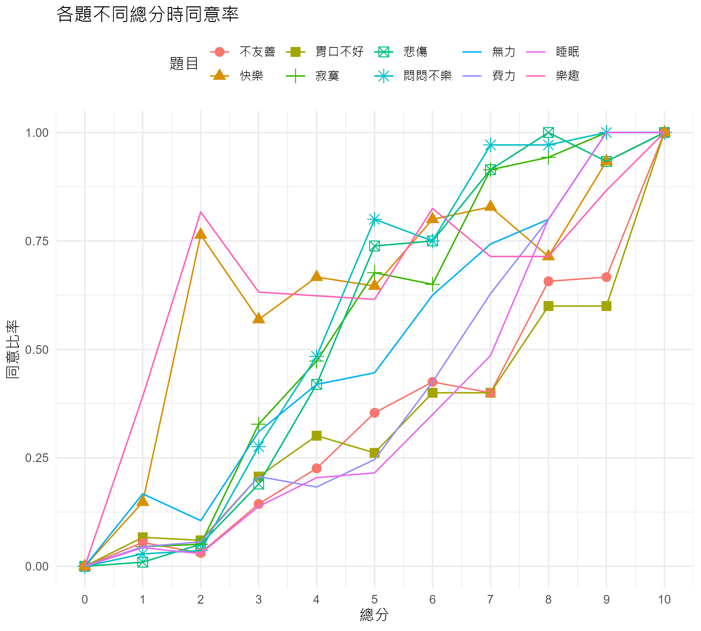

# Rasch 分析

``` r
#Rasch 分析不需要總分，將之移除
dta_b <- dta_b |> dplyr::select(-c(ts))
```

``` r
#確認分析的題目是否接近單向度
#如果 Mcdonald's hierarchical Omega > .7， 算是支持接近單向度證據
psych::omega(dta_b, plot=F) |> purrr::pluck('omega_h')
```

    [1] 0.6149

``` r
#以mirt套件，進行 Rasch 分析
fit <- mirt::mirt(dta_b, 1, itemtype = "Rasch", verbose = F)
```

``` r
# 模型適合度指標
#程式報表9.2
mirt::M2(fit) |> 
  round(3) 
```

<table>
<thead>
<tr>
<th style="text-align:left;">
</th>
<th style="text-align:right;">
M2
</th>
<th style="text-align:right;">
df
</th>
<th style="text-align:right;">
p
</th>
<th style="text-align:right;">
RMSEA
</th>
<th style="text-align:right;">
RMSEA_5
</th>
<th style="text-align:right;">
RMSEA_95
</th>
<th style="text-align:right;">
SRMSR
</th>
<th style="text-align:right;">
TLI
</th>
<th style="text-align:right;">
CFI
</th>
</tr>
</thead>
<tbody>
<tr>
<td style="text-align:left;">
stats
</td>
<td style="text-align:right;">
1901
</td>
<td style="text-align:right;">
44
</td>
<td style="text-align:right;">
0
</td>
<td style="text-align:right;">
0.145
</td>
<td style="text-align:right;">
0.14
</td>
<td style="text-align:right;">
0.151
</td>
<td style="text-align:right;">
0.159
</td>
<td style="text-align:right;">
0.73
</td>
<td style="text-align:right;">
0.736
</td>
</tr>
</tbody>
</table>

``` r
#模型摘要圖 
#圖9.2
ggmirt::summaryPlot(fit, adj_factor = 1.75)
```

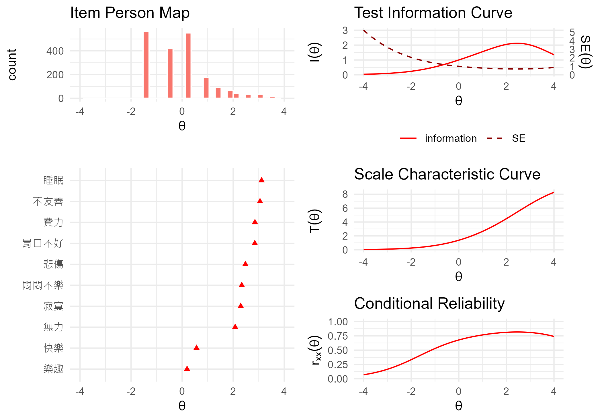

``` r
#檢驗估計能力與答對題數間相關
cor(mirt::fscores(fit), rowSums(dta_b))
```

<table>
<tbody>
<tr>
<td style="text-align:left;">
F1
</td>
<td style="text-align:right;">
0.9814
</td>
</tr>
</tbody>
</table>

## 看題的訊息

``` r
#mirt 支援四參數模型，包含a（區辨度）,b（難度）
#另有兩個與猜測有關參數：g（猜測率，正確率下限）, u（正確率上限）
#設定用 Rasch model，只有難度待估計，其餘參數固定a=1, g=0, u=1
#程式報表9.3
coef(fit, IRTpars = TRUE, simplify=TRUE)
```

    $items
             a     b g u
    費力     1 2.852 0 1
    睡眠     1 3.112 0 1
    無力     1 2.078 0 1
    胃口不好 1 2.845 0 1
    悲傷     1 2.478 0 1
    寂寞     1 2.296 0 1
    悶悶不樂 1 2.336 0 1
    不友善   1 3.051 0 1
    快樂     1 0.564 0 1
    樂趣     1 0.194 0 1

    $means
    F1 
     0 

    $cov
          F1
    F1 2.104

``` r
#題目特徵曲線
#此處讓顏色改為灰階，讀者可自行於scale_color_grey() + 加上 #，恢復顏色
#facet = T 可以分題畫
#圖9.3右
p_01 <-
  ggmirt::tracePlot(fit, theta_range = c(-5, 5), 
                  facet = F, legend = T) + 
  scale_color_grey() +
  labs(x=expression(theta), y = '機率', title = '題目特徵曲線')
```

``` r
#題目資訊曲線（Item information curves）
#圖9.3左
p_02 <-
  ggmirt::itemInfoPlot(fit,theta_range = c(-5, 5), 
                  facet = F, legend = T)+
  guides(color='none') +
  scale_color_grey() +
  labs(x=expression(theta), 
       y = '資訊量', 
       title = '題目資訊曲線')

ggarrange(p_02,p_01,nrow = 1)
```

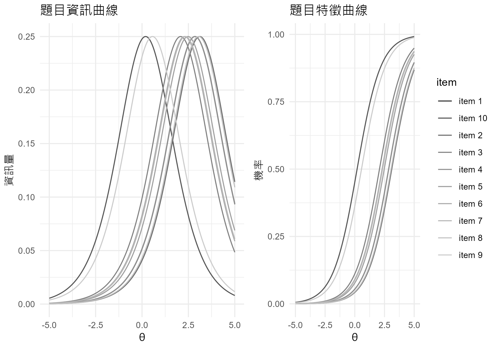

``` r
#題目適合度指標
#程式報表9.4
mirt::itemfit(fit)
```

<table>
<thead>
<tr>
<th style="text-align:left;">
item
</th>
<th style="text-align:right;">
S_X2
</th>
<th style="text-align:right;">
df.S_X2
</th>
<th style="text-align:right;">
RMSEA.S_X2
</th>
<th style="text-align:right;">
p.S_X2
</th>
</tr>
</thead>
<tbody>
<tr>
<td style="text-align:left;">
費力
</td>
<td style="text-align:right;">
20.25
</td>
<td style="text-align:right;">
7
</td>
<td style="text-align:right;">
0.0308
</td>
<td style="text-align:right;">
0.0051
</td>
</tr>
<tr>
<td style="text-align:left;">
睡眠
</td>
<td style="text-align:right;">
26.53
</td>
<td style="text-align:right;">
7
</td>
<td style="text-align:right;">
0.0374
</td>
<td style="text-align:right;">
0.0004
</td>
</tr>
<tr>
<td style="text-align:left;">
無力
</td>
<td style="text-align:right;">
94.36
</td>
<td style="text-align:right;">
6
</td>
<td style="text-align:right;">
0.0858
</td>
<td style="text-align:right;">
0.0000
</td>
</tr>
<tr>
<td style="text-align:left;">
胃口不好
</td>
<td style="text-align:right;">
48.23
</td>
<td style="text-align:right;">
7
</td>
<td style="text-align:right;">
0.0543
</td>
<td style="text-align:right;">
0.0000
</td>
</tr>
<tr>
<td style="text-align:left;">
悲傷
</td>
<td style="text-align:right;">
81.14
</td>
<td style="text-align:right;">
7
</td>
<td style="text-align:right;">
0.0728
</td>
<td style="text-align:right;">
0.0000
</td>
</tr>
<tr>
<td style="text-align:left;">
寂寞
</td>
<td style="text-align:right;">
61.54
</td>
<td style="text-align:right;">
7
</td>
<td style="text-align:right;">
0.0624
</td>
<td style="text-align:right;">
0.0000
</td>
</tr>
<tr>
<td style="text-align:left;">
悶悶不樂
</td>
<td style="text-align:right;">
99.01
</td>
<td style="text-align:right;">
7
</td>
<td style="text-align:right;">
0.0811
</td>
<td style="text-align:right;">
0.0000
</td>
</tr>
<tr>
<td style="text-align:left;">
不友善
</td>
<td style="text-align:right;">
34.47
</td>
<td style="text-align:right;">
7
</td>
<td style="text-align:right;">
0.0443
</td>
<td style="text-align:right;">
0.0000
</td>
</tr>
<tr>
<td style="text-align:left;">
快樂
</td>
<td style="text-align:right;">
277.91
</td>
<td style="text-align:right;">
6
</td>
<td style="text-align:right;">
0.1506
</td>
<td style="text-align:right;">
0.0000
</td>
</tr>
<tr>
<td style="text-align:left;">
樂趣
</td>
<td style="text-align:right;">
371.43
</td>
<td style="text-align:right;">
5
</td>
<td style="text-align:right;">
0.1915
</td>
<td style="text-align:right;">
0.0000
</td>
</tr>
</tbody>
</table>

``` r
#LD 較大且顯著時，表示局部獨立假設可能被違反
#程式報表9.5
mirt::residuals(fit,  df.p = TRUE)
```

    Degrees of freedom (lower triangle) and p-values:

             費力 睡眠  無力 胃口不好  悲傷  寂寞 悶悶不樂 不友善  快樂 樂趣
    費力       NA    0 0.005    0.297 0.000 0.000        0  0.001 0.000    0
    睡眠        1   NA 0.006    0.003 0.000 0.000        0  0.072 0.000    0
    無力        1    1    NA    0.670 0.001 0.087        0  0.040 0.000    0
    胃口不好    1    1 1.000       NA 0.089 0.118        0  0.095 0.000    0
    悲傷        1    1 1.000    1.000    NA 0.000        0  0.001 0.005    0
    寂寞        1    1 1.000    1.000 1.000    NA        0  0.009 0.000    0
    悶悶不樂    1    1 1.000    1.000 1.000 1.000       NA  0.000 0.000    0
    不友善      1    1 1.000    1.000 1.000 1.000        1     NA 0.000    0
    快樂        1    1 1.000    1.000 1.000 1.000        1  1.000    NA    0
    樂趣        1    1 1.000    1.000 1.000 1.000        1  1.000 1.000   NA

    LD matrix (lower triangle) and standardized values.

    Upper triangle summary:
       Min. 1st Qu.  Median    Mean 3rd Qu.    Max. 
     -0.248  -0.111   0.040   0.014   0.101   0.337 

               費力   睡眠    無力 胃口不好    悲傷    寂寞 悶悶不樂 不友善    快樂
    費力         NA  0.093   0.063    0.023   0.128   0.101    0.085  0.072  -0.111
    睡眠     17.262     NA   0.061    0.067   0.132   0.127    0.152  0.040  -0.111
    無力      7.814  7.444      NA   -0.010   0.076   0.038    0.104  0.046  -0.202
    胃口不好  1.086  8.891   0.181       NA   0.038   0.035    0.120  0.037  -0.200
    悲傷     32.585 34.953  11.687    2.895      NA   0.337    0.292  0.075  -0.063
    寂寞     20.209 32.235   2.938    2.444 226.683      NA    0.250  0.059  -0.097
    悶悶不樂 14.376 46.035  21.796   28.603 170.824 124.914       NA  0.132  -0.084
    不友善   10.226  3.235   4.231    2.792  11.153   6.890   34.990     NA  -0.132
    快樂     24.474 24.717  81.693   79.697   8.036  18.789   14.204 34.599      NA
    樂趣     53.007 70.278 123.112  113.675  27.430  60.977   40.458 65.916 184.505
               樂趣
    費力     -0.163
    睡眠     -0.187
    無力     -0.248
    胃口不好 -0.238
    悲傷     -0.117
    寂寞     -0.175
    悶悶不樂 -0.142
    不友善   -0.182
    快樂      0.304
    樂趣         NA

``` r
#題目infit與outfit統計值
#繪製 infit 圖
#圖9.4
ggmirt::itemfitPlot(fit) + aes(group=1)
```

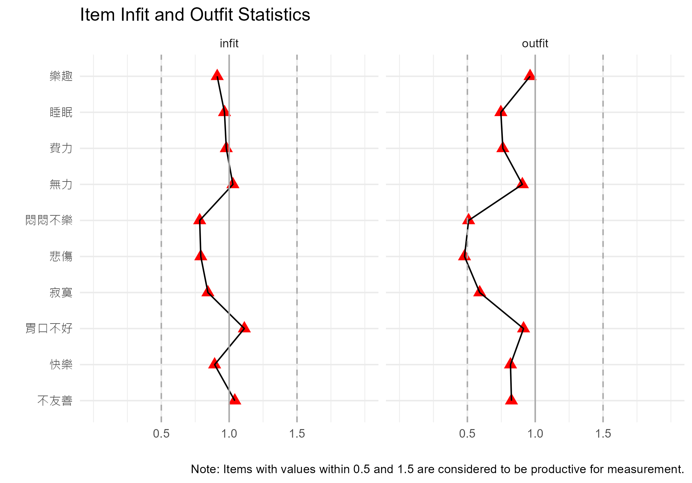

``` r
#個人配適統計值（person fit）
mirt::personfit(fit) |>
  dplyr::reframe(infit.outside = prop.table(table(z.infit > 1.96 | z.infit < -1.96)),
  outfit.outside = prop.table(table(z.outfit > 1.96 | z.outfit < -1.96))) 
```

<table>
<thead>
<tr>
<th style="text-align:right;">
infit.outside
</th>
<th style="text-align:right;">
outfit.outside
</th>
</tr>
</thead>
<tbody>
<tr>
<td style="text-align:right;">
0.974
</td>
<td style="text-align:right;">
0.974
</td>
</tr>
<tr>
<td style="text-align:right;">
0.026
</td>
<td style="text-align:right;">
0.026
</td>
</tr>
</tbody>
</table>

``` r
#為底下的圖，決定適當的分組數
nbin <- mirt::personfit(fit)$z.outfit |> nclass.FD()
#個人配適統計值分布圖
#圖9.5
ggmirt::personfitPlot(fit) + stat_bin(bins=nbin) 
```

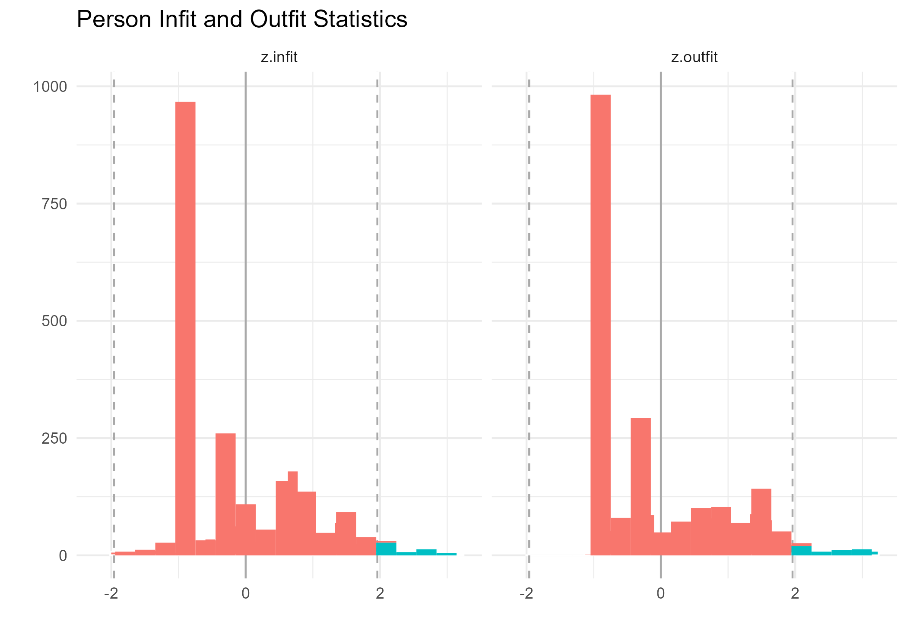

``` r
#總分與個人能力對照表
#程式報表9.6
data.frame(rawscore=rowSums(dta_b),mirt::fscores(fit,full.scores.SE =T)) |>
    dplyr::group_by(rawscore) |> 
    dplyr::summarise(theta = mean(F1), theta_SE = mean(SE_F1)) 
```

<table>
<thead>
<tr>
<th style="text-align:right;">
rawscore
</th>
<th style="text-align:right;">
theta
</th>
<th style="text-align:right;">
theta_SE
</th>
</tr>
</thead>
<tbody>
<tr>
<td style="text-align:right;">
0
</td>
<td style="text-align:right;">
-1.3341
</td>
<td style="text-align:right;">
1.0393
</td>
</tr>
<tr>
<td style="text-align:right;">
1
</td>
<td style="text-align:right;">
-0.4089
</td>
<td style="text-align:right;">
0.8909
</td>
</tr>
<tr>
<td style="text-align:right;">
2
</td>
<td style="text-align:right;">
0.2928
</td>
<td style="text-align:right;">
0.7903
</td>
</tr>
<tr>
<td style="text-align:right;">
3
</td>
<td style="text-align:right;">
0.8629
</td>
<td style="text-align:right;">
0.7239
</td>
</tr>
<tr>
<td style="text-align:right;">
4
</td>
<td style="text-align:right;">
1.3537
</td>
<td style="text-align:right;">
0.6800
</td>
</tr>
<tr>
<td style="text-align:right;">
5
</td>
<td style="text-align:right;">
1.7961
</td>
<td style="text-align:right;">
0.6526
</td>
</tr>
<tr>
<td style="text-align:right;">
6
</td>
<td style="text-align:right;">
2.2119
</td>
<td style="text-align:right;">
0.6393
</td>
</tr>
<tr>
<td style="text-align:right;">
7
</td>
<td style="text-align:right;">
2.6194
</td>
<td style="text-align:right;">
0.6399
</td>
</tr>
<tr>
<td style="text-align:right;">
8
</td>
<td style="text-align:right;">
3.0374
</td>
<td style="text-align:right;">
0.6560
</td>
</tr>
<tr>
<td style="text-align:right;">
9
</td>
<td style="text-align:right;">
3.4882
</td>
<td style="text-align:right;">
0.6895
</td>
</tr>
<tr>
<td style="text-align:right;">
10
</td>
<td style="text-align:right;">
3.9935
</td>
<td style="text-align:right;">
0.7307
</td>
</tr>
</tbody>
</table>

# 二參數模型

``` r
#以mirt套件，進行二參數模型分析
fit3 <- mirt::mirt(dta_b, itemtype = "2PL", verbose = F)
```

``` r
#估計參數值，因為設定用二參數，g=0, u=1
#程式報表9.7
coef(fit3, IRTpars = TRUE, simplify=TRUE)
```

    $items
                 a     b g u
    費力     1.678 1.813 0 1
    睡眠     1.944 1.839 0 1
    無力     1.298 1.536 0 1
    胃口不好 1.357 2.038 0 1
    悲傷     4.413 1.174 0 1
    寂寞     3.284 1.153 0 1
    悶悶不樂 3.775 1.139 0 1
    不友善   1.546 2.023 0 1
    快樂     0.472 0.932 0 1
    樂趣     0.320 0.475 0 1

    $means
    F1 
     0 

    $cov
       F1
    F1  1

``` r
#題目特徵曲線
#此處讓顏色改為灰階，讀者可自行於scale_color_grey() + 加上 #，恢復顏色
#圖9.6
ggmirt::tracePlot(fit3, theta_range = c(-5, 5), 
                  facet = F, legend = T) + 
  scale_color_grey() +
  labs(x=expression(theta), 
       y = '機率', 
       title = '題目特徵曲線')
```

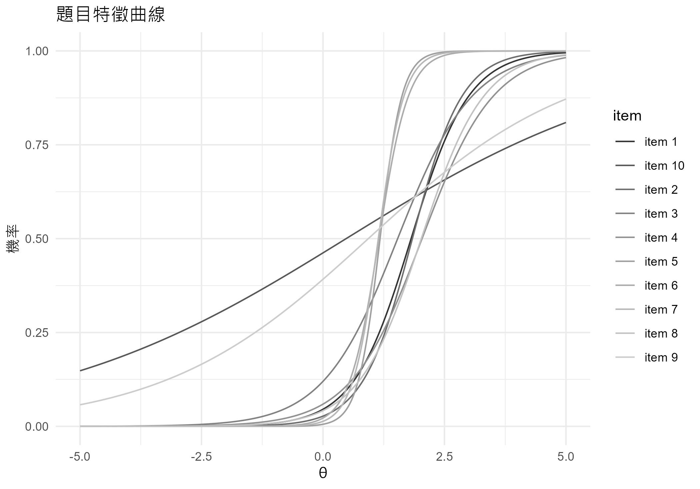

``` r
#模型適合度指標
#程式報表9.8前
mirt::M2(fit3) |> round(3)
```

<table>
<thead>
<tr>
<th style="text-align:left;">
</th>
<th style="text-align:right;">
M2
</th>
<th style="text-align:right;">
df
</th>
<th style="text-align:right;">
p
</th>
<th style="text-align:right;">
RMSEA
</th>
<th style="text-align:right;">
RMSEA_5
</th>
<th style="text-align:right;">
RMSEA_95
</th>
<th style="text-align:right;">
SRMSR
</th>
<th style="text-align:right;">
TLI
</th>
<th style="text-align:right;">
CFI
</th>
</tr>
</thead>
<tbody>
<tr>
<td style="text-align:left;">
stats
</td>
<td style="text-align:right;">
780.2
</td>
<td style="text-align:right;">
35
</td>
<td style="text-align:right;">
0
</td>
<td style="text-align:right;">
0.103
</td>
<td style="text-align:right;">
0.097
</td>
<td style="text-align:right;">
0.11
</td>
<td style="text-align:right;">
0.09
</td>
<td style="text-align:right;">
0.864
</td>
<td style="text-align:right;">
0.894
</td>
</tr>
</tbody>
</table>

``` r
#不要求區辨度相同的二參數模型表現較佳
#程式報表9.8後
anova(fit, fit3)
```

<table>
<thead>
<tr>
<th style="text-align:left;">
</th>
<th style="text-align:right;">
AIC
</th>
<th style="text-align:right;">
SABIC
</th>
<th style="text-align:right;">
HQ
</th>
<th style="text-align:right;">
BIC
</th>
<th style="text-align:right;">
logLik
</th>
<th style="text-align:right;">
X2
</th>
<th style="text-align:right;">
df
</th>
<th style="text-align:right;">
p
</th>
</tr>
</thead>
<tbody>
<tr>
<td style="text-align:left;">
fit
</td>
<td style="text-align:right;">
15622
</td>
<td style="text-align:right;">
15649
</td>
<td style="text-align:right;">
15645
</td>
<td style="text-align:right;">
15684
</td>
<td style="text-align:right;">
-7800
</td>
<td style="text-align:right;">
NA
</td>
<td style="text-align:right;">
NA
</td>
<td style="text-align:right;">
NA
</td>
</tr>
<tr>
<td style="text-align:left;">
fit3
</td>
<td style="text-align:right;">
15076
</td>
<td style="text-align:right;">
15125
</td>
<td style="text-align:right;">
15118
</td>
<td style="text-align:right;">
15188
</td>
<td style="text-align:right;">
-7518
</td>
<td style="text-align:right;">
563.5
</td>
<td style="text-align:right;">
9
</td>
<td style="text-align:right;">
0
</td>
</tr>
</tbody>
</table>

``` r
#考慮去除第7、10題，看看適合度是否變好
fit4 <- mirt::mirt(dta_b[,-c(7,10)], 1, itemtype = "2PL", verbose = F)
```

``` r
#模型適合度指標
mirt::M2(fit4) |> round(3) 
```

<table>
<thead>
<tr>
<th style="text-align:left;">
</th>
<th style="text-align:right;">
M2
</th>
<th style="text-align:right;">
df
</th>
<th style="text-align:right;">
p
</th>
<th style="text-align:right;">
RMSEA
</th>
<th style="text-align:right;">
RMSEA_5
</th>
<th style="text-align:right;">
RMSEA_95
</th>
<th style="text-align:right;">
SRMSR
</th>
<th style="text-align:right;">
TLI
</th>
<th style="text-align:right;">
CFI
</th>
</tr>
</thead>
<tbody>
<tr>
<td style="text-align:left;">
stats
</td>
<td style="text-align:right;">
97.34
</td>
<td style="text-align:right;">
20
</td>
<td style="text-align:right;">
0
</td>
<td style="text-align:right;">
0.044
</td>
<td style="text-align:right;">
0.035
</td>
<td style="text-align:right;">
0.053
</td>
<td style="text-align:right;">
0.042
</td>
<td style="text-align:right;">
0.972
</td>
<td style="text-align:right;">
0.98
</td>
</tr>
</tbody>
</table>

\#性別的差異試題功能分析

``` r
#性別的差異試題功能分析
fit2 <- mirt::multipleGroup(dta_b,itemtype = "Rasch",
                       group=as.factor(dta$性別), SE = TRUE)
```

    Iteration: 1, Log-Lik: -7879.710, Max-Change: 0.43950Iteration: 2, Log-Lik: -7763.089, Max-Change: 0.29240Iteration: 3, Log-Lik: -7740.768, Max-Change: 0.25963Iteration: 4, Log-Lik: -7727.633, Max-Change: 0.21781Iteration: 5, Log-Lik: -7719.893, Max-Change: 0.17506Iteration: 6, Log-Lik: -7715.283, Max-Change: 0.13671Iteration: 7, Log-Lik: -7712.485, Max-Change: 0.10499Iteration: 8, Log-Lik: -7710.746, Max-Change: 0.08007Iteration: 9, Log-Lik: -7709.641, Max-Change: 0.06108Iteration: 10, Log-Lik: -7708.473, Max-Change: 0.07238Iteration: 11, Log-Lik: -7707.990, Max-Change: 0.04286Iteration: 12, Log-Lik: -7707.789, Max-Change: 0.02922Iteration: 13, Log-Lik: -7707.649, Max-Change: 0.02449Iteration: 14, Log-Lik: -7707.573, Max-Change: 0.01538Iteration: 15, Log-Lik: -7707.530, Max-Change: 0.01088Iteration: 16, Log-Lik: -7707.493, Max-Change: 0.01090Iteration: 17, Log-Lik: -7707.472, Max-Change: 0.00661Iteration: 18, Log-Lik: -7707.461, Max-Change: 0.00461Iteration: 19, Log-Lik: -7707.452, Max-Change: 0.00445Iteration: 20, Log-Lik: -7707.446, Max-Change: 0.00274Iteration: 21, Log-Lik: -7707.443, Max-Change: 0.00189Iteration: 22, Log-Lik: -7707.440, Max-Change: 0.00187Iteration: 23, Log-Lik: -7707.438, Max-Change: 0.00113Iteration: 24, Log-Lik: -7707.437, Max-Change: 0.00079Iteration: 25, Log-Lik: -7707.436, Max-Change: 0.00079Iteration: 26, Log-Lik: -7707.435, Max-Change: 0.00047Iteration: 27, Log-Lik: -7707.435, Max-Change: 0.00033Iteration: 28, Log-Lik: -7707.435, Max-Change: 0.00035Iteration: 29, Log-Lik: -7707.434, Max-Change: 0.00021Iteration: 30, Log-Lik: -7707.434, Max-Change: 0.00013Iteration: 31, Log-Lik: -7707.434, Max-Change: 0.00014Iteration: 32, Log-Lik: -7707.434, Max-Change: 0.00008

    Calculating information matrix...

``` r
#繪製不同性別題目特徵圖
#圖9.7
#程式報表9.9
dif_fit2 <- mirt::DIF(fit2, which.par=c('d'), plotdif = T)
```

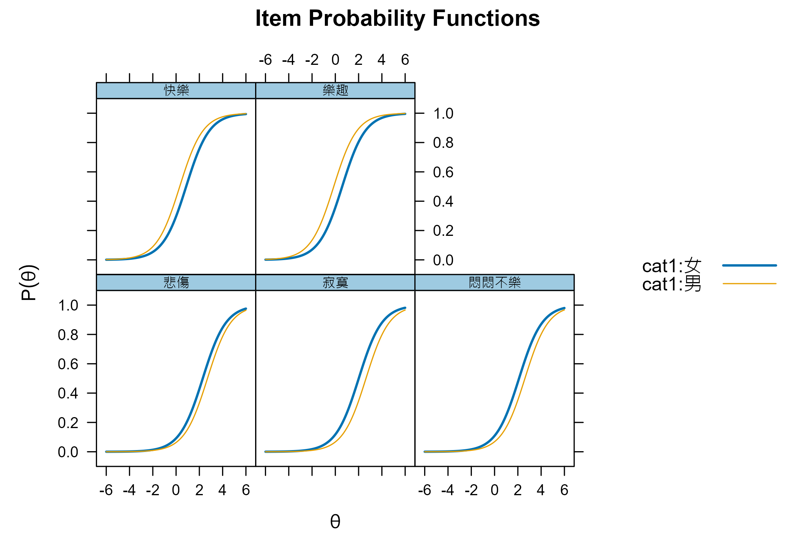

``` r
dif_fit2
```

<table>
<thead>
<tr>
<th style="text-align:left;">
</th>
<th style="text-align:left;">
groups
</th>
<th style="text-align:left;">
converged
</th>
<th style="text-align:right;">
AIC
</th>
<th style="text-align:right;">
SABIC
</th>
<th style="text-align:right;">
HQ
</th>
<th style="text-align:right;">
BIC
</th>
<th style="text-align:right;">
X2
</th>
<th style="text-align:right;">
df
</th>
<th style="text-align:right;">
p
</th>
</tr>
</thead>
<tbody>
<tr>
<td style="text-align:left;">
費力
</td>
<td style="text-align:left;">
女,男
</td>
<td style="text-align:left;">
TRUE
</td>
<td style="text-align:right;">
1.2057
</td>
<td style="text-align:right;">
3.6296
</td>
<td style="text-align:right;">
3.262
</td>
<td style="text-align:right;">
6.807
</td>
<td style="text-align:right;">
0.7943
</td>
<td style="text-align:right;">
1
</td>
<td style="text-align:right;">
0.3728
</td>
</tr>
<tr>
<td style="text-align:left;">
睡眠
</td>
<td style="text-align:left;">
女,男
</td>
<td style="text-align:left;">
TRUE
</td>
<td style="text-align:right;">
1.9893
</td>
<td style="text-align:right;">
4.4132
</td>
<td style="text-align:right;">
4.046
</td>
<td style="text-align:right;">
7.590
</td>
<td style="text-align:right;">
0.0107
</td>
<td style="text-align:right;">
1
</td>
<td style="text-align:right;">
0.9177
</td>
</tr>
<tr>
<td style="text-align:left;">
無力
</td>
<td style="text-align:left;">
女,男
</td>
<td style="text-align:left;">
TRUE
</td>
<td style="text-align:right;">
2.0008
</td>
<td style="text-align:right;">
4.4246
</td>
<td style="text-align:right;">
4.057
</td>
<td style="text-align:right;">
7.602
</td>
<td style="text-align:right;">
-0.0008
</td>
<td style="text-align:right;">
1
</td>
<td style="text-align:right;">
NaN
</td>
</tr>
<tr>
<td style="text-align:left;">
胃口不好
</td>
<td style="text-align:left;">
女,男
</td>
<td style="text-align:left;">
TRUE
</td>
<td style="text-align:right;">
1.9940
</td>
<td style="text-align:right;">
4.4179
</td>
<td style="text-align:right;">
4.051
</td>
<td style="text-align:right;">
7.595
</td>
<td style="text-align:right;">
0.0060
</td>
<td style="text-align:right;">
1
</td>
<td style="text-align:right;">
0.9383
</td>
</tr>
<tr>
<td style="text-align:left;">
悲傷
</td>
<td style="text-align:left;">
女,男
</td>
<td style="text-align:left;">
TRUE
</td>
<td style="text-align:right;">
-3.3704
</td>
<td style="text-align:right;">
-0.9466
</td>
<td style="text-align:right;">
-1.314
</td>
<td style="text-align:right;">
2.231
</td>
<td style="text-align:right;">
5.3704
</td>
<td style="text-align:right;">
1
</td>
<td style="text-align:right;">
0.0205
</td>
</tr>
<tr>
<td style="text-align:left;">
寂寞
</td>
<td style="text-align:left;">
女,男
</td>
<td style="text-align:left;">
TRUE
</td>
<td style="text-align:right;">
-11.7044
</td>
<td style="text-align:right;">
-9.2805
</td>
<td style="text-align:right;">
-9.648
</td>
<td style="text-align:right;">
-6.104
</td>
<td style="text-align:right;">
13.7044
</td>
<td style="text-align:right;">
1
</td>
<td style="text-align:right;">
0.0002
</td>
</tr>
<tr>
<td style="text-align:left;">
悶悶不樂
</td>
<td style="text-align:left;">
女,男
</td>
<td style="text-align:left;">
TRUE
</td>
<td style="text-align:right;">
-6.9899
</td>
<td style="text-align:right;">
-4.5660
</td>
<td style="text-align:right;">
-4.933
</td>
<td style="text-align:right;">
-1.389
</td>
<td style="text-align:right;">
8.9899
</td>
<td style="text-align:right;">
1
</td>
<td style="text-align:right;">
0.0027
</td>
</tr>
<tr>
<td style="text-align:left;">
不友善
</td>
<td style="text-align:left;">
女,男
</td>
<td style="text-align:left;">
TRUE
</td>
<td style="text-align:right;">
-0.8989
</td>
<td style="text-align:right;">
1.5250
</td>
<td style="text-align:right;">
1.158
</td>
<td style="text-align:right;">
4.702
</td>
<td style="text-align:right;">
2.8989
</td>
<td style="text-align:right;">
1
</td>
<td style="text-align:right;">
0.0886
</td>
</tr>
<tr>
<td style="text-align:left;">
快樂
</td>
<td style="text-align:left;">
女,男
</td>
<td style="text-align:left;">
TRUE
</td>
<td style="text-align:right;">
-16.9025
</td>
<td style="text-align:right;">
-14.4787
</td>
<td style="text-align:right;">
-14.846
</td>
<td style="text-align:right;">
-11.302
</td>
<td style="text-align:right;">
18.9025
</td>
<td style="text-align:right;">
1
</td>
<td style="text-align:right;">
0.0000
</td>
</tr>
<tr>
<td style="text-align:left;">
樂趣
</td>
<td style="text-align:left;">
女,男
</td>
<td style="text-align:left;">
TRUE
</td>
<td style="text-align:right;">
-31.4583
</td>
<td style="text-align:right;">
-29.0345
</td>
<td style="text-align:right;">
-29.402
</td>
<td style="text-align:right;">
-25.857
</td>
<td style="text-align:right;">
33.4583
</td>
<td style="text-align:right;">
1
</td>
<td style="text-align:right;">
0.0000
</td>
</tr>
</tbody>
</table>

``` r
#繪製不同性別題目難度估計，並加上信賴區間
#圖9.8
coef(fit2) |> as.data.frame() |> 
  dplyr::select(ends_with(".d")) |> t() |>
  as_tibble(rownames="rowname") |>
  dplyr::mutate(性別 = substr(rowname, 1, 1), 
                item=substr(rowname,3, 
                            nchar(rowname)-2), est=par,
                est_lb = CI_2.5,
                est_ub = CI_97.5, .keep="none") |>
  ggplot()+
  aes(ymin = est_lb, y = est, ymax = est_ub, 
                   reorder(x = item, est, min),
                   color=性別)+
  geom_point(position = position_dodge(.3)) +
  geom_linerange(position = position_dodge(.3)) +
  coord_flip()+
  scale_color_grey(end=.7)+
  labs(y="參數估計值",
       x="題目",
       title='題目性別差異及信賴區間')+
  theme(legend.position='top')
```

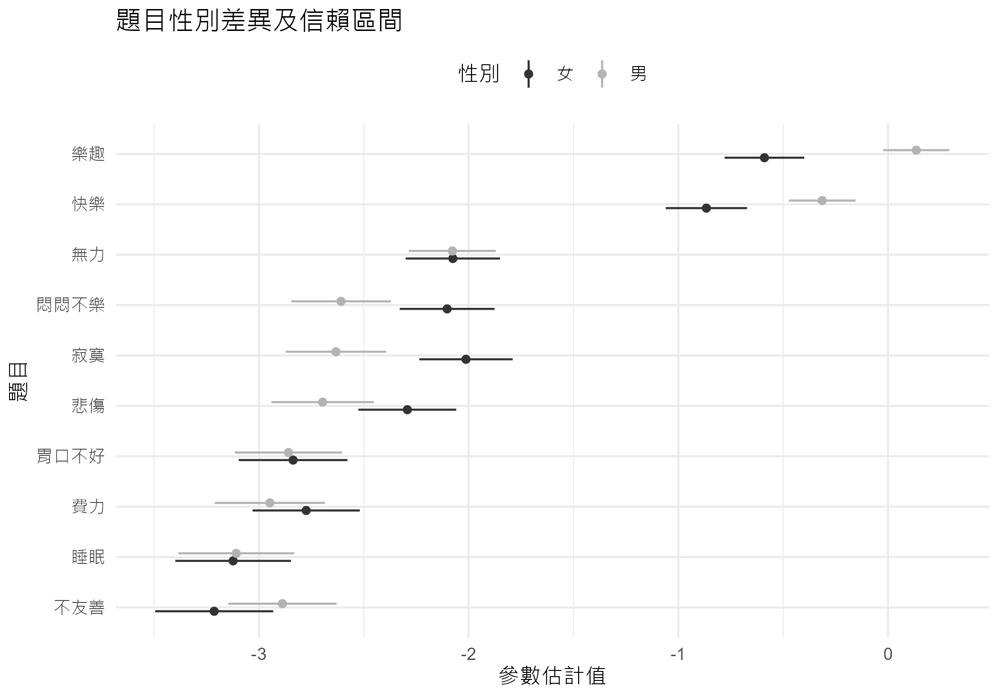

# 多序類項目反應理論模型分析

``` r
#看一下各題答各選項比率
gtsummary::tbl_summary(dta, include=c(-性別))
```

<div id="ekkdcygxnk" style="padding-left:0px;padding-right:0px;padding-top:10px;padding-bottom:10px;overflow-x:auto;overflow-y:auto;width:auto;height:auto;">
<style>#ekkdcygxnk table {
  font-family: system-ui, 'Segoe UI', Roboto, Helvetica, Arial, sans-serif, 'Apple Color Emoji', 'Segoe UI Emoji', 'Segoe UI Symbol', 'Noto Color Emoji';
  -webkit-font-smoothing: antialiased;
  -moz-osx-font-smoothing: grayscale;
}
&#10;#ekkdcygxnk thead, #ekkdcygxnk tbody, #ekkdcygxnk tfoot, #ekkdcygxnk tr, #ekkdcygxnk td, #ekkdcygxnk th {
  border-style: none;
}
&#10;#ekkdcygxnk p {
  margin: 0;
  padding: 0;
}
&#10;#ekkdcygxnk .gt_table {
  display: table;
  border-collapse: collapse;
  line-height: normal;
  margin-left: auto;
  margin-right: auto;
  color: #333333;
  font-size: 16px;
  font-weight: normal;
  font-style: normal;
  background-color: #FFFFFF;
  width: auto;
  border-top-style: solid;
  border-top-width: 2px;
  border-top-color: #A8A8A8;
  border-right-style: none;
  border-right-width: 2px;
  border-right-color: #D3D3D3;
  border-bottom-style: solid;
  border-bottom-width: 2px;
  border-bottom-color: #A8A8A8;
  border-left-style: none;
  border-left-width: 2px;
  border-left-color: #D3D3D3;
}
&#10;#ekkdcygxnk .gt_caption {
  padding-top: 4px;
  padding-bottom: 4px;
}
&#10;#ekkdcygxnk .gt_title {
  color: #333333;
  font-size: 125%;
  font-weight: initial;
  padding-top: 4px;
  padding-bottom: 4px;
  padding-left: 5px;
  padding-right: 5px;
  border-bottom-color: #FFFFFF;
  border-bottom-width: 0;
}
&#10;#ekkdcygxnk .gt_subtitle {
  color: #333333;
  font-size: 85%;
  font-weight: initial;
  padding-top: 3px;
  padding-bottom: 5px;
  padding-left: 5px;
  padding-right: 5px;
  border-top-color: #FFFFFF;
  border-top-width: 0;
}
&#10;#ekkdcygxnk .gt_heading {
  background-color: #FFFFFF;
  text-align: center;
  border-bottom-color: #FFFFFF;
  border-left-style: none;
  border-left-width: 1px;
  border-left-color: #D3D3D3;
  border-right-style: none;
  border-right-width: 1px;
  border-right-color: #D3D3D3;
}
&#10;#ekkdcygxnk .gt_bottom_border {
  border-bottom-style: solid;
  border-bottom-width: 2px;
  border-bottom-color: #D3D3D3;
}
&#10;#ekkdcygxnk .gt_col_headings {
  border-top-style: solid;
  border-top-width: 2px;
  border-top-color: #D3D3D3;
  border-bottom-style: solid;
  border-bottom-width: 2px;
  border-bottom-color: #D3D3D3;
  border-left-style: none;
  border-left-width: 1px;
  border-left-color: #D3D3D3;
  border-right-style: none;
  border-right-width: 1px;
  border-right-color: #D3D3D3;
}
&#10;#ekkdcygxnk .gt_col_heading {
  color: #333333;
  background-color: #FFFFFF;
  font-size: 100%;
  font-weight: normal;
  text-transform: inherit;
  border-left-style: none;
  border-left-width: 1px;
  border-left-color: #D3D3D3;
  border-right-style: none;
  border-right-width: 1px;
  border-right-color: #D3D3D3;
  vertical-align: bottom;
  padding-top: 5px;
  padding-bottom: 6px;
  padding-left: 5px;
  padding-right: 5px;
  overflow-x: hidden;
}
&#10;#ekkdcygxnk .gt_column_spanner_outer {
  color: #333333;
  background-color: #FFFFFF;
  font-size: 100%;
  font-weight: normal;
  text-transform: inherit;
  padding-top: 0;
  padding-bottom: 0;
  padding-left: 4px;
  padding-right: 4px;
}
&#10;#ekkdcygxnk .gt_column_spanner_outer:first-child {
  padding-left: 0;
}
&#10;#ekkdcygxnk .gt_column_spanner_outer:last-child {
  padding-right: 0;
}
&#10;#ekkdcygxnk .gt_column_spanner {
  border-bottom-style: solid;
  border-bottom-width: 2px;
  border-bottom-color: #D3D3D3;
  vertical-align: bottom;
  padding-top: 5px;
  padding-bottom: 5px;
  overflow-x: hidden;
  display: inline-block;
  width: 100%;
}
&#10;#ekkdcygxnk .gt_spanner_row {
  border-bottom-style: hidden;
}
&#10;#ekkdcygxnk .gt_group_heading {
  padding-top: 8px;
  padding-bottom: 8px;
  padding-left: 5px;
  padding-right: 5px;
  color: #333333;
  background-color: #FFFFFF;
  font-size: 100%;
  font-weight: initial;
  text-transform: inherit;
  border-top-style: solid;
  border-top-width: 2px;
  border-top-color: #D3D3D3;
  border-bottom-style: solid;
  border-bottom-width: 2px;
  border-bottom-color: #D3D3D3;
  border-left-style: none;
  border-left-width: 1px;
  border-left-color: #D3D3D3;
  border-right-style: none;
  border-right-width: 1px;
  border-right-color: #D3D3D3;
  vertical-align: middle;
  text-align: left;
}
&#10;#ekkdcygxnk .gt_empty_group_heading {
  padding: 0.5px;
  color: #333333;
  background-color: #FFFFFF;
  font-size: 100%;
  font-weight: initial;
  border-top-style: solid;
  border-top-width: 2px;
  border-top-color: #D3D3D3;
  border-bottom-style: solid;
  border-bottom-width: 2px;
  border-bottom-color: #D3D3D3;
  vertical-align: middle;
}
&#10;#ekkdcygxnk .gt_from_md > :first-child {
  margin-top: 0;
}
&#10;#ekkdcygxnk .gt_from_md > :last-child {
  margin-bottom: 0;
}
&#10;#ekkdcygxnk .gt_row {
  padding-top: 8px;
  padding-bottom: 8px;
  padding-left: 5px;
  padding-right: 5px;
  margin: 10px;
  border-top-style: solid;
  border-top-width: 1px;
  border-top-color: #D3D3D3;
  border-left-style: none;
  border-left-width: 1px;
  border-left-color: #D3D3D3;
  border-right-style: none;
  border-right-width: 1px;
  border-right-color: #D3D3D3;
  vertical-align: middle;
  overflow-x: hidden;
}
&#10;#ekkdcygxnk .gt_stub {
  color: #333333;
  background-color: #FFFFFF;
  font-size: 100%;
  font-weight: initial;
  text-transform: inherit;
  border-right-style: solid;
  border-right-width: 2px;
  border-right-color: #D3D3D3;
  padding-left: 5px;
  padding-right: 5px;
}
&#10;#ekkdcygxnk .gt_stub_row_group {
  color: #333333;
  background-color: #FFFFFF;
  font-size: 100%;
  font-weight: initial;
  text-transform: inherit;
  border-right-style: solid;
  border-right-width: 2px;
  border-right-color: #D3D3D3;
  padding-left: 5px;
  padding-right: 5px;
  vertical-align: top;
}
&#10;#ekkdcygxnk .gt_row_group_first td {
  border-top-width: 2px;
}
&#10;#ekkdcygxnk .gt_row_group_first th {
  border-top-width: 2px;
}
&#10;#ekkdcygxnk .gt_summary_row {
  color: #333333;
  background-color: #FFFFFF;
  text-transform: inherit;
  padding-top: 8px;
  padding-bottom: 8px;
  padding-left: 5px;
  padding-right: 5px;
}
&#10;#ekkdcygxnk .gt_first_summary_row {
  border-top-style: solid;
  border-top-color: #D3D3D3;
}
&#10;#ekkdcygxnk .gt_first_summary_row.thick {
  border-top-width: 2px;
}
&#10;#ekkdcygxnk .gt_last_summary_row {
  padding-top: 8px;
  padding-bottom: 8px;
  padding-left: 5px;
  padding-right: 5px;
  border-bottom-style: solid;
  border-bottom-width: 2px;
  border-bottom-color: #D3D3D3;
}
&#10;#ekkdcygxnk .gt_grand_summary_row {
  color: #333333;
  background-color: #FFFFFF;
  text-transform: inherit;
  padding-top: 8px;
  padding-bottom: 8px;
  padding-left: 5px;
  padding-right: 5px;
}
&#10;#ekkdcygxnk .gt_first_grand_summary_row {
  padding-top: 8px;
  padding-bottom: 8px;
  padding-left: 5px;
  padding-right: 5px;
  border-top-style: double;
  border-top-width: 6px;
  border-top-color: #D3D3D3;
}
&#10;#ekkdcygxnk .gt_last_grand_summary_row_top {
  padding-top: 8px;
  padding-bottom: 8px;
  padding-left: 5px;
  padding-right: 5px;
  border-bottom-style: double;
  border-bottom-width: 6px;
  border-bottom-color: #D3D3D3;
}
&#10;#ekkdcygxnk .gt_striped {
  background-color: rgba(128, 128, 128, 0.05);
}
&#10;#ekkdcygxnk .gt_table_body {
  border-top-style: solid;
  border-top-width: 2px;
  border-top-color: #D3D3D3;
  border-bottom-style: solid;
  border-bottom-width: 2px;
  border-bottom-color: #D3D3D3;
}
&#10;#ekkdcygxnk .gt_footnotes {
  color: #333333;
  background-color: #FFFFFF;
  border-bottom-style: none;
  border-bottom-width: 2px;
  border-bottom-color: #D3D3D3;
  border-left-style: none;
  border-left-width: 2px;
  border-left-color: #D3D3D3;
  border-right-style: none;
  border-right-width: 2px;
  border-right-color: #D3D3D3;
}
&#10;#ekkdcygxnk .gt_footnote {
  margin: 0px;
  font-size: 90%;
  padding-top: 4px;
  padding-bottom: 4px;
  padding-left: 5px;
  padding-right: 5px;
}
&#10;#ekkdcygxnk .gt_sourcenotes {
  color: #333333;
  background-color: #FFFFFF;
  border-bottom-style: none;
  border-bottom-width: 2px;
  border-bottom-color: #D3D3D3;
  border-left-style: none;
  border-left-width: 2px;
  border-left-color: #D3D3D3;
  border-right-style: none;
  border-right-width: 2px;
  border-right-color: #D3D3D3;
}
&#10;#ekkdcygxnk .gt_sourcenote {
  font-size: 90%;
  padding-top: 4px;
  padding-bottom: 4px;
  padding-left: 5px;
  padding-right: 5px;
}
&#10;#ekkdcygxnk .gt_left {
  text-align: left;
}
&#10;#ekkdcygxnk .gt_center {
  text-align: center;
}
&#10;#ekkdcygxnk .gt_right {
  text-align: right;
  font-variant-numeric: tabular-nums;
}
&#10;#ekkdcygxnk .gt_font_normal {
  font-weight: normal;
}
&#10;#ekkdcygxnk .gt_font_bold {
  font-weight: bold;
}
&#10;#ekkdcygxnk .gt_font_italic {
  font-style: italic;
}
&#10;#ekkdcygxnk .gt_super {
  font-size: 65%;
}
&#10;#ekkdcygxnk .gt_footnote_marks {
  font-size: 75%;
  vertical-align: 0.4em;
  position: initial;
}
&#10;#ekkdcygxnk .gt_asterisk {
  font-size: 100%;
  vertical-align: 0;
}
&#10;#ekkdcygxnk .gt_indent_1 {
  text-indent: 5px;
}
&#10;#ekkdcygxnk .gt_indent_2 {
  text-indent: 10px;
}
&#10;#ekkdcygxnk .gt_indent_3 {
  text-indent: 15px;
}
&#10;#ekkdcygxnk .gt_indent_4 {
  text-indent: 20px;
}
&#10;#ekkdcygxnk .gt_indent_5 {
  text-indent: 25px;
}
</style>
<table class="gt_table" data-quarto-disable-processing="false" data-quarto-bootstrap="false">
  <thead>
    &#10;    <tr class="gt_col_headings">
      <th class="gt_col_heading gt_columns_bottom_border gt_left" rowspan="1" colspan="1" scope="col" id="&lt;strong&gt;Characteristic&lt;/strong&gt;"><strong>Characteristic</strong></th>
      <th class="gt_col_heading gt_columns_bottom_border gt_center" rowspan="1" colspan="1" scope="col" id="&lt;strong&gt;N = 2,000&lt;/strong&gt;&lt;span class=&quot;gt_footnote_marks&quot; style=&quot;white-space:nowrap;font-style:italic;font-weight:normal;&quot;&gt;&lt;sup&gt;1&lt;/sup&gt;&lt;/span&gt;"><strong>N = 2,000</strong><span class="gt_footnote_marks" style="white-space:nowrap;font-style:italic;font-weight:normal;"><sup>1</sup></span></th>
    </tr>
  </thead>
  <tbody class="gt_table_body">
    <tr><td headers="label" class="gt_row gt_left">費力</td>
<td headers="stat_0" class="gt_row gt_center"><br /></td></tr>
    <tr><td headers="label" class="gt_row gt_left">    0</td>
<td headers="stat_0" class="gt_row gt_center">1,041 (52%)</td></tr>
    <tr><td headers="label" class="gt_row gt_left">    1</td>
<td headers="stat_0" class="gt_row gt_center">750 (38%)</td></tr>
    <tr><td headers="label" class="gt_row gt_left">    2</td>
<td headers="stat_0" class="gt_row gt_center">156 (7.8%)</td></tr>
    <tr><td headers="label" class="gt_row gt_left">    3</td>
<td headers="stat_0" class="gt_row gt_center">53 (2.7%)</td></tr>
    <tr><td headers="label" class="gt_row gt_left">睡眠</td>
<td headers="stat_0" class="gt_row gt_center"><br /></td></tr>
    <tr><td headers="label" class="gt_row gt_left">    0</td>
<td headers="stat_0" class="gt_row gt_center">1,349 (67%)</td></tr>
    <tr><td headers="label" class="gt_row gt_left">    1</td>
<td headers="stat_0" class="gt_row gt_center">478 (24%)</td></tr>
    <tr><td headers="label" class="gt_row gt_left">    2</td>
<td headers="stat_0" class="gt_row gt_center">103 (5.2%)</td></tr>
    <tr><td headers="label" class="gt_row gt_left">    3</td>
<td headers="stat_0" class="gt_row gt_center">70 (3.5%)</td></tr>
    <tr><td headers="label" class="gt_row gt_left">無力</td>
<td headers="stat_0" class="gt_row gt_center"><br /></td></tr>
    <tr><td headers="label" class="gt_row gt_left">    0</td>
<td headers="stat_0" class="gt_row gt_center">967 (48%)</td></tr>
    <tr><td headers="label" class="gt_row gt_left">    1</td>
<td headers="stat_0" class="gt_row gt_center">681 (34%)</td></tr>
    <tr><td headers="label" class="gt_row gt_left">    2</td>
<td headers="stat_0" class="gt_row gt_center">225 (11%)</td></tr>
    <tr><td headers="label" class="gt_row gt_left">    3</td>
<td headers="stat_0" class="gt_row gt_center">127 (6.4%)</td></tr>
    <tr><td headers="label" class="gt_row gt_left">胃口不好</td>
<td headers="stat_0" class="gt_row gt_center"><br /></td></tr>
    <tr><td headers="label" class="gt_row gt_left">    0</td>
<td headers="stat_0" class="gt_row gt_center">1,227 (61%)</td></tr>
    <tr><td headers="label" class="gt_row gt_left">    1</td>
<td headers="stat_0" class="gt_row gt_center">563 (28%)</td></tr>
    <tr><td headers="label" class="gt_row gt_left">    2</td>
<td headers="stat_0" class="gt_row gt_center">146 (7.3%)</td></tr>
    <tr><td headers="label" class="gt_row gt_left">    3</td>
<td headers="stat_0" class="gt_row gt_center">64 (3.2%)</td></tr>
    <tr><td headers="label" class="gt_row gt_left">悲傷</td>
<td headers="stat_0" class="gt_row gt_center"><br /></td></tr>
    <tr><td headers="label" class="gt_row gt_left">    0</td>
<td headers="stat_0" class="gt_row gt_center">1,147 (57%)</td></tr>
    <tr><td headers="label" class="gt_row gt_left">    1</td>
<td headers="stat_0" class="gt_row gt_center">582 (29%)</td></tr>
    <tr><td headers="label" class="gt_row gt_left">    2</td>
<td headers="stat_0" class="gt_row gt_center">163 (8.2%)</td></tr>
    <tr><td headers="label" class="gt_row gt_left">    3</td>
<td headers="stat_0" class="gt_row gt_center">108 (5.4%)</td></tr>
    <tr><td headers="label" class="gt_row gt_left">寂寞</td>
<td headers="stat_0" class="gt_row gt_center"><br /></td></tr>
    <tr><td headers="label" class="gt_row gt_left">    0</td>
<td headers="stat_0" class="gt_row gt_center">1,194 (60%)</td></tr>
    <tr><td headers="label" class="gt_row gt_left">    1</td>
<td headers="stat_0" class="gt_row gt_center">500 (25%)</td></tr>
    <tr><td headers="label" class="gt_row gt_left">    2</td>
<td headers="stat_0" class="gt_row gt_center">178 (8.9%)</td></tr>
    <tr><td headers="label" class="gt_row gt_left">    3</td>
<td headers="stat_0" class="gt_row gt_center">128 (6.4%)</td></tr>
    <tr><td headers="label" class="gt_row gt_left">悶悶不樂</td>
<td headers="stat_0" class="gt_row gt_center"><br /></td></tr>
    <tr><td headers="label" class="gt_row gt_left">    0</td>
<td headers="stat_0" class="gt_row gt_center">1,051 (53%)</td></tr>
    <tr><td headers="label" class="gt_row gt_left">    1</td>
<td headers="stat_0" class="gt_row gt_center">651 (33%)</td></tr>
    <tr><td headers="label" class="gt_row gt_left">    2</td>
<td headers="stat_0" class="gt_row gt_center">175 (8.8%)</td></tr>
    <tr><td headers="label" class="gt_row gt_left">    3</td>
<td headers="stat_0" class="gt_row gt_center">123 (6.2%)</td></tr>
    <tr><td headers="label" class="gt_row gt_left">不友善</td>
<td headers="stat_0" class="gt_row gt_center"><br /></td></tr>
    <tr><td headers="label" class="gt_row gt_left">    0</td>
<td headers="stat_0" class="gt_row gt_center">1,269 (63%)</td></tr>
    <tr><td headers="label" class="gt_row gt_left">    1</td>
<td headers="stat_0" class="gt_row gt_center">550 (28%)</td></tr>
    <tr><td headers="label" class="gt_row gt_left">    2</td>
<td headers="stat_0" class="gt_row gt_center">104 (5.2%)</td></tr>
    <tr><td headers="label" class="gt_row gt_left">    3</td>
<td headers="stat_0" class="gt_row gt_center">77 (3.9%)</td></tr>
    <tr><td headers="label" class="gt_row gt_left">快樂</td>
<td headers="stat_0" class="gt_row gt_center"><br /></td></tr>
    <tr><td headers="label" class="gt_row gt_left">    0</td>
<td headers="stat_0" class="gt_row gt_center">726 (36%)</td></tr>
    <tr><td headers="label" class="gt_row gt_left">    1</td>
<td headers="stat_0" class="gt_row gt_center">480 (24%)</td></tr>
    <tr><td headers="label" class="gt_row gt_left">    2</td>
<td headers="stat_0" class="gt_row gt_center">434 (22%)</td></tr>
    <tr><td headers="label" class="gt_row gt_left">    3</td>
<td headers="stat_0" class="gt_row gt_center">360 (18%)</td></tr>
    <tr><td headers="label" class="gt_row gt_left">樂趣</td>
<td headers="stat_0" class="gt_row gt_center"><br /></td></tr>
    <tr><td headers="label" class="gt_row gt_left">    0</td>
<td headers="stat_0" class="gt_row gt_center">570 (29%)</td></tr>
    <tr><td headers="label" class="gt_row gt_left">    1</td>
<td headers="stat_0" class="gt_row gt_center">504 (25%)</td></tr>
    <tr><td headers="label" class="gt_row gt_left">    2</td>
<td headers="stat_0" class="gt_row gt_center">487 (24%)</td></tr>
    <tr><td headers="label" class="gt_row gt_left">    3</td>
<td headers="stat_0" class="gt_row gt_center">439 (22%)</td></tr>
  </tbody>
  &#10;  <tfoot class="gt_footnotes">
    <tr>
      <td class="gt_footnote" colspan="2"><span class="gt_footnote_marks" style="white-space:nowrap;font-style:italic;font-weight:normal;"><sup>1</sup></span> n (%)</td>
    </tr>
  </tfoot>
</table>
</div>

``` r
#以圖形呈現點量表的情形
#圖9.9
data.frame(sapply(dta[, -1], table) |> 
             prop.table(2), score=0:3) |>
  tidyr::pivot_longer(-score, 
                      names_to = '題目',
                      values_to = '百分比') |>
 ggplot() +
  aes(x = reorder(題目, 百分比, min), y = 百分比, fill=score)  +
  geom_bar(position='fill', stat='identity', width=.5, color="black")+
  coord_flip()+
  labs(x="題目",
       y="百分比",
       title='各題反應分數比例')+
  theme(legend.position='top')
```

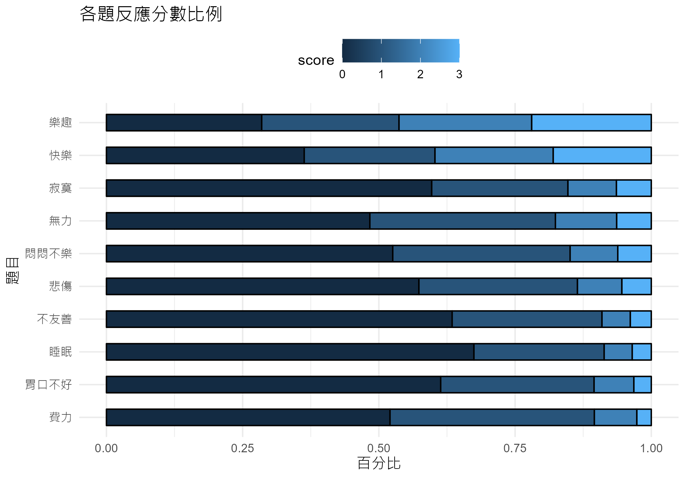

``` r
#多序類資料的Graded response model分析
#預設的 GRM，不要求區辨度相同
#分析時不需要性別
#dta <- dta |> dplyr::select(-性別)
#fitGraded <- mirt::mirt(dta, 1, itemtype = "graded")

fitGraded <-
  dta |> dplyr::select(-性別) |>
   mirt::mirt(1, itemtype = "graded")
```

    Iteration: 1, Log-Lik: -20028.347, Max-Change: 1.28573Iteration: 2, Log-Lik: -19225.820, Max-Change: 0.75528Iteration: 3, Log-Lik: -19027.639, Max-Change: 0.55733Iteration: 4, Log-Lik: -18966.924, Max-Change: 0.45253Iteration: 5, Log-Lik: -18935.906, Max-Change: 0.23699Iteration: 6, Log-Lik: -18917.864, Max-Change: 0.19067Iteration: 7, Log-Lik: -18911.339, Max-Change: 0.08345Iteration: 8, Log-Lik: -18906.796, Max-Change: 0.08208Iteration: 9, Log-Lik: -18904.715, Max-Change: 0.06155Iteration: 10, Log-Lik: -18902.487, Max-Change: 0.02548Iteration: 11, Log-Lik: -18901.590, Max-Change: 0.02634Iteration: 12, Log-Lik: -18901.037, Max-Change: 0.02347Iteration: 13, Log-Lik: -18900.430, Max-Change: 0.01309Iteration: 14, Log-Lik: -18900.241, Max-Change: 0.00976Iteration: 15, Log-Lik: -18900.107, Max-Change: 0.00886Iteration: 16, Log-Lik: -18899.852, Max-Change: 0.00570Iteration: 17, Log-Lik: -18899.791, Max-Change: 0.00581Iteration: 18, Log-Lik: -18899.744, Max-Change: 0.00408Iteration: 19, Log-Lik: -18899.694, Max-Change: 0.00485Iteration: 20, Log-Lik: -18899.666, Max-Change: 0.00330Iteration: 21, Log-Lik: -18899.644, Max-Change: 0.00450Iteration: 22, Log-Lik: -18899.609, Max-Change: 0.00235Iteration: 23, Log-Lik: -18899.598, Max-Change: 0.00194Iteration: 24, Log-Lik: -18899.590, Max-Change: 0.00210Iteration: 25, Log-Lik: -18899.577, Max-Change: 0.00325Iteration: 26, Log-Lik: -18899.567, Max-Change: 0.00322Iteration: 27, Log-Lik: -18899.562, Max-Change: 0.00078Iteration: 28, Log-Lik: -18899.562, Max-Change: 0.00154Iteration: 29, Log-Lik: -18899.559, Max-Change: 0.00078Iteration: 30, Log-Lik: -18899.557, Max-Change: 0.00127Iteration: 31, Log-Lik: -18899.554, Max-Change: 0.00096Iteration: 32, Log-Lik: -18899.552, Max-Change: 0.00053Iteration: 33, Log-Lik: -18899.551, Max-Change: 0.00099Iteration: 34, Log-Lik: -18899.549, Max-Change: 0.00063Iteration: 35, Log-Lik: -18899.548, Max-Change: 0.00021Iteration: 36, Log-Lik: -18899.548, Max-Change: 0.00020Iteration: 37, Log-Lik: -18899.548, Max-Change: 0.00041Iteration: 38, Log-Lik: -18899.547, Max-Change: 0.00049Iteration: 39, Log-Lik: -18899.547, Max-Change: 0.00056Iteration: 40, Log-Lik: -18899.547, Max-Change: 0.00027Iteration: 41, Log-Lik: -18899.547, Max-Change: 0.00031Iteration: 42, Log-Lik: -18899.547, Max-Change: 0.00037Iteration: 43, Log-Lik: -18899.547, Max-Change: 0.00026Iteration: 44, Log-Lik: -18899.546, Max-Change: 0.00031Iteration: 45, Log-Lik: -18899.546, Max-Change: 0.00035Iteration: 46, Log-Lik: -18899.546, Max-Change: 0.00024Iteration: 47, Log-Lik: -18899.546, Max-Change: 0.00027Iteration: 48, Log-Lik: -18899.546, Max-Change: 0.00032Iteration: 49, Log-Lik: -18899.546, Max-Change: 0.00021Iteration: 50, Log-Lik: -18899.546, Max-Change: 0.00026Iteration: 51, Log-Lik: -18899.546, Max-Change: 0.00029Iteration: 52, Log-Lik: -18899.546, Max-Change: 0.00021Iteration: 53, Log-Lik: -18899.546, Max-Change: 0.00023Iteration: 54, Log-Lik: -18899.545, Max-Change: 0.00028Iteration: 55, Log-Lik: -18899.545, Max-Change: 0.00019Iteration: 56, Log-Lik: -18899.545, Max-Change: 0.00022Iteration: 57, Log-Lik: -18899.545, Max-Change: 0.00026Iteration: 58, Log-Lik: -18899.545, Max-Change: 0.00018Iteration: 59, Log-Lik: -18899.545, Max-Change: 0.00021Iteration: 60, Log-Lik: -18899.545, Max-Change: 0.00025Iteration: 61, Log-Lik: -18899.545, Max-Change: 0.00017Iteration: 62, Log-Lik: -18899.545, Max-Change: 0.00020Iteration: 63, Log-Lik: -18899.545, Max-Change: 0.00023Iteration: 64, Log-Lik: -18899.545, Max-Change: 0.00016Iteration: 65, Log-Lik: -18899.545, Max-Change: 0.00018Iteration: 66, Log-Lik: -18899.545, Max-Change: 0.00022Iteration: 67, Log-Lik: -18899.545, Max-Change: 0.00015Iteration: 68, Log-Lik: -18899.545, Max-Change: 0.00018Iteration: 69, Log-Lik: -18899.545, Max-Change: 0.00021Iteration: 70, Log-Lik: -18899.545, Max-Change: 0.00015Iteration: 71, Log-Lik: -18899.544, Max-Change: 0.00017Iteration: 72, Log-Lik: -18899.544, Max-Change: 0.00020Iteration: 73, Log-Lik: -18899.544, Max-Change: 0.00014Iteration: 74, Log-Lik: -18899.544, Max-Change: 0.00016Iteration: 75, Log-Lik: -18899.544, Max-Change: 0.00019Iteration: 76, Log-Lik: -18899.544, Max-Change: 0.00013Iteration: 77, Log-Lik: -18899.544, Max-Change: 0.00015Iteration: 78, Log-Lik: -18899.544, Max-Change: 0.00018Iteration: 79, Log-Lik: -18899.544, Max-Change: 0.00013Iteration: 80, Log-Lik: -18899.544, Max-Change: 0.00015Iteration: 81, Log-Lik: -18899.544, Max-Change: 0.00017Iteration: 82, Log-Lik: -18899.544, Max-Change: 0.00012Iteration: 83, Log-Lik: -18899.544, Max-Change: 0.00014Iteration: 84, Log-Lik: -18899.544, Max-Change: 0.00017Iteration: 85, Log-Lik: -18899.544, Max-Change: 0.00012Iteration: 86, Log-Lik: -18899.544, Max-Change: 0.00014Iteration: 87, Log-Lik: -18899.544, Max-Change: 0.00016Iteration: 88, Log-Lik: -18899.544, Max-Change: 0.00011Iteration: 89, Log-Lik: -18899.544, Max-Change: 0.00013Iteration: 90, Log-Lik: -18899.544, Max-Change: 0.00015Iteration: 91, Log-Lik: -18899.544, Max-Change: 0.00011Iteration: 92, Log-Lik: -18899.544, Max-Change: 0.00013Iteration: 93, Log-Lik: -18899.544, Max-Change: 0.00015Iteration: 94, Log-Lik: -18899.544, Max-Change: 0.00010Iteration: 95, Log-Lik: -18899.544, Max-Change: 0.00012Iteration: 96, Log-Lik: -18899.544, Max-Change: 0.00014Iteration: 97, Log-Lik: -18899.544, Max-Change: 0.00010

``` r
#估計的參數，果然區辨度（a）各題不同 
#程式報表9.10前
coef(fitGraded, IRTpars = TRUE, simplify = TRUE) |> 
  purrr::pluck(1) |> 
  round(2)
```

<table>
<thead>
<tr>
<th style="text-align:left;">
</th>
<th style="text-align:right;">
a
</th>
<th style="text-align:right;">
b1
</th>
<th style="text-align:right;">
b2
</th>
<th style="text-align:right;">
b3
</th>
</tr>
</thead>
<tbody>
<tr>
<td style="text-align:left;">
費力
</td>
<td style="text-align:right;">
1.59
</td>
<td style="text-align:right;">
0.08
</td>
<td style="text-align:right;">
1.82
</td>
<td style="text-align:right;">
2.95
</td>
</tr>
<tr>
<td style="text-align:left;">
睡眠
</td>
<td style="text-align:right;">
1.86
</td>
<td style="text-align:right;">
0.61
</td>
<td style="text-align:right;">
1.84
</td>
<td style="text-align:right;">
2.52
</td>
</tr>
<tr>
<td style="text-align:left;">
無力
</td>
<td style="text-align:right;">
1.52
</td>
<td style="text-align:right;">
-0.03
</td>
<td style="text-align:right;">
1.41
</td>
<td style="text-align:right;">
2.34
</td>
</tr>
<tr>
<td style="text-align:left;">
胃口不好
</td>
<td style="text-align:right;">
1.48
</td>
<td style="text-align:right;">
0.45
</td>
<td style="text-align:right;">
1.90
</td>
<td style="text-align:right;">
2.90
</td>
</tr>
<tr>
<td style="text-align:left;">
悲傷
</td>
<td style="text-align:right;">
3.71
</td>
<td style="text-align:right;">
0.23
</td>
<td style="text-align:right;">
1.18
</td>
<td style="text-align:right;">
1.75
</td>
</tr>
<tr>
<td style="text-align:left;">
寂寞
</td>
<td style="text-align:right;">
3.08
</td>
<td style="text-align:right;">
0.31
</td>
<td style="text-align:right;">
1.15
</td>
<td style="text-align:right;">
1.73
</td>
</tr>
<tr>
<td style="text-align:left;">
悶悶不樂
</td>
<td style="text-align:right;">
3.40
</td>
<td style="text-align:right;">
0.10
</td>
<td style="text-align:right;">
1.15
</td>
<td style="text-align:right;">
1.72
</td>
</tr>
<tr>
<td style="text-align:left;">
不友善
</td>
<td style="text-align:right;">
1.49
</td>
<td style="text-align:right;">
0.52
</td>
<td style="text-align:right;">
2.04
</td>
<td style="text-align:right;">
2.77
</td>
</tr>
<tr>
<td style="text-align:left;">
快樂
</td>
<td style="text-align:right;">
0.30
</td>
<td style="text-align:right;">
-1.86
</td>
<td style="text-align:right;">
1.57
</td>
<td style="text-align:right;">
5.31
</td>
</tr>
<tr>
<td style="text-align:left;">
樂趣
</td>
<td style="text-align:right;">
0.10
</td>
<td style="text-align:right;">
-9.56
</td>
<td style="text-align:right;">
1.68
</td>
<td style="text-align:right;">
13.39
</td>
</tr>
</tbody>
</table>

``` r
#模型適合度指標
#程式報表9.10後
mirt::M2(fitGraded, type = "C2", calcNULL = FALSE) |> round(3)
```

<table>
<thead>
<tr>
<th style="text-align:left;">
</th>
<th style="text-align:right;">
M2
</th>
<th style="text-align:right;">
df
</th>
<th style="text-align:right;">
p
</th>
<th style="text-align:right;">
RMSEA
</th>
<th style="text-align:right;">
RMSEA_5
</th>
<th style="text-align:right;">
RMSEA_95
</th>
<th style="text-align:right;">
SRMSR
</th>
<th style="text-align:right;">
TLI
</th>
<th style="text-align:right;">
CFI
</th>
</tr>
</thead>
<tbody>
<tr>
<td style="text-align:left;">
stats
</td>
<td style="text-align:right;">
1224
</td>
<td style="text-align:right;">
35
</td>
<td style="text-align:right;">
0
</td>
<td style="text-align:right;">
0.13
</td>
<td style="text-align:right;">
0.124
</td>
<td style="text-align:right;">
0.137
</td>
<td style="text-align:right;">
0.106
</td>
<td style="text-align:right;">
0.87
</td>
<td style="text-align:right;">
0.899
</td>
</tr>
</tbody>
</table>

``` r
#測驗訊息函數 
#圖9.10
ggmirt::testInfoPlot(fitGraded, adj_factor = .5)
```

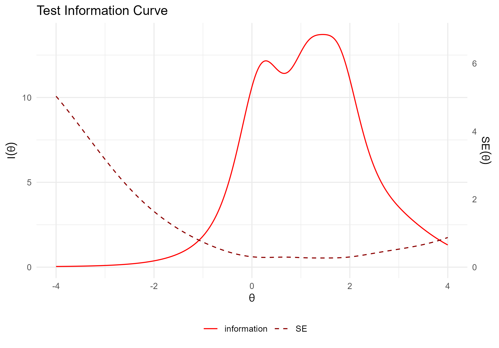

``` r
#題目特徵曲線
#圖9.11
ggmirt::tracePlot(mod=fitGraded) +
  labs(color = "Response") +
  guides(color = guide_legend(nrow = 1))+
  theme(legend.position="top")
```

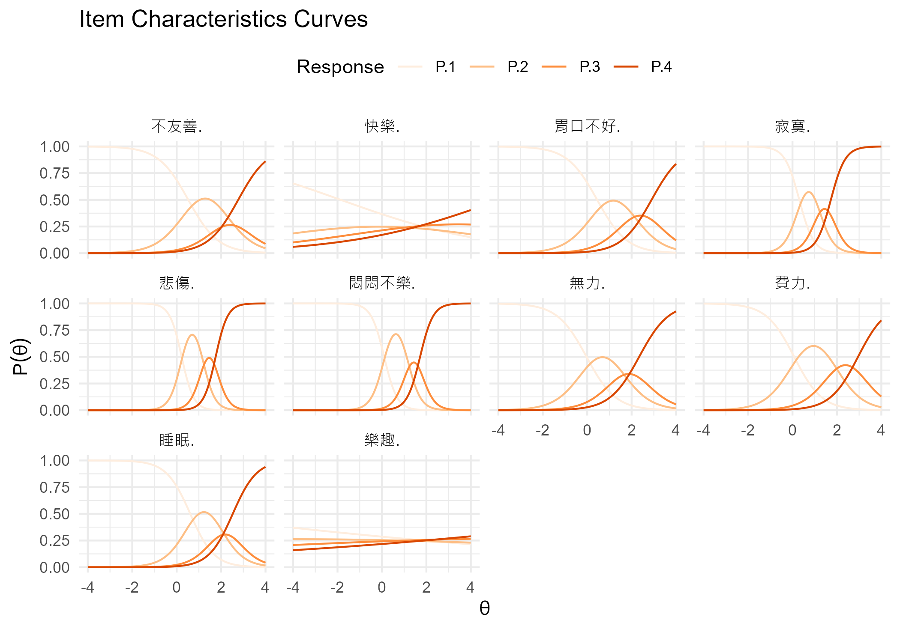

``` r
#題目訊息曲線
#圖9.12
ggmirt::itemInfoPlot(mod=fitGraded, facet = T)
```

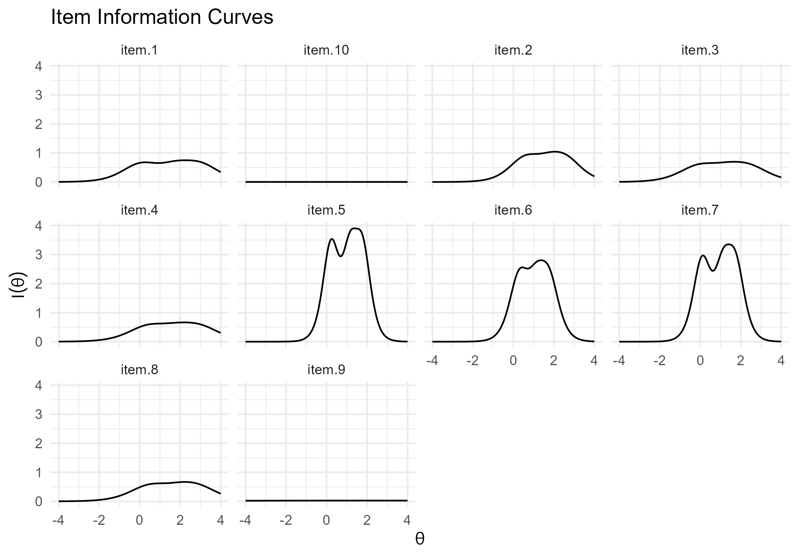

``` r
#題目適合度指標
#程式報表9.11
mirt::itemfit(fitGraded)
```

<table>
<thead>
<tr>
<th style="text-align:left;">
item
</th>
<th style="text-align:right;">
S_X2
</th>
<th style="text-align:right;">
df.S_X2
</th>
<th style="text-align:right;">
RMSEA.S_X2
</th>
<th style="text-align:right;">
p.S_X2
</th>
</tr>
</thead>
<tbody>
<tr>
<td style="text-align:left;">
費力
</td>
<td style="text-align:right;">
179.53
</td>
<td style="text-align:right;">
55
</td>
<td style="text-align:right;">
0.0337
</td>
<td style="text-align:right;">
0.0000
</td>
</tr>
<tr>
<td style="text-align:left;">
睡眠
</td>
<td style="text-align:right;">
83.90
</td>
<td style="text-align:right;">
56
</td>
<td style="text-align:right;">
0.0158
</td>
<td style="text-align:right;">
0.0093
</td>
</tr>
<tr>
<td style="text-align:left;">
無力
</td>
<td style="text-align:right;">
162.41
</td>
<td style="text-align:right;">
55
</td>
<td style="text-align:right;">
0.0313
</td>
<td style="text-align:right;">
0.0000
</td>
</tr>
<tr>
<td style="text-align:left;">
胃口不好
</td>
<td style="text-align:right;">
130.35
</td>
<td style="text-align:right;">
57
</td>
<td style="text-align:right;">
0.0254
</td>
<td style="text-align:right;">
0.0000
</td>
</tr>
<tr>
<td style="text-align:left;">
悲傷
</td>
<td style="text-align:right;">
114.07
</td>
<td style="text-align:right;">
38
</td>
<td style="text-align:right;">
0.0316
</td>
<td style="text-align:right;">
0.0000
</td>
</tr>
<tr>
<td style="text-align:left;">
寂寞
</td>
<td style="text-align:right;">
168.57
</td>
<td style="text-align:right;">
41
</td>
<td style="text-align:right;">
0.0395
</td>
<td style="text-align:right;">
0.0000
</td>
</tr>
<tr>
<td style="text-align:left;">
悶悶不樂
</td>
<td style="text-align:right;">
98.22
</td>
<td style="text-align:right;">
40
</td>
<td style="text-align:right;">
0.0270
</td>
<td style="text-align:right;">
0.0000
</td>
</tr>
<tr>
<td style="text-align:left;">
不友善
</td>
<td style="text-align:right;">
125.07
</td>
<td style="text-align:right;">
57
</td>
<td style="text-align:right;">
0.0244
</td>
<td style="text-align:right;">
0.0000
</td>
</tr>
<tr>
<td style="text-align:left;">
快樂
</td>
<td style="text-align:right;">
578.03
</td>
<td style="text-align:right;">
66
</td>
<td style="text-align:right;">
0.0623
</td>
<td style="text-align:right;">
0.0000
</td>
</tr>
<tr>
<td style="text-align:left;">
樂趣
</td>
<td style="text-align:right;">
447.07
</td>
<td style="text-align:right;">
66
</td>
<td style="text-align:right;">
0.0537
</td>
<td style="text-align:right;">
0.0000
</td>
</tr>
</tbody>
</table>

``` r
#個人配適指標
#程式報表9.12
mirt::personfit(fitGraded) |> head(3) 
```

<table>
<thead>
<tr>
<th style="text-align:right;">
outfit
</th>
<th style="text-align:right;">
z.outfit
</th>
<th style="text-align:right;">
infit
</th>
<th style="text-align:right;">
z.infit
</th>
<th style="text-align:right;">
Zh
</th>
</tr>
</thead>
<tbody>
<tr>
<td style="text-align:right;">
0.4958
</td>
<td style="text-align:right;">
-1.1880
</td>
<td style="text-align:right;">
0.6326
</td>
<td style="text-align:right;">
-0.8922
</td>
<td style="text-align:right;">
1.1607
</td>
</tr>
<tr>
<td style="text-align:right;">
0.5718
</td>
<td style="text-align:right;">
-0.7172
</td>
<td style="text-align:right;">
0.4260
</td>
<td style="text-align:right;">
-1.4267
</td>
<td style="text-align:right;">
-0.2860
</td>
</tr>
<tr>
<td style="text-align:right;">
0.8296
</td>
<td style="text-align:right;">
-0.2309
</td>
<td style="text-align:right;">
0.7253
</td>
<td style="text-align:right;">
-0.5985
</td>
<td style="text-align:right;">
-0.2997
</td>
</tr>
</tbody>
</table>

## Model comparison

``` r
#GRM 並不假設區辨度相同，對應於二元資料的二參數模型
#此處與限制區辨度相同的 GRM（對應於二元資料的Rasch模型）做模型比較
#先找到區辨參數（a1）的位置，待作後用
prm_lst <-
  dta |> dplyr::select(-性別) |>
  mirt::mirt(1, itemtype="graded", pars = 'values')
which(prm_lst$name=='a1')
```

     [1]  1  5  9 13 17 21 25 29 33 37

``` r
#要求區辨度相同的GRM
grm1 <- 
  dta |> dplyr::select(-性別) |>
  mirt::mirt(1, itemtype = "graded", verbose = FALSE,
                   constrain = list(c(1,5,9,13,17,21,25,29,33,37)))
```

``` r
#看一下模型參數，果然 a 現在都一樣了
#程式報表9.13前
coef(grm1, IRTpars = TRUE, simplify = TRUE) |> 
  purrr::pluck(1) |>
  round(2)
```

<table>
<thead>
<tr>
<th style="text-align:left;">
</th>
<th style="text-align:right;">
a
</th>
<th style="text-align:right;">
b1
</th>
<th style="text-align:right;">
b2
</th>
<th style="text-align:right;">
b3
</th>
</tr>
</thead>
<tbody>
<tr>
<td style="text-align:left;">
費力
</td>
<td style="text-align:right;">
1.39
</td>
<td style="text-align:right;">
0.06
</td>
<td style="text-align:right;">
2.00
</td>
<td style="text-align:right;">
3.27
</td>
</tr>
<tr>
<td style="text-align:left;">
睡眠
</td>
<td style="text-align:right;">
1.39
</td>
<td style="text-align:right;">
0.69
</td>
<td style="text-align:right;">
2.21
</td>
<td style="text-align:right;">
3.05
</td>
</tr>
<tr>
<td style="text-align:left;">
無力
</td>
<td style="text-align:right;">
1.39
</td>
<td style="text-align:right;">
-0.05
</td>
<td style="text-align:right;">
1.49
</td>
<td style="text-align:right;">
2.50
</td>
</tr>
<tr>
<td style="text-align:left;">
胃口不好
</td>
<td style="text-align:right;">
1.39
</td>
<td style="text-align:right;">
0.45
</td>
<td style="text-align:right;">
2.00
</td>
<td style="text-align:right;">
3.06
</td>
</tr>
<tr>
<td style="text-align:left;">
悲傷
</td>
<td style="text-align:right;">
1.39
</td>
<td style="text-align:right;">
0.25
</td>
<td style="text-align:right;">
1.77
</td>
<td style="text-align:right;">
2.71
</td>
</tr>
<tr>
<td style="text-align:left;">
寂寞
</td>
<td style="text-align:right;">
1.39
</td>
<td style="text-align:right;">
0.36
</td>
<td style="text-align:right;">
1.64
</td>
<td style="text-align:right;">
2.54
</td>
</tr>
<tr>
<td style="text-align:left;">
悶悶不樂
</td>
<td style="text-align:right;">
1.39
</td>
<td style="text-align:right;">
0.07
</td>
<td style="text-align:right;">
1.69
</td>
<td style="text-align:right;">
2.59
</td>
</tr>
<tr>
<td style="text-align:left;">
不友善
</td>
<td style="text-align:right;">
1.39
</td>
<td style="text-align:right;">
0.53
</td>
<td style="text-align:right;">
2.15
</td>
<td style="text-align:right;">
2.94
</td>
</tr>
<tr>
<td style="text-align:left;">
快樂
</td>
<td style="text-align:right;">
1.39
</td>
<td style="text-align:right;">
-0.44
</td>
<td style="text-align:right;">
0.50
</td>
<td style="text-align:right;">
1.45
</td>
</tr>
<tr>
<td style="text-align:left;">
樂趣
</td>
<td style="text-align:right;">
1.39
</td>
<td style="text-align:right;">
-0.75
</td>
<td style="text-align:right;">
0.25
</td>
<td style="text-align:right;">
1.19
</td>
</tr>
</tbody>
</table>

``` r
#不要求區辨度相同的二參數模型表現較佳
#程式報表9.13後
anova(grm1, fitGraded)
```

<table>
<thead>
<tr>
<th style="text-align:left;">
</th>
<th style="text-align:right;">
AIC
</th>
<th style="text-align:right;">
SABIC
</th>
<th style="text-align:right;">
HQ
</th>
<th style="text-align:right;">
BIC
</th>
<th style="text-align:right;">
logLik
</th>
<th style="text-align:right;">
X2
</th>
<th style="text-align:right;">
df
</th>
<th style="text-align:right;">
p
</th>
</tr>
</thead>
<tbody>
<tr>
<td style="text-align:left;">
grm1
</td>
<td style="text-align:right;">
39598
</td>
<td style="text-align:right;">
39674
</td>
<td style="text-align:right;">
39662
</td>
<td style="text-align:right;">
39772
</td>
<td style="text-align:right;">
-19768
</td>
<td style="text-align:right;">
NA
</td>
<td style="text-align:right;">
NA
</td>
<td style="text-align:right;">
NA
</td>
</tr>
<tr>
<td style="text-align:left;">
fitGraded
</td>
<td style="text-align:right;">
37879
</td>
<td style="text-align:right;">
37976
</td>
<td style="text-align:right;">
37961
</td>
<td style="text-align:right;">
38103
</td>
<td style="text-align:right;">
-18900
</td>
<td style="text-align:right;">
1737
</td>
<td style="text-align:right;">
9
</td>
<td style="text-align:right;">
0
</td>
</tr>
</tbody>
</table>

``` r
#去除題目配適較差之樂趣與快樂兩題
fitGraded1 <-
  dta |> dplyr::select(-c(性別, 樂趣, 快樂)) |>
   mirt::mirt(1, itemtype = "graded")
```

    Iteration: 1, Log-Lik: -14393.916, Max-Change: 1.32520Iteration: 2, Log-Lik: -13735.889, Max-Change: 1.03947Iteration: 3, Log-Lik: -13570.427, Max-Change: 0.47889Iteration: 4, Log-Lik: -13511.642, Max-Change: 0.37292Iteration: 5, Log-Lik: -13488.709, Max-Change: 0.20648Iteration: 6, Log-Lik: -13475.256, Max-Change: 0.13589Iteration: 7, Log-Lik: -13468.019, Max-Change: 0.09500Iteration: 8, Log-Lik: -13463.411, Max-Change: 0.07936Iteration: 9, Log-Lik: -13460.511, Max-Change: 0.05915Iteration: 10, Log-Lik: -13458.099, Max-Change: 0.03852Iteration: 11, Log-Lik: -13456.925, Max-Change: 0.02764Iteration: 12, Log-Lik: -13456.083, Max-Change: 0.02233Iteration: 13, Log-Lik: -13455.041, Max-Change: 0.01914Iteration: 14, Log-Lik: -13454.663, Max-Change: 0.01439Iteration: 15, Log-Lik: -13454.340, Max-Change: 0.01094Iteration: 16, Log-Lik: -13453.591, Max-Change: 0.01060Iteration: 17, Log-Lik: -13453.488, Max-Change: 0.00805Iteration: 18, Log-Lik: -13453.403, Max-Change: 0.00643Iteration: 19, Log-Lik: -13453.142, Max-Change: 0.00362Iteration: 20, Log-Lik: -13453.121, Max-Change: 0.00291Iteration: 21, Log-Lik: -13453.105, Max-Change: 0.00241Iteration: 22, Log-Lik: -13453.085, Max-Change: 0.00319Iteration: 23, Log-Lik: -13453.075, Max-Change: 0.00199Iteration: 24, Log-Lik: -13453.068, Max-Change: 0.00138Iteration: 25, Log-Lik: -13453.053, Max-Change: 0.00410Iteration: 26, Log-Lik: -13453.048, Max-Change: 0.00115Iteration: 27, Log-Lik: -13453.045, Max-Change: 0.00168Iteration: 28, Log-Lik: -13453.038, Max-Change: 0.00205Iteration: 29, Log-Lik: -13453.036, Max-Change: 0.00084Iteration: 30, Log-Lik: -13453.035, Max-Change: 0.00069Iteration: 31, Log-Lik: -13453.033, Max-Change: 0.00077Iteration: 32, Log-Lik: -13453.032, Max-Change: 0.00029Iteration: 33, Log-Lik: -13453.032, Max-Change: 0.00012Iteration: 34, Log-Lik: -13453.031, Max-Change: 0.00060Iteration: 35, Log-Lik: -13453.031, Max-Change: 0.00054Iteration: 36, Log-Lik: -13453.031, Max-Change: 0.00016Iteration: 37, Log-Lik: -13453.031, Max-Change: 0.00070Iteration: 38, Log-Lik: -13453.030, Max-Change: 0.00031Iteration: 39, Log-Lik: -13453.030, Max-Change: 0.00044Iteration: 40, Log-Lik: -13453.030, Max-Change: 0.00029Iteration: 41, Log-Lik: -13453.030, Max-Change: 0.00041Iteration: 42, Log-Lik: -13453.030, Max-Change: 0.00017Iteration: 43, Log-Lik: -13453.030, Max-Change: 0.00014Iteration: 44, Log-Lik: -13453.030, Max-Change: 0.00034Iteration: 45, Log-Lik: -13453.030, Max-Change: 0.00048Iteration: 46, Log-Lik: -13453.030, Max-Change: 0.00034Iteration: 47, Log-Lik: -13453.030, Max-Change: 0.00040Iteration: 48, Log-Lik: -13453.029, Max-Change: 0.00023Iteration: 49, Log-Lik: -13453.029, Max-Change: 0.00017Iteration: 50, Log-Lik: -13453.029, Max-Change: 0.00029Iteration: 51, Log-Lik: -13453.029, Max-Change: 0.00010

``` r
mirt::M2(fitGraded1, type = "C2", calcNULL = FALSE) |> round(3)
```

<table>
<thead>
<tr>
<th style="text-align:left;">
</th>
<th style="text-align:right;">
M2
</th>
<th style="text-align:right;">
df
</th>
<th style="text-align:right;">
p
</th>
<th style="text-align:right;">
RMSEA
</th>
<th style="text-align:right;">
RMSEA_5
</th>
<th style="text-align:right;">
RMSEA_95
</th>
<th style="text-align:right;">
SRMSR
</th>
<th style="text-align:right;">
TLI
</th>
<th style="text-align:right;">
CFI
</th>
</tr>
</thead>
<tbody>
<tr>
<td style="text-align:left;">
stats
</td>
<td style="text-align:right;">
307.7
</td>
<td style="text-align:right;">
20
</td>
<td style="text-align:right;">
0
</td>
<td style="text-align:right;">
0.085
</td>
<td style="text-align:right;">
0.077
</td>
<td style="text-align:right;">
0.093
</td>
<td style="text-align:right;">
0.053
</td>
<td style="text-align:right;">
0.962
</td>
<td style="text-align:right;">
0.973
</td>
</tr>
</tbody>
</table>

# References

Masur, P.K. (2022). ggmirt: Plotting functions to extend “mirt” for IRT
analyses. R package version 0.1.0.

Schlechter, P., Ford, T.J., & Neufeld, S.A.S. (2022). The Eight-Item
Center for Epidemiological Studies Depression Scale in the English
Longitudinal Study of Aging: Longitudinal and Gender Invariance, Sum
Score Models, and External Associations. Assessment, 0(0).
<https://doi.org/10.1177/10731911221138930>

Chang, K.-F., & Weng, L.-J. (2013). Screening for depressive symptoms
among older adults in Taiwan: Cutoff of a short form of the Center for
Epidemiologic Studies Depression Scale. Scientific Research: Health,
5(3A). 588-594. DOI: 10.4236/health.2013.53A078
