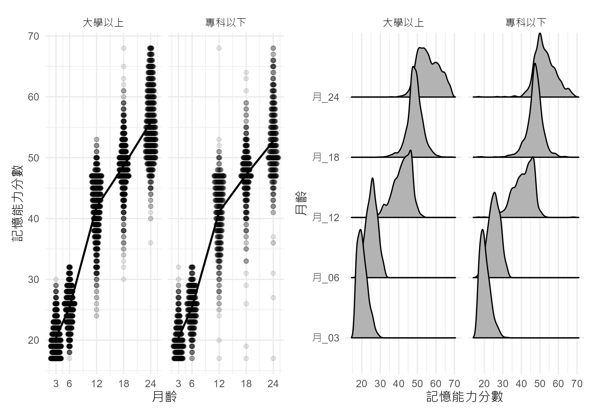
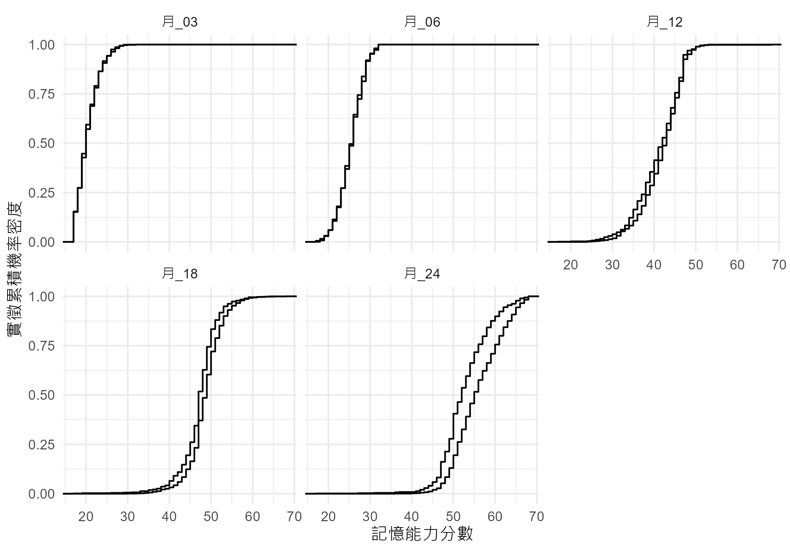
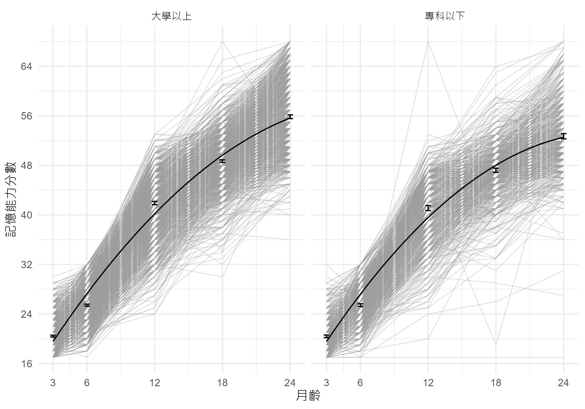
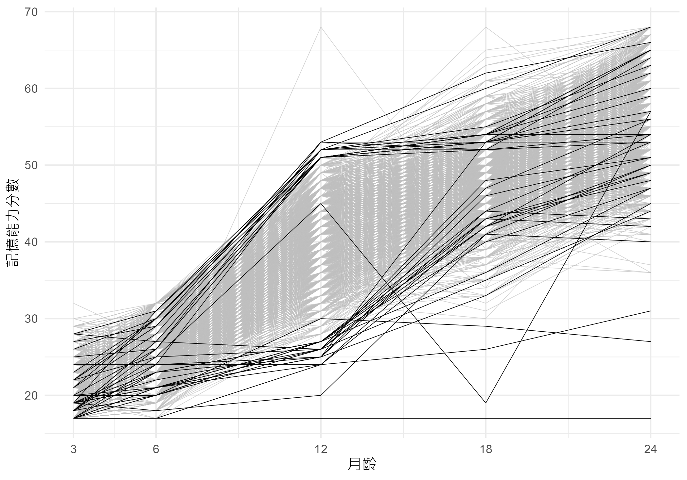
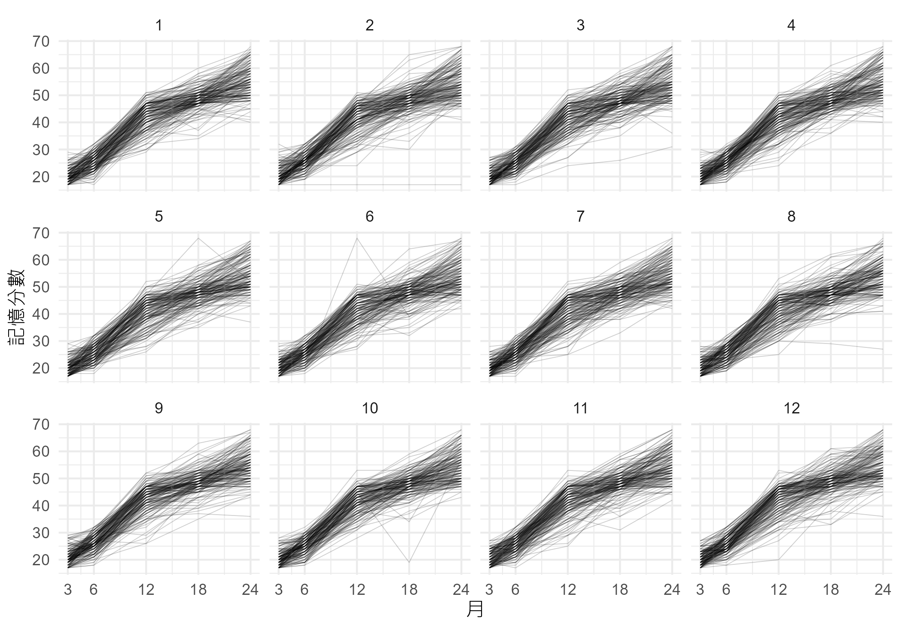
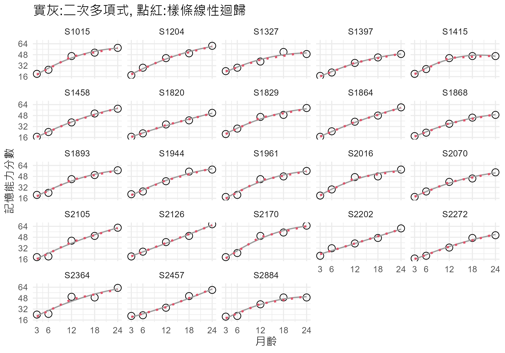
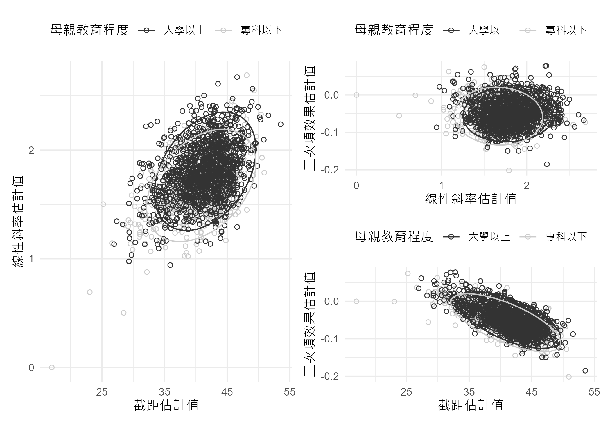
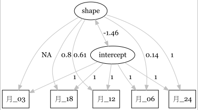
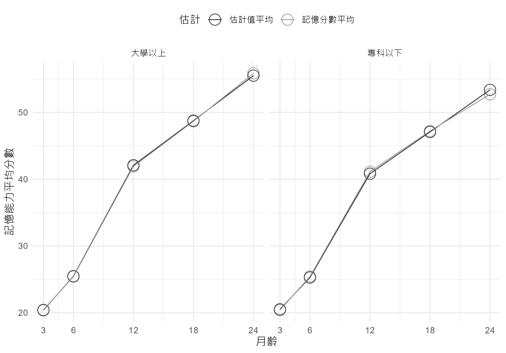
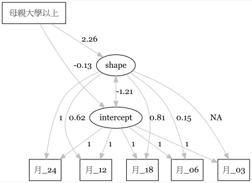

第十章: 潛在成長模型分析
================

# 資料與管理

``` r
#讀取檔案
dta <- read.csv('../Data/KIT_memory.csv', 
                header=T, stringsAsFactors = TRUE)
```

``` r
#看資料結構
#程式報表10.1
dim(dta)
```

    [1] 2000    7

``` r
#檢視資料格式與前六筆
head(dta)
```

<table>
<thead>
<tr>
<th style="text-align:left;">
識別碼
</th>
<th style="text-align:left;">
母親教育程度
</th>
<th style="text-align:right;">
月_03
</th>
<th style="text-align:right;">
月_06
</th>
<th style="text-align:right;">
月_12
</th>
<th style="text-align:right;">
月_18
</th>
<th style="text-align:right;">
月_24
</th>
</tr>
</thead>
<tbody>
<tr>
<td style="text-align:left;">
S1001
</td>
<td style="text-align:left;">
大學以上
</td>
<td style="text-align:right;">
20
</td>
<td style="text-align:right;">
32
</td>
<td style="text-align:right;">
51
</td>
<td style="text-align:right;">
52
</td>
<td style="text-align:right;">
63
</td>
</tr>
<tr>
<td style="text-align:left;">
S1002
</td>
<td style="text-align:left;">
大學以上
</td>
<td style="text-align:right;">
22
</td>
<td style="text-align:right;">
29
</td>
<td style="text-align:right;">
36
</td>
<td style="text-align:right;">
54
</td>
<td style="text-align:right;">
65
</td>
</tr>
<tr>
<td style="text-align:left;">
S1003
</td>
<td style="text-align:left;">
大學以上
</td>
<td style="text-align:right;">
20
</td>
<td style="text-align:right;">
28
</td>
<td style="text-align:right;">
48
</td>
<td style="text-align:right;">
58
</td>
<td style="text-align:right;">
72
</td>
</tr>
<tr>
<td style="text-align:left;">
S1004
</td>
<td style="text-align:left;">
專科以下
</td>
<td style="text-align:right;">
26
</td>
<td style="text-align:right;">
29
</td>
<td style="text-align:right;">
53
</td>
<td style="text-align:right;">
62
</td>
<td style="text-align:right;">
68
</td>
</tr>
<tr>
<td style="text-align:left;">
S1005
</td>
<td style="text-align:left;">
大學以上
</td>
<td style="text-align:right;">
28
</td>
<td style="text-align:right;">
35
</td>
<td style="text-align:right;">
58
</td>
<td style="text-align:right;">
65
</td>
<td style="text-align:right;">
70
</td>
</tr>
<tr>
<td style="text-align:left;">
S1006
</td>
<td style="text-align:left;">
大學以上
</td>
<td style="text-align:right;">
25
</td>
<td style="text-align:right;">
31
</td>
<td style="text-align:right;">
45
</td>
<td style="text-align:right;">
54
</td>
<td style="text-align:right;">
68
</td>
</tr>
</tbody>
</table>

``` r
#寬資料轉成長資料
#也另外製造「月」，以及將月置中的「月置中」變項
dtaL <- dta |> 
  tidyr::pivot_longer(cols=3:7,
                      names_to ='月齡',  
                      values_to = '記憶分數') |>
  dplyr::mutate(月 = parse_number(月齡), 
                月置中 = scale(月, scale = F)[,1])
```

``` r
#程式報表10.2
head(dtaL)
```

<table>
<thead>
<tr>
<th style="text-align:left;">
識別碼
</th>
<th style="text-align:left;">
母親教育程度
</th>
<th style="text-align:left;">
月齡
</th>
<th style="text-align:right;">
記憶分數
</th>
<th style="text-align:right;">
月
</th>
<th style="text-align:right;">
月置中
</th>
</tr>
</thead>
<tbody>
<tr>
<td style="text-align:left;">
S1001
</td>
<td style="text-align:left;">
大學以上
</td>
<td style="text-align:left;">
月_03
</td>
<td style="text-align:right;">
20
</td>
<td style="text-align:right;">
3
</td>
<td style="text-align:right;">
-9.6
</td>
</tr>
<tr>
<td style="text-align:left;">
S1001
</td>
<td style="text-align:left;">
大學以上
</td>
<td style="text-align:left;">
月_06
</td>
<td style="text-align:right;">
32
</td>
<td style="text-align:right;">
6
</td>
<td style="text-align:right;">
-6.6
</td>
</tr>
<tr>
<td style="text-align:left;">
S1001
</td>
<td style="text-align:left;">
大學以上
</td>
<td style="text-align:left;">
月_12
</td>
<td style="text-align:right;">
51
</td>
<td style="text-align:right;">
12
</td>
<td style="text-align:right;">
-0.6
</td>
</tr>
<tr>
<td style="text-align:left;">
S1001
</td>
<td style="text-align:left;">
大學以上
</td>
<td style="text-align:left;">
月_18
</td>
<td style="text-align:right;">
52
</td>
<td style="text-align:right;">
18
</td>
<td style="text-align:right;">
5.4
</td>
</tr>
<tr>
<td style="text-align:left;">
S1001
</td>
<td style="text-align:left;">
大學以上
</td>
<td style="text-align:left;">
月_24
</td>
<td style="text-align:right;">
63
</td>
<td style="text-align:right;">
24
</td>
<td style="text-align:right;">
11.4
</td>
</tr>
<tr>
<td style="text-align:left;">
S1002
</td>
<td style="text-align:left;">
大學以上
</td>
<td style="text-align:left;">
月_03
</td>
<td style="text-align:right;">
22
</td>
<td style="text-align:right;">
3
</td>
<td style="text-align:right;">
-9.6
</td>
</tr>
</tbody>
</table>

``` r
#看五波的平均數與變異數，母親教育程度的影響在月齡較大時顯現
#程式報表10.3
dtaL |> 
  tidyr::unite("月齡母親教育程度", 月齡, 母親教育程度) |>
  dplyr::select("月齡母親教育程度", "記憶分數") |>
  gtsummary::tbl_summary(by=月齡母親教育程度,
            digits=list(記憶分數 ~ c(1, 2)),
            type = all_continuous() ~ "continuous2",
            statistic = list(all_continuous() ~ "{mean} ({sd})")) |>                          
  modify_header(label ~ "**變項**") 
```

``` r
#看看偏態與峰度
#程式報表10.4前
dtaL |> 
  dplyr::group_by(月齡, 母親教育程度) |>
  dplyr::reframe(平均 = mean(記憶分數),
                 標準差 = sd(記憶分數),
                 偏度 = moments::skewness(記憶分數),
                 峰度 = moments::kurtosis(記憶分數))
```

<table>
<thead>
<tr>
<th style="text-align:left;">
月齡
</th>
<th style="text-align:left;">
母親教育程度
</th>
<th style="text-align:right;">
平均
</th>
<th style="text-align:right;">
標準差
</th>
<th style="text-align:right;">
偏度
</th>
<th style="text-align:right;">
峰度
</th>
</tr>
</thead>
<tbody>
<tr>
<td style="text-align:left;">
月_03
</td>
<td style="text-align:left;">
大學以上
</td>
<td style="text-align:right;">
25.85
</td>
<td style="text-align:right;">
3.185
</td>
<td style="text-align:right;">
0.4695
</td>
<td style="text-align:right;">
2.791
</td>
</tr>
<tr>
<td style="text-align:left;">
月_03
</td>
<td style="text-align:left;">
專科以下
</td>
<td style="text-align:right;">
25.92
</td>
<td style="text-align:right;">
3.315
</td>
<td style="text-align:right;">
0.6159
</td>
<td style="text-align:right;">
3.051
</td>
</tr>
<tr>
<td style="text-align:left;">
月_06
</td>
<td style="text-align:left;">
大學以上
</td>
<td style="text-align:right;">
31.37
</td>
<td style="text-align:right;">
3.071
</td>
<td style="text-align:right;">
-0.2157
</td>
<td style="text-align:right;">
2.774
</td>
</tr>
<tr>
<td style="text-align:left;">
月_06
</td>
<td style="text-align:left;">
專科以下
</td>
<td style="text-align:right;">
31.36
</td>
<td style="text-align:right;">
3.288
</td>
<td style="text-align:right;">
-0.2724
</td>
<td style="text-align:right;">
2.742
</td>
</tr>
<tr>
<td style="text-align:left;">
月_12
</td>
<td style="text-align:left;">
大學以上
</td>
<td style="text-align:right;">
52.13
</td>
<td style="text-align:right;">
5.825
</td>
<td style="text-align:right;">
-0.7532
</td>
<td style="text-align:right;">
3.355
</td>
</tr>
<tr>
<td style="text-align:left;">
月_12
</td>
<td style="text-align:left;">
專科以下
</td>
<td style="text-align:right;">
51.48
</td>
<td style="text-align:right;">
6.175
</td>
<td style="text-align:right;">
-0.8872
</td>
<td style="text-align:right;">
3.888
</td>
</tr>
<tr>
<td style="text-align:left;">
月_18
</td>
<td style="text-align:left;">
大學以上
</td>
<td style="text-align:right;">
59.70
</td>
<td style="text-align:right;">
4.717
</td>
<td style="text-align:right;">
-0.2169
</td>
<td style="text-align:right;">
4.995
</td>
</tr>
<tr>
<td style="text-align:left;">
月_18
</td>
<td style="text-align:left;">
專科以下
</td>
<td style="text-align:right;">
58.22
</td>
<td style="text-align:right;">
5.008
</td>
<td style="text-align:right;">
-1.1335
</td>
<td style="text-align:right;">
7.628
</td>
</tr>
<tr>
<td style="text-align:left;">
月_24
</td>
<td style="text-align:left;">
大學以上
</td>
<td style="text-align:right;">
67.11
</td>
<td style="text-align:right;">
6.172
</td>
<td style="text-align:right;">
-0.0005
</td>
<td style="text-align:right;">
2.723
</td>
</tr>
<tr>
<td style="text-align:left;">
月_24
</td>
<td style="text-align:left;">
專科以下
</td>
<td style="text-align:right;">
64.25
</td>
<td style="text-align:right;">
6.082
</td>
<td style="text-align:right;">
-0.2496
</td>
<td style="text-align:right;">
6.240
</td>
</tr>
</tbody>
</table>

``` r
#歷次分數間相關
#程式報表10.4後
dta |> 
  dplyr::select(where(is.numeric)) |> 
  cor() |> 
  round(3)
```

<table>
<thead>
<tr>
<th style="text-align:left;">
</th>
<th style="text-align:right;">
月_03
</th>
<th style="text-align:right;">
月_06
</th>
<th style="text-align:right;">
月_12
</th>
<th style="text-align:right;">
月_18
</th>
<th style="text-align:right;">
月_24
</th>
</tr>
</thead>
<tbody>
<tr>
<td style="text-align:left;">
月_03
</td>
<td style="text-align:right;">
1.000
</td>
<td style="text-align:right;">
0.479
</td>
<td style="text-align:right;">
0.326
</td>
<td style="text-align:right;">
0.229
</td>
<td style="text-align:right;">
0.174
</td>
</tr>
<tr>
<td style="text-align:left;">
月_06
</td>
<td style="text-align:right;">
0.479
</td>
<td style="text-align:right;">
1.000
</td>
<td style="text-align:right;">
0.426
</td>
<td style="text-align:right;">
0.317
</td>
<td style="text-align:right;">
0.216
</td>
</tr>
<tr>
<td style="text-align:left;">
月_12
</td>
<td style="text-align:right;">
0.326
</td>
<td style="text-align:right;">
0.426
</td>
<td style="text-align:right;">
1.000
</td>
<td style="text-align:right;">
0.547
</td>
<td style="text-align:right;">
0.416
</td>
</tr>
<tr>
<td style="text-align:left;">
月_18
</td>
<td style="text-align:right;">
0.229
</td>
<td style="text-align:right;">
0.317
</td>
<td style="text-align:right;">
0.547
</td>
<td style="text-align:right;">
1.000
</td>
<td style="text-align:right;">
0.590
</td>
</tr>
<tr>
<td style="text-align:left;">
月_24
</td>
<td style="text-align:right;">
0.174
</td>
<td style="text-align:right;">
0.216
</td>
<td style="text-align:right;">
0.416
</td>
<td style="text-align:right;">
0.590
</td>
<td style="text-align:right;">
1.000
</td>
</tr>
</tbody>
</table>

# 繪圖

``` r
#繪製不同母親教育程度五波圖
#圖10.1a
p1 <- ggplot(data = dtaL, 
       aes(x = 月, y = 記憶分數)) +
 ggbeeswarm::geom_quasirandom(aes(group=月), alpha=.1)+
 facet_wrap(vars(母親教育程度))+
 stat_summary(fun = mean, geom = 'line', linewidth=.8) +
 scale_x_continuous(breaks=c(3,6,12,18,24))+
 labs(x = '月齡', 
      y = '記憶能力分數') +
 theme(legend.position = 'top')
```

``` r
#看五波的直方圖
#圖10.1b
p2 <- ggplot(dtaL, 
       aes(x=記憶分數, y=月齡)) +
  ggridges::geom_density_ridges2()+
  scale_x_continuous(breaks=seq(10, 70, by=10))+
  facet_wrap(vars(母親教育程度))+
  labs(x = '記憶能力分數', 
       y = '月齡')
p1+p2
```



``` r
#不同母親教育程度下的實徵累積機率密度圖
#圖10.2
ggplot(dtaL,
       aes(x=記憶分數, group=母親教育程度)) +
  stat_ecdf()+
  facet_wrap(vars(月齡))+
  labs(x="記憶能力分數",
       y="實徵累積機率密度")
```



``` r
#看看個別資料，畫上迴歸線並配上區間
#圖10.3
ggplot(data = dtaL, 
       aes(y=記憶分數, x=月)) +
 geom_line(aes(group = 識別碼), 
           linewidth = .2,
           alpha=.5,
           col=8) +
 stat_summary(fun.data = 'mean_cl_boot', geom = "errorbar", width = 0.5) +
 stat_smooth(method="lm", 
             formula= y ~ poly(x, 2),
             se=FALSE, 
             col=1, 
             linewidth=.5)+
 facet_wrap(vars(母親教育程度))+
 scale_x_continuous(breaks=c(3, 6, 12, 18, 24))+
 scale_y_continuous(breaks=seq(8, 72, by=8))+
 labs(x = '月齡', 
      y = '記憶能力分數')
```



``` r
#前述圖形看起來不完全是線性，後續進一步探索
#將資料框轉成 tsibble，方便後續使用
dta_tb <- brolgar::as_tsibble(x = dtaL,
                             key = 識別碼,
                             index = 月,
                             regular = FALSE)
```

``` r
#brolgar套件的features功能，可以計算每個幼兒記憶分數的五數綜合（含中位數）
#利用gghighlight，在繪圖時，特別強調中位數特別高或低的幼兒資料
#圖10.4
dta_tb |>
  brolgar::features(記憶分數, feat_five_num) |>
  dplyr::left_join(dta_tb, by = '識別碼') |>
  ggplot(aes(x = 月,
             y = 記憶分數,
             group = 識別碼)) +
  geom_line(linewidth=.2) + 
  gghighlight::gghighlight(med > 50 | med < 28, 
                           label_key = 識別碼,
                           use_direct_label = FALSE)+
   scale_x_continuous(breaks=c(3, 6, 12, 18, 24))+
  labs(x = '月齡', 
      y = '記憶能力分數')
```



``` r
#brolgar套件中的facet_strata()，預設將資料分成12組，助於探索資料
#看看個別資料
#圖10.5
dta_tb |>
  ggplot(aes(x = 月,
             y = 記憶分數,
             group = 識別碼)) + 
  #geom_point()+
  geom_line(alpha=.2, linewidth=.2)+
  brolgar::facet_strata()+
  scale_x_continuous(breaks=c(3, 6, 12, 18, 24))
```



``` r
#隨機取23位來看一下資料
#前面觀察到資料並非線性，嘗試以二次式迴歸配適資料
#為對比二次式，也用樣條迴歸（spline regression）配適資料
#圖10.6
set.seed(18072023)
dta |> dplyr::slice_sample(n=23) |>
  tidyr::pivot_longer(cols=3:7,
                      names_to ='月齡',  
                      values_to = '記憶分數') |>
  dplyr::mutate(月 = parse_number(月齡)) |>
  ggplot()+
  aes(x=月, y=記憶分數)+
  geom_point(pch=1, size=rel(3))+
  stat_smooth(method='lm', formula= y ~ poly(x, 2), 
              col=8,
              alpha=.5,
              linewidth=.6,
              se=FALSE)+
  stat_smooth(method='lm', 
         formula = y ~ splines::bs(x, knots = c(3, 12, 24), degree = 1),
              col=2,
              linetype='dotted',
              linewidth=1,
              se=FALSE)+
  facet_wrap(vars(識別碼)) +
  scale_x_continuous(breaks=c(3, 6, 12, 18, 24))+
  scale_y_continuous(breaks=seq(16, 72, by=16))+
  labs(x = '月齡', 
       y = '記憶能力分數',
       title="實灰:二次多項式, 點紅:樣條線性迴歸")
```



## 二次多項式迴歸

``` r
#以nlme，做每個人的迴歸線
m1 <- nlme::lmList(記憶分數 ~ 月置中 + I(月置中^2) | 識別碼, data = dtaL, subset=母親教育程度=='專科以下') |> 
  coef() |> 
  as.data.frame() |>
  dplyr::mutate(母親教育程度='專科以下')

m2 <- nlme::lmList(記憶分數 ~ 月置中 + I(月置中^2) | 識別碼, data = dtaL, subset=母親教育程度=='大學以上') |> 
  coef() |> 
  as.data.frame() |>
  dplyr::mutate(母親教育程度='大學以上')

m12 <- rbind(m1, m2)
names(m12)[1:3] <- c("b0", "b1", "b2")
```

``` r
#截距、一次式與二次式係數間的相關
cor(m12[,-4])
```

<table>
<thead>
<tr>
<th style="text-align:left;">
</th>
<th style="text-align:right;">
b0
</th>
<th style="text-align:right;">
b1
</th>
<th style="text-align:right;">
b2
</th>
</tr>
</thead>
<tbody>
<tr>
<td style="text-align:left;">
b0
</td>
<td style="text-align:right;">
1.0000
</td>
<td style="text-align:right;">
0.4546
</td>
<td style="text-align:right;">
-0.7011
</td>
</tr>
<tr>
<td style="text-align:left;">
b1
</td>
<td style="text-align:right;">
0.4546
</td>
<td style="text-align:right;">
1.0000
</td>
<td style="text-align:right;">
-0.0905
</td>
</tr>
<tr>
<td style="text-align:left;">
b2
</td>
<td style="text-align:right;">
-0.7011
</td>
<td style="text-align:right;">
-0.0905
</td>
<td style="text-align:right;">
1.0000
</td>
</tr>
</tbody>
</table>

``` r
#看看母親教育程度對係數的影響
#程式報表10.5
m12 |> 
  gtsummary::tbl_summary(by=母親教育程度,
                         statistic = list(all_continuous() ~ "{mean} ({sd})"))
```

<div id="piviasaiav" style="padding-left:0px;padding-right:0px;padding-top:10px;padding-bottom:10px;overflow-x:auto;overflow-y:auto;width:auto;height:auto;">
<style>#piviasaiav table {
  font-family: system-ui, 'Segoe UI', Roboto, Helvetica, Arial, sans-serif, 'Apple Color Emoji', 'Segoe UI Emoji', 'Segoe UI Symbol', 'Noto Color Emoji';
  -webkit-font-smoothing: antialiased;
  -moz-osx-font-smoothing: grayscale;
}
&#10;#piviasaiav thead, #piviasaiav tbody, #piviasaiav tfoot, #piviasaiav tr, #piviasaiav td, #piviasaiav th {
  border-style: none;
}
&#10;#piviasaiav p {
  margin: 0;
  padding: 0;
}
&#10;#piviasaiav .gt_table {
  display: table;
  border-collapse: collapse;
  line-height: normal;
  margin-left: auto;
  margin-right: auto;
  color: #333333;
  font-size: 16px;
  font-weight: normal;
  font-style: normal;
  background-color: #FFFFFF;
  width: auto;
  border-top-style: solid;
  border-top-width: 2px;
  border-top-color: #A8A8A8;
  border-right-style: none;
  border-right-width: 2px;
  border-right-color: #D3D3D3;
  border-bottom-style: solid;
  border-bottom-width: 2px;
  border-bottom-color: #A8A8A8;
  border-left-style: none;
  border-left-width: 2px;
  border-left-color: #D3D3D3;
}
&#10;#piviasaiav .gt_caption {
  padding-top: 4px;
  padding-bottom: 4px;
}
&#10;#piviasaiav .gt_title {
  color: #333333;
  font-size: 125%;
  font-weight: initial;
  padding-top: 4px;
  padding-bottom: 4px;
  padding-left: 5px;
  padding-right: 5px;
  border-bottom-color: #FFFFFF;
  border-bottom-width: 0;
}
&#10;#piviasaiav .gt_subtitle {
  color: #333333;
  font-size: 85%;
  font-weight: initial;
  padding-top: 3px;
  padding-bottom: 5px;
  padding-left: 5px;
  padding-right: 5px;
  border-top-color: #FFFFFF;
  border-top-width: 0;
}
&#10;#piviasaiav .gt_heading {
  background-color: #FFFFFF;
  text-align: center;
  border-bottom-color: #FFFFFF;
  border-left-style: none;
  border-left-width: 1px;
  border-left-color: #D3D3D3;
  border-right-style: none;
  border-right-width: 1px;
  border-right-color: #D3D3D3;
}
&#10;#piviasaiav .gt_bottom_border {
  border-bottom-style: solid;
  border-bottom-width: 2px;
  border-bottom-color: #D3D3D3;
}
&#10;#piviasaiav .gt_col_headings {
  border-top-style: solid;
  border-top-width: 2px;
  border-top-color: #D3D3D3;
  border-bottom-style: solid;
  border-bottom-width: 2px;
  border-bottom-color: #D3D3D3;
  border-left-style: none;
  border-left-width: 1px;
  border-left-color: #D3D3D3;
  border-right-style: none;
  border-right-width: 1px;
  border-right-color: #D3D3D3;
}
&#10;#piviasaiav .gt_col_heading {
  color: #333333;
  background-color: #FFFFFF;
  font-size: 100%;
  font-weight: normal;
  text-transform: inherit;
  border-left-style: none;
  border-left-width: 1px;
  border-left-color: #D3D3D3;
  border-right-style: none;
  border-right-width: 1px;
  border-right-color: #D3D3D3;
  vertical-align: bottom;
  padding-top: 5px;
  padding-bottom: 6px;
  padding-left: 5px;
  padding-right: 5px;
  overflow-x: hidden;
}
&#10;#piviasaiav .gt_column_spanner_outer {
  color: #333333;
  background-color: #FFFFFF;
  font-size: 100%;
  font-weight: normal;
  text-transform: inherit;
  padding-top: 0;
  padding-bottom: 0;
  padding-left: 4px;
  padding-right: 4px;
}
&#10;#piviasaiav .gt_column_spanner_outer:first-child {
  padding-left: 0;
}
&#10;#piviasaiav .gt_column_spanner_outer:last-child {
  padding-right: 0;
}
&#10;#piviasaiav .gt_column_spanner {
  border-bottom-style: solid;
  border-bottom-width: 2px;
  border-bottom-color: #D3D3D3;
  vertical-align: bottom;
  padding-top: 5px;
  padding-bottom: 5px;
  overflow-x: hidden;
  display: inline-block;
  width: 100%;
}
&#10;#piviasaiav .gt_spanner_row {
  border-bottom-style: hidden;
}
&#10;#piviasaiav .gt_group_heading {
  padding-top: 8px;
  padding-bottom: 8px;
  padding-left: 5px;
  padding-right: 5px;
  color: #333333;
  background-color: #FFFFFF;
  font-size: 100%;
  font-weight: initial;
  text-transform: inherit;
  border-top-style: solid;
  border-top-width: 2px;
  border-top-color: #D3D3D3;
  border-bottom-style: solid;
  border-bottom-width: 2px;
  border-bottom-color: #D3D3D3;
  border-left-style: none;
  border-left-width: 1px;
  border-left-color: #D3D3D3;
  border-right-style: none;
  border-right-width: 1px;
  border-right-color: #D3D3D3;
  vertical-align: middle;
  text-align: left;
}
&#10;#piviasaiav .gt_empty_group_heading {
  padding: 0.5px;
  color: #333333;
  background-color: #FFFFFF;
  font-size: 100%;
  font-weight: initial;
  border-top-style: solid;
  border-top-width: 2px;
  border-top-color: #D3D3D3;
  border-bottom-style: solid;
  border-bottom-width: 2px;
  border-bottom-color: #D3D3D3;
  vertical-align: middle;
}
&#10;#piviasaiav .gt_from_md > :first-child {
  margin-top: 0;
}
&#10;#piviasaiav .gt_from_md > :last-child {
  margin-bottom: 0;
}
&#10;#piviasaiav .gt_row {
  padding-top: 8px;
  padding-bottom: 8px;
  padding-left: 5px;
  padding-right: 5px;
  margin: 10px;
  border-top-style: solid;
  border-top-width: 1px;
  border-top-color: #D3D3D3;
  border-left-style: none;
  border-left-width: 1px;
  border-left-color: #D3D3D3;
  border-right-style: none;
  border-right-width: 1px;
  border-right-color: #D3D3D3;
  vertical-align: middle;
  overflow-x: hidden;
}
&#10;#piviasaiav .gt_stub {
  color: #333333;
  background-color: #FFFFFF;
  font-size: 100%;
  font-weight: initial;
  text-transform: inherit;
  border-right-style: solid;
  border-right-width: 2px;
  border-right-color: #D3D3D3;
  padding-left: 5px;
  padding-right: 5px;
}
&#10;#piviasaiav .gt_stub_row_group {
  color: #333333;
  background-color: #FFFFFF;
  font-size: 100%;
  font-weight: initial;
  text-transform: inherit;
  border-right-style: solid;
  border-right-width: 2px;
  border-right-color: #D3D3D3;
  padding-left: 5px;
  padding-right: 5px;
  vertical-align: top;
}
&#10;#piviasaiav .gt_row_group_first td {
  border-top-width: 2px;
}
&#10;#piviasaiav .gt_row_group_first th {
  border-top-width: 2px;
}
&#10;#piviasaiav .gt_summary_row {
  color: #333333;
  background-color: #FFFFFF;
  text-transform: inherit;
  padding-top: 8px;
  padding-bottom: 8px;
  padding-left: 5px;
  padding-right: 5px;
}
&#10;#piviasaiav .gt_first_summary_row {
  border-top-style: solid;
  border-top-color: #D3D3D3;
}
&#10;#piviasaiav .gt_first_summary_row.thick {
  border-top-width: 2px;
}
&#10;#piviasaiav .gt_last_summary_row {
  padding-top: 8px;
  padding-bottom: 8px;
  padding-left: 5px;
  padding-right: 5px;
  border-bottom-style: solid;
  border-bottom-width: 2px;
  border-bottom-color: #D3D3D3;
}
&#10;#piviasaiav .gt_grand_summary_row {
  color: #333333;
  background-color: #FFFFFF;
  text-transform: inherit;
  padding-top: 8px;
  padding-bottom: 8px;
  padding-left: 5px;
  padding-right: 5px;
}
&#10;#piviasaiav .gt_first_grand_summary_row {
  padding-top: 8px;
  padding-bottom: 8px;
  padding-left: 5px;
  padding-right: 5px;
  border-top-style: double;
  border-top-width: 6px;
  border-top-color: #D3D3D3;
}
&#10;#piviasaiav .gt_last_grand_summary_row_top {
  padding-top: 8px;
  padding-bottom: 8px;
  padding-left: 5px;
  padding-right: 5px;
  border-bottom-style: double;
  border-bottom-width: 6px;
  border-bottom-color: #D3D3D3;
}
&#10;#piviasaiav .gt_striped {
  background-color: rgba(128, 128, 128, 0.05);
}
&#10;#piviasaiav .gt_table_body {
  border-top-style: solid;
  border-top-width: 2px;
  border-top-color: #D3D3D3;
  border-bottom-style: solid;
  border-bottom-width: 2px;
  border-bottom-color: #D3D3D3;
}
&#10;#piviasaiav .gt_footnotes {
  color: #333333;
  background-color: #FFFFFF;
  border-bottom-style: none;
  border-bottom-width: 2px;
  border-bottom-color: #D3D3D3;
  border-left-style: none;
  border-left-width: 2px;
  border-left-color: #D3D3D3;
  border-right-style: none;
  border-right-width: 2px;
  border-right-color: #D3D3D3;
}
&#10;#piviasaiav .gt_footnote {
  margin: 0px;
  font-size: 90%;
  padding-top: 4px;
  padding-bottom: 4px;
  padding-left: 5px;
  padding-right: 5px;
}
&#10;#piviasaiav .gt_sourcenotes {
  color: #333333;
  background-color: #FFFFFF;
  border-bottom-style: none;
  border-bottom-width: 2px;
  border-bottom-color: #D3D3D3;
  border-left-style: none;
  border-left-width: 2px;
  border-left-color: #D3D3D3;
  border-right-style: none;
  border-right-width: 2px;
  border-right-color: #D3D3D3;
}
&#10;#piviasaiav .gt_sourcenote {
  font-size: 90%;
  padding-top: 4px;
  padding-bottom: 4px;
  padding-left: 5px;
  padding-right: 5px;
}
&#10;#piviasaiav .gt_left {
  text-align: left;
}
&#10;#piviasaiav .gt_center {
  text-align: center;
}
&#10;#piviasaiav .gt_right {
  text-align: right;
  font-variant-numeric: tabular-nums;
}
&#10;#piviasaiav .gt_font_normal {
  font-weight: normal;
}
&#10;#piviasaiav .gt_font_bold {
  font-weight: bold;
}
&#10;#piviasaiav .gt_font_italic {
  font-style: italic;
}
&#10;#piviasaiav .gt_super {
  font-size: 65%;
}
&#10;#piviasaiav .gt_footnote_marks {
  font-size: 75%;
  vertical-align: 0.4em;
  position: initial;
}
&#10;#piviasaiav .gt_asterisk {
  font-size: 100%;
  vertical-align: 0;
}
&#10;#piviasaiav .gt_indent_1 {
  text-indent: 5px;
}
&#10;#piviasaiav .gt_indent_2 {
  text-indent: 10px;
}
&#10;#piviasaiav .gt_indent_3 {
  text-indent: 15px;
}
&#10;#piviasaiav .gt_indent_4 {
  text-indent: 20px;
}
&#10;#piviasaiav .gt_indent_5 {
  text-indent: 25px;
}
</style>
<table class="gt_table" data-quarto-disable-processing="false" data-quarto-bootstrap="false">
  <thead>
    &#10;    <tr class="gt_col_headings">
      <th class="gt_col_heading gt_columns_bottom_border gt_left" rowspan="1" colspan="1" scope="col" id="&lt;strong&gt;Characteristic&lt;/strong&gt;"><strong>Characteristic</strong></th>
      <th class="gt_col_heading gt_columns_bottom_border gt_center" rowspan="1" colspan="1" scope="col" id="&lt;strong&gt;大學以上&lt;/strong&gt;, N = 1,296&lt;span class=&quot;gt_footnote_marks&quot; style=&quot;white-space:nowrap;font-style:italic;font-weight:normal;&quot;&gt;&lt;sup&gt;1&lt;/sup&gt;&lt;/span&gt;"><strong>大學以上</strong>, N = 1,296<span class="gt_footnote_marks" style="white-space:nowrap;font-style:italic;font-weight:normal;"><sup>1</sup></span></th>
      <th class="gt_col_heading gt_columns_bottom_border gt_center" rowspan="1" colspan="1" scope="col" id="&lt;strong&gt;專科以下&lt;/strong&gt;, N = 704&lt;span class=&quot;gt_footnote_marks&quot; style=&quot;white-space:nowrap;font-style:italic;font-weight:normal;&quot;&gt;&lt;sup&gt;1&lt;/sup&gt;&lt;/span&gt;"><strong>專科以下</strong>, N = 704<span class="gt_footnote_marks" style="white-space:nowrap;font-style:italic;font-weight:normal;"><sup>1</sup></span></th>
    </tr>
  </thead>
  <tbody class="gt_table_body">
    <tr><td headers="label" class="gt_row gt_left">b0</td>
<td headers="stat_1" class="gt_row gt_center">51.2 (4.5)</td>
<td headers="stat_2" class="gt_row gt_center">50.5 (4.8)</td></tr>
    <tr><td headers="label" class="gt_row gt_left">b1</td>
<td headers="stat_1" class="gt_row gt_center">2.14 (0.29)</td>
<td headers="stat_2" class="gt_row gt_center">2.01 (0.29)</td></tr>
    <tr><td headers="label" class="gt_row gt_left">b2</td>
<td headers="stat_1" class="gt_row gt_center">-0.07 (0.04)</td>
<td headers="stat_2" class="gt_row gt_center">-0.07 (0.04)</td></tr>
  </tbody>
  &#10;  <tfoot class="gt_footnotes">
    <tr>
      <td class="gt_footnote" colspan="3"><span class="gt_footnote_marks" style="white-space:nowrap;font-style:italic;font-weight:normal;"><sup>1</sup></span> Mean (SD)</td>
    </tr>
  </tfoot>
</table>
</div>

``` r
#不同母親教育程度所得之截距，線性斜率，二次項效果估計值
#圖10.7
g1<-ggplot(m12,
       aes(x=b0, y=b1, color=母親教育程度))+
  geom_point(pch=1)+
  stat_ellipse()+
  scale_color_grey()+
  labs(x='截距估計值', 
       y = '線性斜率估計值')+
  theme(legend.position='top')
g2<-ggplot(m12,
       aes(x=b1, y=b2, color=母親教育程度))+
  geom_point(pch=1)+
  stat_ellipse()+
  scale_color_grey()+
  labs(x='線性斜率估計值', 
       y = '二次項效果估計值')+
  theme(legend.position='top')
g3 <- ggplot(m12,
       aes(x=b0, y=b2, color=母親教育程度))+
  geom_point(pch=1)+
  stat_ellipse()+
  scale_color_grey()+
  labs(x='截距估計值', 
       y = '二次項效果估計值')+
  theme(legend.position='top')
g1 + g2 / g3
```



# 潛在成長模型

## 先分析母親教育程度為大學以上者

``` r
#潛在成長模型可以視為因素分析的子模型，我們以 lavaan 進行分析
#先選擇母親教育程度為大學以上者分析
dta_2 <- dta |> dplyr::filter(母親教育程度 == '大學以上')
```

## 線性模型

``` r
#先試試看線性模型
growth1 <- '
intercept =~ 1*月_03 + 1*月_06 + 1*月_12 + 1*月_18 + 1*月_24
slope =~ 0*月_03 + 1*月_06 + 3*月_12 + 5*月_18 + 7*月_24
'
#配適模型
fit1 <- lavaan::growth(model = growth1, data = dta_2)
#程式報表10.6前，後
fit1 |> fitMeasures(c("chisq", "df", "pvalue", "rmsea","srmr","cfi", "tli"))
```

       chisq       df   pvalue    rmsea     srmr      cfi      tli 
    2768.722   10.000    0.000    0.461    0.462    0.000   -0.769 

``` r
fit1 |> parameterestimates() 
```

<table>
<thead>
<tr>
<th style="text-align:left;">
lhs
</th>
<th style="text-align:left;">
op
</th>
<th style="text-align:left;">
rhs
</th>
<th style="text-align:right;">
est
</th>
<th style="text-align:right;">
se
</th>
<th style="text-align:right;">
z
</th>
<th style="text-align:right;">
pvalue
</th>
<th style="text-align:right;">
ci.lower
</th>
<th style="text-align:right;">
ci.upper
</th>
</tr>
</thead>
<tbody>
<tr>
<td style="text-align:left;">
intercept
</td>
<td style="text-align:left;">
=~
</td>
<td style="text-align:left;">
月_03
</td>
<td style="text-align:right;">
1.0000
</td>
<td style="text-align:right;">
0.0000
</td>
<td style="text-align:right;">
NA
</td>
<td style="text-align:right;">
NA
</td>
<td style="text-align:right;">
1.0000
</td>
<td style="text-align:right;">
1.0000
</td>
</tr>
<tr>
<td style="text-align:left;">
intercept
</td>
<td style="text-align:left;">
=~
</td>
<td style="text-align:left;">
月_06
</td>
<td style="text-align:right;">
1.0000
</td>
<td style="text-align:right;">
0.0000
</td>
<td style="text-align:right;">
NA
</td>
<td style="text-align:right;">
NA
</td>
<td style="text-align:right;">
1.0000
</td>
<td style="text-align:right;">
1.0000
</td>
</tr>
<tr>
<td style="text-align:left;">
intercept
</td>
<td style="text-align:left;">
=~
</td>
<td style="text-align:left;">
月_12
</td>
<td style="text-align:right;">
1.0000
</td>
<td style="text-align:right;">
0.0000
</td>
<td style="text-align:right;">
NA
</td>
<td style="text-align:right;">
NA
</td>
<td style="text-align:right;">
1.0000
</td>
<td style="text-align:right;">
1.0000
</td>
</tr>
<tr>
<td style="text-align:left;">
intercept
</td>
<td style="text-align:left;">
=~
</td>
<td style="text-align:left;">
月_18
</td>
<td style="text-align:right;">
1.0000
</td>
<td style="text-align:right;">
0.0000
</td>
<td style="text-align:right;">
NA
</td>
<td style="text-align:right;">
NA
</td>
<td style="text-align:right;">
1.0000
</td>
<td style="text-align:right;">
1.0000
</td>
</tr>
<tr>
<td style="text-align:left;">
intercept
</td>
<td style="text-align:left;">
=~
</td>
<td style="text-align:left;">
月_24
</td>
<td style="text-align:right;">
1.0000
</td>
<td style="text-align:right;">
0.0000
</td>
<td style="text-align:right;">
NA
</td>
<td style="text-align:right;">
NA
</td>
<td style="text-align:right;">
1.0000
</td>
<td style="text-align:right;">
1.0000
</td>
</tr>
<tr>
<td style="text-align:left;">
slope
</td>
<td style="text-align:left;">
=~
</td>
<td style="text-align:left;">
月_03
</td>
<td style="text-align:right;">
0.0000
</td>
<td style="text-align:right;">
0.0000
</td>
<td style="text-align:right;">
NA
</td>
<td style="text-align:right;">
NA
</td>
<td style="text-align:right;">
0.0000
</td>
<td style="text-align:right;">
0.0000
</td>
</tr>
<tr>
<td style="text-align:left;">
slope
</td>
<td style="text-align:left;">
=~
</td>
<td style="text-align:left;">
月_06
</td>
<td style="text-align:right;">
1.0000
</td>
<td style="text-align:right;">
0.0000
</td>
<td style="text-align:right;">
NA
</td>
<td style="text-align:right;">
NA
</td>
<td style="text-align:right;">
1.0000
</td>
<td style="text-align:right;">
1.0000
</td>
</tr>
<tr>
<td style="text-align:left;">
slope
</td>
<td style="text-align:left;">
=~
</td>
<td style="text-align:left;">
月_12
</td>
<td style="text-align:right;">
3.0000
</td>
<td style="text-align:right;">
0.0000
</td>
<td style="text-align:right;">
NA
</td>
<td style="text-align:right;">
NA
</td>
<td style="text-align:right;">
3.0000
</td>
<td style="text-align:right;">
3.0000
</td>
</tr>
<tr>
<td style="text-align:left;">
slope
</td>
<td style="text-align:left;">
=~
</td>
<td style="text-align:left;">
月_18
</td>
<td style="text-align:right;">
5.0000
</td>
<td style="text-align:right;">
0.0000
</td>
<td style="text-align:right;">
NA
</td>
<td style="text-align:right;">
NA
</td>
<td style="text-align:right;">
5.0000
</td>
<td style="text-align:right;">
5.0000
</td>
</tr>
<tr>
<td style="text-align:left;">
slope
</td>
<td style="text-align:left;">
=~
</td>
<td style="text-align:left;">
月_24
</td>
<td style="text-align:right;">
7.0000
</td>
<td style="text-align:right;">
0.0000
</td>
<td style="text-align:right;">
NA
</td>
<td style="text-align:right;">
NA
</td>
<td style="text-align:right;">
7.0000
</td>
<td style="text-align:right;">
7.0000
</td>
</tr>
<tr>
<td style="text-align:left;">
月_03
</td>
<td style="text-align:left;">
\~~
</td>
<td style="text-align:left;">
月_03
</td>
<td style="text-align:right;">
4.9861
</td>
<td style="text-align:right;">
0.3413
</td>
<td style="text-align:right;">
14.610
</td>
<td style="text-align:right;">
0e+00
</td>
<td style="text-align:right;">
4.3172
</td>
<td style="text-align:right;">
5.6550
</td>
</tr>
<tr>
<td style="text-align:left;">
月_06
</td>
<td style="text-align:left;">
\~~
</td>
<td style="text-align:left;">
月_06
</td>
<td style="text-align:right;">
5.8748
</td>
<td style="text-align:right;">
0.3149
</td>
<td style="text-align:right;">
18.657
</td>
<td style="text-align:right;">
0e+00
</td>
<td style="text-align:right;">
5.2576
</td>
<td style="text-align:right;">
6.4920
</td>
</tr>
<tr>
<td style="text-align:left;">
月_12
</td>
<td style="text-align:left;">
\~~
</td>
<td style="text-align:left;">
月_12
</td>
<td style="text-align:right;">
73.5050
</td>
<td style="text-align:right;">
2.9658
</td>
<td style="text-align:right;">
24.784
</td>
<td style="text-align:right;">
0e+00
</td>
<td style="text-align:right;">
67.6921
</td>
<td style="text-align:right;">
79.3178
</td>
</tr>
<tr>
<td style="text-align:left;">
月_18
</td>
<td style="text-align:left;">
\~~
</td>
<td style="text-align:left;">
月_18
</td>
<td style="text-align:right;">
15.0058
</td>
<td style="text-align:right;">
0.8552
</td>
<td style="text-align:right;">
17.546
</td>
<td style="text-align:right;">
0e+00
</td>
<td style="text-align:right;">
13.3296
</td>
<td style="text-align:right;">
16.6821
</td>
</tr>
<tr>
<td style="text-align:left;">
月_24
</td>
<td style="text-align:left;">
\~~
</td>
<td style="text-align:left;">
月_24
</td>
<td style="text-align:right;">
42.5113
</td>
<td style="text-align:right;">
2.0868
</td>
<td style="text-align:right;">
20.372
</td>
<td style="text-align:right;">
0e+00
</td>
<td style="text-align:right;">
38.4213
</td>
<td style="text-align:right;">
46.6013
</td>
</tr>
<tr>
<td style="text-align:left;">
intercept
</td>
<td style="text-align:left;">
\~~
</td>
<td style="text-align:left;">
intercept
</td>
<td style="text-align:right;">
4.9314
</td>
<td style="text-align:right;">
0.3505
</td>
<td style="text-align:right;">
14.071
</td>
<td style="text-align:right;">
0e+00
</td>
<td style="text-align:right;">
4.2444
</td>
<td style="text-align:right;">
5.6183
</td>
</tr>
<tr>
<td style="text-align:left;">
slope
</td>
<td style="text-align:left;">
\~~
</td>
<td style="text-align:left;">
slope
</td>
<td style="text-align:right;">
0.2743
</td>
<td style="text-align:right;">
0.0340
</td>
<td style="text-align:right;">
8.061
</td>
<td style="text-align:right;">
0e+00
</td>
<td style="text-align:right;">
0.2076
</td>
<td style="text-align:right;">
0.3409
</td>
</tr>
<tr>
<td style="text-align:left;">
intercept
</td>
<td style="text-align:left;">
\~~
</td>
<td style="text-align:left;">
slope
</td>
<td style="text-align:right;">
-0.2813
</td>
<td style="text-align:right;">
0.0814
</td>
<td style="text-align:right;">
-3.454
</td>
<td style="text-align:right;">
6e-04
</td>
<td style="text-align:right;">
-0.4410
</td>
<td style="text-align:right;">
-0.1217
</td>
</tr>
<tr>
<td style="text-align:left;">
月_03
</td>
<td style="text-align:left;">
~1
</td>
<td style="text-align:left;">
</td>
<td style="text-align:right;">
0.0000
</td>
<td style="text-align:right;">
0.0000
</td>
<td style="text-align:right;">
NA
</td>
<td style="text-align:right;">
NA
</td>
<td style="text-align:right;">
0.0000
</td>
<td style="text-align:right;">
0.0000
</td>
</tr>
<tr>
<td style="text-align:left;">
月_06
</td>
<td style="text-align:left;">
~1
</td>
<td style="text-align:left;">
</td>
<td style="text-align:right;">
0.0000
</td>
<td style="text-align:right;">
0.0000
</td>
<td style="text-align:right;">
NA
</td>
<td style="text-align:right;">
NA
</td>
<td style="text-align:right;">
0.0000
</td>
<td style="text-align:right;">
0.0000
</td>
</tr>
<tr>
<td style="text-align:left;">
月_12
</td>
<td style="text-align:left;">
~1
</td>
<td style="text-align:left;">
</td>
<td style="text-align:right;">
0.0000
</td>
<td style="text-align:right;">
0.0000
</td>
<td style="text-align:right;">
NA
</td>
<td style="text-align:right;">
NA
</td>
<td style="text-align:right;">
0.0000
</td>
<td style="text-align:right;">
0.0000
</td>
</tr>
<tr>
<td style="text-align:left;">
月_18
</td>
<td style="text-align:left;">
~1
</td>
<td style="text-align:left;">
</td>
<td style="text-align:right;">
0.0000
</td>
<td style="text-align:right;">
0.0000
</td>
<td style="text-align:right;">
NA
</td>
<td style="text-align:right;">
NA
</td>
<td style="text-align:right;">
0.0000
</td>
<td style="text-align:right;">
0.0000
</td>
</tr>
<tr>
<td style="text-align:left;">
月_24
</td>
<td style="text-align:left;">
~1
</td>
<td style="text-align:left;">
</td>
<td style="text-align:right;">
0.0000
</td>
<td style="text-align:right;">
0.0000
</td>
<td style="text-align:right;">
NA
</td>
<td style="text-align:right;">
NA
</td>
<td style="text-align:right;">
0.0000
</td>
<td style="text-align:right;">
0.0000
</td>
</tr>
<tr>
<td style="text-align:left;">
intercept
</td>
<td style="text-align:left;">
~1
</td>
<td style="text-align:left;">
</td>
<td style="text-align:right;">
25.6777
</td>
<td style="text-align:right;">
0.0792
</td>
<td style="text-align:right;">
324.280
</td>
<td style="text-align:right;">
0e+00
</td>
<td style="text-align:right;">
25.5225
</td>
<td style="text-align:right;">
25.8328
</td>
</tr>
<tr>
<td style="text-align:left;">
slope
</td>
<td style="text-align:left;">
~1
</td>
<td style="text-align:left;">
</td>
<td style="text-align:right;">
6.4950
</td>
<td style="text-align:right;">
0.0242
</td>
<td style="text-align:right;">
267.944
</td>
<td style="text-align:right;">
0e+00
</td>
<td style="text-align:right;">
6.4475
</td>
<td style="text-align:right;">
6.5425
</td>
</tr>
</tbody>
</table>

## 二次多項式模型

``` r
#試試看二次模型

growth2 <- '
intercept =~ 1*月_03 + 1*月_06    + 1*月_12 + 1*月_18 +  1*月_24
linear =~ (-3)*月_03 + (-2)*月_06 + 0*月_12 + 2*月_18 +  4*月_24
qudratic =~  9*月_03 + 4*月_06    + 0*月_12 + 4*月_18 + 16*月_24
'
fit2 <- growth(model = growth2, data = dta_2)
```

    Warning in lav_object_post_check(object): lavaan WARNING: some estimated lv
    variances are negative

``` r
#程式報表10.7前
fit2 |> parameterestimates() |>
  filter(!is.na(z)) 
```

<table>
<thead>
<tr>
<th style="text-align:left;">
lhs
</th>
<th style="text-align:left;">
op
</th>
<th style="text-align:left;">
rhs
</th>
<th style="text-align:right;">
est
</th>
<th style="text-align:right;">
se
</th>
<th style="text-align:right;">
z
</th>
<th style="text-align:right;">
pvalue
</th>
<th style="text-align:right;">
ci.lower
</th>
<th style="text-align:right;">
ci.upper
</th>
</tr>
</thead>
<tbody>
<tr>
<td style="text-align:left;">
月_03
</td>
<td style="text-align:left;">
\~~
</td>
<td style="text-align:left;">
月_03
</td>
<td style="text-align:right;">
6.9559
</td>
<td style="text-align:right;">
0.6110
</td>
<td style="text-align:right;">
11.3849
</td>
<td style="text-align:right;">
0.0000
</td>
<td style="text-align:right;">
5.7584
</td>
<td style="text-align:right;">
8.1534
</td>
</tr>
<tr>
<td style="text-align:left;">
月_06
</td>
<td style="text-align:left;">
\~~
</td>
<td style="text-align:left;">
月_06
</td>
<td style="text-align:right;">
13.3366
</td>
<td style="text-align:right;">
0.6045
</td>
<td style="text-align:right;">
22.0622
</td>
<td style="text-align:right;">
0.0000
</td>
<td style="text-align:right;">
12.1518
</td>
<td style="text-align:right;">
14.5214
</td>
</tr>
<tr>
<td style="text-align:left;">
月_12
</td>
<td style="text-align:left;">
\~~
</td>
<td style="text-align:left;">
月_12
</td>
<td style="text-align:right;">
36.3181
</td>
<td style="text-align:right;">
1.5151
</td>
<td style="text-align:right;">
23.9705
</td>
<td style="text-align:right;">
0.0000
</td>
<td style="text-align:right;">
33.3485
</td>
<td style="text-align:right;">
39.2876
</td>
</tr>
<tr>
<td style="text-align:left;">
月_18
</td>
<td style="text-align:left;">
\~~
</td>
<td style="text-align:left;">
月_18
</td>
<td style="text-align:right;">
6.5718
</td>
<td style="text-align:right;">
0.6815
</td>
<td style="text-align:right;">
9.6433
</td>
<td style="text-align:right;">
0.0000
</td>
<td style="text-align:right;">
5.2361
</td>
<td style="text-align:right;">
7.9075
</td>
</tr>
<tr>
<td style="text-align:left;">
月_24
</td>
<td style="text-align:left;">
\~~
</td>
<td style="text-align:left;">
月_24
</td>
<td style="text-align:right;">
29.8110
</td>
<td style="text-align:right;">
2.2515
</td>
<td style="text-align:right;">
13.2407
</td>
<td style="text-align:right;">
0.0000
</td>
<td style="text-align:right;">
25.3983
</td>
<td style="text-align:right;">
34.2238
</td>
</tr>
<tr>
<td style="text-align:left;">
intercept
</td>
<td style="text-align:left;">
\~~
</td>
<td style="text-align:left;">
intercept
</td>
<td style="text-align:right;">
8.0151
</td>
<td style="text-align:right;">
0.7335
</td>
<td style="text-align:right;">
10.9271
</td>
<td style="text-align:right;">
0.0000
</td>
<td style="text-align:right;">
6.5775
</td>
<td style="text-align:right;">
9.4528
</td>
</tr>
<tr>
<td style="text-align:left;">
linear
</td>
<td style="text-align:left;">
\~~
</td>
<td style="text-align:left;">
linear
</td>
<td style="text-align:right;">
0.3986
</td>
<td style="text-align:right;">
0.0349
</td>
<td style="text-align:right;">
11.4168
</td>
<td style="text-align:right;">
0.0000
</td>
<td style="text-align:right;">
0.3302
</td>
<td style="text-align:right;">
0.4670
</td>
</tr>
<tr>
<td style="text-align:left;">
qudratic
</td>
<td style="text-align:left;">
\~~
</td>
<td style="text-align:left;">
qudratic
</td>
<td style="text-align:right;">
-0.0371
</td>
<td style="text-align:right;">
0.0080
</td>
<td style="text-align:right;">
-4.6240
</td>
<td style="text-align:right;">
0.0000
</td>
<td style="text-align:right;">
-0.0528
</td>
<td style="text-align:right;">
-0.0213
</td>
</tr>
<tr>
<td style="text-align:left;">
intercept
</td>
<td style="text-align:left;">
\~~
</td>
<td style="text-align:left;">
linear
</td>
<td style="text-align:right;">
1.6479
</td>
<td style="text-align:right;">
0.1368
</td>
<td style="text-align:right;">
12.0418
</td>
<td style="text-align:right;">
0.0000
</td>
<td style="text-align:right;">
1.3797
</td>
<td style="text-align:right;">
1.9161
</td>
</tr>
<tr>
<td style="text-align:left;">
intercept
</td>
<td style="text-align:left;">
\~~
</td>
<td style="text-align:left;">
qudratic
</td>
<td style="text-align:right;">
0.0523
</td>
<td style="text-align:right;">
0.0573
</td>
<td style="text-align:right;">
0.9136
</td>
<td style="text-align:right;">
0.3609
</td>
<td style="text-align:right;">
-0.0599
</td>
<td style="text-align:right;">
0.1646
</td>
</tr>
<tr>
<td style="text-align:left;">
linear
</td>
<td style="text-align:left;">
\~~
</td>
<td style="text-align:left;">
qudratic
</td>
<td style="text-align:right;">
-0.0679
</td>
<td style="text-align:right;">
0.0136
</td>
<td style="text-align:right;">
-4.9776
</td>
<td style="text-align:right;">
0.0000
</td>
<td style="text-align:right;">
-0.0946
</td>
<td style="text-align:right;">
-0.0411
</td>
</tr>
<tr>
<td style="text-align:left;">
intercept
</td>
<td style="text-align:left;">
~1
</td>
<td style="text-align:left;">
</td>
<td style="text-align:right;">
48.5561
</td>
<td style="text-align:right;">
0.1129
</td>
<td style="text-align:right;">
430.0305
</td>
<td style="text-align:right;">
0.0000
</td>
<td style="text-align:right;">
48.3348
</td>
<td style="text-align:right;">
48.7774
</td>
</tr>
<tr>
<td style="text-align:left;">
linear
</td>
<td style="text-align:left;">
~1
</td>
<td style="text-align:left;">
</td>
<td style="text-align:right;">
6.4839
</td>
<td style="text-align:right;">
0.0244
</td>
<td style="text-align:right;">
265.8297
</td>
<td style="text-align:right;">
0.0000
</td>
<td style="text-align:right;">
6.4361
</td>
<td style="text-align:right;">
6.5317
</td>
</tr>
<tr>
<td style="text-align:left;">
qudratic
</td>
<td style="text-align:left;">
~1
</td>
<td style="text-align:left;">
</td>
<td style="text-align:right;">
-0.4421
</td>
<td style="text-align:right;">
0.0095
</td>
<td style="text-align:right;">
-46.4866
</td>
<td style="text-align:right;">
0.0000
</td>
<td style="text-align:right;">
-0.4608
</td>
<td style="text-align:right;">
-0.4235
</td>
</tr>
</tbody>
</table>

``` r
#修改二次模型，要求二次參數變異數為小的正數
#程式報表10.10後
growth21 <- '
intercept =~ 1*月_03 + 1*月_06    + 1*月_12 + 1*月_18 +  1*月_24
linear =~ (-3)*月_03 + (-2)*月_06 + 0*月_12 + 2*月_18 +  4*月_24
qudratic =~  9*月_03 + 4*月_06    + 0*月_12 + 4*月_18 + 16*月_24
qudratic~~.01*qudratic
'
fit21 <- growth(model = growth21, data = dta_2)
#程式報表10.7中，後
fit21 |> fitMeasures(c("chisq", "df", "pvalue", "rmsea","srmr","cfi", "tli"))
```

       chisq       df   pvalue    rmsea     srmr      cfi      tli 
    1755.084    7.000    0.000    0.439    0.323    0.000   -0.601 

``` r
fit21 |> parameterestimates() |>
  filter(!is.na(z)) 
```

<table>
<thead>
<tr>
<th style="text-align:left;">
lhs
</th>
<th style="text-align:left;">
op
</th>
<th style="text-align:left;">
rhs
</th>
<th style="text-align:right;">
est
</th>
<th style="text-align:right;">
se
</th>
<th style="text-align:right;">
z
</th>
<th style="text-align:right;">
pvalue
</th>
<th style="text-align:right;">
ci.lower
</th>
<th style="text-align:right;">
ci.upper
</th>
</tr>
</thead>
<tbody>
<tr>
<td style="text-align:left;">
月_03
</td>
<td style="text-align:left;">
\~~
</td>
<td style="text-align:left;">
月_03
</td>
<td style="text-align:right;">
6.1781
</td>
<td style="text-align:right;">
0.5813
</td>
<td style="text-align:right;">
10.628
</td>
<td style="text-align:right;">
0e+00
</td>
<td style="text-align:right;">
5.0387
</td>
<td style="text-align:right;">
7.3174
</td>
</tr>
<tr>
<td style="text-align:left;">
月_06
</td>
<td style="text-align:left;">
\~~
</td>
<td style="text-align:left;">
月_06
</td>
<td style="text-align:right;">
13.4050
</td>
<td style="text-align:right;">
0.6090
</td>
<td style="text-align:right;">
22.013
</td>
<td style="text-align:right;">
0e+00
</td>
<td style="text-align:right;">
12.2115
</td>
<td style="text-align:right;">
14.5986
</td>
</tr>
<tr>
<td style="text-align:left;">
月_12
</td>
<td style="text-align:left;">
\~~
</td>
<td style="text-align:left;">
月_12
</td>
<td style="text-align:right;">
34.5414
</td>
<td style="text-align:right;">
1.4576
</td>
<td style="text-align:right;">
23.697
</td>
<td style="text-align:right;">
0e+00
</td>
<td style="text-align:right;">
31.6845
</td>
<td style="text-align:right;">
37.3983
</td>
</tr>
<tr>
<td style="text-align:left;">
月_18
</td>
<td style="text-align:left;">
\~~
</td>
<td style="text-align:left;">
月_18
</td>
<td style="text-align:right;">
6.6817
</td>
<td style="text-align:right;">
0.6645
</td>
<td style="text-align:right;">
10.056
</td>
<td style="text-align:right;">
0e+00
</td>
<td style="text-align:right;">
5.3794
</td>
<td style="text-align:right;">
7.9840
</td>
</tr>
<tr>
<td style="text-align:left;">
月_24
</td>
<td style="text-align:left;">
\~~
</td>
<td style="text-align:left;">
月_24
</td>
<td style="text-align:right;">
20.1400
</td>
<td style="text-align:right;">
1.5535
</td>
<td style="text-align:right;">
12.964
</td>
<td style="text-align:right;">
0e+00
</td>
<td style="text-align:right;">
17.0951
</td>
<td style="text-align:right;">
23.1849
</td>
</tr>
<tr>
<td style="text-align:left;">
intercept
</td>
<td style="text-align:left;">
\~~
</td>
<td style="text-align:left;">
intercept
</td>
<td style="text-align:right;">
9.6433
</td>
<td style="text-align:right;">
0.7071
</td>
<td style="text-align:right;">
13.637
</td>
<td style="text-align:right;">
0e+00
</td>
<td style="text-align:right;">
8.2573
</td>
<td style="text-align:right;">
11.0292
</td>
</tr>
<tr>
<td style="text-align:left;">
linear
</td>
<td style="text-align:left;">
\~~
</td>
<td style="text-align:left;">
linear
</td>
<td style="text-align:right;">
0.4396
</td>
<td style="text-align:right;">
0.0332
</td>
<td style="text-align:right;">
13.253
</td>
<td style="text-align:right;">
0e+00
</td>
<td style="text-align:right;">
0.3746
</td>
<td style="text-align:right;">
0.5046
</td>
</tr>
<tr>
<td style="text-align:left;">
intercept
</td>
<td style="text-align:left;">
\~~
</td>
<td style="text-align:left;">
linear
</td>
<td style="text-align:right;">
1.5212
</td>
<td style="text-align:right;">
0.1361
</td>
<td style="text-align:right;">
11.177
</td>
<td style="text-align:right;">
0e+00
</td>
<td style="text-align:right;">
1.2544
</td>
<td style="text-align:right;">
1.7879
</td>
</tr>
<tr>
<td style="text-align:left;">
intercept
</td>
<td style="text-align:left;">
\~~
</td>
<td style="text-align:left;">
qudratic
</td>
<td style="text-align:right;">
-0.2104
</td>
<td style="text-align:right;">
0.0388
</td>
<td style="text-align:right;">
-5.421
</td>
<td style="text-align:right;">
0e+00
</td>
<td style="text-align:right;">
-0.2865
</td>
<td style="text-align:right;">
-0.1344
</td>
</tr>
<tr>
<td style="text-align:left;">
linear
</td>
<td style="text-align:left;">
\~~
</td>
<td style="text-align:left;">
qudratic
</td>
<td style="text-align:right;">
-0.0472
</td>
<td style="text-align:right;">
0.0141
</td>
<td style="text-align:right;">
-3.351
</td>
<td style="text-align:right;">
8e-04
</td>
<td style="text-align:right;">
-0.0748
</td>
<td style="text-align:right;">
-0.0196
</td>
</tr>
<tr>
<td style="text-align:left;">
intercept
</td>
<td style="text-align:left;">
~1
</td>
<td style="text-align:left;">
</td>
<td style="text-align:right;">
48.6219
</td>
<td style="text-align:right;">
0.1165
</td>
<td style="text-align:right;">
417.470
</td>
<td style="text-align:right;">
0e+00
</td>
<td style="text-align:right;">
48.3936
</td>
<td style="text-align:right;">
48.8502
</td>
</tr>
<tr>
<td style="text-align:left;">
linear
</td>
<td style="text-align:left;">
~1
</td>
<td style="text-align:left;">
</td>
<td style="text-align:right;">
6.4663
</td>
<td style="text-align:right;">
0.0243
</td>
<td style="text-align:right;">
266.530
</td>
<td style="text-align:right;">
0e+00
</td>
<td style="text-align:right;">
6.4188
</td>
<td style="text-align:right;">
6.5139
</td>
</tr>
<tr>
<td style="text-align:left;">
qudratic
</td>
<td style="text-align:left;">
~1
</td>
<td style="text-align:left;">
</td>
<td style="text-align:right;">
-0.4481
</td>
<td style="text-align:right;">
0.0102
</td>
<td style="text-align:right;">
-44.024
</td>
<td style="text-align:right;">
0e+00
</td>
<td style="text-align:right;">
-0.4681
</td>
<td style="text-align:right;">
-0.4282
</td>
</tr>
</tbody>
</table>

``` r
#線性模型與二次模型比較
#程式報表10.8
anova(fit1, fit21)
```

<table>
<thead>
<tr>
<th style="text-align:left;">
</th>
<th style="text-align:right;">
Df
</th>
<th style="text-align:right;">
AIC
</th>
<th style="text-align:right;">
BIC
</th>
<th style="text-align:right;">
Chisq
</th>
<th style="text-align:right;">
Chisq diff
</th>
<th style="text-align:right;">
RMSEA
</th>
<th style="text-align:right;">
Df diff
</th>
<th style="text-align:right;">
Pr(\>Chisq)
</th>
</tr>
</thead>
<tbody>
<tr>
<td style="text-align:left;">
fit21
</td>
<td style="text-align:right;">
7
</td>
<td style="text-align:right;">
37813
</td>
<td style="text-align:right;">
37880
</td>
<td style="text-align:right;">
1755
</td>
<td style="text-align:right;">
NA
</td>
<td style="text-align:right;">
NA
</td>
<td style="text-align:right;">
NA
</td>
<td style="text-align:right;">
NA
</td>
</tr>
<tr>
<td style="text-align:left;">
fit1
</td>
<td style="text-align:right;">
10
</td>
<td style="text-align:right;">
38820
</td>
<td style="text-align:right;">
38872
</td>
<td style="text-align:right;">
2769
</td>
<td style="text-align:right;">
1014
</td>
<td style="text-align:right;">
0.5098
</td>
<td style="text-align:right;">
3
</td>
<td style="text-align:right;">
0
</td>
</tr>
</tbody>
</table>

## 包含形狀因素不固定的潛在成長模型

``` r
#包含形狀因素的潛在成長模型，形狀不固定
growth3 <- '
intercept =~ 1*月_03 + 1*月_06 + 1*月_12 + 1*月_18 + 1*月_24
shape =~     0*月_03 + 月_06   +   月_12 + 月_18   + 1*月_24
'
fit3 <- growth(model = growth3, data = dta_2)
#程式報表10.9前，後
fit3 |> fitMeasures(c("chisq", "df", "pvalue", "rmsea","srmr","cfi", "tli"))
```

     chisq     df pvalue  rmsea   srmr    cfi    tli 
    81.284  7.000  0.000  0.090  0.056  0.952  0.932 

``` r
fit3 |> parameterestimates() |>
  filter(!is.na(z)) 
```

<table>
<thead>
<tr>
<th style="text-align:left;">
lhs
</th>
<th style="text-align:left;">
op
</th>
<th style="text-align:left;">
rhs
</th>
<th style="text-align:right;">
est
</th>
<th style="text-align:right;">
se
</th>
<th style="text-align:right;">
z
</th>
<th style="text-align:right;">
pvalue
</th>
<th style="text-align:right;">
ci.lower
</th>
<th style="text-align:right;">
ci.upper
</th>
</tr>
</thead>
<tbody>
<tr>
<td style="text-align:left;">
shape
</td>
<td style="text-align:left;">
=~
</td>
<td style="text-align:left;">
月_06
</td>
<td style="text-align:right;">
0.1335
</td>
<td style="text-align:right;">
0.0020
</td>
<td style="text-align:right;">
67.048
</td>
<td style="text-align:right;">
0
</td>
<td style="text-align:right;">
0.1296
</td>
<td style="text-align:right;">
0.1375
</td>
</tr>
<tr>
<td style="text-align:left;">
shape
</td>
<td style="text-align:left;">
=~
</td>
<td style="text-align:left;">
月_12
</td>
<td style="text-align:right;">
0.6372
</td>
<td style="text-align:right;">
0.0036
</td>
<td style="text-align:right;">
176.255
</td>
<td style="text-align:right;">
0
</td>
<td style="text-align:right;">
0.6301
</td>
<td style="text-align:right;">
0.6443
</td>
</tr>
<tr>
<td style="text-align:left;">
shape
</td>
<td style="text-align:left;">
=~
</td>
<td style="text-align:left;">
月_18
</td>
<td style="text-align:right;">
0.8210
</td>
<td style="text-align:right;">
0.0031
</td>
<td style="text-align:right;">
264.073
</td>
<td style="text-align:right;">
0
</td>
<td style="text-align:right;">
0.8149
</td>
<td style="text-align:right;">
0.8271
</td>
</tr>
<tr>
<td style="text-align:left;">
月_03
</td>
<td style="text-align:left;">
\~~
</td>
<td style="text-align:left;">
月_03
</td>
<td style="text-align:right;">
4.9618
</td>
<td style="text-align:right;">
0.3217
</td>
<td style="text-align:right;">
15.424
</td>
<td style="text-align:right;">
0
</td>
<td style="text-align:right;">
4.3313
</td>
<td style="text-align:right;">
5.5923
</td>
</tr>
<tr>
<td style="text-align:left;">
月_06
</td>
<td style="text-align:left;">
\~~
</td>
<td style="text-align:left;">
月_06
</td>
<td style="text-align:right;">
4.7139
</td>
<td style="text-align:right;">
0.2668
</td>
<td style="text-align:right;">
17.666
</td>
<td style="text-align:right;">
0
</td>
<td style="text-align:right;">
4.1909
</td>
<td style="text-align:right;">
5.2369
</td>
</tr>
<tr>
<td style="text-align:left;">
月_12
</td>
<td style="text-align:left;">
\~~
</td>
<td style="text-align:left;">
月_12
</td>
<td style="text-align:right;">
20.2126
</td>
<td style="text-align:right;">
0.8855
</td>
<td style="text-align:right;">
22.827
</td>
<td style="text-align:right;">
0
</td>
<td style="text-align:right;">
18.4771
</td>
<td style="text-align:right;">
21.9481
</td>
</tr>
<tr>
<td style="text-align:left;">
月_18
</td>
<td style="text-align:left;">
\~~
</td>
<td style="text-align:left;">
月_18
</td>
<td style="text-align:right;">
7.7199
</td>
<td style="text-align:right;">
0.5363
</td>
<td style="text-align:right;">
14.395
</td>
<td style="text-align:right;">
0
</td>
<td style="text-align:right;">
6.6688
</td>
<td style="text-align:right;">
8.7710
</td>
</tr>
<tr>
<td style="text-align:left;">
月_24
</td>
<td style="text-align:left;">
\~~
</td>
<td style="text-align:left;">
月_24
</td>
<td style="text-align:right;">
20.0099
</td>
<td style="text-align:right;">
1.0503
</td>
<td style="text-align:right;">
19.052
</td>
<td style="text-align:right;">
0
</td>
<td style="text-align:right;">
17.9513
</td>
<td style="text-align:right;">
22.0684
</td>
</tr>
<tr>
<td style="text-align:left;">
intercept
</td>
<td style="text-align:left;">
\~~
</td>
<td style="text-align:left;">
intercept
</td>
<td style="text-align:right;">
5.2267
</td>
<td style="text-align:right;">
0.3371
</td>
<td style="text-align:right;">
15.503
</td>
<td style="text-align:right;">
0
</td>
<td style="text-align:right;">
4.5659
</td>
<td style="text-align:right;">
5.8875
</td>
</tr>
<tr>
<td style="text-align:left;">
shape
</td>
<td style="text-align:left;">
\~~
</td>
<td style="text-align:left;">
shape
</td>
<td style="text-align:right;">
19.0755
</td>
<td style="text-align:right;">
1.2449
</td>
<td style="text-align:right;">
15.322
</td>
<td style="text-align:right;">
0
</td>
<td style="text-align:right;">
16.6355
</td>
<td style="text-align:right;">
21.5155
</td>
</tr>
<tr>
<td style="text-align:left;">
intercept
</td>
<td style="text-align:left;">
\~~
</td>
<td style="text-align:left;">
shape
</td>
<td style="text-align:right;">
-2.1540
</td>
<td style="text-align:right;">
0.4887
</td>
<td style="text-align:right;">
-4.407
</td>
<td style="text-align:right;">
0
</td>
<td style="text-align:right;">
-3.1120
</td>
<td style="text-align:right;">
-1.1961
</td>
</tr>
<tr>
<td style="text-align:left;">
intercept
</td>
<td style="text-align:left;">
~1
</td>
<td style="text-align:left;">
</td>
<td style="text-align:right;">
25.8520
</td>
<td style="text-align:right;">
0.0886
</td>
<td style="text-align:right;">
291.743
</td>
<td style="text-align:right;">
0
</td>
<td style="text-align:right;">
25.6783
</td>
<td style="text-align:right;">
26.0257
</td>
</tr>
<tr>
<td style="text-align:left;">
shape
</td>
<td style="text-align:left;">
~1
</td>
<td style="text-align:left;">
</td>
<td style="text-align:right;">
41.2417
</td>
<td style="text-align:right;">
0.1843
</td>
<td style="text-align:right;">
223.826
</td>
<td style="text-align:right;">
0
</td>
<td style="text-align:right;">
40.8805
</td>
<td style="text-align:right;">
41.6028
</td>
</tr>
</tbody>
</table>

``` r
#程式報表10.10
semTools::compareFit(linear = fit1, quadratic = fit21, shape = fit3, nested=F) |> summary()
```

    ####################### Model Fit Indices ###########################
                  chisq df pvalue rmsea   cfi     tli  srmr        aic        bic
    quadratic 1755.084   7   .000 .439  .000  -0.601  .323  37812.819  37879.991 
    shape       81.284†  7   .000 .090† .952†   .932† .056† 36139.020† 36206.191†
    linear    2768.722  10   .000 .461  .000  -0.769  .462  38820.457  38872.128 

``` r
#繪製路徑圖
#將圖存為 .png
#圖10.8
pl_01 <- lavaanPlot(model=fit3,
           edge_options = list(color = "grey"),
           coefs = TRUE,
           stand = FALSE,
           covs = TRUE)
dir.create(file.path(here::here()), 'figure')
lavaanPlot::save_png(pl_01, "figure/plot_01.png")
```

``` r

```


## 包括共變量的潛在成長模型

``` r
#我們選擇包含形狀因素的潛在成長模型
#進一步看看母親教育程度對截距與形狀的影響。
#先看看不同母親教育程度下，資料配適情形。
dta_1 <- dta |> 
  dplyr::filter(母親教育程度 == '專科以下')
```

``` r
fit32 <- growth(model = growth3, data=dta_1)
#程式報表10.11前，後
fit32 |> fitMeasures(c("chisq", "df", "pvalue", "rmsea","srmr","cfi", "tli"))
```

     chisq     df pvalue  rmsea   srmr    cfi    tli 
    44.650  7.000  0.000  0.087  0.059  0.962  0.946 

``` r
fit32 |> parameterestimates() |>
  filter(!is.na(z)) 
```

<table>
<thead>
<tr>
<th style="text-align:left;">
lhs
</th>
<th style="text-align:left;">
op
</th>
<th style="text-align:left;">
rhs
</th>
<th style="text-align:right;">
est
</th>
<th style="text-align:right;">
se
</th>
<th style="text-align:right;">
z
</th>
<th style="text-align:right;">
pvalue
</th>
<th style="text-align:right;">
ci.lower
</th>
<th style="text-align:right;">
ci.upper
</th>
</tr>
</thead>
<tbody>
<tr>
<td style="text-align:left;">
shape
</td>
<td style="text-align:left;">
=~
</td>
<td style="text-align:left;">
月_06
</td>
<td style="text-align:right;">
0.1416
</td>
<td style="text-align:right;">
0.0031
</td>
<td style="text-align:right;">
45.407
</td>
<td style="text-align:right;">
0.0000
</td>
<td style="text-align:right;">
0.1355
</td>
<td style="text-align:right;">
0.1477
</td>
</tr>
<tr>
<td style="text-align:left;">
shape
</td>
<td style="text-align:left;">
=~
</td>
<td style="text-align:left;">
月_12
</td>
<td style="text-align:right;">
0.6677
</td>
<td style="text-align:right;">
0.0053
</td>
<td style="text-align:right;">
126.529
</td>
<td style="text-align:right;">
0.0000
</td>
<td style="text-align:right;">
0.6573
</td>
<td style="text-align:right;">
0.6780
</td>
</tr>
<tr>
<td style="text-align:left;">
shape
</td>
<td style="text-align:left;">
=~
</td>
<td style="text-align:left;">
月_18
</td>
<td style="text-align:right;">
0.8433
</td>
<td style="text-align:right;">
0.0043
</td>
<td style="text-align:right;">
195.525
</td>
<td style="text-align:right;">
0.0000
</td>
<td style="text-align:right;">
0.8349
</td>
<td style="text-align:right;">
0.8518
</td>
</tr>
<tr>
<td style="text-align:left;">
月_03
</td>
<td style="text-align:left;">
\~~
</td>
<td style="text-align:left;">
月_03
</td>
<td style="text-align:right;">
5.5221
</td>
<td style="text-align:right;">
0.4867
</td>
<td style="text-align:right;">
11.346
</td>
<td style="text-align:right;">
0.0000
</td>
<td style="text-align:right;">
4.5682
</td>
<td style="text-align:right;">
6.4761
</td>
</tr>
<tr>
<td style="text-align:left;">
月_06
</td>
<td style="text-align:left;">
\~~
</td>
<td style="text-align:left;">
月_06
</td>
<td style="text-align:right;">
5.7158
</td>
<td style="text-align:right;">
0.4193
</td>
<td style="text-align:right;">
13.630
</td>
<td style="text-align:right;">
0.0000
</td>
<td style="text-align:right;">
4.8940
</td>
<td style="text-align:right;">
6.5377
</td>
</tr>
<tr>
<td style="text-align:left;">
月_12
</td>
<td style="text-align:left;">
\~~
</td>
<td style="text-align:left;">
月_12
</td>
<td style="text-align:right;">
20.9020
</td>
<td style="text-align:right;">
1.2414
</td>
<td style="text-align:right;">
16.837
</td>
<td style="text-align:right;">
0.0000
</td>
<td style="text-align:right;">
18.4688
</td>
<td style="text-align:right;">
23.3352
</td>
</tr>
<tr>
<td style="text-align:left;">
月_18
</td>
<td style="text-align:left;">
\~~
</td>
<td style="text-align:left;">
月_18
</td>
<td style="text-align:right;">
7.2088
</td>
<td style="text-align:right;">
0.7066
</td>
<td style="text-align:right;">
10.202
</td>
<td style="text-align:right;">
0.0000
</td>
<td style="text-align:right;">
5.8239
</td>
<td style="text-align:right;">
8.5938
</td>
</tr>
<tr>
<td style="text-align:left;">
月_24
</td>
<td style="text-align:left;">
\~~
</td>
<td style="text-align:left;">
月_24
</td>
<td style="text-align:right;">
16.7903
</td>
<td style="text-align:right;">
1.2467
</td>
<td style="text-align:right;">
13.468
</td>
<td style="text-align:right;">
0.0000
</td>
<td style="text-align:right;">
14.3468
</td>
<td style="text-align:right;">
19.2339
</td>
</tr>
<tr>
<td style="text-align:left;">
intercept
</td>
<td style="text-align:left;">
\~~
</td>
<td style="text-align:left;">
intercept
</td>
<td style="text-align:right;">
5.4636
</td>
<td style="text-align:right;">
0.5021
</td>
<td style="text-align:right;">
10.882
</td>
<td style="text-align:right;">
0.0000
</td>
<td style="text-align:right;">
4.4795
</td>
<td style="text-align:right;">
6.4477
</td>
</tr>
<tr>
<td style="text-align:left;">
shape
</td>
<td style="text-align:left;">
\~~
</td>
<td style="text-align:left;">
shape
</td>
<td style="text-align:right;">
20.1519
</td>
<td style="text-align:right;">
1.7128
</td>
<td style="text-align:right;">
11.766
</td>
<td style="text-align:right;">
0.0000
</td>
<td style="text-align:right;">
16.7949
</td>
<td style="text-align:right;">
23.5089
</td>
</tr>
<tr>
<td style="text-align:left;">
intercept
</td>
<td style="text-align:left;">
\~~
</td>
<td style="text-align:left;">
shape
</td>
<td style="text-align:right;">
-1.3017
</td>
<td style="text-align:right;">
0.6938
</td>
<td style="text-align:right;">
-1.876
</td>
<td style="text-align:right;">
0.0606
</td>
<td style="text-align:right;">
-2.6615
</td>
<td style="text-align:right;">
0.0581
</td>
</tr>
<tr>
<td style="text-align:left;">
intercept
</td>
<td style="text-align:left;">
~1
</td>
<td style="text-align:left;">
</td>
<td style="text-align:right;">
25.9277
</td>
<td style="text-align:right;">
0.1248
</td>
<td style="text-align:right;">
207.722
</td>
<td style="text-align:right;">
0.0000
</td>
<td style="text-align:right;">
25.6831
</td>
<td style="text-align:right;">
26.1724
</td>
</tr>
<tr>
<td style="text-align:left;">
shape
</td>
<td style="text-align:left;">
~1
</td>
<td style="text-align:left;">
</td>
<td style="text-align:right;">
38.3026
</td>
<td style="text-align:right;">
0.2454
</td>
<td style="text-align:right;">
156.054
</td>
<td style="text-align:right;">
0.0000
</td>
<td style="text-align:right;">
37.8215
</td>
<td style="text-align:right;">
38.7837
</td>
</tr>
</tbody>
</table>

``` r
#將母親教育程度變成 0,1 的虛擬變項
dta <- dta |> 
  dplyr::mutate(母親大學以上 = ifelse(母親教育程度 =='大學以上', 1 , 0))
```

## 包含形狀因素的潛在成長模型

``` r
#包含形狀因素的潛在成長模型，讓性別影響截距與形狀因素。
growth4 <- '
intercept =~ 1*月_03 + 1*月_06 + 1*月_12 + 1*月_18 + 1*月_24
shape =~     0*月_03 + 月_06   + 月_12  + 月_18   + 1*月_24
intercept ~ 母親大學以上
shape ~ 母親大學以上
'
fit4 <- growth(model = growth4, data = dta, fixed.x = T)
#程式報表10.12前，後
fit4 |> fitMeasures(c("chisq", "df", "pvalue", "rmsea","srmr","cfi", "tli"))
```

      chisq      df  pvalue   rmsea    srmr     cfi     tli 
    152.843  10.000   0.000   0.085   0.050   0.947   0.920 

``` r
fit4 |> parameterestimates() |>
  filter(!is.na(z)) 
```

<table>
<thead>
<tr>
<th style="text-align:left;">
lhs
</th>
<th style="text-align:left;">
op
</th>
<th style="text-align:left;">
rhs
</th>
<th style="text-align:right;">
est
</th>
<th style="text-align:right;">
se
</th>
<th style="text-align:right;">
z
</th>
<th style="text-align:right;">
pvalue
</th>
<th style="text-align:right;">
ci.lower
</th>
<th style="text-align:right;">
ci.upper
</th>
</tr>
</thead>
<tbody>
<tr>
<td style="text-align:left;">
shape
</td>
<td style="text-align:left;">
=~
</td>
<td style="text-align:left;">
月_06
</td>
<td style="text-align:right;">
0.1362
</td>
<td style="text-align:right;">
0.0017
</td>
<td style="text-align:right;">
80.663
</td>
<td style="text-align:right;">
0.0000
</td>
<td style="text-align:right;">
0.1328
</td>
<td style="text-align:right;">
0.1395
</td>
</tr>
<tr>
<td style="text-align:left;">
shape
</td>
<td style="text-align:left;">
=~
</td>
<td style="text-align:left;">
月_12
</td>
<td style="text-align:right;">
0.6471
</td>
<td style="text-align:right;">
0.0030
</td>
<td style="text-align:right;">
216.126
</td>
<td style="text-align:right;">
0.0000
</td>
<td style="text-align:right;">
0.6412
</td>
<td style="text-align:right;">
0.6529
</td>
</tr>
<tr>
<td style="text-align:left;">
shape
</td>
<td style="text-align:left;">
=~
</td>
<td style="text-align:left;">
月_18
</td>
<td style="text-align:right;">
0.8283
</td>
<td style="text-align:right;">
0.0025
</td>
<td style="text-align:right;">
327.260
</td>
<td style="text-align:right;">
0.0000
</td>
<td style="text-align:right;">
0.8233
</td>
<td style="text-align:right;">
0.8332
</td>
</tr>
<tr>
<td style="text-align:left;">
intercept
</td>
<td style="text-align:left;">
~
</td>
<td style="text-align:left;">
母親大學以上
</td>
<td style="text-align:right;">
-0.2234
</td>
<td style="text-align:right;">
0.1349
</td>
<td style="text-align:right;">
-1.656
</td>
<td style="text-align:right;">
0.0977
</td>
<td style="text-align:right;">
-0.4878
</td>
<td style="text-align:right;">
0.0410
</td>
</tr>
<tr>
<td style="text-align:left;">
shape
</td>
<td style="text-align:left;">
~
</td>
<td style="text-align:left;">
母親大學以上
</td>
<td style="text-align:right;">
2.2836
</td>
<td style="text-align:right;">
0.2592
</td>
<td style="text-align:right;">
8.810
</td>
<td style="text-align:right;">
0.0000
</td>
<td style="text-align:right;">
1.7756
</td>
<td style="text-align:right;">
2.7917
</td>
</tr>
<tr>
<td style="text-align:left;">
月_03
</td>
<td style="text-align:left;">
\~~
</td>
<td style="text-align:left;">
月_03
</td>
<td style="text-align:right;">
5.1728
</td>
<td style="text-align:right;">
0.2698
</td>
<td style="text-align:right;">
19.171
</td>
<td style="text-align:right;">
0.0000
</td>
<td style="text-align:right;">
4.6440
</td>
<td style="text-align:right;">
5.7017
</td>
</tr>
<tr>
<td style="text-align:left;">
月_06
</td>
<td style="text-align:left;">
\~~
</td>
<td style="text-align:left;">
月_06
</td>
<td style="text-align:right;">
5.0664
</td>
<td style="text-align:right;">
0.2269
</td>
<td style="text-align:right;">
22.330
</td>
<td style="text-align:right;">
0.0000
</td>
<td style="text-align:right;">
4.6218
</td>
<td style="text-align:right;">
5.5111
</td>
</tr>
<tr>
<td style="text-align:left;">
月_12
</td>
<td style="text-align:left;">
\~~
</td>
<td style="text-align:left;">
月_12
</td>
<td style="text-align:right;">
20.5709
</td>
<td style="text-align:right;">
0.7253
</td>
<td style="text-align:right;">
28.363
</td>
<td style="text-align:right;">
0.0000
</td>
<td style="text-align:right;">
19.1494
</td>
<td style="text-align:right;">
21.9924
</td>
</tr>
<tr>
<td style="text-align:left;">
月_18
</td>
<td style="text-align:left;">
\~~
</td>
<td style="text-align:left;">
月_18
</td>
<td style="text-align:right;">
7.5405
</td>
<td style="text-align:right;">
0.4289
</td>
<td style="text-align:right;">
17.579
</td>
<td style="text-align:right;">
0.0000
</td>
<td style="text-align:right;">
6.6998
</td>
<td style="text-align:right;">
8.3813
</td>
</tr>
<tr>
<td style="text-align:left;">
月_24
</td>
<td style="text-align:left;">
\~~
</td>
<td style="text-align:left;">
月_24
</td>
<td style="text-align:right;">
19.1003
</td>
<td style="text-align:right;">
0.8158
</td>
<td style="text-align:right;">
23.412
</td>
<td style="text-align:right;">
0.0000
</td>
<td style="text-align:right;">
17.5013
</td>
<td style="text-align:right;">
20.6993
</td>
</tr>
<tr>
<td style="text-align:left;">
intercept
</td>
<td style="text-align:left;">
\~~
</td>
<td style="text-align:left;">
intercept
</td>
<td style="text-align:right;">
5.3046
</td>
<td style="text-align:right;">
0.2807
</td>
<td style="text-align:right;">
18.899
</td>
<td style="text-align:right;">
0.0000
</td>
<td style="text-align:right;">
4.7545
</td>
<td style="text-align:right;">
5.8547
</td>
</tr>
<tr>
<td style="text-align:left;">
shape
</td>
<td style="text-align:left;">
\~~
</td>
<td style="text-align:left;">
shape
</td>
<td style="text-align:right;">
19.4630
</td>
<td style="text-align:right;">
1.0096
</td>
<td style="text-align:right;">
19.278
</td>
<td style="text-align:right;">
0.0000
</td>
<td style="text-align:right;">
17.4842
</td>
<td style="text-align:right;">
21.4418
</td>
</tr>
<tr>
<td style="text-align:left;">
intercept
</td>
<td style="text-align:left;">
\~~
</td>
<td style="text-align:left;">
shape
</td>
<td style="text-align:right;">
-1.8394
</td>
<td style="text-align:right;">
0.4002
</td>
<td style="text-align:right;">
-4.597
</td>
<td style="text-align:right;">
0.0000
</td>
<td style="text-align:right;">
-2.6237
</td>
<td style="text-align:right;">
-1.0552
</td>
</tr>
<tr>
<td style="text-align:left;">
intercept
</td>
<td style="text-align:left;">
~1
</td>
<td style="text-align:left;">
</td>
<td style="text-align:right;">
26.0253
</td>
<td style="text-align:right;">
0.1131
</td>
<td style="text-align:right;">
230.086
</td>
<td style="text-align:right;">
0.0000
</td>
<td style="text-align:right;">
25.8036
</td>
<td style="text-align:right;">
26.2470
</td>
</tr>
<tr>
<td style="text-align:left;">
shape
</td>
<td style="text-align:left;">
~1
</td>
<td style="text-align:left;">
</td>
<td style="text-align:right;">
38.7346
</td>
<td style="text-align:right;">
0.2227
</td>
<td style="text-align:right;">
173.970
</td>
<td style="text-align:right;">
0.0000
</td>
<td style="text-align:right;">
38.2982
</td>
<td style="text-align:right;">
39.1710
</td>
</tr>
</tbody>
</table>

## 比較實際記憶分數平均與預測值平均

``` r
#比較實際資料與預測值平均
#計算實際平均數
df <- aggregate(cbind(月_03, 月_06, 月_12, 月_18, 月_24) ~ 母親教育程度, 
                data = dta, mean) |>
  tidyr::pivot_longer(cols=-1, 
                      names_to = "月", 
                      values_to = '記憶分數平均') |>
  dplyr::mutate(月 = parse_number(月))
#計算預測值
t <- c(0,.136, .647, .828, 1)
df$估計值平均 <- c((26.025-0.223)+(38.735+2.284)*t, 26.025+38.735*t)
```

``` r
#畫圖
#圖10.9
df |> tidyr::pivot_longer(cols=3:4,
                      names_to = "估計",
                      values_to = "平均分數") |>
 ggplot()+
   aes(y=平均分數, x=月, group=估計, color=估計)+
   geom_point(size=rel(5), pch=1)+
   geom_line(linewidth=.4)+
   facet_wrap(vars(母親教育程度))+
   scale_color_grey(end=.6)+
   scale_x_continuous(breaks=c(3, 6, 12, 18, 24))+
   labs(x = '月齡',
        y = '記憶能力平均分數')+
   theme(legend.position='top')
```



``` r
#繪製路徑圖
#將圖存為 .png
#圖10.10
pl_02 <- lavaanPlot(model=fit4,
           edge_options = list(color = "grey"),
           coefs = TRUE,
           stand = FALSE,
           covs = TRUE)
dir.create(file.path(here::here()), 'figure')
lavaanPlot::save_png(pl_02, "figure/plot_02.png")
```

``` r

```


