第十一章: 整合分析
================
2024 二月 23

``` r
#整體設定，含載入套件
source("https://raw.githubusercontent.com/ChungPingCheng/R4BS2/main/R4BS_setup.R")
```

# 背景

``` r
#先瞭解恐懼管理理論文獻的趨勢，為了對照，我們也搜尋腦連接組（connectome）
#以 renterz 套件檢索 pubmed 資料庫
#這個指令比較花時間且與網路有關，如果不成功、請嘗試重新執行
#圖11.1a
search_year <- function(year, term){
    query <- paste(term, "AND (", year, "[PDAT])")
    entrez_search(db="pubmed", term=query, retmax=0)$count
}
#
year <- 2000:2022
tot_tmt <- sapply(year, search_year, term="Terror Management Theory", USE.NAMES=FALSE)
tot_cntm <- sapply(year, search_year, term="Connectome", USE.NAMES=FALSE)
p1 <- data.frame(Year = year, tmt = tot_tmt, cntm = tot_cntm) |>
  ggplot()+
  geom_point(aes(x=Year, y=tmt), pch=16, size=rel(3))+
  geom_line(aes(x=Year, y=tmt))+
  geom_point(aes(x=Year, y=cntm), pch=1, size=rel(3))+
  geom_line(aes(x=Year, y=cntm), linetype='dotted')+
  labs(y="文獻數目",
       x = "年 (西元)",
       title="查詢 PubMed 資料庫文獻數",
       subtitle="恐懼管理理論 (實心), 大腦連結組 (空心)")
```

``` r
#以 google 檢索
#圖11.1b
p2 <- ggram(c("Terror Management Theory", "Connectome"), 
      year_start = 1999, year_end = 2023,
      geom='line', 
      smoothing=0) +
  theme(legend.position='top')
p1+p2
```

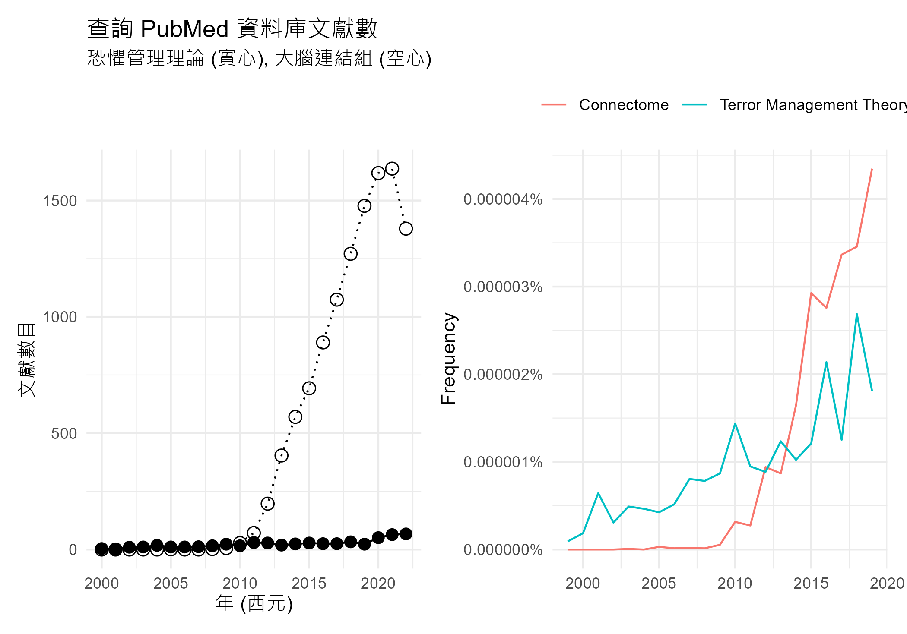

# 資料與管理

``` r
#讀進資料
dta <- read.table("../Data/TMTmeta.txt", header=T, stringsAsFactors = TRUE)
```

``` r
#顯示前六筆資料
#程式報表11.1
dim(dta)
```

    [1] 277   5

``` r
head(dta)
```

<table>
<thead>
<tr>
<th style="text-align:right;">
Study
</th>
<th style="text-align:right;">
Region
</th>
<th style="text-align:right;">
Group
</th>
<th style="text-align:right;">
N
</th>
<th style="text-align:right;">
ES
</th>
</tr>
</thead>
<tbody>
<tr>
<td style="text-align:right;">
10
</td>
<td style="text-align:right;">
1
</td>
<td style="text-align:right;">
1
</td>
<td style="text-align:right;">
37
</td>
<td style="text-align:right;">
0.29
</td>
</tr>
<tr>
<td style="text-align:right;">
20
</td>
<td style="text-align:right;">
1
</td>
<td style="text-align:right;">
1
</td>
<td style="text-align:right;">
83
</td>
<td style="text-align:right;">
0.33
</td>
</tr>
<tr>
<td style="text-align:right;">
30
</td>
<td style="text-align:right;">
99
</td>
<td style="text-align:right;">
1
</td>
<td style="text-align:right;">
93
</td>
<td style="text-align:right;">
0.65
</td>
</tr>
<tr>
<td style="text-align:right;">
41
</td>
<td style="text-align:right;">
1
</td>
<td style="text-align:right;">
1
</td>
<td style="text-align:right;">
46
</td>
<td style="text-align:right;">
0.62
</td>
</tr>
<tr>
<td style="text-align:right;">
42
</td>
<td style="text-align:right;">
1
</td>
<td style="text-align:right;">
1
</td>
<td style="text-align:right;">
55
</td>
<td style="text-align:right;">
0.26
</td>
</tr>
<tr>
<td style="text-align:right;">
43
</td>
<td style="text-align:right;">
1
</td>
<td style="text-align:right;">
1
</td>
<td style="text-align:right;">
29
</td>
<td style="text-align:right;">
0.44
</td>
</tr>
</tbody>
</table>

## 描述性統計

``` r
#依不同研究群，看看效果量等的描述性統計
#程式報表11.2
dta |>
  select(-Study) |>
  gtsummary::tbl_summary(by=Group,
                       statistic = list(all_continuous() ~ "{mean} ({sd})"))
```

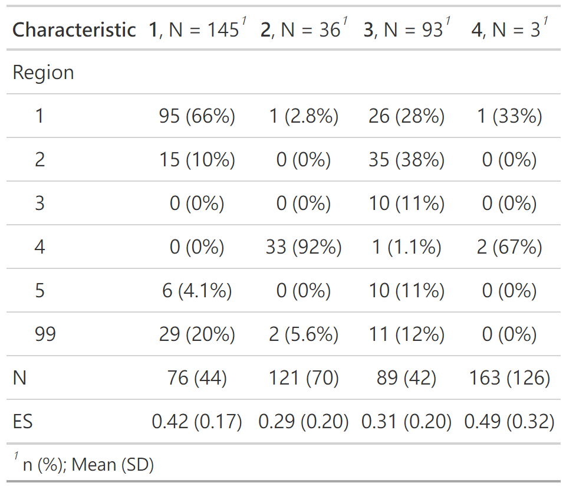

``` r
#依不同區域，看看效果量等的描述性統計
#程式報表11.3
dta |>
  select(-Study) |>
  gtsummary::tbl_summary(by=Region,
                       statistic = list(all_continuous() ~ "{mean} ({sd})"))
```

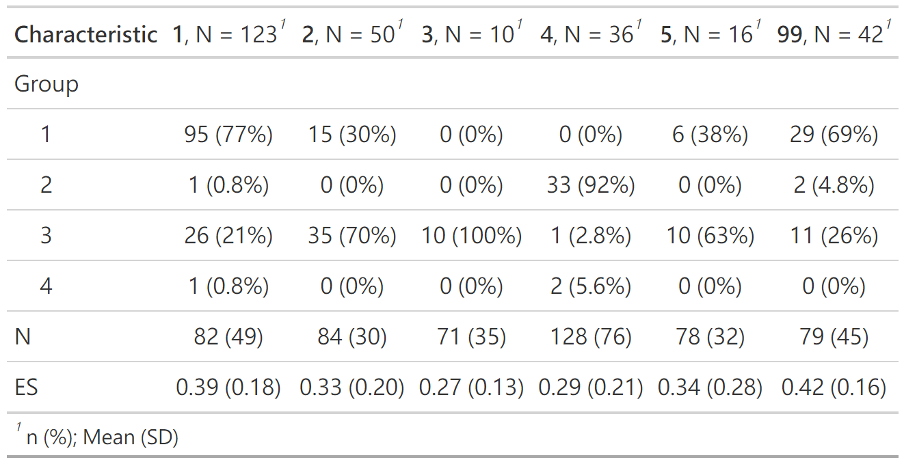

# 資料圖形化

``` r
#效果量直方圖
#圖11.2
ggplot(data=dta, 
       aes(ES, after_stat(density)))+
  geom_histogram(binwidth = function(x) 2 * IQR(x) / (length(x)^(1/3)),
                 col=1, fill=8)+
  labs(x="研究所得效果（相關係數量）",
       y="密度")
```

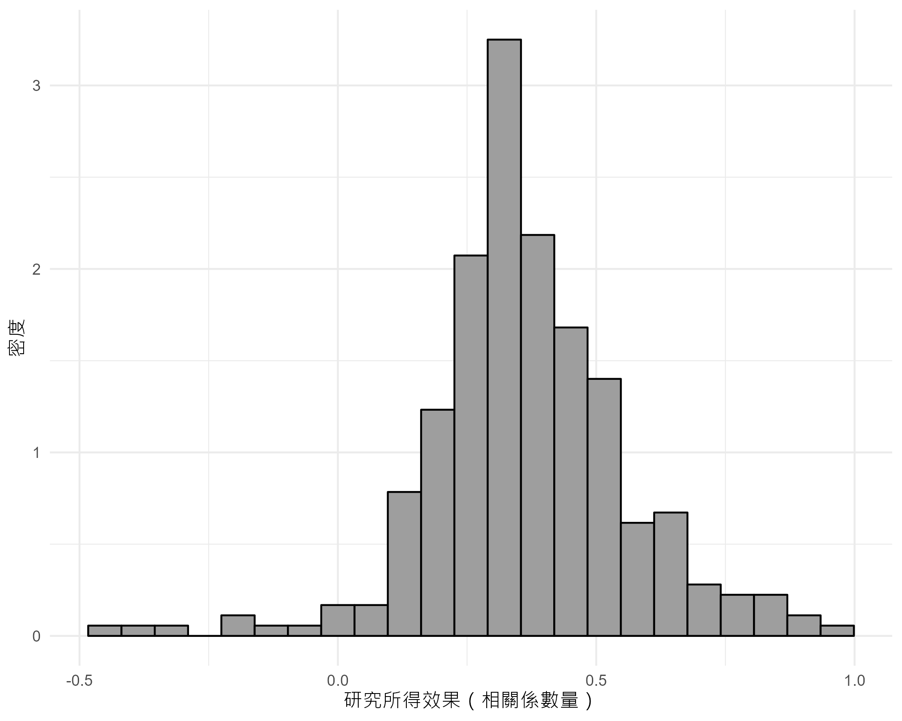

# 整合分析

``` r
#利用相關與樣本數計算相關的抽樣變異，並放進原先資料
dta <- metafor::escalc(measure="COR", ri=ES, ni=N, data=dta)
head(dta)
```

<table>
<thead>
<tr>
<th style="text-align:right;">
Study
</th>
<th style="text-align:right;">
Region
</th>
<th style="text-align:right;">
Group
</th>
<th style="text-align:right;">
N
</th>
<th style="text-align:right;">
ES
</th>
<th style="text-align:right;">
yi
</th>
<th style="text-align:right;">
vi
</th>
</tr>
</thead>
<tbody>
<tr>
<td style="text-align:right;">
10
</td>
<td style="text-align:right;">
1
</td>
<td style="text-align:right;">
1
</td>
<td style="text-align:right;">
37
</td>
<td style="text-align:right;">
0.29
</td>
<td style="text-align:right;">
0.29
</td>
<td style="text-align:right;">
0.0233
</td>
</tr>
<tr>
<td style="text-align:right;">
20
</td>
<td style="text-align:right;">
1
</td>
<td style="text-align:right;">
1
</td>
<td style="text-align:right;">
83
</td>
<td style="text-align:right;">
0.33
</td>
<td style="text-align:right;">
0.33
</td>
<td style="text-align:right;">
0.0097
</td>
</tr>
<tr>
<td style="text-align:right;">
30
</td>
<td style="text-align:right;">
99
</td>
<td style="text-align:right;">
1
</td>
<td style="text-align:right;">
93
</td>
<td style="text-align:right;">
0.65
</td>
<td style="text-align:right;">
0.65
</td>
<td style="text-align:right;">
0.0036
</td>
</tr>
<tr>
<td style="text-align:right;">
41
</td>
<td style="text-align:right;">
1
</td>
<td style="text-align:right;">
1
</td>
<td style="text-align:right;">
46
</td>
<td style="text-align:right;">
0.62
</td>
<td style="text-align:right;">
0.62
</td>
<td style="text-align:right;">
0.0084
</td>
</tr>
<tr>
<td style="text-align:right;">
42
</td>
<td style="text-align:right;">
1
</td>
<td style="text-align:right;">
1
</td>
<td style="text-align:right;">
55
</td>
<td style="text-align:right;">
0.26
</td>
<td style="text-align:right;">
0.26
</td>
<td style="text-align:right;">
0.0161
</td>
</tr>
<tr>
<td style="text-align:right;">
43
</td>
<td style="text-align:right;">
1
</td>
<td style="text-align:right;">
1
</td>
<td style="text-align:right;">
29
</td>
<td style="text-align:right;">
0.44
</td>
<td style="text-align:right;">
0.44
</td>
<td style="text-align:right;">
0.0232
</td>
</tr>
</tbody>
</table>

``` r
#計算所有研究的平均效果
#程式報表11.4
summary(res <- metafor::rma(yi=yi, vi=vi, data=dta))
```


    Random-Effects Model (k = 277; tau^2 estimator: REML)

      logLik  deviance       AIC       BIC      AICc   
     49.8797  -99.7594  -95.7594  -88.5186  -95.7155   

    tau^2 (estimated amount of total heterogeneity): 0.0337 (SE = 0.0037)
    tau (square root of estimated tau^2 value):      0.1836
    I^2 (total heterogeneity / total variability):   90.46%
    H^2 (total variability / sampling variability):  10.48

    Test for Heterogeneity:
    Q(df = 276) = 12088.7813, p-val < .0001

    Model Results:

    estimate      se     zval    pval   ci.lb   ci.ub 
      0.3726  0.0125  29.6979  <.0001  0.3480  0.3972 

``` r
#圖11.3
metaviz::viz_forest(res)
```

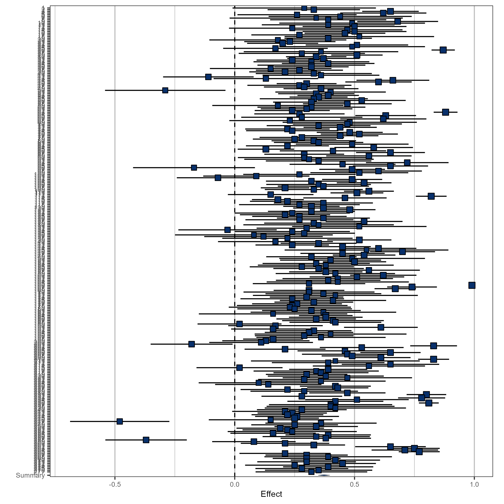

``` r
#檢查出版偏誤，先繪製 funnelplot
#圖11.4
metaviz::viz_funnel(res)
```

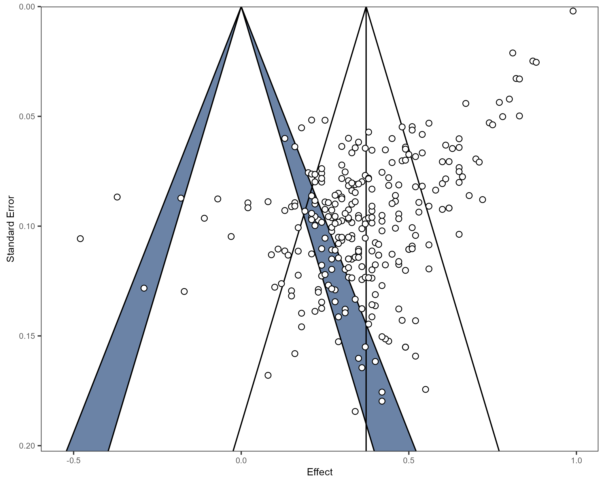

``` r
#程式報表11.5前半
ranktest(res)
```

    Warning in cor.test.default(yi.star, vi, method = "kendall", exact = exact):
    無法給連結計算精確 p 值


    Rank Correlation Test for Funnel Plot Asymmetry

    Kendall's tau = 0.3035, p < .0001

``` r
#程式報表11.5後半
regtest(res)
```


    Regression Test for Funnel Plot Asymmetry

    Model:     mixed-effects meta-regression model
    Predictor: standard error

    Test for Funnel Plot Asymmetry: z = -7.3122, p < .0001
    Limit Estimate (as sei -> 0):   b =  0.6401 (CI: 0.5656, 0.7147)

## 整合調節分析

``` r
#後續要分析區域與研究群的調節效果
#先排除區域不明與第四組研究群體資料
dta <- dta |>
  dplyr::filter(Region != 99 & Group < 4) |> 
  dplyr::mutate( Region = factor(Region),
                 Group = factor(Group))
```

``` r
#抽取277筆中的13%，依區域與 ES 排序，繪製森林圖，標示區域
set.seed(201408)
dta_13 <- dta |> 
  dplyr::sample_frac(.13) |> 
  arrange(Region, ES)
```

``` r
#圖11.5
with(dta_13, metafor::forest(yi, vi, slab = Region))
```

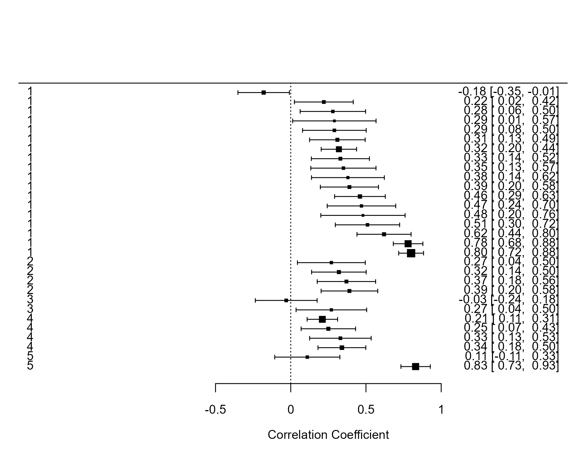

``` r
#檢查區域效果。排除區域不明與第四組研究群體資料
#程式報表11.6
dta <- 
  dta |> arrange(Region, ES)
res_rgn <- rma(yi=yi, vi=vi, mods = ~ Region, data=dta)
res_rgn |> summary()
```


    Mixed-Effects Model (k = 232; tau^2 estimator: REML)

      logLik  deviance       AIC       BIC      AICc   
     41.3077  -82.6154  -70.6154  -50.0657  -70.2336   

    tau^2 (estimated amount of residual heterogeneity):     0.0337 (SE = 0.0041)
    tau (square root of estimated tau^2 value):             0.1836
    I^2 (residual heterogeneity / unaccounted variability): 88.12%
    H^2 (unaccounted variability / sampling variability):   8.42
    R^2 (amount of heterogeneity accounted for):            3.21%

    Test for Residual Heterogeneity:
    QE(df = 227) = 6206.1429, p-val < .0001

    Test of Moderators (coefficients 2:5):
    QM(df = 4) = 10.2446, p-val = 0.0365

    Model Results:

             estimate      se     zval    pval    ci.lb    ci.ub 
    intrcpt    0.3990  0.0190  20.9591  <.0001   0.3617   0.4363 
    Region2   -0.0590  0.0351  -1.6810  0.0928  -0.1279   0.0098 
    Region3   -0.1334  0.0714  -1.8685  0.0617  -0.2734   0.0065 
    Region4   -0.1064  0.0398  -2.6742  0.0075  -0.1843  -0.0284 
    Region5   -0.0356  0.0556  -0.6414  0.5212  -0.1445   0.0733 

``` r
#繪製 forest，標示區域（不只抽出一部份）
#圖11.6
p1 <- metaviz::viz_forest(res_rgn, group=dta[,'Region'],
              xlab = "r", x_limit=c(-.80,1.1), type="study_only")
p2 <- metaviz::viz_forest(res_rgn, group=dta[,'Region'],
              xlab = "r", x_limit=c(-.80,1.1),type="summary_only")
p1/p2+plot_layout(heights = c(7, 1))
```

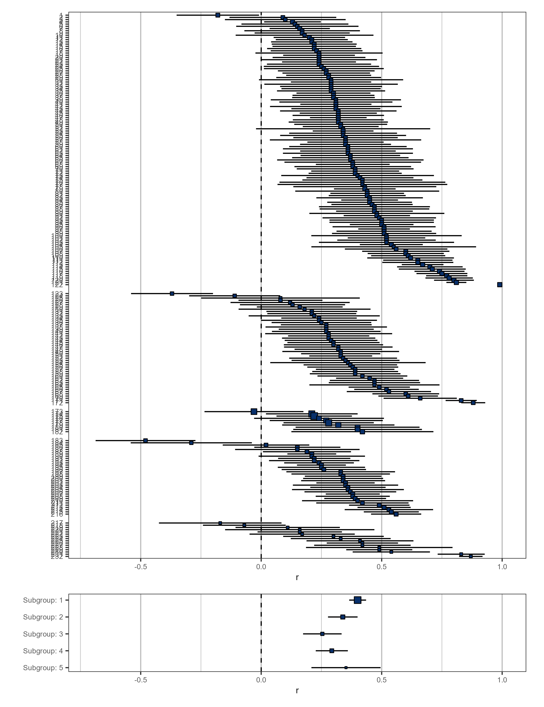

``` r
#檢查出版偏誤，繪製 funnelplot，設定點的形狀
#圖11.7
metaviz::viz_funnel(res_rgn, group=dta[,"Region"],group_legend=T)+
    scale_shape_manual(values = c(15:17,0,1)) 
```

    Scale for shape is already present.
    Adding another scale for shape, which will replace the existing scale.

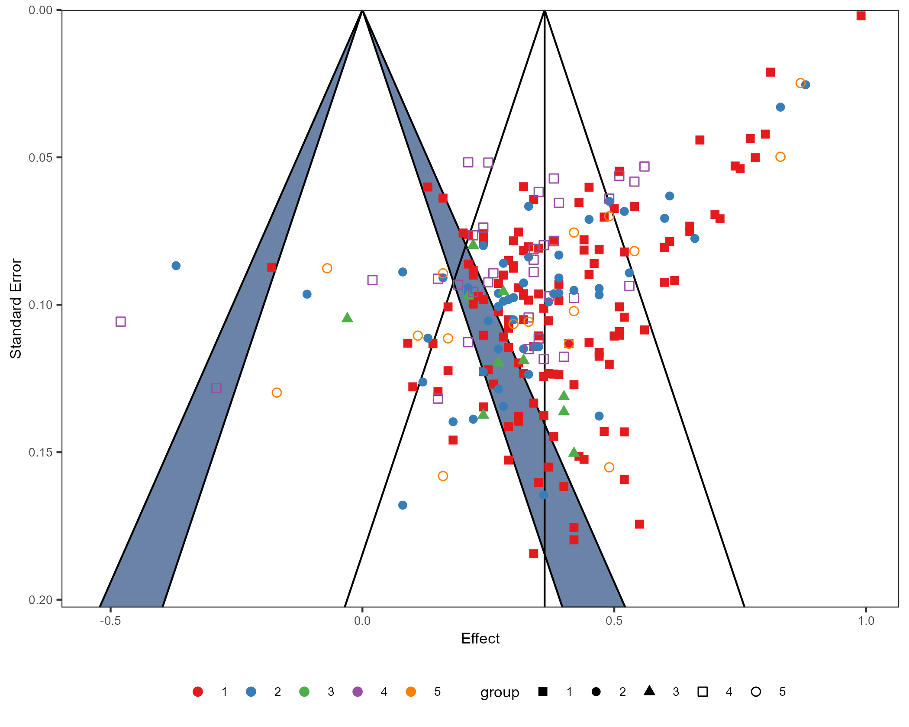

``` r
#每組抽取10筆，依 Group 與 ES 排序，繪製森林圖，以 Group 標示
set.seed(2014)
dta1 <- dta[dta$Group==1,][sample(145,10),]
dta2 <- dta[dta$Group==2,][sample(36,10),]
dta3 <- dta[dta$Group==3,][sample(93,10),]
dta30 <- rbind(dta1,dta2,dta3)

dta30 <- dta30 |> 
  arrange(Group, ES)

#圖11.8
with(dta30, metafor::forest(yi, vi, slab = Group))
```

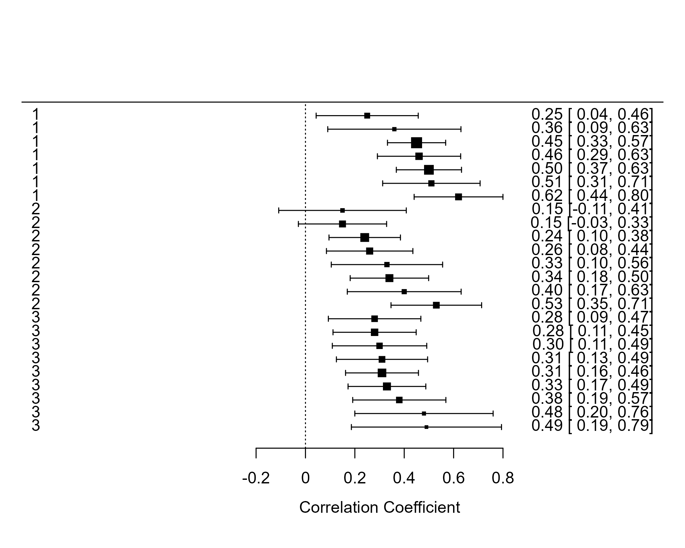

``` r
#檢查研究群體效果
#程式報表11.7
dta <- 
  dta |> arrange(Group, ES)
res_grp <- rma(yi=yi, vi=vi, mods = ~ Group, data=dta)
res_grp |> summary()
```


    Mixed-Effects Model (k = 232; tau^2 estimator: REML)

      logLik  deviance       AIC       BIC      AICc   
     48.5235  -97.0470  -89.0470  -75.3121  -88.8684   

    tau^2 (estimated amount of residual heterogeneity):     0.0314 (SE = 0.0038)
    tau (square root of estimated tau^2 value):             0.1773
    I^2 (residual heterogeneity / unaccounted variability): 87.38%
    H^2 (unaccounted variability / sampling variability):   7.93
    R^2 (amount of heterogeneity accounted for):            9.73%

    Test for Residual Heterogeneity:
    QE(df = 229) = 5694.0567, p-val < .0001

    Test of Moderators (coefficients 2:3):
    QM(df = 2) = 23.0536, p-val < .0001

    Model Results:

             estimate      se     zval    pval    ci.lb    ci.ub 
    intrcpt    0.4271  0.0190  22.5283  <.0001   0.3899   0.4643 
    Group2    -0.1254  0.0389  -3.2235  0.0013  -0.2016  -0.0491 
    Group3    -0.1296  0.0295  -4.3886  <.0001  -0.1874  -0.0717 

``` r
#繪製森林圖，以 Group 標示
#圖11.9
p1 <- metaviz::viz_forest(res_grp, group=dta[,'Group'],xlab = "r",
              x_limit=c(-.80,1.1),type="study_only")
p2 <- metaviz::viz_forest(res_grp, group=dta[,'Group'],xlab = "r", 
              x_limit=c(-.80,1.1), type="summary_only")
p1/p2+plot_layout(heights = c(7, 1))
```

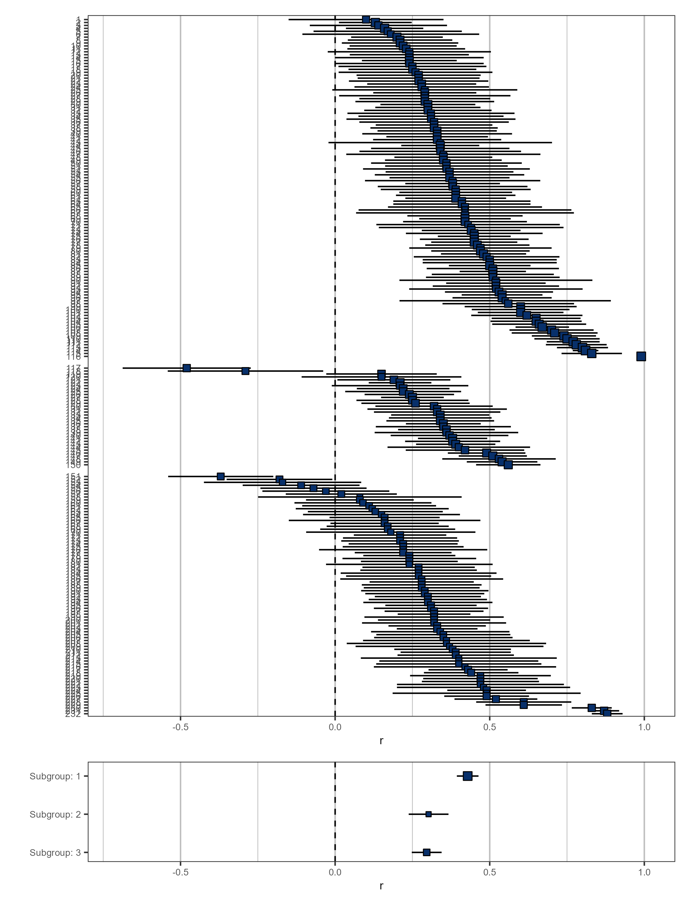

``` r
#檢查出版偏誤，繪製 funnelplot，設定點的形狀
#圖11.10
metaviz::viz_funnel(res_grp, group=dta[,"Group"],group_legend=T)+
  scale_shape_manual(values = c(15,1,9)) 
```

    Scale for shape is already present.
    Adding another scale for shape, which will replace the existing scale.

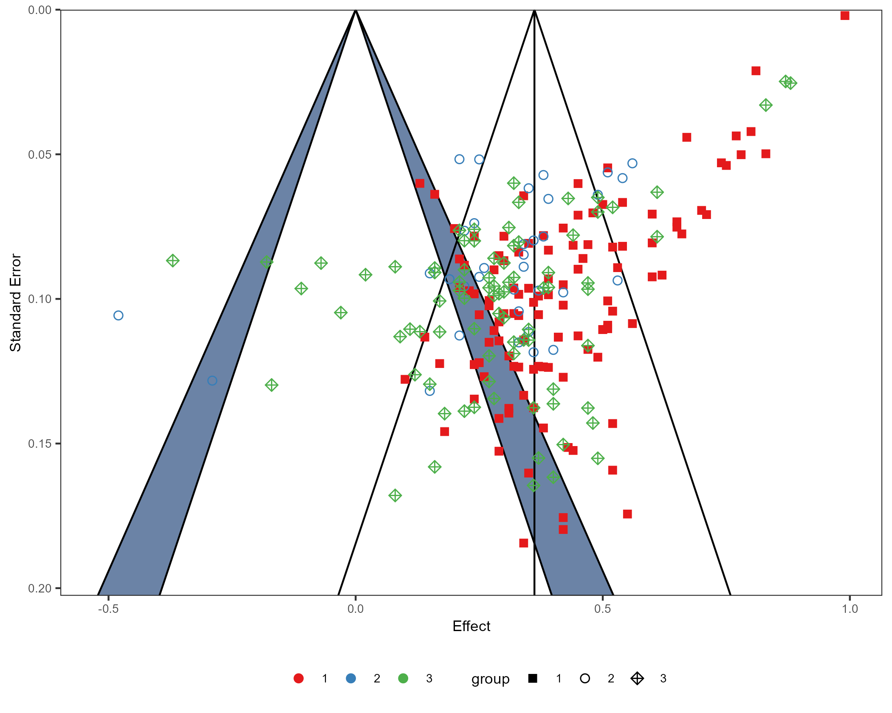

``` r
#同時檢驗區域與研究群體效果
#程式報表11.8
summary(res_rg <- rma(yi=yi, vi=vi, mods = ~ Group+Region, data=dta))
```


    Mixed-Effects Model (k = 232; tau^2 estimator: REML)

      logLik  deviance       AIC       BIC      AICc   
     46.5998  -93.1997  -77.1997  -49.8709  -76.5330   

    tau^2 (estimated amount of residual heterogeneity):     0.0318 (SE = 0.0039)
    tau (square root of estimated tau^2 value):             0.1782
    I^2 (residual heterogeneity / unaccounted variability): 87.11%
    H^2 (unaccounted variability / sampling variability):   7.76
    R^2 (amount of heterogeneity accounted for):            8.83%

    Test for Residual Heterogeneity:
    QE(df = 225) = 5508.1821, p-val < .0001

    Test of Moderators (coefficients 2:7):
    QM(df = 6) = 24.3459, p-val = 0.0005

    Model Results:

             estimate      se     zval    pval    ci.lb    ci.ub 
    intrcpt    0.4261  0.0201  21.1655  <.0001   0.3866   0.4655 
    Group2     0.0248  0.1454   0.1704  0.8647  -0.2602   0.3098 
    Group3    -0.1248  0.0345  -3.6180  0.0003  -0.1923  -0.0572 
    Region2    0.0012  0.0380   0.0322  0.9743  -0.0733   0.0758 
    Region3   -0.0361  0.0749  -0.4817  0.6300  -0.1829   0.1107 
    Region4   -0.1535  0.1445  -1.0624  0.2881  -0.4368   0.1297 
    Region5    0.0141  0.0559   0.2527  0.8005  -0.0954   0.1237 

# Reference

Kossmeier, M., Tran, U., & Voracek, M. (2020). metaviz: Forest Plots,
Funnel Plots, and Visual Funnel Plot Inference for Meta-Analysis\_. R
package version 0.3.1, <https://CRAN.R-project.org/package=metaviz>.
