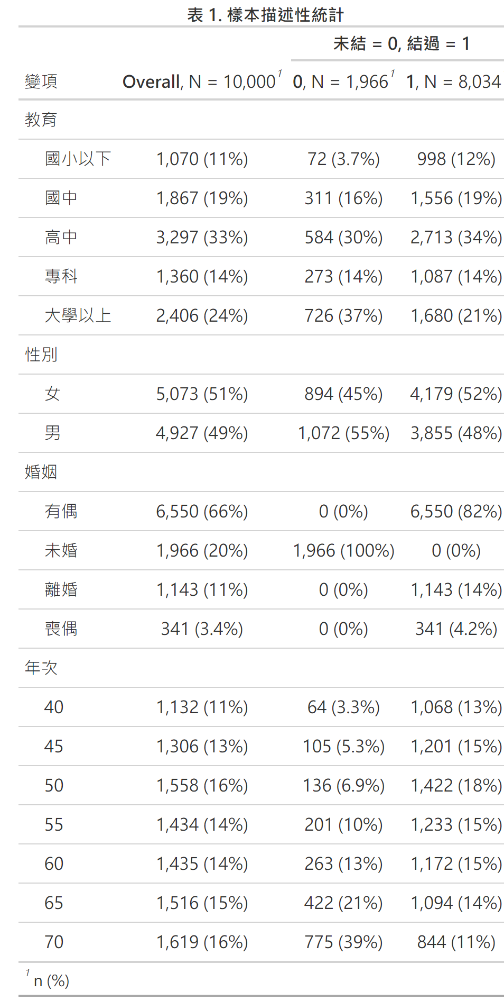
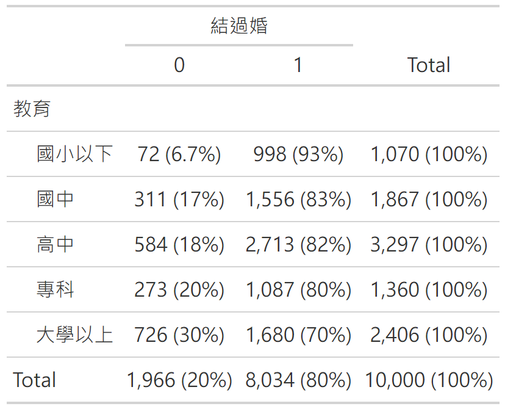
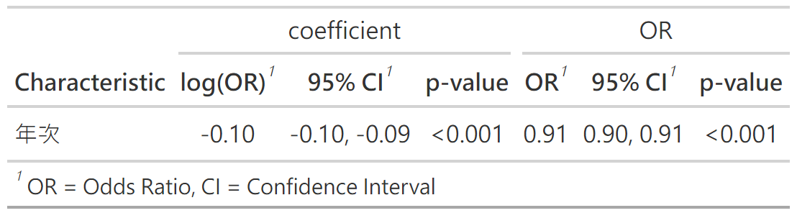
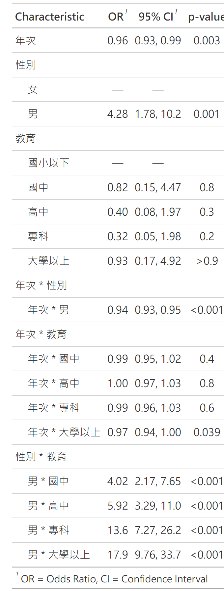

第十二章: 邏輯式迴歸
================
2024 三月 04

``` r
#整體設定，含載入套件
source("https://raw.githubusercontent.com/ChungPingCheng/R4BS2/main/R4BS_setup.R")
```

# 資料與管理

``` r
#讀資料
dta <- read.table(file ="../Data/married.txt", 
                  header = TRUE, stringsAsFactors = TRUE)
```

``` r
#顯示前六筆，看資料結構
#程式報表12.1
head(dta)
```

<table>
<thead>
<tr>
<th style="text-align:left;">
教育
</th>
<th style="text-align:left;">
性別
</th>
<th style="text-align:left;">
婚姻
</th>
<th style="text-align:right;">
年齡
</th>
</tr>
</thead>
<tbody>
<tr>
<td style="text-align:left;">
大學以上
</td>
<td style="text-align:left;">
女
</td>
<td style="text-align:left;">
未婚
</td>
<td style="text-align:right;">
32.5
</td>
</tr>
<tr>
<td style="text-align:left;">
國中
</td>
<td style="text-align:left;">
男
</td>
<td style="text-align:left;">
有偶
</td>
<td style="text-align:right;">
57.5
</td>
</tr>
<tr>
<td style="text-align:left;">
專科
</td>
<td style="text-align:left;">
男
</td>
<td style="text-align:left;">
有偶
</td>
<td style="text-align:right;">
42.5
</td>
</tr>
<tr>
<td style="text-align:left;">
大學以上
</td>
<td style="text-align:left;">
男
</td>
<td style="text-align:left;">
有偶
</td>
<td style="text-align:right;">
42.5
</td>
</tr>
<tr>
<td style="text-align:left;">
高中
</td>
<td style="text-align:left;">
女
</td>
<td style="text-align:left;">
喪偶
</td>
<td style="text-align:right;">
62.5
</td>
</tr>
<tr>
<td style="text-align:left;">
高中
</td>
<td style="text-align:left;">
女
</td>
<td style="text-align:left;">
有偶
</td>
<td style="text-align:right;">
52.5
</td>
</tr>
</tbody>
</table>

``` r
#程式報表12.2
str(dta)
```

    'data.frame':   10000 obs. of  4 variables:
     $ 教育: Factor w/ 5 levels "大學以上","高中",..: 1 4 5 1 2 2 1 5 2 1 ...
     $ 性別: Factor w/ 2 levels "女","男": 1 2 2 2 1 1 2 1 2 2 ...
     $ 婚姻: Factor w/ 4 levels "未婚","有偶",..: 1 2 2 2 3 2 1 1 1 2 ...
     $ 年齡: num  32.5 57.5 42.5 42.5 62.5 52.5 32.5 37.5 42.5 62.5 ...

``` r
#重排教育各水準
#重排婚姻，依發生頻次由多到少
#將年齡換成年次
#將婚姻狀況分為未婚與結過婚
dta <- dta |> 
  dplyr::mutate(教育 = factor(教育, 
                              levels = c('國小以下', '國中', '高中', '專科', '大學以上')),
                婚姻 = factor(婚姻, 
                            levels = c('有偶', '未婚', '離婚', '喪偶')),
                年次 = (102.5 - 年齡),
                結過婚 = ifelse(婚姻 == '未婚', 0, 1))
```

# 描述統計

``` r
#程式報表12.3
dta |> 
  dplyr::select(-年齡) |>
  gtsummary::tbl_summary(by=結過婚) |> 
  gtsummary::add_overall() |>
  modify_header(label ~ "變項") %>%
  modify_spanning_header(c("stat_1", "stat_2") ~ "**未結 = 0, 結過 = 1**") |>
  modify_caption("**表 1. 樣本描述性統計**") 
```



``` r
#單一變項與結過婚與否的列聯表
#程式報表12.4
dta |>
  gtsummary::tbl_cross(
    row = 教育,
    col = 結過婚,
    percent = "row"
  )
```



``` r
#兩個變項與結過婚與否的列聯表
#程式報表12.5
ftable(dta, row.vars = c('教育', '性別'), col.vars = '結過婚') |> 
    prop.table(1) |> round(3)
```

                  結過婚     0     1
    教育     性別                   
    國小以下 女          0.029 0.971
             男          0.134 0.866
    國中     女          0.102 0.898
             男          0.218 0.782
    高中     女          0.138 0.862
             男          0.219 0.781
    專科     女          0.228 0.772
             男          0.173 0.827
    大學以上 女          0.340 0.660
             男          0.265 0.735

``` r
#三個變項與結過婚與否的列聯表，也可以換成比率
ftable(dta, row.vars=c("教育", "性別", "年次"), col.vars = '結過婚')  |> prop.table(1) |> round(3)
```

                       結過婚     0     1
    教育     性別 年次                   
    國小以下 女   40          0.019 0.981
                  45          0.030 0.970
                  50          0.020 0.980
                  55          0.067 0.933
                  60          0.125 0.875
                  65          0.077 0.923
                  70          0.050 0.950
             男   40          0.049 0.951
                  45          0.150 0.850
                  50          0.150 0.850
                  55          0.258 0.742
                  60          0.250 0.750
                  65          0.471 0.529
                  70          0.667 0.333
    國中     女   40          0.124 0.876
                  45          0.053 0.947
                  50          0.048 0.952
                  55          0.092 0.908
                  60          0.079 0.921
                  65          0.182 0.818
                  70          0.288 0.713
             男   40          0.042 0.958
                  45          0.079 0.921
                  50          0.107 0.893
                  55          0.172 0.828
                  60          0.256 0.744
                  65          0.360 0.640
                  70          0.658 0.342
    高中     女   40          0.114 0.886
                  45          0.093 0.907
                  50          0.062 0.938
                  55          0.096 0.904
                  60          0.105 0.895
                  65          0.184 0.816
                  70          0.311 0.689
             男   40          0.063 0.937
                  45          0.090 0.910
                  50          0.093 0.907
                  55          0.138 0.862
                  60          0.228 0.772
                  65          0.358 0.642
                  70          0.498 0.502
    專科     女   40          0.135 0.865
                  45          0.116 0.884
                  50          0.128 0.872
                  55          0.228 0.772
                  60          0.213 0.787
                  65          0.220 0.780
                  70          0.392 0.608
             男   40          0.000 1.000
                  45          0.058 0.942
                  50          0.067 0.933
                  55          0.114 0.886
                  60          0.178 0.822
                  65          0.267 0.733
                  70          0.471 0.529
    大學以上 女   40          0.113 0.887
                  45          0.171 0.829
                  50          0.211 0.789
                  55          0.212 0.788
                  60          0.299 0.701
                  65          0.360 0.640
                  70          0.487 0.513
             男   40          0.013 0.987
                  45          0.042 0.958
                  50          0.073 0.927
                  55          0.136 0.864
                  60          0.124 0.876
                  65          0.256 0.744
                  70          0.623 0.377

``` r
#換種方式看
#程式報表12.6
ftable(dta, row.vars = c("教育", "性別"), col.vars = c('年次', '結過婚'))
```

                  年次    40      45      50      55      60      65      70    
                  結過婚   0   1   0   1   0   1   0   1   0   1   0   1   0   1
    教育     性別                                                               
    國小以下 女            6 302   6 191   2  97   2  28   2  14   1  12   1  19
             男            9 176  15  85   6  34   8  23   2   6   8   9   4   2
    國中     女           11  78   7 124  10 200  13 128   9 105  12  54  23  57
             男            3  68  14 164  27 225  28 135  34  99  45  80  75  39
    高中     女           15 117  19 186  17 257  29 272  30 255  49 217  76 168
             男            8 119  18 182  25 243  36 225  60 203  83 149 119 120
    專科     女            5  32   5  38  10  68  21  71  29 107  38 135  47  73
             男            0  53   5  81   7  98  13 101  21  97  32  88  40  45
    大學以上 女            6  47  12  58  23  86  28 104  53 124  87 155 190 200
             男            1  76   4  92   9 114  23 146  23 162  67 195 200 121

# 畫圖

``` r
#圖示不同年次、性別與教育程度的結過婚比率，加上標準差
#圖12.1
ggplot(data = dta, 
       aes(x = 年次, y = 結過婚, shape = 性別, color = 性別)) +
  stat_summary(fun.data = mean_se, size = rel(.5)) +
  facet_wrap(vars(教育), nrow=1) +
  scale_x_reverse(breaks = seq(70, 40, by = -5))+
  scale_color_grey(end=.6)+
  labs(x = '年次', 
       y = '結過婚比例',
       subtitle='不同世代的結過婚比例與男女教育程度') +
  theme(legend.position = "top")
```


注意，年次跟年齡成反比

# 邏輯迴歸

``` r
#簡單邏輯迴歸
m1 <- glm(結過婚 ~ 年次, data = dta, family = binomial) 
#原始報表
#程式報表12.7
summary(m1)
```


    Call:
    glm(formula = 結過婚 ~ 年次, family = binomial, data = dta)

    Coefficients:
                Estimate Std. Error z value Pr(>|z|)
    (Intercept)  7.09682    0.19630    36.1   <2e-16
    年次        -0.09713    0.00319   -30.4   <2e-16

    (Dispersion parameter for binomial family taken to be 1)

        Null deviance: 9913.1  on 9999  degrees of freedom
    Residual deviance: 8766.2  on 9998  degrees of freedom
    AIC: 8770

    Number of Fisher Scoring iterations: 5

``` r
#格式化後報表，包含勝算比的信賴區間 
#程式報表12.8
gtsummary::tbl_merge(list(
  gtsummary::tbl_regression(m1,exponentiate = FALSE),
  gtsummary::tbl_regression(m1,exponentiate = TRUE)),
  tab_spanner=c('coefficient','OR'))
```



``` r
#格式化後報表，包含勝算比與它的信賴區間 
m1 |> broom::tidy(conf.int=TRUE) |> 
  dplyr::select(c('conf.low','estimate','conf.high')) |>
  dplyr::mutate(conf.low_exp = exp(conf.low),
                estimate_exp = exp(estimate),
                conf.high_exp = exp(conf.high)) |>
  round(digit=3)
```

<table>
<thead>
<tr>
<th style="text-align:right;">
conf.low
</th>
<th style="text-align:right;">
estimate
</th>
<th style="text-align:right;">
conf.high
</th>
<th style="text-align:right;">
conf.low_exp
</th>
<th style="text-align:right;">
estimate_exp
</th>
<th style="text-align:right;">
conf.high_exp
</th>
</tr>
</thead>
<tbody>
<tr>
<td style="text-align:right;">
6.716
</td>
<td style="text-align:right;">
7.097
</td>
<td style="text-align:right;">
7.485
</td>
<td style="text-align:right;">
825.393
</td>
<td style="text-align:right;">
1208.119
</td>
<td style="text-align:right;">
1781.893
</td>
</tr>
<tr>
<td style="text-align:right;">
-0.103
</td>
<td style="text-align:right;">
-0.097
</td>
<td style="text-align:right;">
-0.091
</td>
<td style="text-align:right;">
0.902
</td>
<td style="text-align:right;">
0.907
</td>
<td style="text-align:right;">
0.913
</td>
</tr>
</tbody>
</table>

``` r
#格式化後報表（書中未呈現）
#勝算比的信賴區間 
options("huxtable.knitr_output_format"="md")
jtools::export_summs(m1, 
                     model.names = c("以年次解釋是否結過婚的邏輯式迴歸模型"),         
                     robust="HC0",
                     error_format = "[{conf.low}, {conf.high}]")
```

|                                                  |      以年次解釋是否結過婚的邏輯式迴歸模型       |
|--------------------------------------------------|:-----------------------------------------------:|
| (Intercept)                                      |                   7.10 \*\*\*                   |
|                                                  |                 \[6.69, 7.51\]                  |
| 年次                                             |                  -0.10 \*\*\*                   |
|                                                  |                \[-0.10, -0.09\]                 |
| N                                                |                      10000                      |
| AIC                                              |                     8770.21                     |
| BIC                                              |                     8784.64                     |
| Pseudo R2                                        |                      0.17                       |
| Standard errors are heteroskedasticity \* p \< 0 | robust. \*\*\* p \< 0.001; \*\* p \< 0.01; .05. |

``` r
#整體模型評估
#程式報表12.9
m1 |> broom::glance()
```

    # A tibble: 1 × 8
      null.deviance df.null logLik   AIC   BIC deviance df.residual  nobs
              <dbl>   <int>  <dbl> <dbl> <dbl>    <dbl>       <int> <int>
    1         9913.    9999 -4383. 8770. 8785.    8766.        9998 10000

``` r
#邏輯迴歸，加入性別與教育程度
m_full <- glm(結過婚 ~ 年次 * 性別 * 教育 , data = dta, family = binomial)
```

``` r
#看看那個效果可刪除
#程式報表12.10
m_full |> drop1(test = 'Chisq')
```

    Single term deletions

    Model:
    結過婚 ~ 年次 * 性別 * 教育
                   Df Deviance  AIC  LRT Pr(>Chi)
    <none>                8490 8530              
    年次:性別:教育  4     8499 8531 9.46    0.051

``` r
m_drop1 <- update(m_full, ~ . - 年次:性別:教育) 
```

``` r
#模型結果
#程式報表12.11
gtsummary::tbl_regression(m_drop1, exponentiate = TRUE)
```



## 模型診斷

``` r
#邏輯迴歸模型診斷，將預測值與實際觀測值放在一起
#圖12.2
ggplot(data = dta, 
       aes(x = 年次, y = 結過婚, shape = 性別, color = 性別)) +
  stat_summary(fun.data = mean_se, size = rel(.5)) +
  stat_summary(aes(y = fitted(m_drop1)), 
               fun = mean, 
               geom = 'line', 
               linewidth = .5) +
  facet_wrap(vars(教育), nrow=1) +
  scale_x_reverse(breaks = seq(70, 40, by = -5)) +
  scale_color_grey(end=.6)+
  labs(x= '年次', 
       y = '結過婚比例') +
  theme(legend.position= "top")
```


``` r
#模型診斷前，將資料整理成分組資料方式
dta_ft <- 
  dta |>
  group_by(年次,性別,教育) |>
  dplyr::summarise(合計 = n(),有婚 = sum(結過婚),.groups = "drop") |>
  mutate(無婚=合計-有婚)
```

``` r
#看看資料
#程式報表12.12
head(dta_ft)
```

    # A tibble: 6 × 6
       年次 性別  教育      合計  有婚  無婚
      <dbl> <fct> <fct>    <int> <dbl> <dbl>
    1    40 女    國小以下   308   302     6
    2    40 女    國中        89    78    11
    3    40 女    高中       132   117    15
    4    40 女    專科        37    32     5
    5    40 女    大學以上    53    47     6
    6    40 男    國小以下   185   176     9

``` r
#以整理過資料重新分析，確認與前面相同
m_last <- glm(cbind(有婚, 無婚) ~ 年次 * 性別 * 教育 - 年次:性別:教育, 
                    data = dta_ft, family = binomial(logit))
summary(m_last)
```


    Call:
    glm(formula = cbind(有婚, 無婚) ~ 年次 * 性別 * 教育 - 
        年次:性別:教育, family = binomial(logit), data = dta_ft)

    Coefficients:
                        Estimate Std. Error z value Pr(>|z|)
    (Intercept)          5.58844    0.76804    7.28  3.4e-13
    年次                -0.04477    0.01526   -2.93   0.0034
    性別男               1.45317    0.44444    3.27   0.0011
    教育國中            -0.20158    0.87264   -0.23   0.8173
    教育高中            -0.90388    0.81508   -1.11   0.2675
    教育專科            -1.14913    0.93653   -1.23   0.2198
    教育大學以上        -0.07104    0.85515   -0.08   0.9338
    年次:性別男         -0.06382    0.00712   -8.96  < 2e-16
    年次:教育國中       -0.01339    0.01658   -0.81   0.4194
    年次:教育高中       -0.00451    0.01570   -0.29   0.7741
    年次:教育專科       -0.00870    0.01736   -0.50   0.6162
    年次:教育大學以上   -0.03330    0.01617   -2.06   0.0394
    性別男:教育國中      1.39138    0.32051    4.34  1.4e-05
    性別男:教育高中      1.77804    0.30655    5.80  6.6e-09
    性別男:教育專科      2.61186    0.32634    8.00  1.2e-15
    性別男:教育大學以上  2.88247    0.31489    9.15  < 2e-16

    (Dispersion parameter for binomial family taken to be 1)

        Null deviance: 1530.13  on 69  degrees of freedom
    Residual deviance:  116.19  on 54  degrees of freedom
    AIC: 446.3

    Number of Fisher Scoring iterations: 4

``` r
#圖12.3
gglm::gglm(m_last, theme = ggplot2::theme_minimal())
```


``` r
#performance 也可以呈現類似圖形
performance::check_model(m_last)
```


``` r
#ggplot 版本
p1 <- ggplot() +
  aes(predict(m_drop1, type='response'), 
               statmod::qresid(m_drop1)) +
  geom_point(size = rel(.5), alpha=.5)+
  stat_smooth(method='loess', 
              se=FALSE, linewidth=0.5,
              formula = y ~ x,
              col=1)+
  labs(x = "Fitted response values",
       y = "Quantile residuals")

p2 <- ggplot()+
  aes(sample=statmod::qresiduals(m_drop1))+
  stat_qq()+
  stat_qq_line()+
  labs(x = "Normal quantiles",
       y = "Quantile residuals")

p3 <- ggplot(data.frame(x=statmod::qresiduals(m_drop1)))+
  aes(x)+
  geom_density()+
  geom_function(fun = dnorm, col = 8)+
  labs(x = "Normal quantiles",
       y = "Density")

p1 / (p2+p3) 
```


## 邏輯迴歸分散參數

``` r
#估計 dispersion parameter
m_last %>%
  { list(sum(residuals(., type='pearson')^2), df.residual(.)) } |>
  purrr::reduce(`/`)
```

``` r
#加入分散參數
m_lastd <- dispmod::glm.binomial.disp(m_last, verbose=FALSE)
```

``` r
#看看膨脹因子（inflation factor，分散參數重參數化）估計值
m_lastd$dispersion
```

    [1] 0.007188

``` r
#程式報表12.13
options("huxtable.knitr_output_format"="md")
jtools::export_summs(m_last, m_lastd, 
                     model.names = c("未考慮過度離散模型", "考慮過度離散模型"),         
                     robust="HC0",
                     error_format = "[{conf.low}, {conf.high}]")
```

|                            |           未考慮過度離散模型            |      考慮過度離散模型       |
|----------------------------|:---------------------------------------:|:---------------------------:|
| (Intercept)                |               5.59 \*\*\*               |         5.35 \*\*\*         |
|                            |             \[4.50, 6.68\]              |       \[4.21, 6.50\]        |
| 年次                       |              -0.04 \*\*\*               |        -0.04 \*\*\*         |
|                            |            \[-0.07, -0.02\]             |      \[-0.06, -0.02\]       |
| 性別男                     |                 1.45 \*                 |          1.57 \*\*          |
|                            |             \[0.24, 2.67\]              |       \[0.39, 2.76\]        |
| 教育國中                   |                  -0.20                  |            -0.08            |
|                            |             \[-1.93, 1.53\]             |       \[-1.91, 1.75\]       |
| 教育高中                   |                  -0.90                  |            -0.95            |
|                            |             \[-2.34, 0.53\]             |       \[-2.40, 0.50\]       |
| 教育專科                   |                  -1.15                  |            -0.96            |
|                            |             \[-2.40, 0.11\]             |       \[-2.24, 0.33\]       |
| 教育大學以上               |                  -0.07                  |            -0.23            |
|                            |             \[-1.71, 1.57\]             |       \[-1.78, 1.31\]       |
| 年次:性別男                |              -0.06 \*\*\*               |        -0.07 \*\*\*         |
|                            |            \[-0.09, -0.04\]             |      \[-0.09, -0.04\]       |
| 年次:教育國中              |                  -0.01                  |            -0.02            |
|                            |             \[-0.04, 0.02\]             |       \[-0.05, 0.02\]       |
| 年次:教育高中              |                  -0.00                  |            -0.00            |
|                            |             \[-0.03, 0.02\]             |       \[-0.03, 0.02\]       |
| 年次:教育專科              |                  -0.01                  |            -0.01            |
|                            |             \[-0.03, 0.02\]             |       \[-0.04, 0.01\]       |
| 年次:教育大學以上          |                -0.03 \*                 |          -0.03 \*           |
|                            |            \[-0.06, -0.00\]             |      \[-0.06, -0.00\]       |
| 性別男:教育國中            |               1.39 \*\*\*               |         1.39 \*\*\*         |
|                            |             \[0.82, 1.96\]              |       \[0.82, 1.96\]        |
| 性別男:教育高中            |               1.78 \*\*\*               |         1.74 \*\*\*         |
|                            |             \[1.24, 2.31\]              |       \[1.21, 2.28\]        |
| 性別男:教育專科            |               2.61 \*\*\*               |         2.58 \*\*\*         |
|                            |             \[2.08, 3.15\]              |       \[2.08, 3.09\]        |
| 性別男:教育大學以上        |               2.88 \*\*\*               |         2.87 \*\*\*         |
|                            |             \[2.27, 3.49\]              |       \[2.31, 3.44\]        |
| N                          |                   70                    |             70              |
| AIC                        |                 446.31                  |           236.78            |
| BIC                        |                 482.28                  |           272.76            |
| Pseudo R2                  |                  1.00                   |            1.00             |
| Standard errors are hetero | skedasticity robust. \*\** * p \< 0.05. | p \< 0.001; \*\* p \< 0.01; |

``` r
#準備再一次模型診斷，收集資料，畫圖
#圖12.4
ggplot(data = dta_ft, 
       aes(x = 年次, y = 有婚/合計,  color = 性別, shape = 性別)) +
  geom_point(size = 3) +
  stat_smooth(aes(y=fitted(m_lastd)), 
              method = 'loess', 
              se = F, linewidth = .5, 
              formula = y ~ x) +
  facet_wrap(vars(教育), nrow=1) +
  scale_color_grey(end=.6)+
  scale_x_reverse(breaks = seq(70, 40, by = -5)) +
  labs(x= '年次', 
       y = '結過婚比例') +
  theme(legend.position = 'top' )
```


``` r
#繪製估計值
#圖12.5
jtools::plot_summs(m_lastd, m_drop1, 
                   robust='HC0',
                   model.names = c("Model w/o dispersion", "Model w/ dispersion"), colors=c("gray60", "gray20")) +
  labs(x = '估計值和信賴區間', 
       y = '邏輯迴歸模型變項(去除截距)', 
       subtitle = '依變項:結過婚')+
  theme(legend.position='top')
```


# 多分類邏輯迴歸

``` r
#先看看年代與婚姻列聯表
#程式報表12.14
with(dta, table(年次, 婚姻)) |> prop.table(1) |> round(3)
```

<table>
<thead>
<tr>
<th style="text-align:left;">
</th>
<th style="text-align:right;">
有偶
</th>
<th style="text-align:right;">
未婚
</th>
<th style="text-align:right;">
離婚
</th>
<th style="text-align:right;">
喪偶
</th>
</tr>
</thead>
<tbody>
<tr>
<td style="text-align:left;">
40
</td>
<td style="text-align:right;">
0.720
</td>
<td style="text-align:right;">
0.057
</td>
<td style="text-align:right;">
0.114
</td>
<td style="text-align:right;">
0.110
</td>
</tr>
<tr>
<td style="text-align:left;">
45
</td>
<td style="text-align:right;">
0.728
</td>
<td style="text-align:right;">
0.080
</td>
<td style="text-align:right;">
0.129
</td>
<td style="text-align:right;">
0.062
</td>
</tr>
<tr>
<td style="text-align:left;">
50
</td>
<td style="text-align:right;">
0.714
</td>
<td style="text-align:right;">
0.087
</td>
<td style="text-align:right;">
0.155
</td>
<td style="text-align:right;">
0.044
</td>
</tr>
<tr>
<td style="text-align:left;">
55
</td>
<td style="text-align:right;">
0.717
</td>
<td style="text-align:right;">
0.140
</td>
<td style="text-align:right;">
0.121
</td>
<td style="text-align:right;">
0.022
</td>
</tr>
<tr>
<td style="text-align:left;">
60
</td>
<td style="text-align:right;">
0.671
</td>
<td style="text-align:right;">
0.183
</td>
<td style="text-align:right;">
0.136
</td>
<td style="text-align:right;">
0.010
</td>
</tr>
<tr>
<td style="text-align:left;">
65
</td>
<td style="text-align:right;">
0.622
</td>
<td style="text-align:right;">
0.278
</td>
<td style="text-align:right;">
0.093
</td>
<td style="text-align:right;">
0.007
</td>
</tr>
<tr>
<td style="text-align:left;">
70
</td>
<td style="text-align:right;">
0.456
</td>
<td style="text-align:right;">
0.479
</td>
<td style="text-align:right;">
0.058
</td>
<td style="text-align:right;">
0.007
</td>
</tr>
</tbody>
</table>

``` r
#以 mlogit 套件執行多分類邏輯迴歸
#將資料轉成 mlogit 需要格式
dta_w <- mlogit.data(dta, shape = 'wide', choice = '婚姻')
```

``` r
#看看資料
#程式報表12.15
dta_w |> head()
```

    ~~~~~~~
     first 10 observations out of 40000 
    ~~~~~~~
           教育 性別  婚姻 年齡 年次 結過婚 chid  alt    idx
    1  大學以上   女  TRUE 32.5   70      0    1 未婚 1:未婚
    2  大學以上   女 FALSE 32.5   70      0    1 有偶 1:有偶
    3  大學以上   女 FALSE 32.5   70      0    1 喪偶 1:喪偶
    4  大學以上   女 FALSE 32.5   70      0    1 離婚 1:離婚
    5      國中   男 FALSE 57.5   45      1    2 未婚 2:未婚
    6      國中   男  TRUE 57.5   45      1    2 有偶 2:有偶
    7      國中   男 FALSE 57.5   45      1    2 喪偶 2:喪偶
    8      國中   男 FALSE 57.5   45      1    2 離婚 2:離婚
    9      專科   男 FALSE 42.5   60      1    3 未婚 3:未婚
    10     專科   男  TRUE 42.5   60      1    3 有偶 3:有偶

    ~~~ indexes ~~~~
       chid  alt
    1     1 未婚
    2     1 有偶
    3     1 喪偶
    4     1 離婚
    5     2 未婚
    6     2 有偶
    7     2 喪偶
    8     2 離婚
    9     3 未婚
    10    3 有偶
    indexes:  1, 2 

``` r
#只展示年次效果
#程式報表12.15前
ml0 <- mlogit(婚姻 ~ 0 | 年次, data = dta_w )
ml0 |> summary()
```


    Call:
    mlogit(formula = 婚姻 ~ 0 | 年次, data = dta_w, method = "nr")

    Frequencies of alternatives:choice
      未婚   有偶   喪偶   離婚 
    0.1966 0.6550 0.0341 0.1143 

    nr method
    7 iterations, 0h:0m:1s 
    g'(-H)^-1g = 0.000103 
    successive function values within tolerance limits 

    Coefficients :
                     Estimate Std. Error z-value Pr(>|z|)
    (Intercept):有偶  6.70221    0.19918    33.6   <2e-16
    (Intercept):喪偶  8.66079    0.39952    21.7   <2e-16
    (Intercept):離婚  5.31879    0.25285    21.0   <2e-16
    年次:有偶        -0.09358    0.00324   -28.9   <2e-16
    年次:喪偶        -0.19059    0.00794   -24.0   <2e-16
    年次:離婚        -0.10024    0.00431   -23.2   <2e-16

    Log-Likelihood: -8920
    McFadden R^2:  0.071 
    Likelihood ratio test : chisq = 1360 (p.value = <2e-16)

``` r
#勝算比信賴區間
#程式報表12.15後
data.frame(b_hat = coef(ml0), b_ci = confint(ml0)) |> exp() |> round(3)
```

                        b_hat b_ci.2.5.. b_ci.97.5..
    (Intercept):有偶  814.203    551.047    1203.031
    (Intercept):喪偶 5772.095   2637.906   12630.124
    (Intercept):離婚  204.137    124.364     335.082
    年次:有偶           0.911      0.905       0.916
    年次:喪偶           0.826      0.814       0.839
    年次:離婚           0.905      0.897       0.912

``` r
#準備畫圖，先得到預測值
newdta <- with(dta, data.frame(
               年次 = rep(seq(from = 70, to = 40, length = 7), 4),
               婚姻 = factor(rep(c('有偶', '未婚', '離婚', '喪偶'), each = 7) ) ) )
```

``` r
newdta_w <- mlogit.data(newdta, shape = 'wide', choice = '婚姻')
```

``` r
ml0_phat <- predict(ml0, newdta_w) |> 
  as.data.frame() |>
  dplyr::slice(1:7) |> 
  tidyr::pivot_longer(cols=1:4,
                      names_to='婚姻',
                      values_to = 'phat') |> arrange(婚姻)
ml0_phat <- data.frame(ml0_phat, newdta["年次"]) 
```

``` r
#製造年次婚姻列聯表、將預測值轉成需要格式
obsp <- dta |> 
  dplyr::select(c(年次, 婚姻)) |>
  table() |>
  prop.table(1) |>
  as.data.frame() |>
  dplyr::mutate(年次 = readr::parse_number(as.character(年次)))
```

``` r
#繪圖
#圖12.6
ggplot() + 
 geom_point(data=obsp, 
            aes(x = 年次, y = Freq, color = 婚姻), 
            size = rel(3)) + 
 stat_smooth(data=ml0_phat,
             aes(x = 年次, y = phat, color = 婚姻), 
             method = 'loess', 
             formula = y ~ x, 
             se = F, 
             linewidth = 1) +
 scale_x_reverse(breaks = seq(70, 40, by = -5)) +
 scale_color_grey(start=.8, end=.1)+
 labs(x = '年次', 
      y = '分類百分比') +
 theme(legend.position = 'top')
```


# References

Dunn, P.K., & Smyth, G.K. (2018). *Generalized linear models with
examples in R*. NY:Springer. <doi:10.1007/978-1-4419-0118-7>
